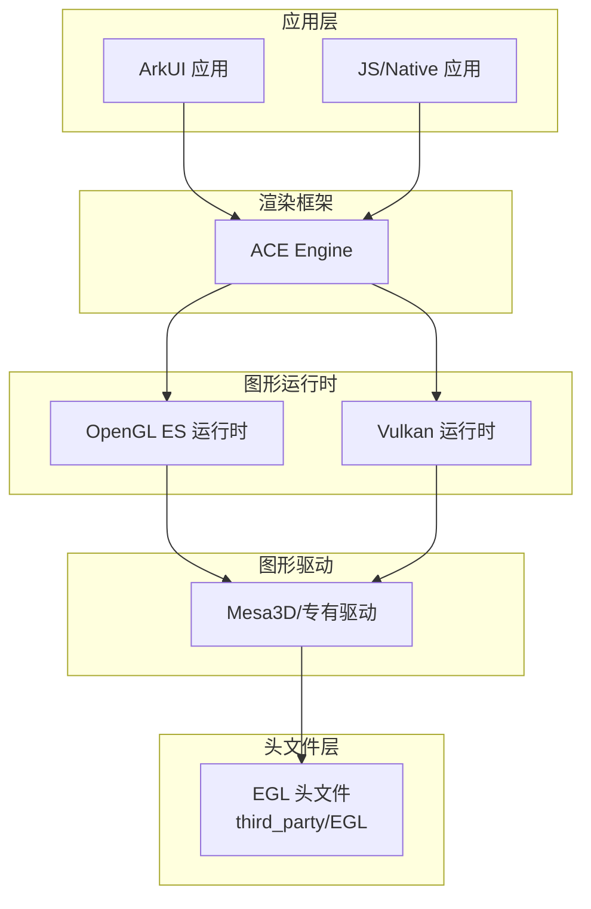

# 依赖关系与使用

## 概述

EGL-Registry 是 OpenHarmony 图形子系统的 **API 头文件提供者**，为图形驱动和渲染框架提供 EGL 接口规范。本章节说明 EGL 库在 OH 中的使用方式和依赖关系。

---

## 依赖者分析

### 直接依赖者

**搜索结果**：在当前代码库中未找到直接引用 `//third_party/EGL` 的 BUILD.gn 文件。

**原因分析**：

1. **纯头文件库**：EGL-Registry 只包含头文件，不生成可执行代码
2. **间接依赖**：使用 EGL 的模块通常通过图形驱动间接引用
3. **典型使用者**：
   - 图形驱动实现（Mesa3D、专有驱动）
   - OpenGL ES/Vulkan 运行时
   - 渲染框架（ACE Engine）

### 依赖关系推断

基于 EGL 的通用使用模式，推断的依赖关系如下：

```
                    ┌─────────────────────────────────────┐
                    │         应用层 (ArkUI/JS)             │
                    └─────────────────────────────────────┘
                                    │
                                    ▼
                    ┌─────────────────────────────────────┐
                    │       渲染框架 (ACE Engine)          │
                    └─────────────────────────────────────┘
                                    │
              ┌─────────────────────┼─────────────────────┐
              ▼                     ▼                     ▼
    ┌─────────────────┐ ┌─────────────────┐ ┌─────────────────┐
    │  OpenGL ES 运行时  │ │    Vulkan 运行时   │ │   其他渲染 API    │
    └─────────────────┘ └─────────────────┘ └─────────────────┘
              │                     │                     │
              └─────────────────────┼─────────────────────┘
                                    ▼
                    ┌─────────────────────────────────────┐
                    │     图形驱动 (Mesa3D/专有)           │
                    │         需要 EGL 接口定义             │
                    └─────────────────────────────────────┘
                                    │
                                    ▼
                    ┌─────────────────────────────────────┐
                    │     //third_party/EGL (头文件)      │ ⭐
                    └─────────────────────────────────────┘
```

---

## 使用方式详解

### 1. 头文件引用方式

#### 标准方式（推荐）

```c
// 包含 EGL 核心头文件
#include <EGL/egl.h>

// 包含 EGL 扩展声明
#include <EGL/eglext.h>

// 包含平台类型定义（通常被 egl.h 自动包含）
#include <EGL/eglplatform.h>
```

#### 使用 EGL_OHOS_image_native_buffer 扩展

```c
// 检查扩展是否可用
const char* extensions = eglQueryString(EGL_NO_DISPLAY, EGL_EXTENSIONS);
if (extensions &&
    strstr(extensions, "EGL_OHOS_image_native_buffer")) {
    // 扩展可用，可以创建 EGLImage
}
```

### 2. 构建依赖声明

#### 静态库引用（推荐）

```gn
# 在目标模块的 BUILD.gn 中
ohos_shared_library("my_graphics_module") {
  deps = [
    "//third_party/EGL:libEGL",  # 获取 EGL 头文件
  ]
}
```

#### 内联方式（不推荐）

```gn
# 不推荐：手动添加头文件路径
ohos_shared_library("my_graphics_module") {
  include_dirs = [
    "//third_party/EGL/api",
  ]
}
```

**推荐理由**：使用 `deps` 引用可以自动继承 `libEGL_public_config` 中的所有配置（include_dirs、defines）。

### 3. 典型使用场景

#### 场景 1：EGL Display 初始化

```c
EGLDisplay display = eglGetDisplay(EGL_DEFAULT_DISPLAY);
if (display == EGL_NO_DISPLAY) {
    // 处理错误
    return EGL_FALSE;
}

EGLint majorVersion, minorVersion;
if (!eglInitialize(display, &majorVersion, &minorVersion)) {
    // 初始化失败
    return EGL_FALSE;
}
```

#### 场景 2：OpenGL ES 上下文创建

```c
// 配置上下文属性
EGLint configAttribs[] = {
    EGL_SURFACE_TYPE, EGL_WINDOW_BIT,
    EGL_RENDERABLE_TYPE, EGL_OPENGL_ES3_BIT,
    EGL_NONE
};

// 选择配置
EGLConfig config;
EGLint numConfigs;
eglChooseConfig(display, configAttribs, &config, 1, &numConfigs);

// 创建 OpenGL ES 上下文
EGLContext context = eglCreateContext(display, config, EGL_NO_CONTEXT, NULL);
```

#### 场景 3：使用 OHOS 原生缓冲区创建 EGLImage

```c
// 前提：已获取 OHNativeWindowBuffer
EGLClientBuffer nativeBuffer = (EGLClientBuffer)nativeWindowBuffer;

EGLint attribs[] = {
    EGL_IMAGE_PRESERVED_KHR, EGL_TRUE,
    EGL_NONE
};

EGLImageKHR eglImage = eglCreateImageKHR(
    display,
    EGL_NO_CONTEXT,
    EGL_NATIVE_BUFFER_OHOS,  // OHOS 特有扩展
    nativeBuffer,
    attribs
);

if (eglImage == EGL_NO_IMAGE_KHR) {
    // 创建失败，处理错误
}
```

---

## 配置与宏定义

### 必需宏定义

| 宏 | 定义位置 | 作用 |
|-----|---------|------|
| `ENABLE_EGL` | BUILD.gn | 启用 EGL 功能 |
| `OHOS_PLATFORM` | BUILD.gn (ohos) | OHOS 平台条件编译 |

### 头文件宏

```c
// 在 eglplatform.h 中
#if defined(OHOS_PLATFORM)
typedef struct NativeWindow*    EGLNativeWindowType;
#endif
```

---

## 依赖关系图

### Mermaid 依赖图



### 依赖矩阵

| 模块 | 依赖关系 | 使用方式 |
|------|----------|----------|
| ACE Engine | 间接 | 渲染 API 抽象层 |
| OpenGL ES 运行时 | 直接 | EGL API 调用 |
| Vulkan 运行时 | 直接 | WSI 集成 |
| Mesa3D | 直接 | EGL 驱动实现 |

---

## 最佳实践

### 1. 头文件包含顺序

```c
// 推荐：先包含系统头文件，再包含 EGL
#include <stdio.h>
#include <stdlib.h>

#include <EGL/egl.h>
#include <EGL/eglext.h>

// 最后包含平台特定头文件
#include <native_window.h>
```

### 2. 扩展检查

```c
// 推荐：检查扩展是否可用
static bool CheckEGLExtension(EGLDisplay display, const char* extension) {
    const char* extensions = eglQueryString(display, EGL_EXTENSIONS);
    if (!extensions) {
        return false;
    }
    return strstr(extensions, extension) != NULL;
}

// 使用
if (CheckEGLExtension(display, "EGL_OHOS_image_native_buffer")) {
    // 使用 OHOS 扩展
}
```

### 3. 错误处理

```c
// 推荐：使用 eglGetError() 检查错误
EGLBoolean result = eglSwapBuffers(display, surface);
if (result == EGL_FALSE) {
    EGLint error = eglGetError();
    switch (error) {
        case EGL_BAD_DISPLAY:
            // 处理错误
            break;
        case EGL_BAD_SURFACE:
            // 处理错误
            break;
        default:
            // 其他错误
            break;
    }
}
```

---

## 常见问题

### Q1: 编译时找不到 egl.h

**原因**：未正确添加依赖

**解决方案**：

```gn
# 在 BUILD.gn 中添加依赖
deps = [
  "//third_party/EGL:libEGL",
]
```

### Q2: OHOS_PLATFORM 未定义

**原因**：BUILD.gn 配置未正确应用

**解决方案**：

```gn
# 确保使用 public_configs
ohos_shared_library("my_module") {
  public_configs = [ "//third_party/EGL:libEGL_public_config" ]
}
```

### Q3: EGL_NATIVE_BUFFER_OHOS 未定义

**原因**：未启用 OHOS 扩展

**解决方案**：

```c
// 确认 EGL_OHOS_image_native_buffer 扩展可用
// 检查 eglGetError() 返回值
// 确认 OHOS 原生缓冲区已正确创建
```

---

## 性能注意事项

### 1. EGL Display 缓存

```c
// 推荐：缓存 EGLDisplay，避免重复初始化
static EGLDisplay g_eglDisplay = EGL_NO_DISPLAY;

EGLDisplay GetEGLDisplay() {
    if (g_eglDisplay == EGL_NO_DISPLAY) {
        g_eglDisplay = eglGetDisplay(EGL_DEFAULT_DISPLAY);
    }
    return g_eglDisplay;
}
```

### 2. 配置查询优化

```c
// 推荐：查询后缓存配置
static EGLConfig g_eglConfig = nullptr;

EGLConfig GetEGLConfig(EGLDisplay display) {
    if (g_eglConfig == nullptr) {
        EGLint numConfigs;
        eglChooseConfig(display, configAttribs, &g_eglConfig, 1, &numConfigs);
    }
    return g_eglConfig;
}
```

---

## 相关文档

- [01_Overview.md](./01_Overview.md) - 库功能与 OH 定位
- [02_Patches.md](./02_Patches.md) - OH 特有扩展说明
- [03_Build_Integration.md](./03_Build_Integration.md) - 构建配置详解
- [Khronos EGL 规范](https://www.khronos.org/registry/egl/)
