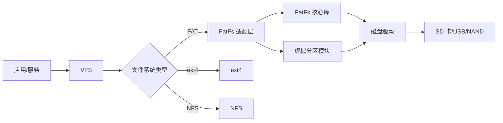
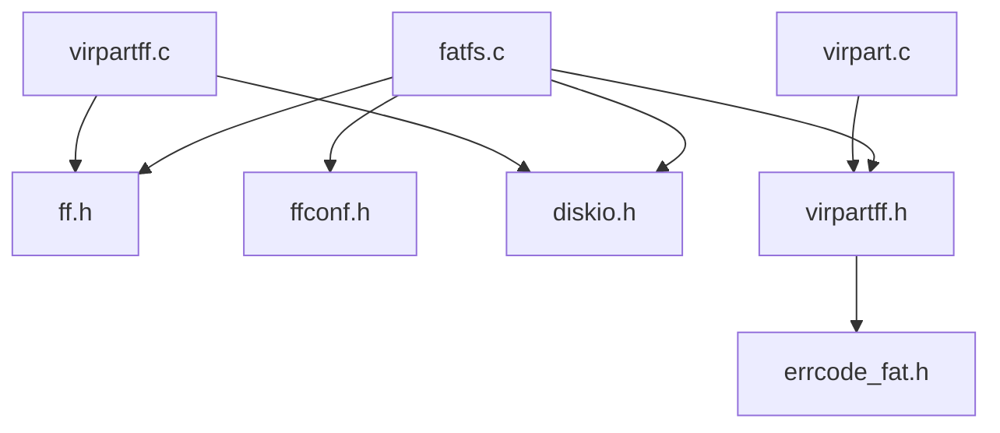

# 依赖关系与使用

> FatFs 在 OpenHarmony 中的使用场景和依赖关系

---

## 直接依赖者

FatFs 主要被 **LiteOS-A 内核文件系统模块**使用：

| 模块 | BUILD.gn 路径 | 用途 |
|------|--------------|------|
| LiteOS-A FAT 文件系统 | `kernel/liteos_a/fs/fat/BUILD.gn` | FatFs VFS 适配层、FatFs 核心库编译 |

### 依赖说明

FatFs 不被其他应用或服务模块直接依赖，而是通过**VFS（虚拟文件系统）**作为中间层被系统使用。

架构：
```
应用/服务
    ↓
VFS (Virtual File System)
    ↓
FatFs 适配层 (kernel/liteos_a/fs/fat/)
    ↓
FatFs 核心库 (third_party/FatFs/)
```

---

## 使用场景

### 1. SD 卡文件系统

**设备**：SD 卡、TF 卡

**文件系统**：FAT32, exFAT

**用途**：
- 相机照片存储
- 手机数据存储
- 开发板用户数据

**典型路径**：
- `/mnt/sdcard/` - SD 卡挂载点
- `/mnt/media/mmcblk0/` - MMC 设备挂载点

### 2. USB 存储文件系统

**设备**：U 盘、移动硬盘

**文件系统**：FAT32, exFAT

**用途**：
- 数据交换
- 文件传输
- 移动存储

**典型路径**：
- `/mnt/usb/` - USB 存储挂载点
- `/mnt/media/sda/` - USB 设备挂载点

### 3. NAND Flash 文件系统

**设备**：NAND Flash 存储器

**文件系统**：FAT32

**用途**：
- 嵌入式设备用户数据存储
- 配置文件存储
- 固件升级

**典型路径**：
- `/mnt/nand/` - NAND Flash 挂载点

---

## OH 集成架构

### 完整架构图

```
┌─────────────────────────────────────────┐
│          应用层                     │
│  ┌──────┬──────┬──────┐          │
│  │相机  │文件  │...  │          │
│  │应用  │管理  │     │          │
│  └──────┴──────┴──────┘          │
└───────────────┬─────────────────────┘
                ↓
┌─────────────────────────────────────────┐
│    VFS (Virtual File System)        │
│  ┌──────┬──────┬──────┐          │
│  │FatFs │ext4  │NFS  │          │
│  │      │      │     │          │
│  └──┬───┴──┬───┴───┘          │
└─────┼──────┼──────────┘
      ↓      ↓
┌─────────────────────────────────────────┐
│     FatFs 适配层                   │
│   kernel/liteos_a/fs/fat/          │
│  ┌──────────────┬──────────┐      │
│  │  os_adapt   │ virpart  │      │
│  │  - fatfs.c  │ - vir.c  │      │
│  │  - format.c │ - virff.c│      │
│  │  - shell.c  │         │      │
│  └──────────────┴──────────┘      │
└───────────────┬────────────────────┘
                ↓
┌─────────────────────────────────────────┐
│    FatFs 核心库                   │
│   third_party/FatFs/source/         │
│  ┌────────────────────────────┐     │
│  │ ff.c      - FAT 核心    │     │
│  │ ffunicode.c - Unicode    │     │
│  │ diskio.c  - 磁盘 I/O  │     │
│  └────────────────────────────┘     │
└───────────────┬────────────────────┘
                ↓
┌─────────────────────────────────────────┐
│     磁盘驱动层                    │
│  ┌────┬────┬────┬────┐        │
│  │SD  │USB │NAND│... │        │
│  └────┴────┴────┴────┘        │
└─────────────────────────────────────────┘
```

---

## VFS 适配层

### 适配层文件

```
kernel/liteos_a/fs/fat/os_adapt/
├── fatfs.c         (61KB) - VFS 适配层核心
├── fatfs.h         - 适配层头文件
├── format.c        (3.8KB) - FAT 格式化工具
└── fat_shellcmd.c  (3.4KB) - Shell 命令
```

### fatfs.c 核心功能

#### 文件操作

| 函数 | 说明 |
|------|------|
| `fatfs_open()` | 打开文件 |
| `fatfs_read()` | 读取文件 |
| `fatfs_write()` | 写入文件 |
| `fatfs_close()` | 关闭文件 |
| `fatfs_lseek()` | 文件指针定位 |
| `fatfs_sync()` | 同步文件到磁盘 |

#### 目录操作

| 函数 | 说明 |
|------|------|
| `fatfs_opendir()` | 打开目录 |
| `fatfs_readdir()` | 读取目录 |
| `fatfs_closedir()` | 关闭目录 |
| `fatfs_mkdir()` | 创建目录 |
| `fatfs_rmdir()` | 删除目录 |

#### 文件系统操作

| 函数 | 说明 |
|------|------|
| `fatfs_mount()` | 挂载 FAT 文件系统 |
| `fatfs_unmount()` | 卸载 FAT 文件系统 |
| `fatfs_statfs()` | 查询文件系统状态 |
| `fatfs_stat()` | 查询文件/目录状态 |

#### 错误码转换

```c
// kernel/liteos_a/fs/fat/os_adapt/fatfs.c
int fatfs_2_vfs(int result)
{
    int status = ENOERR;
    switch (result) {
        case FR_OK:
            break;
        case FR_NO_FILE:
        case FR_NO_PATH:
            status = ENOENT;
            break;
        case FR_DISK_ERR:
            status = EIO;
            break;
        // ... 其他错误码转换
    }
    return status;
}
```

---

## OH 特有功能

### 1. 虚拟分区

**实现**：`kernel/liteos_a/fs/fat/virpart/`

**功能**：在单一 FAT 卷上创建多个逻辑分区

**配置**：`LOSCFG_FS_FAT_VIRTUAL_PARTITION`

**优势**：
- 在不支持多分区的存储设备上实现逻辑隔离
- 为不同用户或应用提供独立的目录空间
- 提供基础的访问控制机制

### 2. Shell 命令

**实现**：`kernel/liteos_a/fs/fat/os_adapt/fat_shellcmd.c`

**命令**：
- `mkfs` - 格式化为 FAT 文件系统
- `fat` - FAT 文件系统操作命令

**使用示例**：
```bash
# 格式化 SD 卡
mkfs /dev/mmcblk0

# 查看 FAT 信息
fat info /dev/mmcblk0
```

---

## 挂载管理

### 挂载流程

1. **设备检测**
   - 驱动检测到新设备（SD 卡、USB）
   - 生成设备节点（`/dev/mmcblk0`, `/dev/sda`）

2. **文件系统识别**
   - VFS 读取设备分区表
   - 识别文件系统类型（FAT32, exFAT）

3. **挂载文件系统**
   - VFS 调用 FatFs 挂载接口（`fatfs_mount()`）
   - FatFs 读取文件系统信息（BPB, FAT 表）
   - 创建挂载点（`/mnt/sdcard/`）

4. **可用性通知**
   - 文件系统可用
   - 应用可以通过 VFS 访问文件

### 挂载点

| 设备 | 挂载点 | 说明 |
|------|---------|------|
| `/dev/mmcblk0` | `/mnt/sdcard/` | SD 卡 |
| `/dev/mmcblk1` | `/mnt/extsd/` | 外部 SD 卡 |
| `/dev/sda` | `/mnt/usb/` | USB 存储 |

---

## 依赖关系图

### 组件依赖



### 文件依赖



---

## 使用示例

### 示例 1：挂载 SD 卡

```c
// 应用代码
int fd = open("/mnt/sdcard/test.txt", O_RDWR | O_CREAT);
if (fd < 0) {
    perror("open failed");
    return -1;
}
write(fd, "Hello FatFs", 13);
close(fd);
```

**流程**：
1. VFS 接收到 `open()` 调用
2. VFS 识别路径为 `/mnt/sdcard/` → FatFs
3. VFS 调用 `fatfs_open()`
4. `fatfs_open()` 调用 FatFs API `f_open()`
5. 文件打开成功，返回文件描述符

### 示例 2：读取目录

```c
// 应用代码
DIR *dir = opendir("/mnt/sdcard/");
if (!dir) {
    perror("opendir failed");
    return -1;
}

struct dirent *entry;
while ((entry = readdir(dir)) != NULL) {
    printf("%s\n", entry->d_name);
}

closedir(dir);
```

**流程**：
1. VFS 接收到 `opendir()` 调用
2. VFS 调用 `fatfs_opendir()`
3. `fatfs_opendir()` 调用 FatFs API `f_opendir()`
4. 目录打开成功，返回目录指针
5. 应用通过 `readdir()` 读取目录项

---

## 性能考虑

### 缓存配置

**配置项**：`FS_FAT_CACHE`

**影响**：
- 启用：提高读取性能，增加内存占用
- 禁用：降低内存占用，读取性能下降

### 缓存同步线程

**配置项**：`FS_FAT_CACHE_SYNC_THREAD`

**影响**：
- 启用：异步刷新缓存，提高响应速度，增加系统复杂度
- 禁用：同步刷新缓存，响应速度较慢，系统简单

### 扇区大小

**配置**：`FF_MAX_SS`（在 `ffconf.h` 中）

**影响**：
- 512 字节：兼容性好，性能中等
- 4096 字节：大扇区设备性能更好

---

## 总结

### FatFs 在 OH 中的定位

- **主要用途**：可移动存储设备（SD 卡、USB、NAND）的 FAT 文件系统支持
- **集成方式**：通过 VFS 适配层（`kernel/liteos_a/fs/fat/`）
- **架构特点**：非侵入式适配，易于上游版本升级

### 关键组件

| 组件 | 路径 | 作用 |
|------|------|------|
| FatFs 核心库 | `third_party/FatFs/source/` | FAT 文件系统实现 |
| VFS 适配层 | `kernel/liteos_a/fs/fat/os_adapt/` | VFS 接口适配 |
| 虚拟分区 | `kernel/liteos_a/fs/fat/virpart/` | 虚拟分区功能 |
| 构建配置 | `FatFs.gni`, `BUILD.gn`, `Kconfig` | 构建和配置 |

### 使用场景

1. **SD 卡文件系统** - 相机、手机、开发板数据存储
2. **USB 存储文件系统** - U 盘、移动硬盘数据交换
3. **NAND Flash 文件系统** - 嵌入式设备用户数据存储

---

## 参考资料

### 相关文档

- **[ASSESSMENT.md](wiki/_work/ASSESSMENT.md)** - 项目评估结果
- **[01_Overview.md](01_Overview.md)** - 原始库简介
- **[02_Patches.md](02_Patches.md)** - Patch 详细分析
- **[03_Build_Integration.md](03_Build_Integration.md)** - OH 构建适配

### 外部资源

- **FatFs 官方文档**：http://elm-chan.org/fsw/ff/00index_e.html
- **OpenHarmony 文档**：https://gitee.com/openharmony/docs
- **LiteOS-A 文档**：https://gitee.com/openharmony/kernel_liteos_a

---

**文档版本**：1.0
**最后更新**：2026-02-08
