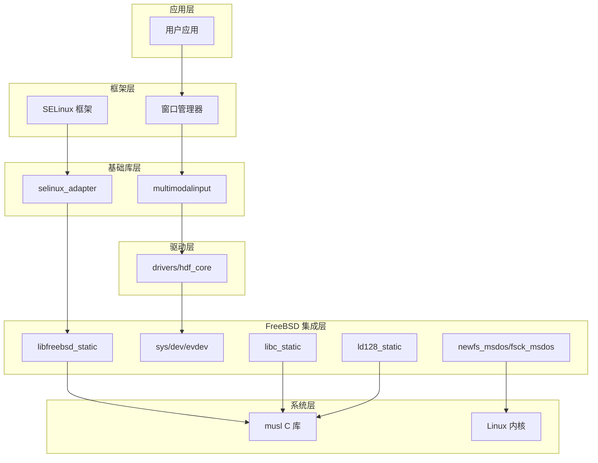
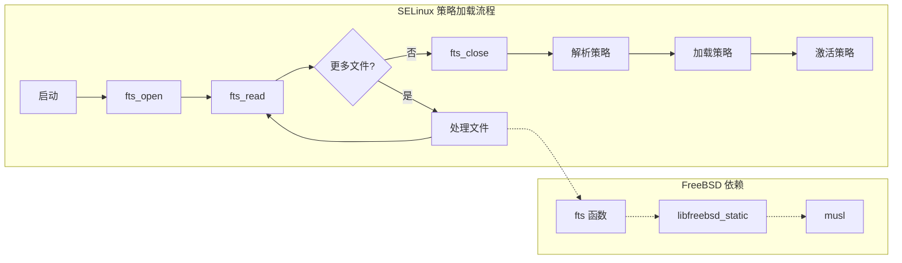

# FreeBSD 依赖关系与使用场景

本文档详细描述 FreeBSD 第三方库在 OpenHarmony 系统中的依赖关系和使用场景，帮助开发者理解该库在系统中的定位以及如何正确使用。

## 1. 直接依赖者分析

### 1.1 依赖组件总览

经过全面搜索，FreeBSD 库被以下 OpenHarmony 组件依赖：

| 模块 | 类型 | 依赖组件 | 用途 |
|------|------|---------|------|
| **base/security/selinux_adapter** | 静态库 | libfreebsd_static | 文件系统遍历 |
| **third_party/selinux** | 静态库 | libfreebsd_static | SELinux 策略处理/hdf_core/input |
| **drivers** | 头文件 | sys/dev/evdev | 输入事件定义 |
| **foundation/window/window_manager_lite** | 头文件 | sys/dev/evdev | 窗口输入处理 |
| **device/qemu/riscv32_virt** | 头文件 | sys/dev/evdev | 模拟设备支持 |
| **foundation/multimodalinput** | 头文件 | sys/dev/evdev | 多模态输入 |
| **test/xts/hats/hdf/input** | 头文件 | sys/dev/evdev | 输入模块测试 |

### 1.2 核心依赖者详情

#### 1.2.1 SELinux 子系统

**依赖组件**：libfreebsd_static

**BUILD.gn 引用**：
```gn
# //base/security/selinux_adapter/BUILD.gn
deps += [ "FreeBSD:libfreebsd_static" ]

# //third_party/selinux/BUILD.gn
deps += [ "FreeBSD:libfreebsd_static" ]
```

**使用场景**：SELinux 子系统需要递归遍历文件系统目录来处理策略文件。fts 函数提供了高效且可靠的文件树遍历能力，是 SELinux 适配层的核心依赖。

**使用方式**：
```c
#include <fts.h>

// 遍历目录查找 SELinux 策略文件
FTS *ftsp;
FTSENT *entry;
char *paths[] = { "/system/etc/selinux", NULL };

ftsp = fts_open(paths, FTS_PHYSICAL | FTS_NOCHDIR, NULL);
while ((entry = fts_read(ftsp)) != NULL) {
    if (entry->fts_info & FTW_F) {
        // 处理策略文件
        process_policy_file(entry->fts_path);
    }
}
fts_close(ftsp);
```

**依赖重要性**：**关键依赖**。没有 libfreebsd_static，SELinux 子系统无法正常工作。

#### 1.2.2 输入设备模块

**依赖组件**：sys/dev/evdev 头文件

**BUILD.gn 引用**：
```gn
# //drivers/hdf_core/adapter/khdf/liteos/model/input/BUILD.gn
include_dirs += [ "//third_party/FreeBSD/sys/dev/evdev" ]

# //foundation/window/window_manager_lite/BUILD.gn
include_dirs += [ "//third_party/FreeBSD/sys/dev/evdev" ]
```

**使用场景**：FreeBSD 的 evdev 头文件定义了输入事件的标准结构，这些定义被 OpenHarmony 的输入子系统引用，确保与 Linux 输入子系统的一致性。

**头文件内容**：
```c
// 使用 FreeBSD 提供的输入事件结构
struct input_event {
    struct timeval time;
    __u16 type;
    __u16 code;
    __s32 value;
};
```

**依赖重要性**：**接口依赖**。这些头文件定义了接口契约，变更会影响多个子系统。

### 1.3 间接依赖分析

```
libfreebsd_static 的间接依赖链：

selinux_adapter
    ↓ 依赖
libfreebsd_static (fts 函数)
    ↓ 提供文件系统遍历
SELinux 策略加载
    ↓ 支持
强制访问控制 (MAC)
    ↓ 支撑
系统安全框架
```

## 2. 组件清单与功能映射

### 2.1 静态库组件

#### 2.1.1 libfreebsd_static

| 属性 | 值 |
|-----|-----|
| **组件路径** | //third_party/FreeBSD:libfreebsd_static |
| **源文件** | lib/libc/gen/fts.c |
| **主要函数** | fts_open, fts_read, fts_close, fts_children |
| **链接方式** | 静态链接 |
| **依赖者** | selinux_adapter, selinux |

**函数功能说明**：

| 函数 | 功能 | SELinux 用途 |
|-----|------|-------------|
| **fts_open** | 打开文件树遍历 | 初始化策略目录遍历 |
| **fts_read** | 读取下一个目录项 | 逐个处理策略文件 |
| **fts_close** | 关闭遍历 | 释放资源 |
| **fts_children** | 获取子项列表 | 并行处理多个策略文件 |

#### 2.1.2 libc_static

| 属性 | 值 |
|-----|-----|
| **组件路径** | //third_party/FreeBSD:libc_static |
| **源文件数** | 7 个 C 源文件 |
| **主要函数** | arc4random, arc4random_uniform, qsort, strtoimax 等 |
| **优化选项** | LTO 启用 |

**包含的函数**：

| 函数类别 | 函数 | 功能 |
|---------|------|------|
| **随机数** | arc4random | 密码学安全随机数 |
| **随机数** | arc4random_uniform | 指定范围随机数 |
| **排序** | qsort_b | 快速排序 |
| **转换** | strtoimax | 字符串到整数转换 |
| **转换** | strtoumax | 字符串到无符号整数 |
| **字符串** | strcasecmp | 大小写无关比较 |

#### 2.1.3 ld128_static

| 属性 | 值 |
|-----|-----|
| **组件路径** | //third_party/FreeBSD:ld128_static |
| **源文件数** | 13 个数学源文件 |
| **精度** | 128 位长双精度 |
| **定义宏** | LD128_ENABLE |

**数学函数**：

| 函数 | 功能 |
|-----|------|
| **e_lgammal_r** | 对数伽马函数 |
| **e_powl** | 幂函数 |
| **k_cosl** | 余弦核函数 |
| **k_sinl** | 正弦核函数 |
| **s_erfl** | 误差函数 |
| **s_expl** | 指数函数 |
| **s_logl** | 对数函数 |

### 2.2 可执行工具组件

#### 2.2.1 newfs_msdos

| 属性 | 值 |
|-----|-----|
| **组件路径** | //third_party/FreeBSD/sbin/newfs_msdos:newfs_msdos |
| **源文件** | mkfs_msdos.c, newfs_msdos.c |
| **安装位置** | /system/bin/newfs_msdos |
| **用途** | 创建 FAT 文件系统 |

**使用示例**：
```bash
# 创建 FAT32 文件系统
newfs_msdos -F 32 /dev/block/sda1

# 创建 FAT16 文件系统
newfs_msdos -F 16 /dev/mmcblk0p1

# 指定卷标
newfs_msdos -F 32 -n "MyVolume" /dev/block/sda1
```

#### 2.2.2 fsck_msdos

| 属性 | 值 |
|-----|-----|
| **组件路径** | //third_party/FreeBSD/sbin/fsck_msdosfs:fsck_msdos |
| **源文件** | boot.c, check.c, dir.c, fat.c, main.c |
| **安装位置** | /system/bin/fsck_msdos |
| **用途** | 检查和修复 FAT 文件系统 |

**使用示例**：
```bash
# 检查文件系统
fsck_msdos /dev/block/sda1

# 自动修复
fsck_msdos -a /dev/block/sda1

# 显示详细信息
fsck_msdos -v /dev/block/sda1
```

## 3. 依赖关系图

### 3.1 系统依赖层次图



### 3.2 SELinux 依赖详情图



### 3.3 组件依赖矩阵

| 组件 | libfreebsd_static | libc_static | ld128_static | evdev | FAT 工具 |
|-----|-----------------|-------------|--------------|-------|---------|
| **selinux_adapter** | ✓ | - | - | - | - |
| **selinux** | ✓ | - | - | - | - |
| **window_manager** | - | - | - | ✓ | - |
| **hdf_core/input** | - | - | - | ✓ | - |
| **qemu** | - | - | - | ✓ | - |
| **multimodalinput** | - | - | - | ✓ | - |
| **系统工具** | - | - | - | - | ✓ |

## 4. 使用场景详解

### 4.1 SELinux 策略文件处理

**场景描述**：OpenHarmony 的 SELinux 子系统在启动时需要加载和解析策略文件。这些文件分布在多个目录中，需要递归遍历整个目录树。

**实现方案**：使用 libfreebsd_static 中的 fts 函数进行高效的目录遍历。

**代码示例**：

```c
#include <fts.h>
#include <stdio.h>
#include <stdlib.h>
#include <string.h>

#define MAX_PATH_LEN 256

int process_selinux_policies(const char *policy_dir) {
    FTS *ftsp;
    FTSENT *entry;
    char *paths[2];
    int file_count = 0;
    
    paths[0] = (char *)policy_dir;
    paths[1] = NULL;
    
    // 打开文件树遍历
    ftsp = fts_open(paths, 
                   FTS_PHYSICAL | FTS_NOCHDIR | FTS_XDEV,
                   NULL);
    if (ftsp == NULL) {
        fprintf(stderr, "Failed to open %s: %s\n", 
                policy_dir, strerror(errno));
        return -1;
    }
    
    // 遍历目录
    while ((entry = fts_read(ftsp)) != NULL) {
        switch (entry->fts_info) {
            case FTS_F:  // 普通文件
                if (strstr(entry->fts_name, ".bin") != NULL) {
                    // 处理策略文件
                    if (load_policy_file(entry->fts_accpath) == 0) {
                        file_count++;
                        printf("Loaded policy: %s\n", 
                               entry->fts_path);
                    }
                }
                break;
                
            case FTS_D:  // 目录
                printf("Entering directory: %s\n", 
                       entry->fts_path);
                break;
                
            case FTS_ERR:  // 错误
                fprintf(stderr, "Error: %s\n", 
                        entry->fts_path);
                break;
        }
    }
    
    fts_close(ftsp);
    return file_count;
}
```

**性能考虑**：fts 函数使用高效的目录遍历算法，支持并行处理和深度限制，适合处理大量策略文件的场景。

### 4.2 FAT 文件系统管理

**场景描述**：OpenHarmony 设备可能使用 FAT 文件系统格式的外部存储（如 SD 卡、USB 存储）。系统需要工具来格式化和检查这些文件系统。

**实现方案**：提供 newfs_msdos 和 fsck_msdos 两个命令行工具。

**格式化使用**：

```bash
# 在设备启动时自动格式化 FAT 分区
newfs_msdos -F 32 -L "Storage" /dev/block/mmcblk0p1

# 挂载前检查
mount -t vfat /dev/block/mmcblk0p1 /mnt
```

**检查修复使用**：

```bash
# 系统启动时检查
fsck_msdos -a -p /dev/block/mmcblk0p1

# 用户手动检查
fsck_msdos /dev/block/sda1
```

**集成方式**：这些工具作为系统命令使用，通过 shell 脚本调用。

### 4.3 输入事件处理

**场景描述**：OpenHarmony 的输入子系统使用 Linux 的 evdev 接口。FreeBSD 的 evdev 头文件提供了与 Linux 一致的接口定义。

**头文件使用**：

```c
#include "third_party/FreeBSD/sys/dev/evdev/input.h"

// 使用 FreeBSD 兼容的事件结构
struct input_event event;
read(fd, &event, sizeof(event));

if (event.type == EV_KEY && event.code == KEY_A) {
    if (event.value == 1) {
        // 按键按下
        handle_key_press(KEY_A);
    }
}
```

**注意事项**：evdev 头文件仅包含结构体和常量定义，不涉及运行时实现。

## 5. 依赖声明最佳实践

### 5.1 静态库依赖声明

当模块需要依赖 libfreebsd_static 时，在 BUILD.gn 中添加：

```gn
# 正确的依赖声明
deps += [ "//third_party/FreeBSD:libfreebsd_static" ]

# 如果需要头文件
include_dirs += [ "//third_party/FreeBSD" ]
```

### 5.2 头文件依赖声明

当模块需要使用 evdev 头文件时：

```gn
# 添加到 include_dirs
include_dirs += [ "//third_party/FreeBSD/sys/dev/evdev" ]
include_dirs += [ "//third_party/FreeBSD/sys" ]
```

### 5.3 工具调用方式

FAT 工具通过系统命令调用，无需在 BUILD.gn 中声明依赖：

```bash
# 在启动脚本中调用
if [ -x /system/bin/fsck_msdos ]; then
    fsck_msdos -a /dev/block/sda1
fi
```

## 6. 常见问题

### 6.1 依赖冲突

**问题**：多个模块同时依赖 libfreebsd_static 是否会导致符号冲突？

**答案**：不会。libfreebsd_static 是静态库，链接时符号合并。即使多个模块都依赖，也只会有一份代码副本。

### 6.2 链接顺序

**问题**：链接 FreeBSD 静态库时是否有顺序要求？

**答案**：有。静态库链接顺序应遵循：
1. 首先链接使用 FreeBSD 函数的代码
2. 然后链接 libfreebsd_static
3. 最后链接 musl 和其他系统库

```gn
# 示例链接顺序
libs = [
  ":my_module",
  "//third_party/FreeBSD:libfreebsd_static",
  "//third_party/musl:*",
]
```

### 6.3 版本兼容性

**问题**：上游 FreeBSD 版本升级会影响 OH 依赖者吗？

**答案**：可能。如果升级涉及 fts 函数签名或行为的变更，可能会影响依赖者。建议在升级前进行兼容性测试。

---

**相关文档**

- 构建配置：03_Build_Integration.md
- Patch 分析：02_Patches.md
- 安全考虑：06_Security.md
