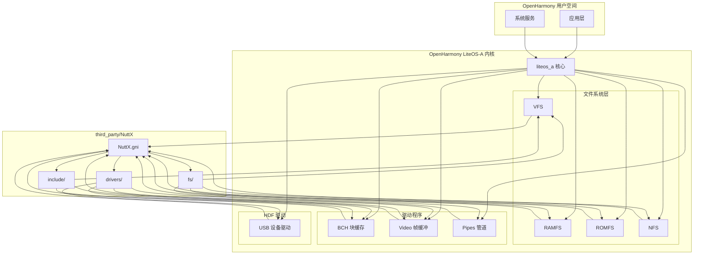
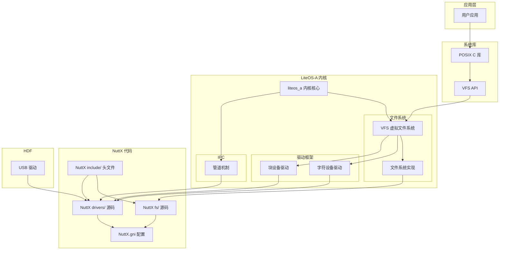

# 依赖关系与使用

## 4.1 直接依赖模块

### 依赖模块清单

NuttX 代码被以下 9 个 OpenHarmony 模块直接依赖：

| # | 模块 | BUILD.gn 路径 | 复用组件 | 主要用途 |
|---|------|--------------|---------|---------|
| 1 | **liteos_a 内核** | `//kernel/liteos_a/BUILD.gn` | notice 生成 | 版权声明 |
| 2 | **VFS** | `//kernel/liteos_a/fs/vfs/BUILD.gn` | 6 个模块组 | 虚拟文件系统 |
| 3 | **RAMFS** | `//kernel/liteos_a/fs/ramfs/BUILD.gn` | TMPFS | 临时文件系统 |
| 4 | **ROMFS** | `//kernel/liteos_a/fs/romfs/BUILD.gn` | ROMFS | ROM 只读文件系统 |
| 5 | **NFS** | `//kernel/liteos_a/fs/nfs/BUILD.gn` | NFS | 网络文件系统 |
| 6 | **BCH 驱动** | `//kernel/liteos_a/drivers/char/bch/BUILD.gn` | BCH | 块设备缓存 |
| 7 | **Video 驱动** | `//kernel/liteos_a/drivers/char/video/BUILD.gn` | Video | 帧缓冲显示 |
| 8 | **Pipes** | `//kernel/liteos_a/kernel/extended/pipes/BUILD.gn` | Pipes | 管道 IPC |
| 9 | **USB 设备** | `//drivers/hdf_core/adapter/khdf/liteos/model/usb/device/BUILD.gn` | usbdev | USB 设备驱动 |

### 依赖关系图



---

## 4.2 使用场景详解

### 4.2.1 文件系统层

#### VFS（虚拟文件系统）

**模块路径**：`//kernel/liteos_a/fs/vfs/`

**功能描述**：
VFS 是 LiteOS-A 文件系统的核心层，提供统一的文件操作接口，屏蔽底层文件系统的差异。

**复用组件**：

| 组件 | 源文件数 | 功能说明 |
|-----|---------|---------|
| DIRENT | 6 | 目录操作（opendir、readdir 等） |
| DRIVER | 8 | 块设备驱动注册管理 |
| INODE | 1 | inode 节点管理 |
| MOUNT | 4 | 文件系统挂载操作 |
| VFS | 27 | 核心文件操作（open、read、write 等） |

**使用方式**：

```c
// 文件操作示例
int fd = open("/dev/block0", O_RDWR);  // 使用 VFS 接口
read(fd, buffer, size);
write(fd, buffer, size);
close(fd);

// 目录操作示例
DIR *dir = opendir("/system");
struct dirent *entry = readdir(dir);
closedir(dir);
```

**OH 特有代码**：
```c
// kernel/liteos_a/fs/vfs/operation/vfs_init.c
int VfsInit(void)
{
    // OH 特有的初始化逻辑
    return 0;
}
```

#### RAMFS（临时文件系统）

**模块路径**：`//kernel/liteos_a/fs/ramfs/`

**复用组件**：`NUTTX_FS_TMPFS_SRC_FILES`

**功能**：基于内存的临时文件系统，适用于存储临时数据

**使用场景**：
- `/tmp` 目录
- 运行时临时文件存储
- 内存文件系统测试

**挂载示例**：
```c
mount("ramfs", "/tmp", "ramfs", 0, NULL);
```

#### ROMFS（ROM 只读文件系统）

**模块路径**：`//kernel/liteos_a/fs/romfs/`

**复用组件**：`NUTTX_FS_ROMFS_SRC_FILES`

**功能**：ROM 只读文件系统，适用于存储只读资源

**使用场景**：
- 系统固件存储
- 只读配置文件
- 预编译资源

#### NFS（网络文件系统）

**模块路径**：`//kernel/liteos_a/fs/nfs/`

**复用组件**：`NUTTX_FS_NFS_SRC_FILES`

**功能**：支持 NFS 协议的网络文件系统

**使用场景**：
- 远程文件访问
- 网络存储集成
- 开发调试

---

### 4.2.2 驱动程序

#### BCH（块设备缓存）

**模块路径**：`//kernel/liteos_a/drivers/char/bch/`

**复用组件**：`NUTTX_DRIVERS_BCH_SRC_FILES`

**功能**：块设备缓存驱动，提高块设备 I/O 效率

**架构**：


**关键文件**：

| 文件 | 功能 |
|-----|------|
| `bchdev_driver.c` | 块设备驱动主文件 |
| `bchlib_cache.c` | 缓存管理 |
| `bchlib_read.c` | 读取操作 |
| `bchlib_write.c` | 写入操作 |

#### Video（帧缓冲）

**模块路径**：`//kernel/liteos_a/drivers/char/video/`

**复用组件**：`NUTTX_DRIVERS_VIDEO_SRC_FILES`

**功能**：帧缓冲显示驱动，支持图形输出

**关键头文件**：
```c
#include <nuttx/video/fb.h>
```

**使用示例**：
```c
struct fb_fix_screeninfo finfo;
struct fb_var_screeninfo vinfo;
int fd = open("/dev/fb0", O_RDWR);
ioctl(fd, FBIOGET_FSCREENINFO, &finfo);
ioctl(fd, FBIOGET_VSCREENINFO, &vinfo);
```

---

### 4.2.3 IPC 机制

#### Pipes（管道）

**模块路径**：`//kernel/liteos_a/kernel/extended/pipes/`

**复用组件**：`NUTTX_DRIVERS_PIPES_SRC_FILES`

**功能**：管道 IPC 机制，支持进程间通信

**特性**：
- 支持匿名管道和命名管道（FIFO）
- 阻塞/非阻塞模式
- 面向字节的通信

**使用示例**：

```c
// 创建匿名管道
int pipefd[2];
pipe(pipefd);

// 命名管道
mkfifo("/tmp/myfifo", 0666);
int fd = open("/tmp/myfifo", O_RDWR);

// 读写管道
write(pipefd[1], "hello", 5);
read(pipefd[0], buffer, 5);
```

---

### 4.2.4 USB 设备驱动

**模块路径**：`//drivers/hdf_core/adapter/khdf/liteos/model/usb/device/`

**复用组件**：`third_party/NuttX/drivers/usbdev`

**功能**：USB 设备协议栈支持

**集成方式**：
```bash
USB_DEVICE_ROOT = "$LITEOSTHIRDPARTY/NuttX/drivers/usbdev"
```

---

## 4.3 头文件引用

### 核心头文件

| 头文件路径 | 说明 | 使用模块 |
|----------|------|---------|
| `//third_party/NuttX/include/nuttx/` | 公共头文件目录 | 所有模块 |
| `//third_party/NuttX/include/sys/` | 系统调用头文件 | VFS |
| `//third_party/Nutttx/include/nuttx/video/` | 视频驱动头文件 | Video |
| `//third_party/NuttX/drivers/pipes/` | 管道驱动头文件 | Pipes |

### 常用头文件

```c
// 文件系统
#include <nuttx/fs/fs.h>
#include <nuttx/fs/dirent.h>
#include <nuttx/fs/inode.h>
#include <nuttx/fs/mount.h>

// 设备驱动
#include <nuttx/video/fb.h>
#include <nuttx/drivers/bch.h>

// 系统调用
#include <sys/types.h>
#include <sys/stat.h>
#include <fcntl.h>
#include <unistd.h>
```

---

## 4.4 依赖关系详解

### 4.4.1 依赖层级

```
层级 0: 核心依赖
    └── kernel/liteos_a/BUILD.gn
            └── NuttX (notice 文件)
                   
层级 1: 文件系统
    ├── fs/vfs (依赖 DIRENT、DRIVER、INODE、MOUNT、VFS)
    ├── fs/ramfs (依赖 TMPFS)
    ├── fs/romfs (依赖 ROMFS)
    └── fs/nfs (依赖 NFS)

层级 2: 驱动程序
    ├── drivers/char/bch (依赖 BCH)
    ├── drivers/char/video (依赖 VIDEO)
    └── kernel/extended/pipes (依赖 PIPES)

层级 3: HDF 集成
    └── drivers/hdf_core (依赖 USBDEV)
```

### 4.4.2 模块间依赖

| 消费者 | 提供者 | 依赖类型 |
|-------|-------|---------|
| VFS | 所有 FS 模块 | 功能调用 |
| BCH | 块设备驱动 | 框架依赖 |
| Video | 显示子系统 | 接口调用 |
| Pipes | IPC 机制 | 功能实现 |

---

## 4.5 集成架构图

### 完整集成视图



---

## 4.6 使用统计

### 代码复用统计

| 类别 | OH 特有代码 | NuttX 复用代码 | 复用比例 |
|-----|------------|---------------|---------|
| VFS | ~20% | ~80% | 80% |
| RAMFS | ~10% | ~90% | 90% |
| ROMFS | ~10% | ~90% | 90% |
| NFS | ~20% | ~80% | 80% |
| BCH | ~5% | ~95% | 95% |
| Video | ~10% | ~90% | 90% |
| Pipes | ~15% | ~85% | 85% |

### 模块复用率

| 模块 | NuttX 源文件 | OH 特有文件 | 总文件数 |
|-----|-------------|------------|---------|
| VFS | 46 | ~20 | ~66 |
| RAMFS | 1 | ~5 | ~6 |
| ROMFS | 2 | ~3 | ~5 |
| NFS | 3 | ~5 | ~8 |
| BCH | 9 | ~3 | ~12 |
| Video | 1 | ~5 | ~6 |
| Pipes | 3 | ~5 | ~8 |

---

## 4.7 典型使用场景

### 场景 1：文件系统操作

```c
#include <stdio.h>
#include <fcntl.h>
#include <unistd.h>

int main() {
    // 打开文件（使用 NuttX VFS）
    int fd = open("/data/file.txt", O_RDWR | O_CREAT, 0644);
    if (fd < 0) {
        perror("open failed");
        return -1;
    }
    
    // 写入数据
    write(fd, "Hello, OpenHarmony!", 19);
    
    // 读取数据
    char buf[64];
    lseek(fd, 0, SEEK_SET);
    read(fd, buf, 19);
    
    // 关闭文件
    close(fd);
    return 0;
}
```

### 场景 2：设备驱动访问

```c
#include <nuttx/drivers/bch.h>
#include <fcntl.h>

int main() {
    // 打开块设备（使用 NuttX BCH 驱动）
    int fd = open("/dev/block0", O_RDWR);
    if (fd < 0) {
        perror("open block device failed");
        return -1;
    }
    
    // 执行 I/O 操作
    char buffer[512];
    read(fd, buffer, sizeof(buffer));
    
    close(fd);
    return 0;
}
```

### 场景 3：进程间通信

```c
#include <unistd.h>
#include <string.h>

int main() {
    int pipefd[2];
    
    // 创建管道
    if (pipe(pipefd) < 0) {
        perror("pipe failed");
        return -1;
    }
    
    // 写入数据
    const char *msg = "message through pipe";
    write(pipefd[1], msg, strlen(msg) + 1);
    
    // 读取数据
    char buf[64];
    read(pipefd[0], buf, sizeof(buf));
    
    // 清理
    close(pipefd[0]);
    close(pipefd[1]);
    
    return 0;
}
```

---

## 4.8 总结

### 核心依赖模块

| 优先级 | 模块 | 关键作用 |
|-------|------|---------|
| ⭐⭐⭐ | VFS | 虚拟文件系统核心 |
| ⭐⭐⭐ | BCH | 块设备缓存 |
| ⭐⭐ | RAMFS | 临时文件系统 |
| ⭐⭐ | Video | 帧缓冲显示 |
| ⭐⭐ | Pipes | 管道 IPC |
| ⭐ | ROMFS | ROM 只读文件系统 |
| ⭐ | NFS | 网络文件系统 |

### 使用建议

1. **了解依赖**：开发时了解所使用模块的 NuttX 依赖
2. **关注更新**：关注 NuttX 上游更新，及时同步
3. **安全审查**：审查 NuttX 代码中的安全相关部分
4. **性能优化**：了解 NuttX 实现细节，进行针对性优化
