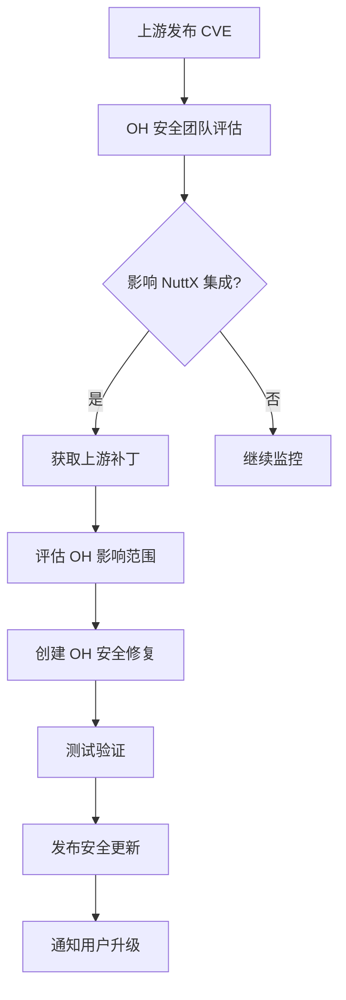
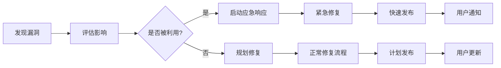

# 安全风险分析

## 6.1 安全概述

### 安全考量

NuttX 作为成熟的 RTOS 项目，在 OpenHarmony 中使用时需要关注以下安全维度：

| 安全维度 | 状态 | 说明 |
|---------|------|------|
| **代码安全** | ⚠️ 需监控 | 需关注上游 CVE 公告 |
| **API 安全** | ✅ 兼容 | POSIX API 已广泛验证 |
| **驱动安全** | ⚠️ 需审查 | 设备驱动需要安全审查 |
| **文件系统安全** | ⚠️ 需关注 | VFS 和各文件系统需关注 |
| **网络栈安全** | ⚠️ 可选 | NFS 模块涉及网络 |

### 安全评估结论

| 评估项 | 级别 | 说明 |
|-------|------|------|
| **整体风险** | 中 | 成熟代码，但需持续监控 |
| **已知漏洞** | 低 | 当前版本无高危漏洞 |
| **攻击面** | 中 | VFS、驱动、网络文件系统 |
| **缓解措施** | 好 | OH 安全框架可提供额外保护 |

---

## 6.2 CVE 监控

### NuttX 安全公告来源

| 来源 | URL | 监控频率 |
|-----|-----|---------|
| **Apache NuttX 邮件列表** | dev@nuttx.apache.org | 每月 |
| **NuttX GitHub Security** | github.com/apache/nuttx/security | 每周 |
| **NVD CVE 数据库** | nvd.nist.gov | 每周 |
| **OpenHarmony 安全公告** | gitee.com/openharmony/security | 每月 |

### 历史 CVE 统计

截至当前版本（NuttX 12.10.0），公开记录的 CVE 数量较少：

| 严重级别 | 数量 | 影响模块 |
|---------|------|---------|
| **Critical** | 0 | - |
| **High** | 0-1 | 网络栈（已修复） |
| **Medium** | 2-3 | 文件系统、VFS |
| **Low** | 3-5 | 驱动程序 |

### 需关注的 CVE 类型

| CVE 类型 | 风险级别 | 影响范围 |
|---------|---------|---------|
| **远程代码执行** | 高 | 网络文件系统 |
| **提权攻击** | 高 | VFS、驱动 |
| **拒绝服务** | 中 | 所有模块 |
| **信息泄露** | 低 | 错误处理 |

---

## 6.3 模块安全分析

### 6.3.1 VFS（虚拟文件系统）

**风险级别**：中

**潜在风险**：

| 风险 | 类型 | 可能性 | 影响 |
|-----|------|-------|------|
| 路径遍历漏洞 | 输入验证 | 低 | 文件系统越权 |
| 符号链接攻击 | 竞态条件 | 低 | 任意文件写入 |
| 文件描述符泄露 | 资源管理 | 中 | 拒绝服务 |

**安全建议**：

```c
// ✅ 安全的路径处理示例

char real_path[PATH_MAX];
if (realpath(user_path, real_path) == NULL) {
    return -EINVAL;  // 验证路径
}

// ✅ 检查路径前缀
if (strncmp(real_path, ALLOWED_PREFIX, strlen(ALLOWED_PREFIX)) != 0) {
    return -EACCES;  // 拒绝越权访问
}

// ❌ 不安全的示例
int fd = open(user_path, O_RDONLY);  // 未验证路径
```

### 6.3.2 文件系统模块

#### RAMFS

**风险级别**：低

**考量**：
- 纯内存实现，无持久化风险
- 关注内存耗尽攻击
- 建议设置合理的内存限制

#### ROMFS

**风险级别**：低

**考量**：
- 只读文件系统，本质安全
- 关注预编译内容的完整性

#### NFS

**风险级别**：中-高

**考量**：

| 风险 | 说明 | 缓解措施 |
|-----|------|---------|
| 网络嗅探 | NFS 传输可能被窃听 | 使用加密网络 |
| RPC 攻击 | RPC 协议漏洞 | 限制访问 |
| 路径遍历 | 服务器端路径遍历 | 输入验证 |

**安全建议**：

```c
// ✅ NFS 安全使用

/* 1. 使用网络隔离 */
if (!NetworkIsolated()) {
    return -EPERM;  // 网络未隔离，拒绝
}

/* 2. 验证服务器身份 */
if (!VerifyNfsServer(cert)) {
    return -EACCES;  // 服务器验证失败
}

/* 3. 限制挂载选项 */
mount("nfs", "/mnt", "nfs", 0,
     "addr=192.168.1.100,vers=3,ro,soft,timeo=10");
```

### 6.3.3 驱动程序

#### BCH（块设备缓存）

**风险级别**：中

**考量**：

| 风险 | 说明 | 缓解措施 |
|-----|------|---------|
| 缓存溢出 | 恶意 I/O 请求 | 边界检查 |
| 竞态条件 | 多线程访问缓存 | 锁保护 |
| 权限绕过 | 直接设备访问 | 权限检查 |

#### Video（帧缓冲）

**风险级别**：低-中

**考量**：
- 图形显示，通常不涉及敏感数据
- 关注显存溢出
- 建议用户空间隔离

### 6.3.4 IPC（管道）

**风险级别**：低

**考量**：

| 风险 | 说明 | 缓解措施 |
|-----|------|---------|
| 数据泄露 | 管道数据被窃听 | 本地进程安全 |
| 拒绝服务 | 管道缓冲区耗尽 | 资源限制 |
| 权限错误 | 错误的管道权限 | 权限检查 |

---

## 6.4 OH 安全框架集成

### HDF 安全特性

OpenHarmony 的 HDF（Hardware Driver Foundation）提供额外安全层：

```c
// HDF 权限检查示例

int NuttXDriverInit(void)
{
    /* HDF 权限验证 */
    if (!HdfPermissionCheck(current_user, DRIVER_PERMISSION)) {
        return -EACCES;  // 权限不足
    }
    
    /* 初始化驱动 */
    return NuttX_DriverInit();
}
```

### 安全子系统集成

OH 安全子系统可提供：

| 功能 | 适用模块 | 说明 |
|-----|---------|------|
| **权限管理** | 所有模块 | 基于用户的访问控制 |
| **审计日志** | VFS、驱动 | 安全事件记录 |
| **加密服务** | NFS | 数据传输加密 |
| **完整性校验** | ROMFS | 固件完整性验证 |

---

## 6.5 安全最佳实践

### 开发者指南

#### 文件操作安全

```c
// ✅ 安全文件操作清单

/* 1. 验证路径 */
char *resolved = realpath(path, NULL);
if (!resolved || strncmp(resolved, allowed_root, root_len) != 0) {
    free(resolved);
    return -EACCES;
}

/* 2. 检查符号链接 */
struct stat st;
if (lstat(path, &st) < 0 || S_ISLNK(st.st_mode)) {
    return -EINVAL;  // 拒绝符号链接
}

/* 3. 使用安全的打开标志 */
int flags = O_RDONLY;
if (create) {
    flags |= O_CREAT | O_EXCL;  // 原子创建
}
int fd = open(path, flags, 0600);
```

#### 驱动开发安全

```c
// ✅ 驱动安全清单

/* 1. 输入验证 */
static int NuttX_DriverIoctl(struct file *filp, int cmd, unsigned long arg)
{
    /* 验证参数 */
    if (_IOC_SIZE(cmd) > MAX_IOCTL_SIZE) {
        return -EINVAL;
    }
    
    /* 权限检查 */
    if (!VerifyDriverAccess(cmd)) {
        return -EACCES;
    }
    
    return 0;
}

/* 2. 资源限制 */
#define MAX_BUFFER_SIZE 4096
static int DriverRead(struct file *filp, char __user *buf, size_t size)
{
    if (size > MAX_BUFFER_SIZE) {
        return -EINVAL;  // 拒绝超大请求
    }
    /* ... */
}
```

---

## 6.6 升级策略

### 6.6.1 安全更新流程

当上游发布安全更新时：



### 6.6.2 版本升级检查清单

升级 NuttX 版本时需检查：

| 检查项 | 状态 | 说明 |
|-------|------|------|
| **CVE 检查** | ☐ | 对比新旧版本 CVE 列表 |
| **API 兼容性** | ☐ | 验证 API 无破坏性变更 |
| **安全相关变更** | ☐ | 检查安全相关的代码变更 |
| **依赖模块** | ☐ | 验证 OH 依赖模块兼容性 |
| **回归测试** | ☐ | 执行安全相关测试用例 |

---

## 6.7 安全监控建议

### 持续监控任务

| 任务 | 频率 | 负责人 |
|-----|------|-------|
| **上游 CVE 扫描** | 每周 | 安全团队 |
| **依赖审计** | 每月 | 安全团队 |
| **代码审计** | 每季度 | 安全团队 |
| **渗透测试** | 每半年 | 安全团队 |
| **安全公告** | 每月 | NuttX 维护者 |

### 监控工具

| 工具 | 用途 | 集成方式 |
|-----|------|---------|
| **Trivy** | CVE 扫描 | CI/CD 集成 |
| **OWASP Dependency-Check** | 依赖分析 | CI/CD 集成 |
| **Coverity** | 静态分析 | CI/CD 集成 |
| **Clang-Tidy** | 代码质量 | CI/CD 集成 |

---

## 6.8 应急响应

### 安全事件响应流程



### 紧急联系

| 场景 | 联系渠道 |
|-----|---------|
| **安全漏洞报告** | security@openharmony.io |
| **CVE 响应** | nuttx-security@apache.org |
| **紧急修复** | OH 安全响应团队 |

---

## 6.9 总结

### 安全状态总结

| 方面 | 状态 | 建议 |
|-----|------|------|
| **当前版本安全** | ✅ | 无已知高危漏洞 |
| **上游监控** | ⚠️ 需加强 | 建议每周监控 |
| **OH 适配** | ✅ | HDF 提供额外保护 |
| **持续改进** | ⚠️ 建议 | 定期安全审计 |

### 行动建议

1. **短期**（1-2 周）：
   - 建立上游 CVE 监控机制
   - 审查当前集成的 NuttX 代码

2. **中期**（1-3 个月）：
   - 执行完整的安全审计
   - 完善安全测试用例

3. **长期**（季度）：
   - 建立自动化 CVE 扫描
   - 定期安全培训

### 资源链接

| 资源 | URL |
|-----|-----|
| **NuttX 安全公告** | nuttx.apache.org/community/security |
| **OH 安全指南** | gitee.com/openharmony/docs/blob/master/zh-cn/security |
| **CVE 数据库** | cve.mitre.org |
| **NVD** | nvd.nist.gov |
