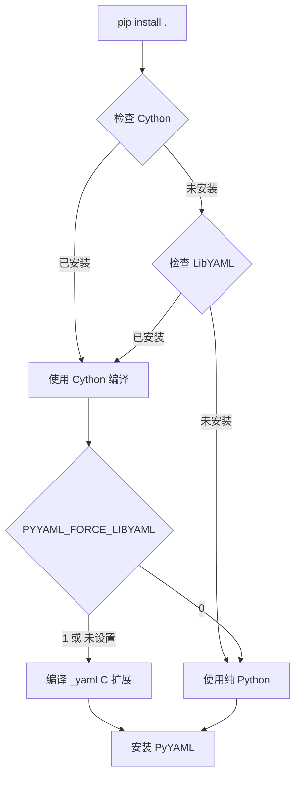
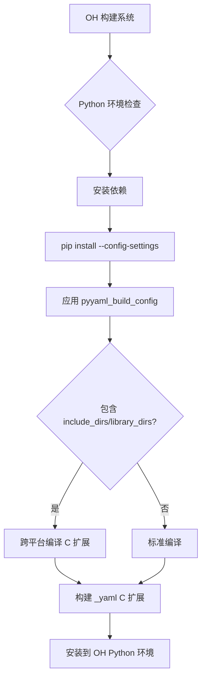

# PyYAML OpenHarmony 构建适配

## 概述

PyYAML 在 OpenHarmony 中采用 **轻量级构建适配** 方式。由于 PyYAML 是纯 Python 库，它不参与 OpenHarmony 的 GN 构建系统，而是通过 PEP 517 标准的 Python 打包方式进行构建和安装。

## 构建架构

### OpenHarmony 构建系统适配

```
OpenHarmony 构建系统 (GN)
         ↓
    Python 环境配置
         ↓
    PyYAML 安装 (pip/setup.py)
         ↓
   Python import yaml
```

**关键特点**:
- ❌ 没有 `BUILD.gn` 文件
- ✅ 使用标准 Python 构建工具 (setuptools + pyproject.toml)
- ✅ 通过 `bundle.json` 声明组件信息
- ✅ 支持跨平台编译 (PEP 517)

---

## bundle.json 配置

### 完整配置

```json
{
  "name": "@ohos/PyYAML",
  "description": "A full-featured YAML processing framework for Python",
  "version": "6.0.2",
  "license": "MIT",
  "publishAs": "code-segment",
  "segment": {
    "destPath": "third_party/PyYAML"
  },
  "dirs": {},
  "scripts": {},
  "component": {
    "name": "PyYAML",
    "subsystem": "thirdparty",
    "syscap": [],
    "features": [],
    "adapted_system_type": [
      "mini",
      "standard"
    ],
    "rom": "",
    "ram": "",
    "deps": {
      "components": [],
      "third_party": []
    },
    "build": {
      "sub_component": [],
      "inner_kits": [],
      "test": []
    }
  }
}
```

### 配置说明

| 字段 | 值 | 说明 |
|------|-----|------|
| `name` | `@ohos/PyYAML` | OpenHarmony 组件标识符 |
| `description` | `A full-featured YAML...` | 组件描述 |
| `version` | `6.0.2` | 版本号，需与上游同步 |
| `license` | `MIT` | 许可证类型 |
| `publishAs` | `code-segment` | 发布方式：代码段（源码） |
| `component.subsystem` | `thirdparty` | 所属子系统：第三方库 |
| `component.adapted_system_type` | `["mini", "standard"]` | 支持的系统类型 |
| `component.deps` | `[]` | 无依赖（纯 Python 库） |

---

## pyproject.toml 配置

### 完整配置

```toml
[build-system]
requires = [
  "setuptools",
  "wheel",
  "Cython; python_version < '3.13'",
  "Cython>=3.0; python_version >= '3.13'"
]
backend-path = ["packaging"]
build-backend = "_pyyaml_pep517"

[project]
name = "PyYAML"
version = "6.0.2"
description = "YAML parser and emitter for Python"
readme = "README.md"
license = {text = "MIT"}
requires-python = ">=3.8"

[project.urls]
Homepage = "https://github.com/yaml/pyyaml"
Documentation = "https://pyyaml.org/wiki/PyYAMLDocumentation"
```

### 关键特性

#### 1. 条件 Cython 依赖

```toml
"Cython; python_version < '3.13'",
"Cython>=3.0; python_version >= '3.13'"
```

**目的**: 根据不同的 Python 版本选择合适的 Cython 版本
- Python 3.8-3.12: 使用任意稳定版 Cython
- Python 3.13: 使用 Cython 3.0+ (因为 Cython < 3.0 不支持 Python 3.13)

#### 2. 自定义构建后端

```toml
backend-path = ["packaging"]
build-backend = "_pyyaml_pep517"
```

**目的**: 使用 OpenHarmony 添加的 PEP 517 构建后端，支持配置化构建。

---

## OH 特有构建适配

### 1. PEP 517 构建后端

**文件**: `packaging/_pyyaml_pep517.py`

**目的**: 桥接 setuptools.build_meta，支持通过配置参数自定义构建过程。

**核心功能**:

```python
# 桥接 setuptools.build_meta 接口
def _bridge_build_meta():
    import functools
    from setuptools import build_meta
    for attr_name in build_meta.__all__:
        attr_value = getattr(build_meta, attr_name)
        if callable(attr_value):
            setattr(self_module, attr_name, functools.partial(_expose_config_settings, attr_value))

# 支持配置参数
class ActiveConfigSettings:
    _current = {}

    @classmethod
    def current(cls):
        return cls._current
```

**使用方式**:

```bash
# 通过 config-settings 传递构建选项
pip install . --config-settings='{"pyyaml_build_config": {"include_dirs": ["/path/to/includes"], "define": ["MACRO=value"]}}'
```

**OpenHarmony 应用场景**:
- 交叉编译时指定 include_dirs（LibYAML 头文件路径）
- 跨平台编译时指定 library_dirs（LibYAML 库文件路径）
- 添加自定义编译宏定义

---

### 2. LibYAML 构建脚本

**文件**: `packaging/build/libyaml.sh`

**原始脚本**:
```bash
#!/bin/sh
set -eux

# build requested version of libyaml locally
git clone --depth 1 --branch ${LIBYAML_REF} https://github.com/yaml/libyaml
cd libyaml
./bootstrap
./configure
make
```

**OH 改进**:
```bash
#!/bin/sh
set -eux

# OH 添加: ensure prove testing tool is available
echo "::group::ensure build/test prerequisites"
if ! command -v prove; then
  if grep -m 1 alpine /etc/os-release; then
    apk add perl-utils
  else
    echo "prove (perl) testing tool unavailable"
    exit 1
  fi
fi
echo "::endgroup::"

# build requested version of libyaml locally
echo "::group::fetch libyaml ${LIBYAML_REF}"
git config --global advice.detachedHead false
git clone --depth 1 --branch ${LIBYAML_REF} https://github.com/yaml/libyaml
# ...
```

**改进点**:
1. ✅ 添加 `prove` 工具检查（用于 LibYAML 的测试）
2. ✅ 支持 Alpine Linux 环境（OpenHarmony 某些构建环境）
3. ✅ 使用 GitHub Actions 输出格式（`::group::` / `::endgroup::`）

---

### 3. setup.py 配置化构建

**关键改动**:

```python
# setup.py
class build_ext(_build_ext):
    def finalize_options(self):
        super().finalize_options()
        pep517_config = ActiveConfigSettings.current()

        build_config = pep517_config.get('pyyaml_build_config')

        if build_config:
            import json
            build_config = json.loads(build_config)
            print(f"`pyyaml_build_config`: {build_config}")
        else:
            build_config = {}
            print("No `pyyaml_build_config` setting found.")

        for key, value in build_config.items():
            existing_value = getattr(self, key, ...)
            if existing_value is ...:
                print(f"ignoring unknown config key {key!r}")
                continue

            if existing_value:
                print(f"combining {key!r} {existing_value!r} and {value!r}")
                value = existing_value + value

            setattr(self, key, value)
```

**支持的配置参数**:

| 参数 | 类型 | 说明 | 示例 |
|------|------|------|------|
| `include_dirs` | List[str] | C 头文件搜索路径 | `["/usr/local/include"]` |
| `library_dirs` | List[str] | 库文件搜索路径 | `["/usr/local/lib"]` |
| `define` | List[str] | 编译宏定义 | `["YAML_VERSION_STRING=060200"]` |
| `undef` | List[str] | 取消宏定义 | `["NDEBUG"]` |
| `libraries` | List[str] | 链接库 | `["yaml"]` |

---

### 4. pytest 测试适配

**文件**: `tests/legacy_tests/conftest.py`

**目的**: 将旧的 unittest 测试框架适配到 pytest。

**核心功能**:

```python
# 自定义 pytest 收集器
class PyYAMLCollector(pytest.Collector):
    def collect(self):
        items = []
        unittest = getattr(self._function, 'unittest', None)

        if unittest is True:
            # 无文件列表，直接返回测试项
            items.append(PyYAMLItem.from_parent(parent=self, function=self._function, filenames=None))
        else:
            # 有文件列表，为每个文件创建测试项
            for base, exts in _test_filenames:
                filenames = []
                for ext in unittest:
                    if ext not in exts:
                        break
                    filenames.append(os.path.join(DATA, base + ext))
                else:
                    # 创建测试项
                    items.append(PyYAMLItem.from_parent(parent=self, function=self._function, filenames=filenames))
        return items
```

**优势**:
- ✅ 无需修改旧的测试代码
- ✅ 支持 pytest 的并行测试和丰富的插件生态
- ✅ 便于持续集成（CI）

---

## 与上游构建系统的差异

### 原始构建系统 (上游 PyYAML)

```toml
[build-system]
requires = ["setuptools", "wheel", "Cython"]
build-backend = "setuptools.build_meta"
```

```python
# setup.py
class build_ext(_build_ext):
    def finalize_options(self):
        super().finalize_options()
        # 无配置化支持

    def run(self):
        optional = True
        if with_ext is not None and not with_ext:
            continue
        if with_cython:
            ext.sources = self.cython_sources(ext.sources, ext)
        try:
            self.build_extension(ext)
        except (Exception, DistutilsError):
            if not optional:
                raise
            ext.python_sources = ext.sources
            ext.sources = []
```

### OpenHarmony 适配

```toml
[build-system]
requires = [
  "setuptools",
  "wheel",
  "Cython; python_version < '3.13'",
  "Cython>=3.0; python_version >= '3.13'"
]
backend-path = ["packaging"]
build-backend = "_pyyaml_pep517"  # OH 添加的构建后端
```

```python
# setup.py
class build_ext(_build_ext):
    def finalize_options(self):
        super().finalize_options()
        # OH 添加: 支持配置化构建
        pep517_config = ActiveConfigSettings.current()
        build_config = pep517_config.get('pyyaml_build_config')
        # ... 应用配置参数

    def run(self):
        optional = True
        if with_ext is not None and not with_ext:
            continue
        if with_cython:
            # OH 添加: 调试输出
            print(f"BUILDING CYTHON EXT; {self.include_dirs=} {self.library_dirs=} {self.define=}")
            ext.sources = self.cython_sources(ext.sources, ext)
        # ...
```

### 差异对比表

| 特性 | 上游构建 | OH 适配 | 影响 |
|------|----------|---------|------|
| 构建后端 | `setuptools.build_meta` | `_pyyaml_pep517` | 支持配置化构建 |
| Cython 依赖 | `Cython` | 条件依赖（Python 3.13 使用 3.0+）| 支持最新 Python 版本 |
| 配置化构建 | ❌ 无 | ✅ 支持 | 跨平台交叉编译 |
| 测试框架 | unittest | pytest (通过 conftest.py 适配) | 更好的 CI 集成 |
| LibYAML 构建 | 基础脚本 | 改进脚本（Alpine 支持）| 更好的环境兼容性 |

---

## 特殊处理

### 1. 禁用 C 扩展

某些场景下可能需要禁用 LibYAML C 扩展（如编译环境受限）：

```bash
# 方式 1: 环境变量
export PYYAML_FORCE_LIBYAML=0
python setup.py install

# 方式 2: 配置参数
pip install . --config-settings='{"pyyaml_build_config": {"with_ext": false}}'
```

### 2. 强制 Cython 重新编译

```bash
# 环境变量
export PYYAML_FORCE_CYTHON=1
python setup.py install
```

### 3. 指定 LibYAML 头文件/库文件路径

```bash
# 跨平台编译时指定路径
pip install . --config-settings='{
  "pyyaml_build_config": {
    "include_dirs": ["/path/to/libyaml/include"],
    "library_dirs": ["/path/to/libyaml/lib"],
    "libraries": ["yaml"]
  }
}'
```

---

## 构建流程

### 标准构建流程



### OH 构建流程



---

## 版本兼容性

### Python 版本支持

| Python 版本 | PyYAML 5.4.1 | PyYAML 6.0 | PyYAML 6.0.2 | OH 状态 |
|------------|--------------|-------------|---------------|---------|
| 3.6 | ✅ | ❌ | ❌ | 不支持 |
| 3.7 | ✅ | ❌ | ❌ | 不支持 |
| 3.8 | ✅ | ✅ | ✅ | ✅ 主要版本 |
| 3.9 | ✅ | ✅ | ✅ | ✅ 主要版本 |
| 3.10 | ✅ | ✅ | ✅ | ✅ 主要版本 |
| 3.11 | ⚠️ | ✅ | ✅ | ✅ 主要版本 |
| 3.12 | ❌ | ✅ | ✅ | ✅ 主要版本 |
| 3.13 | ❌ | ❌ | ✅ | ✅ 最新支持 |

### Cython 版本兼容性

| Cython 版本 | Python 3.8-3.12 | Python 3.13 | OH 支持 |
|------------|-----------------|--------------|---------|
| < 3.0 | ✅ | ❌ | 部分支持 |
| >= 3.0 | ✅ | ✅ | ✅ 完全支持 |

---

## 相关文档

- [01_Overview.md](./01_Overview.md) - PyYAML 原始库简介
- [02_Patches.md](./02_Patches.md) - OpenHarmony Patch 详细分析
- [04_Usage_in_OH.md](./04_Usage_in_OH.md) - 在 OpenHarmony 中的依赖关系与使用
