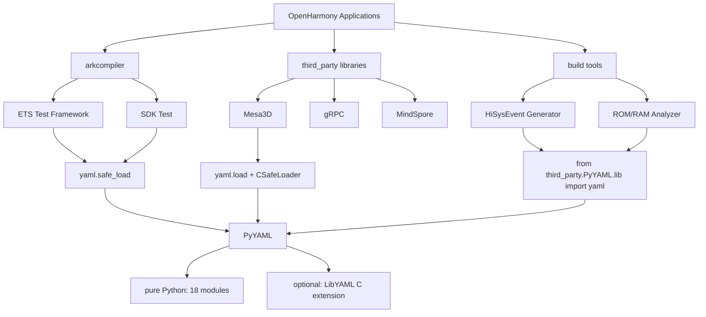

# PyYAML 在 OpenHarmony 中的依赖关系与使用

## 概述

PyYAML 在 OpenHarmony 中主要通过 **Python 直接 import** 的方式使用，而不是通过 GN 构建系统依赖。它被多个子系统和第三方库用于配置文件解析、测试元数据处理、构建系统代码生成等场景。

## 组件基本信息

| 属性 | 值 |
|------|-----|
| 组件名 | @ohos/PyYAML |
| 版本 | 6.0.2 |
| 许可证 | MIT |
| 子系统 | thirdparty |
| 适配系统类型 | mini, standard |

---

## 依赖方式说明

### 不使用 GN 构建系统依赖

**重要发现**: PyYAML 在 OpenHarmony 中**不是通过 GN 构建系统依赖的**（未发现 BUILD.gn 中的 deps 引用）。

**原因**:
- PyYAML 是纯 Python 库
- OpenHarmony 系统中已预装 Python 和 PyYAML
- 直接通过 `import yaml` 使用即可

### 依赖方式分类

| 依赖方式 | 说明 | 使用场景 | 示例 |
|----------|------|----------|------|
| **Python 直接 import** | `import yaml` / `from yaml import ...` | 最常见，大部分使用场景 | `import yaml`<br>`data = yaml.safe_load(f)` |
| **第三方包依赖** | `python3-yaml` (apt 包) | Docker 构建环境 | `apt-get install python3-yaml` |
| **Python 路径引用** | `from third_party.PyYAML.lib import yaml` | 特定构建脚本 | 构建系统代码生成 |

---

## 直接依赖者统计

### 按子系统分类

| 子系统 | 文件数量 | 主要用途 |
|--------|----------|----------|
| **arkcompiler** | 37 | 编译器测试框架、ETS Playground、SDK 测试 |
| **third_party** | 45 | gRPC、Mesa3D、MindSpore、libinput 等第三方库 |
| **kernel** | 3 | Linux 内核网络工具 (ynl) |
| **developtools** | 2 | ROM/RAM 分析工具 |
| **build** | 1 | HiSysEvent 定义生成 |
| **总计** | **88 处引用** | **83 个独立文件** |

### 按文件类型分类

| 文件类型 | 数量 | 说明 |
|----------|------|------|
| `*.py` | 78 | Python 源文件 |
| `BUILD.gn` | 2 | GN 构建文件（注释引用） |
| `*.json` | 2 | JSON 配置文件 |
| `*.txt` | 1 | 文本文件 |

---

## 主要使用场景

### 场景 1: 配置文件解析（最常见）

**用途**: 读取 YAML 格式的配置文件，获取应用程序或工具的配置信息。

**典型代码**:

```python
# arkcompiler/ets_frontend/test/scripts/sdk_test/options.py
import yaml

configs = yaml.safe_load(config_file)
```

```python
# arkcompiler/runtime_core/static_core/plugins/ets/playground/backend/src/arkts_playground/config.py
import yaml

with open(f) as f:
    conf = yaml.safe_load(f)
```

**特点**:
- 使用 `yaml.safe_load()` 保障安全
- 配置文件格式清晰、易读
- 支持复杂数据结构（嵌套、列表、字典）

**应用模块**:
- ETS Playground 配置管理
- SDK 测试配置
- 编译器选项配置

---

### 场景 2: 测试元数据处理

**用途**: 解析测试用例的 YAML 元数据，定义测试参数和预期结果。

**典型代码**:

```python
# arkcompiler/runtime_core/static_core/tests/tests-u-runner/runner/plugins/ets/utils/test_parameters.py
import yaml

params = yaml.safe_load(text)
```

```python
# arkcompiler/runtime_core/static_core/tests/tests-u-runner/runner/plugins/ets/ets_templates/test_metadata.py
import yaml

metadata = yaml.safe_load(yaml_text)
```

**特点**:
- 测试数据与测试代码分离
- 支持复杂的测试场景定义
- 便于维护和扩展

**应用模块**:
- ETS 测试框架
- 测试用例生成器
- 测试参数解析

---

### 场景 3: 构建系统代码生成

**用途**: 解析 YAML 定义文件，生成代码或构建配置。

**典型代码**:

```python
# build/ohos/hisysevent/gen_def_from_all_yaml.py
from third_party.PyYAML.lib import yaml

def load_yaml_file(file_path):
    with open(file_path, 'r', encoding='utf-8') as f:
        return yaml.load(f, Loader=yaml.SafeLoader)

# 解析 HiSysEvent 的 YAML 定义文件
# 生成 C/C++ 代码
```

**特点**:
- 使用 `from third_party.PyYAML.lib import yaml` 路径引用
- 生成大量代码文件
- 提升构建效率

**应用模块**:
- HiSysEvent 事件定义生成
- 接口代码生成器
- 构建配置转换

---

### 场景 4: 工具链配置管理

**用途**: 解析工具链的 YAML 配置文件，管理构建和分析工具的选项。

**典型代码**:

```python
# developtools/integration_verification/tools/rom_ram_analyzer/lite_small/pkgs/simple_yaml_tool.py
import yaml
from yaml.loader import SafeLoader

def load_yaml(file_path):
    with open(file_path, 'r') as f:
        return yaml.load(f, Loader=SafeLoader)
```

```python
# third_party/mesa3d/src/util/format/u_format_parse.py
from yaml import CSafeLoader as YAMLSafeLoader

# 优先使用 C 实现加速
with open(file) as f:
    data = yaml.load(f, Loader=YAMLSafeLoader)
```

**特点**:
- 部分场景使用 `CSafeLoader` 提升性能
- 处理大型配置文件
- 支持动态配置加载

**应用模块**:
- ROM/RAM 分析工具
- Mesa3D 图形库
- 图形工具链配置

---

## PyYAML API 使用模式

### API 方法使用频率

| API 方法 | 使用频率 | 典型场景 | 示例 |
|----------|----------|----------|------|
| `yaml.safe_load()` | 高 | 配置文件读取（安全推荐） | `data = yaml.safe_load(file)` |
| `yaml.load()` + Loader | 中 | 需要自定义 Loader 的场景 | `data = yaml.load(f, Loader=SafeLoader)` |
| `yaml.dump()` / `yaml.safe_dump()` | 中 | 配置/数据序列化输出 | `yaml.dump(data, f)` |
| `yaml.load_all()` | 低 | 多文档 YAML 处理 | `for doc in yaml.load_all(f): ...` |
| `CSafeLoader` / `CLoader` | 低 | 性能敏感场景（C 扩展） | `yaml.load(f, Loader=CSafeLoader)` |

### 安全使用实践

OpenHarmony 项目中主要使用 **safe_load** 模式，遵循最佳安全实践：

```python
# ✅ 推荐的安全用法（已普遍采用）
data = yaml.safe_load(file)
# 或
data = yaml.load(f, Loader=SafeLoader)
# 或（C 扩展加速）
data = yaml.load(f, Loader=CSafeLoader)

# ❌ 避免使用（未在代码中发现）
data = yaml.load(file)  # 不安全，可能执行任意代码
```

**安全风险**: 使用 `yaml.load()` 而不指定 `Loader` 可能导致任意代码执行（CVE-2020-14343）。

---

## 典型使用示例

### 示例 1: ETS Playground 配置

**文件**: `arkcompiler/runtime_core/static_core/plugins/ets/playground/backend/src/arkts_playground/config.py`

```python
import yaml
from pathlib import Path

class Config:
    def __init__(self, config_file: str):
        with open(config_file) as f:
            self.conf = yaml.safe_load(f)

    def get_port(self):
        return self.conf.get('server', {}).get('port', 8080)
```

**用途**: ETS Playground 服务器配置管理。

---

### 示例 2: HiSysEvent 代码生成

**文件**: `build/ohos/hisysevent/gen_def_from_all_yaml.py`

```python
from third_party.PyYAML.lib import yaml
import os

def parse_yaml_files(yaml_dir):
    event_defs = []
    for root, dirs, files in os.walk(yaml_dir):
        for file in files:
            if file.endswith('.yaml'):
                file_path = os.path.join(root, file)
                with open(file_path, 'r', encoding='utf-8') as f:
                    event_def = yaml.load(f, Loader=yaml.SafeLoader)
                    event_defs.append(event_def)
    return event_defs

def generate_c_code(event_defs):
    # 根据解析的 YAML 定义生成 C/C++ 代码
    for event in event_defs:
        print(f"// {event['name']}: {event['description']}")
        # ... 生成代码
```

**用途**: 根据 YAML 定义自动生成 HiSysEvent 的 C/C++ 代码。

---

### 示例 3: Mesa3D 格式定义

**文件**: `third_party/mesa3d/src/util/format/u_format_parse.py`

```python
from yaml import CSafeLoader as YAMLSafeLoader
import yaml

def parse_format_file(filename):
    with open(filename) as f:
        data = yaml.load(f, Loader=YAMLSafeLoader)

    formats = []
    for fmt in data['formats']:
        formats.append({
            'name': fmt['name'],
            'block_size': fmt.get('block_size', 4),
            # ... 解析其他字段
        })
    return formats
```

**用途**: 解析 Mesa3D 图形格式的 YAML 定义。

---

## 依赖关系图



---

## 升级和维护建议

### 添加新的 PyYAML 依赖

1. **对于 Python 脚本**: 直接使用 `import yaml`（系统 Python 环境已安装）
   ```python
   import yaml
   data = yaml.safe_load(open('config.yaml'))
   ```

2. **对于构建脚本**: 可参考 `gen_def_from_all_yaml.py` 使用路径引用
   ```python
   from third_party.PyYAML.lib import yaml
   data = yaml.load(f, Loader=yaml.SafeLoader)
   ```

3. **对于性能敏感场景**: 使用 C 扩展加速
   ```python
   from yaml import CSafeLoader as YAMLSafeLoader
   data = yaml.load(f, Loader=YAMLSafeLoader)
   ```

### 版本升级注意事项

1. **PyYAML 6.0+ 变更**:
   - ✅ 已弃用不指定 Loader 的 `yaml.load()`
   - ✅ OpenHarmony 代码已普遍使用 `safe_load()`，兼容性良好

2. **安全更新**:
   - ✅ CVE-2020-14343 已在 5.4.1+ 修复
   - ✅ 推荐始终使用 `safe_load()` 或指定 `Loader=SafeLoader`

3. **性能优化**:
   - ⚠️ 考虑使用 `CSafeLoader` 提升解析速度（5-10倍）
   - ⚠️ 大型配置文件可考虑 `load_all()` 分批处理

---

## 相关文档

- [01_Overview.md](./01_Overview.md) - PyYAML 原始库简介
- [02_Patches.md](./02_Patches.md) - OpenHarmony Patch 详细分析
- [03_Build_Integration.md](./03_Build_Integration.md) - OpenHarmony 构建适配
- [06_Security.md](./06_Security.md) - 安全风险分析
