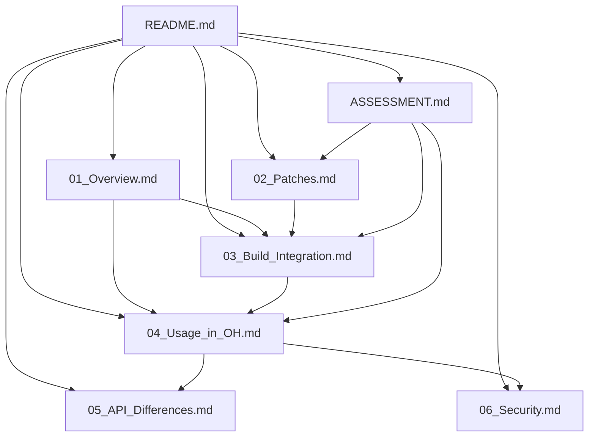

# 阅读路线建议

## 文档导航

本文档提供 PyYAML OpenHarmony 集成文档的阅读路线建议，帮助不同读者快速找到所需信息。

---

## 按角色分类

### 角色一：OpenHarmony 开发者

**目标**: 了解如何在 OpenHarmony 中使用 PyYAML

**阅读路线**:

1. **[README.md](./README.md)** (5 分钟)
   - 快速了解 PyYAML 在 OpenHarmony 中的定位
   - 掌握关键发现和版本信息

2. **[04_Usage_in_OH.md](./04_Usage_in_OH.md)** (15 分钟)
   - 了解哪些 OH 模块在使用 PyYAML
   - 学习 PyYAML 的典型使用场景
   - 查看实际代码示例

3. **[05_API_Differences.md](./05_API_Differences.md)** (10 分钟)
   - 确认 OpenHarmony 版本 API 完全兼容
   - 学习正确的 API 使用方式

4. **[06_Security.md](./06_Security.md)** (10 分钟)
   - 了解安全注意事项
   - 学习安全使用最佳实践

**预计总时间**: 40 分钟

---

### 角色二：构建工程师

**目标**: 了解 PyYAML 如何集成到 OpenHarmony 构建系统

**阅读路线**:

1. **[README.md](./README.md)** (5 分钟)
   - 了解集成方式概述

2. **[03_Build_Integration.md](./03_Build_Integration.md)** (20 分钟)
   - 详细了解 bundle.json 配置
   - 学习 pyproject.toml 配置
   - 了解 OH 特有的构建适配
   - 掌握构建流程

3. **[02_Patches.md](./02_Patches.md)** (15 分钟)
   - 了解 OH 对 PyYAML 的所有 Patch
   - 理解构建适配的背景和原因

**预计总时间**: 40 分钟

---

### 角色三：安全工程师

**目标**: 评估 PyYAML 在 OpenHarmony 中的安全风险

**阅读路线**:

1. **[README.md](./README.md)** (5 分钟)
   - 快速了解版本和集成方式

2. **[06_Security.md](./06_Security.md)** (20 分钟)
   - 了解已知 CVE 及其修复状态
   - 学习 OH Patch 引入的新风险
   - 掌握安全使用最佳实践
   - 查看安全升级策略

3. **[04_Usage_in_OH.md](./04_Usage_in_OH.md)** (10 分钟)
   - 了解 PyYAML 的使用场景
   - 审查实际代码使用情况

**预计总时间**: 35 分钟

---

### 角色四：维护者

**目标**: 全面了解 PyYAML 的 OpenHarmony 适配，便于后续维护和升级

**阅读路线**:

1. **[README.md](./README.md)** (5 分钟)
   - 快速了解整体情况

2. **[_work/ASSESSMENT.md](./_work/ASSESSMENT.md)** (15 分钟)
   - 了解项目评估结果
   - 掌握基础信息收集情况

3. **[01_Overview.md](./01_Overview.md)** (10 分钟)
   - 了解 PyYAML 原始库功能
   - 掌握项目结构

4. **[02_Patches.md](./02_Patches.md)** (15 分钟)
   - 详细了解所有 OH Patch
   - 掌握升级建议

5. **[03_Build_Integration.md](./03_Build_Integration.md)** (20 分钟)
   - 深入了解构建适配
   - 掌握构建工具配置

6. **[04_Usage_in_OH.md](./04_Usage_in_OH.md)** (15 分钟)
   - 了解依赖关系
   - 掌握使用场景

7. **[05_API_Differences.md](./05_API_Differences.md)** (10 分钟)
   - 了解 API 兼容性
   - 掌握版本升级影响

8. **[06_Security.md](./06_Security.md)** (20 分钟)
   - 了解安全风险
   - 掌握最佳实践

9. **[_work/NOTES.md](./_work/NOTES.md)** (10 分钟)
   - 了解分析过程
   - 掌握技术细节

**预计总时间**: 2 小时

---

## 按主题分类

### 主题一：快速概览

**目标**: 快速了解 PyYAML 在 OpenHarmony 中的情况

**阅读路线**:

1. **[README.md](./README.md)** (5 分钟)
   - 概述、关键发现、版本信息

2. **[_work/ASSESSMENT.md](./_work/ASSESSMENT.md)** (15 分钟)
   - 基础信息、Patch 分析、构建适配

**预计总时间**: 20 分钟

---

### 主题二：深度技术分析

**目标**: 深入了解 PyYAML 的 OpenHarmony 适配细节

**阅读路线**:

1. **[02_Patches.md](./02_Patches.md)** (15 分钟)
   - Patch 详细分析、修改清单

2. **[03_Build_Integration.md](./03_Build_Integration.md)** (20 分钟)
   - 构建适配、配置详解

3. **[05_API_Differences.md](./05_API_Differences.md)** (10 分钟)
   - API 兼容性分析

**预计总时间**: 45 分钟

---

### 主题三：实际应用

**目标**: 学习如何在 OpenHarmony 中使用 PyYAML

**阅读路线**:

1. **[04_Usage_in_OH.md](./04_Usage_in_OH.md)** (15 分钟)
   - 依赖关系、使用场景、代码示例

2. **[05_API_Differences.md](./05_API_Differences.md)** (10 分钟)
   - API 使用示例

3. **[06_Security.md](./06_Security.md)** (20 分钟)
   - 安全使用实践

**预计总时间**: 45 分钟

---

### 主题四：安全与维护

**目标**: 了解安全风险和维护策略

**阅读路线**:

1. **[06_Security.md](./06_Security.md)** (20 分钟)
   - CVE 分析、风险评估、最佳实践

2. **[02_Patches.md](./02_Patches.md)** (15 分钟)
   - 升级建议、维护策略

3. **[_work/ASSESSMENT.md](./_work/ASSESSMENT.md)** (15 分钟)
   - 待确认事项、风险评估

**预计总时间**: 50 分钟

---

## 按时间预算分类

### 15 分钟快速浏览

**目标**: 快速了解 PyYAML 在 OpenHarmony 中的核心信息

**必读文档**:

1. **[README.md](./README.md)** (5 分钟)
   - 重点关注：概述、关键发现、版本信息

2. **[04_Usage_in_OH.md](./04_Usage_in_OH.md)** (10 分钟)
   - 重点关注：依赖关系统计、主要使用场景

**选读**:
- 查看 [01_Overview.md](./01_Overview.md) 的"在 OpenHarmony 中的作用"部分

---

### 30 分钟深入了解

**目标**: 了解 PyYAML 的适配细节和使用方式

**必读文档**:

1. **[README.md](./README.md)** (5 分钟)

2. **[04_Usage_in_OH.md](./04_Usage_in_OH.md)** (10 分钟)

3. **[03_Build_Integration.md](./03_Build_Integration.md)** (15 分钟)
   - 重点关注：bundle.json 配置、构建流程

---

### 60 分钟全面阅读

**目标**: 全面了解 PyYAML 的 OpenHarmony 集成

**必读文档**:

1. **[README.md](./README.md)** (5 分钟)

2. **[01_Overview.md](./01_Overview.md)** (10 分钟)
   - 重点关注：核心功能、项目结构

3. **[04_Usage_in_OH.md](./04_Usage_in_OH.md)** (15 分钟)

4. **[03_Build_Integration.md](./03_Build_Integration.md)** (20 分钟)

5. **[06_Security.md](./06_Security.md)** (10 分钟)
   - 重点关注：安全使用最佳实践

---

### 2 小时深度学习

**目标**: 全面掌握 PyYAML 的 OpenHarmony 适配，便于维护

**必读文档**:

所有核心文档 ([01_Overview.md](./01_Overview.md) - [06_Security.md](./06_Security.md))

**选读文档**:

[_work/ASSESSMENT.md](_work/ASSESSMENT.md), [_work/NOTES.md](_work/NOTES.md)

---

## 常见问题快速索引

| 问题 | 文档 | 章节 |
|------|------|------|
| PyYAML 是什么？ | [01_Overview.md](./01_Overview.md) | 概述 |
| OH 中有哪些 Patch？ | [02_Patches.md](./02_Patches.md) | Patch 清单表 |
| 如何配置构建？ | [03_Build_Integration.md](./03_Build_Integration.md) | bundle.json 配置 |
| 哪些模块在使用 PyYAML？ | [04_Usage_in_OH.md](./04_Usage_in_OH.md) | 直接依赖者统计 |
| OH 版本 API 有差异吗？ | [05_API_Differences.md](./05_API_Differences.md) | API 差异总结 |
| 有安全风险吗？ | [06_Security.md](./06_Security.md) | 已知 CVE 分析 |
| 如何安全使用？ | [06_Security.md](./06_Security.md) | 安全使用最佳实践 |
| 升级版本需要注意什么？ | [02_Patches.md](./02_Patches.md) | 升级建议 |

---

## 文档依赖关系图

**阅读建议**:
- ✅ 先阅读 [README.md](./README.md) 了解整体情况
- ✅ 根据角色或主题选择文档深入阅读
- ✅ 必要时参考 [_work/ASSESSMENT.md](_work/ASSESSMENT.md) 了解评估过程

---

## 反馈与改进

如发现文档问题或有改进建议，请：

1. 提交 Issue 到 OpenHarmony 仓库
2. 联系文档维护者
3. 提交 Pull Request 改进文档

---

**版权声明**: 本文档基于 MIT 许可证发布。

**最后更新**: 2026-02-07
