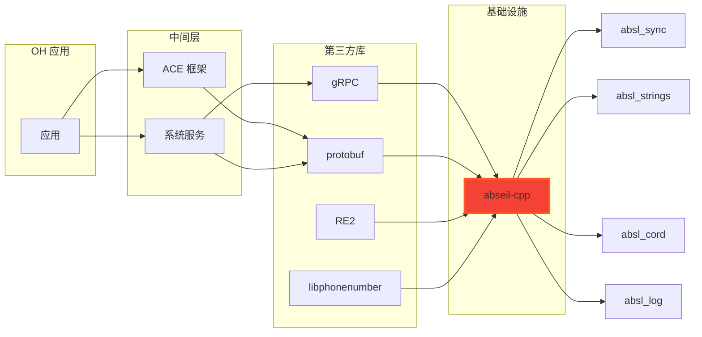

# 依赖关系与使用（OpenHarmony 中）

> 本文档详细说明 Abseil-CPP 在 OpenHarmony 系统中的依赖关系、使用场景和典型用法。

---

## 概述

### 依赖统计

| 统计 | 数量 |
|------|------|
| **子系统数量** | 3 个（developtools、arkcompiler、thirdparty） |
| **直接依赖者** | 20+ 个模块 |
| **间接影响** | 所有使用 protobuf/gRPC 的模块 |

### 依赖特点

- **深度依赖**: 通过 protobuf/gRPC 间接服务于大量模块
- **关键路径**: profiler 工具链直接依赖 abseil-cpp
- **核心基础设施**: 作为基础库被多个第三方库依赖

---

## 直接依赖者清单

### 1. DEVELOPTOOLS 子系统

#### 1.1 hiperf（性能测试工具）

**BUILD.gn 路径**: `developtools/hiperf/BUILD.gn`

**使用的 abseil 库**:
```gn
external_deps = [
  "//third_party/abseil-cpp:absl_container",
  "//third_party/abseil-cpp:absl_cord",
  "//third_party/abseil-cpp:absl_log",
  "//third_party/abseil-cpp:absl_strings",
]
```

**使用场景**:
- 性能测试工具
- 需要高效的容器和字符串处理
- 日志记录测试结果

**关键用途**:
- `absl_container`: 高效哈希表存储测试数据
- `absl_cord`: 增量字符串处理
- `absl_log`: 记录性能指标和错误
- `absl_strings`: 字符串操作

#### 1.2 profiler（设备性能分析框架）

**BUILD.gn 路径**:
- `developtools/profiler/device/services/profiler_service/BUILD.gn`
- `developtools/profiler/device/cmds/BUILD.gn`
- `developtools/profiler/device/plugins/native_hook/BUILD.gn`
- `developtools/profiler/device/plugins/network_profiler/BUILD.gn`

**使用的 abseil 库**:

| 组件 | 库 | 用途 |
|------|------|------|
| profiler_service | `absl_sync`, `absl_cord`, `absl_log` | 并发控制和数据传输 |
| hiprofiler_cmd | `absl_sync`, `absl_cord`, `absl_log` | 命令行工具 |
| native_hook | `absl_sync` | 性能数据捕获钩子 |
| 网络分析器 | `absl_sync`, `absl_cord`, `absl_log` | 网络数据解析 |

**使用场景**:
- 设备性能分析
- 并发数据流处理
- 高效字符串和容器管理
- 实时日志记录

**关键用途**:
- `absl_sync`: 并发控制（互斥、屏障）
- `absl_cord`: 增量数据传输
- `absl_log`: 性能日志记录

#### 1.3 smartperf_host（流量分析工具）

**BUILD.gn 路径**: `developtools/smartperf_host/smartperf_host/trace_streamer/src/parser/BUILD.gn`

**使用的 abseil 库**:
```gn
include_dirs = [
  "${THIRD_PARTY}/protobuf/third_party/abseil-cpp",
  # ...
]
```

**使用场景**:
- 流量数据解析
- 通过 protobuf 间接使用
- 头文件包含依赖

---

### 2. ARKCOMPILER 子系统

#### 2.1 es2panda（TypeScript 编译器前端）

**BUILD.gn 路径**: `arkcompiler/ets_frontend/es2panda/BUILD.gn`

**使用的 abseil 库**:
```gn
if (ohos_indep_compiler_enable) {
  external_deps = [ "//third_party/abseil-cpp:absl_base_static" ]
}
```

**使用场景**:
- TypeScript 到 ES 的编译
- 静态链接优化
- 编译器基础设施

**关键用途**:
- `absl_base_static`: 所有 abseil 基础设施
- 静态链接减少运行时依赖

#### 2.2 merge_abc（字节码合并工具）

**BUILD.gn 路径**: `arkcompiler/ets_frontend/merge_abc/BUILD.gn`

**使用的 abseil 库**:
```gn
if (ohos_indep_compiler_enable) {
  external_deps = [ "//third_party/abseil-cpp:absl_base_static" ]
}
```

**使用场景**:
- 字节码合并和处理
- 静态链接编译器工具

---

### 3. THIRDPARTY 子系统

#### 3.1 gRPC（RPC 框架）

**BUILD.gn 路径**: `third_party/grpc/BUILD.gn`

**使用的 abseil 库**（15+ 个）:
```gn
external_deps = [
  "//third_party/abseil-cpp:absl_base",
  "//third_party/abseil-cpp:absl_cord",
  "//third_party/abseil-cpp:absl_flags",
  "//third_party/abseil-cpp:absl_log",
  "//third_party/abseil-cpp:absl_raw_logging_internal",
  "//third_party/abseil-cpp:absl_spinlock_wait",
  "//third_party/abseil-cpp:absl_status",
  "//third_party/abseil-cpp:absl_statusor",
  "//third_party/abseil-cpp:absl_str_format_internal",
  "//third_party/abseil-cpp:absl_strings",
  "//third_party/abseil-cpp:absl_sync",
  "//third_party/abseil-cpp:absl_throw_delegate",
  "//third_party/abseil-cpp:absl_time",
  "//third_party/abseil-cpp:absl_time_zone",
  "//third_party/abseil-cpp:absl_container",
  "//third_party/abseil-cpp:absl_hash",
  "//third_party/abseil-cpp:absl_random",
]
```

**使用场景**:
- RPC 框架核心
- 网络通信基础设施
- 依赖几乎所有 abseil 功能模块

**关键用途**:
- `absl_sync`: 并发 RPC 调用
- `absl_cord`: 增量数据序列化
- `absl_time`: 超时和重试逻辑
- `absl_status`: 错误传播
- `absl_strings`: 数据编解码
- `absl_log`: RPC 日志和调试

**重要性**: ⭐⭐⭐（重度使用者，几乎使用所有 abseil 库）

#### 3.2 RE2（正则表达式库）

**BUILD.gn 路径**: `third_party/re2/BUILD.gn`

**使用的 abseil 库**:
```gn
external_deps = [
  "//third_party/abseil-cpp:absl_base",
  "//third_party/abseil-cpp:absl_container",
  "//third_party/abseil-cpp:absl_cord",
  "//third_party/abseil-cpp:absl_hash",
  "//third_party/abseil-cpp:absl_log",
  "//third_party/abseil-cpp:absl_raw_logging_internal",
  "//third_party/abseil-cpp:absl_spinlock_wait",
  "//third_party/abseil-cpp:absl_str_format_internal",
  "//third_party/abseil-cpp:absl_strings",
]
```

**使用场景**:
- 正则表达式匹配
- 字符串搜索和处理
- 模式编译

**关键用途**:
- `absl_strings`: 字符串操作
- `absl_container`: 模式匹配状态存储
- `absl_hash`: 正则优化哈希
- `absl_log`: 匹配调试

#### 3.3 libphonenumber（电话号码处理）

**BUILD.gn 路径**: `third_party/libphonenumber/cpp/BUILD.gn`

**使用的 abseil 库**:
```gn
external_deps = [
  "//third_party/abseil-cpp:absl_strings",
  "//third_party/abseil-cpp:absl_time",
]
```

**使用场景**:
- 电话号码解析和验证
- 国际化支持
- 时区处理

**关键用途**:
- `absl_strings`: 电话号码字符串处理
- `absl_time`: 时区相关的号码验证

#### 3.4 protobuf（Protocol Buffers）

**BUILD.gn 路径**: `third_party/protobuf/BUILD.gn`

**使用的 abseil 库**:
```gn
config("protobuf_config") {
  include_dirs = [
    "src",
    "third_party/abseil-cpp",
    "third_party/utf8_range",
  ]
}

if (!is_mingw) {
  external_deps = [ "abseil-cpp:absl_base_static" ]
}
```

**使用场景**:
- 数据序列化和反序列化
- 跨语言通信
- 数据存储格式

**关键用途**:
- `absl_base_static`: 序列化基础设施
- 通过头文件包含访问其他 abseil 功能

**重要性**: ⭐⭐⭐（间接影响大量应用）

#### 3.5 libyuv（视频处理库 - Skia 子库）

**BUILD.gn 路径**: `third_party/skia/m133/third_party/externals/libyuv/BUILD.gn`

**使用的 abseil 库**:
```gn
libyuv_use_absl_flags = true

if (libyuv_use_absl_flags) {
  deps = [
    "//third_party/abseil-cpp/absl/flags:flag",
    "//third_party/abseil-cpp/absl/flags:parse",
  ]
}
```

**使用场景**:
- 视频帧处理
- YUV 格式转换
- 命令行标志解析

**关键用途**:
- `absl_flags`: 命令行参数处理

---

## 依赖关系图

### 完整依赖图

```mermaid
graph TD
    %% 应用层
    A[OH 应用] --> B[ACE 框架]
    A --> C[系统服务]

    %% 直接依赖 abseil-cpp
    D[profiler/hiperf] --> E[abseil-cpp]
    F[es2panda/merge_abc] --> E
    G[gRPC] --> E
    H[RE2] --> E
    I[libphonenumber] --> E
    J[libyuv] --> E

    %% 通过 gRPC/protobuf 间接依赖
    B --> K[protobuf]
    C --> K
    C --> G
    L[媒体服务] --> K
    M[网络服务] --> G
    N[存储服务] --> K

    %% abseil-cpp 内部依赖
    E --> O[absl_sync]
    E --> P[absl_cord]
    E --> Q[absl_log]
    E --> R[absl_strings]
    E --> S[absl_base]
    E --> T[absl_time]
    E --> U[absl_container]
    E --> V[absl_status]
    E --> W[absl_hash]

    %% 样式
    A B C D F G H I J K L M N:::fill:#e3f2fd
    E:::fill:#f44336
    O P Q R S T U V W:::fill:#4caf50

    classDef important fill:#ff9800,stroke:#ff5722,stroke-width:2px;
    classDef direct fill:#4caf50,stroke:#1b5e20,stroke-width:2px;
    classDef indirect fill:#2196f3,stroke:#1976d2,stroke-width:2px,stroke-dasharray: 5,5;
```

**图例**:
- 红色: abseil-cpp 核心库
- 绿色: 最常用的 abseil 组件
- 蓝色: 应用和系统服务
- 实线: 直接依赖
- 虚线: 间接依赖（通过 protobuf/gRPC）

### 简化依赖图



---

## 最常用的 abseil 库

### 使用频率统计

| abseil 库 | 直接使用者 | 间接影响 | 关键用途 |
|-----------|----------|----------|----------|
| `absl_sync` | 10+ | 几乎所有模块 | 并发控制、互斥 |
| `absl_cord` | 8+ | profiler、gRPC、re2 | 增量字符串、数据传输 |
| `absl_log` | 8+ | profiler、gRPC、re2 | 日志、调试、错误报告 |
| `absl_strings` | 6+ | gRPC、re2、libphonenumber | 字符串操作、编解码 |
| `absl_base` / `absl_base_static` | 5+ | gRPC、re2、protobuf、arkcompiler | 基础设施 |
| `absl_container` | 3+ | profiler、gRPC、re2 | 高效哈希表 |
| `absl_time` / `absl_time_zone` | 2+ | gRPC、libphonenumber | 时间处理、超时 |
| `absl_hash` | 2+ | gRPC、re2 | 哈希计算 |
| `absl_status` / `absl_statusor` | 1+ | gRPC | 错误处理、传播 |
| `absl_flags` | 1+ | gRPC、libyuv | 命令行标志 |

---

## 典型使用场景

### 场景 1：性能分析工具（profiler/hiperf）

```cpp
#include "absl/synchronization/mutex.h"
#include "absl/strings/string_view.h"
#include "absl/log/log.h"

// 并发数据流处理
absl::Mutex mu;
absl::log(absl::LogSeverity::kInfo) << "Processing data";

// 高效字符串处理
absl::string_view data = GetTraceData();
ProcessData(data);
```

**关键点**:
- 使用 `absl::Mutex` 实现并发控制
- 使用 `absl::log` 记录性能指标
- 使用 `absl::string_view` 避免字符串拷贝

### 场景 2：RPC 通信（gRPC）

```cpp
#include "absl/time/time.h"
#include "absl/status/statusor.h"
#include "absl/strings/str_format.h"

// 超时控制
absl::Time deadline = absl::Now() + absl::Seconds(5);

// 错误处理
absl::StatusOr<Response> result = MakeRequest(deadline);
if (!result.ok()) {
    LOG(ERROR) << "RPC failed: " << result.status();
}
```

**关键点**:
- 使用 `absl::Time` 和 `absl::Duration` 实现超时
- 使用 `absl::StatusOr` 处理 RPC 错误
- 使用 `absl::log` 记录通信日志

### 场景 3：字符串处理（protobuf/re2）

```cpp
#include "absl/strings/str_cat.h"
#include "absl/strings/str_split.h"
#include "absl/strings/numbers.h"

// 高效字符串拼接
std::string result = absl::StrCat("Hello", ", ", "World!");

// 字符串分割
std::vector<absl::string_view> parts =
    absl::StrSplit(input, ',', absl::SkipWhitespace());
```

**关键点**:
- 使用 `absl::StrCat` 高效拼接字符串
- 使用 `absl::StrSplit` 解析字符串
- 使用 `absl::string_view` 避免拷贝

### 场景 4：并发控制（任意模块）

```cpp
#include "absl/synchronization/mutex.h"
#include "absl/synchronization/notification.h"

// 互斥锁保护
absl::Mutex mu;
{
    absl::MutexLock lock(&mu);
    // 临界区代码
}

// 线程同步
absl::Notification n;
// ... other thread ...
n.Notify();
```

**关键点**:
- 使用 `absl::Mutex` 替代 `std::mutex`
- 使用 `absl::MutexLock` RAII 风格锁管理
- 使用 `absl::Notification` 线程间通信

---

## 依赖链分析

### 主要依赖链

```
应用层
  ├─→ ACE 框架 ──→ protobuf ──→ abseil-cpp
  ├─→ 系统服务 ──→ gRPC ──→ abseil-cpp
  └─→ 开发工具 ──→ abseil-cpp（直接）
```

### 间接影响评估

| 依赖层级 | 模块数 | 影响 |
|---------|--------|------|
| **直接依赖** | 20+ | profiler、hiperf、arkcompiler、gRPC、re2 等 |
| **一级间接**（通过 protobuf） | 100+ | 所有使用 protobuf 的应用和服务 |
| **一级间接**（通过 gRPC） | 50+ | 网络服务、媒体服务等 |

**结论**: abseil-cpp 通过 protobuf/gRPC 间接影响**几乎整个 OH 生态系统**。

---

## 升级影响分析

### 影响范围

如果升级 abseil-cpp 版本，以下模块需要重新测试：

| 优先级 | 模块 | 测试重点 |
|--------|------|----------|
| **高** | profiler/hiperf | 性能分析功能 |
| **高** | gRPC | RPC 通信、网络服务 |
| **高** | protobuf | 序列化/反序列化 |
| **中** | RE2 | 正则表达式 |
| **中** | arkcompiler | 编译器功能 |
| **低** | libphonenumber | 电话号码处理 |

### 回归风险

| 风险 | 概率 | 缓解措施 |
|------|------|----------|
| `__OHOS__` 宏失效 | 中 | 重新验证所有平台适配 |
| API 不兼容 | 低 | 上游版本兼容性保证 |
| 性能回归 | 低 | 基准测试 |
| 编译错误 | 中 | 完整构建所有依赖模块 |

---

## 最佳实践

### 1. 选择合适的库目标

| 需求 | 推荐目标 |
|------|----------|
| 基础设施 | `absl_base` |
| 字符串操作 | `absl_strings` |
| 并发控制 | `absl_sync` |
| 日志记录 | `absl_log` |
| 时间处理 | `absl_time`, `absl_time_zone` |
| 错误处理 | `absl_status`, `absl_statusor` |
| 高效容器 | `absl_container` |
| 静态链接 | `absl_base_static` |

### 2. 避免循环依赖

- protobuf 已经间接依赖 abseil-cpp
- 不要在 protobuf 和 abseil-cpp 之间创建循环
- 使用 `external_deps` 而非 `deps`（如果是外部库）

### 3. 考虑运行时开销

- 共享库：减少二进制大小，增加加载时间
- 静态库：增加二进制大小，减少加载时间
- 根据模块特点选择

### 4. 安全考虑

- 使用 `innerapi_tags` 控制可见性
- 启用 PAC-RET 分支保护（对于安全敏感模块）
- 考虑沙箱环境限制

---

**最后更新**: 2026-02-07
