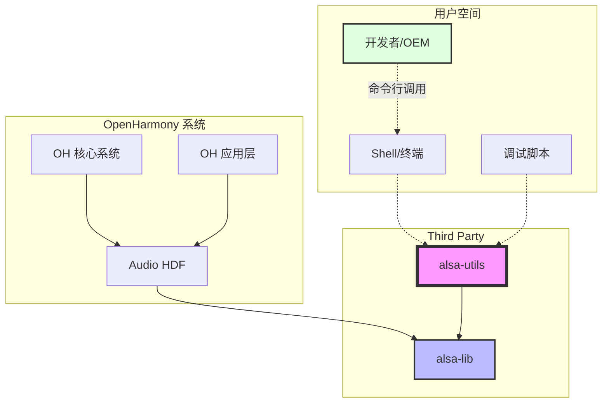

# 04 - 依赖关系与使用

> alsa-utils 在 OpenHarmony 中的使用场景和依赖关系

---

## 1. 直接依赖者

### 1.1 依赖者统计

**重要发现: alsa-utils 在 OpenHarmony 中没有任何直接依赖者。**

```bash
$ find ../../../ -type f \( -name "*.json" -o -name "*.gn" \) \
    -exec grep -l "alsa-utils" {} \; 2>/dev/null
(仅返回 alsa-utils 自身的 bundle.json)
```

| 依赖者类型 | 数量 | 说明 |
|-----------|------|------|
| **编译依赖** | 0 | 无 OH 组件依赖编译 alsa-utils |
| **运行时依赖** | 0 | 无 OH 组件运行时链接 alsa-utils |
| **直接使用者** | 0 | 无 OH 组件直接调用 alsa-utils 工具 |

### 1.2 依赖关系图



**说明**:
- `----->`: 直接依赖 (编译时/运行时)
- `- . ->`: 使用/调用 (非编译依赖,非库链接)

### 1.3 使用方式分类

| 使用方式 | 使用者 | 调用方式 | 说明 |
|----------|--------|----------|------|
| **命令行调用** | 开发者/OEM | Shell 手动输入 | 最常用方式 |
| **调试脚本** | 开发者 | Shell 脚本 | 自动化调试流程 |
| **生产环境** | ❌ 无 | - | 不建议在生产环境使用 |

---

## 2. 使用场景

### 2.1 核心使用场景

#### 2.1.1 音频通路调试

**场景**: 验证音频通路的配置是否正确

**使用工具**: `amixer`, `aplay`, `arecord`

**典型流程**:

```bash
# 1. 查看混音器控件
amixer contents

# 2. 打开放音通路 (示例: numid=1, 值=6 表示 SPK_HP)
amixer cset numid=1 6

# 3. 打开录音通路 (示例: numid=2, 值=1 表示 Main Mic)
amixer cset numid=2 1

# 4. 播放测试音频
aplay /data/test.wav

# 5. 录制测试音频
arecord -d 5 -f cd -r 44100 -c 2 -t wav test_record.wav
```

**预期结果**:
- ✅ 能听到播放的音频
- ✅ 能录制到清晰的音频
- ✅ amixer 能正确控制音量和通路

#### 2.1.2 扬声器测试

**场景**: 测试扬声器硬件是否正常工作

**使用工具**: `speaker-test`

**典型流程**:

```bash
# 1. 测试立体声输出
speaker-test -t wav -c 2

# 2. 测试单声道输出
speaker-test -t wav -c 1

# 3. 持续测试 (Ctrl+C 停止)
speaker-test -t wav -c 2 -l 100
```

**输出示例**:
```
Playback device is plughw:0,0
Stream parameters are 48000Hz, S16_LE, 2 channels
WAV file(s)
Rate set to 48000Hz (requested 48000Hz)
Buffer size range from 2048 to 16384
Period size range from 1024 to 8192
Using max buffer size 16384
Periods = 4
was set period_size = 4096
was set buffer_size = 16384
  0 - Front Left
  1 - Front Right
Time per period = 2.666667
```

#### 2.1.3 声卡配置保存与恢复

**场景**: 保存调优后的声卡配置,系统重启后自动恢复

**使用工具**: `alsactl`

**典型流程**:

```bash
# 1. 手动配置声卡 (使用 amixer)
amixer cset numid=1 6
amixer cset numid=2 1

# 2. 保存配置到文件
alsactl store

# 3. 验证配置文件
cat /var/lib/alsa/asound.state

# 4. 恢复配置 (系统启动时)
alsactl restore
```

**配置文件示例** (`/var/lib/alsa/asound.state`):

```
state.RK809 {
        control.1 {
                iface MIXER
                name 'Playback Path'
                value 'SPK_HP'
                comment {
                        access 'read write'
                        type ENUMERATED
                        count 1
                        item.0 'OFF'
                        item.1 'RCV'
                        item.6 'SPK_HP'
                }
        }
        control.2 {
                iface MIXER
                name 'Capture MIC Path'
                value 'Main Mic'
                comment {
                        access 'read write'
                        type ENUMERATED
                        count 1
                        item.0 'MIC OFF'
                        item.1 'Main Mic'
                        item.2 'Hands Free Mic'
                }
        }
}
```

#### 2.1.4 MIDI 设备调试

**场景**: 测试 MIDI 设备连接和传输

**使用工具**: `aconnect`

**典型流程**:

```bash
# 1. 列出所有 MIDI 端口
aconnect -l

# 输出示例:
# client 0: 'System' [type=kernel]
#     0 'Timer           '
#     1 'Announce        '
# client 14: 'MIDI Through' [type=kernel]
#     0 'MIDI Through Port-0'

# 2. 连接两个 MIDI 端口
aconnect 14:0 128:0

# 3. 断开连接
aconnect -d 14:0 128:0
```

### 2.2 高级使用场景

#### 2.2.1 自动化音频测试脚本

**场景**: 自动化测试音频通路,验证硬件和驱动

**示例脚本**:

```bash
#!/bin/bash
# audio_test.sh - 音频通路自动化测试

set -e

echo "=== 音频通路自动化测试 ==="

# 1. 打开通路
echo "[1/4] 配置音频通路..."
amixer cset numid=1 6  # SPK_HP
amixer cset numid=2 1  # Main Mic

# 2. 播放测试
echo "[2/4] 播放测试音频..."
if [ -f /data/test.wav ]; then
    aplay /data/test.wav
else
    echo "警告: /data/test.wav 不存在,跳过播放测试"
fi

# 3. 录制测试
echo "[3/4] 录制测试音频..."
arecord -d 3 -f cd -r 44100 -c 2 -t wav /tmp/test_record.wav

# 4. 验证录音文件
echo "[4/4] 验证录音文件..."
if [ -f /tmp/test_record.wav ]; then
    SIZE=$(stat -c%s /tmp/test_record.wav)
    if [ $SIZE -gt 0 ]; then
        echo "✅ 录音成功: ${SIZE} bytes"
    else
        echo "❌ 录音失败: 文件为空"
        exit 1
    fi
else
    echo "❌ 录音失败: 文件不存在"
    exit 1
fi

echo "=== 测试完成 ==="
```

#### 2.2.2 音频性能测试

**场景**: 测试音频播放/录制的性能指标

**示例**:

```bash
#!/bin/bash
# audio_perf.sh - 音频性能测试

echo "=== 音频性能测试 ==="

# 测试不同采样率的播放
for rate in 8000 16000 44100 48000; do
    echo "测试播放: ${rate} Hz"
    aplay -r ${rate} -t raw -f S16_LE -c 2 /dev/zero -d 1
done

# 测试不同格式的播放
for format in cd s16_le s32_le; do
    echo "测试播放: ${format}"
    aplay -f ${format} -t raw -c 2 /dev/zero -d 1
done
```

---

## 3. 常用命令

### 3.1 命令速查表

| 工具 | 主要功能 | 常用参数 |
|------|----------|----------|
| `aplay` | 音频播放 | `-f fmt`, `-r rate`, `-c channels`, `-t type` |
| `arecord` | 音频录制 | `-d duration`, `-f fmt`, `-r rate`, `-c channels` |
| `amixer` | 混音器控制 | `contents`, `cset numid=ID VALUE`, `scontrols` |
| `alsactl` | 声卡配置 | `store`, `restore`, `init` |
| `speaker-test` | 扬声器测试 | `-t type`, `-c channels`, `-l loops` |
| `aconnect` | MIDI 连接 | `-l` (list), `-d` (disconnect) |

### 3.2 aplay 命令详解

#### 3.2.1 基本用法

```bash
# 播放 WAV 文件
aplay /data/test.wav

# 播放指定时长
aplay -d 10 /data/test.wav  # 只播放前 10 秒

# 播放指定位置
aplay -s 100 /data/test.wav  # 从第 100 秒开始播放
```

#### 3.2.2 格式参数

```bash
# 指定采样率
aplay -r 44100 -t raw -f S16_LE /data/test.raw

# 指定声道数
aplay -c 1 /data/test.wav  # 单声道
aplay -c 2 /data/test.wav  # 立体声

# 指定格式
aplay -f cd /data/test.wav    # CD 质量 (44100Hz, 16bit, 立体声)
aplay -f dat /data/test.wav   # DAT 质量 (48000Hz, 16bit, 立体声)
```

#### 3.2.3 设备参数

```bash
# 列出播放设备
aplay -L

# 指定播放设备
aplay -D hw:0,0 /data/test.wav

# 指定 PCM 设备
aplay -D plughw:0,0 /data/test.wav
```

#### 3.2.4 高级选项

```bash
# 调整缓冲区大小
aplay -B 100000 /data/test.wav  # 100ms 缓冲区

# 调整周期大小
aplay -F 50000 /data/test.wav   # 50ms 周期

# 禁用混音
aplay -M /data/test.wav
```

### 3.3 arecord 命令详解

#### 3.3.1 基本用法

```bash
# 录制 10 秒音频
arecord -d 10 /data/test_record.wav

# 录制到标准输出
arecord -t wav -f cd -c 2 | aplay -t wav -f cd -c 2
```

#### 3.3.2 格式参数

```bash
# CD 质量
arecord -d 30 -f cd -r 44100 -c 2 -t wav test.wav

# 指定采样率和格式
arecord -f S16_LE -r 48000 -c 2 -t wav test.wav

# 录制单声道
arecord -d 30 -f cd -c 1 -t wav test.wav
```

#### 3.3.3 设备参数

```bash
# 列出录音设备
arecord -L

# 指定录音设备
arecord -D hw:0,0 -d 10 -f cd test.wav
```

### 3.4 amixer 命令详解

#### 3.4.1 查看控件

```bash
# 列出所有简单控件
amixer scontrols

# 列出所有控件的详细信息
amixer contents

# 查看单个控件的详细信息
amixer cget numid=1
```

#### 3.4.2 设置控件

```bash
# 设置简单的开关控件
amixer sset 'Master' on
amixer sset 'Master' off

# 设置音量
amixer sset 'Master' 50%  # 50% 音量
amixer sset 'Master' 65536  # 绝对值

# 设置枚举控件 (通过 numid)
amixer cset numid=1 6

# 设置枚举控件 (通过名称)
amixer cset name='Playback Path' 6
```

#### 3.4.3 音量控制示例

```bash
# 获取当前音量
VOLUME=$(amixer sget 'PCM' | grep -oP '\d+%' | head -1)
echo "当前音量: ${VOLUME}"

# 设置音量为 70%
amixer sset 'PCM' 70%

# 静音/取消静音
amixer sset 'PCM' mute
amixer sset 'PCM' unmute
```

### 3.5 alsactl 命令详解

```bash
# 保存当前配置
alsactl store

# 恢复保存的配置
alsactl restore

# 初始化默认配置
alsactl init

# 指定配置文件
alsactl -f /custom/state.file store
alsactl -f /custom/state.file restore

# 调试模式 (显示详细信息)
alsactl -v restore
```

### 3.6 speaker-test 命令详解

```bash
# 基本测试 (立体声)
speaker-test -t wav -c 2

# 指定持续时间
speaker-test -t wav -c 2 -l 10  # 持续 10 秒

# 指定采样率
speaker-test -t wav -c 2 -r 48000

# 粉红噪声测试
speaker-test -t wav -c 2 -p

# 正弦波测试
speaker-test -t wav -c 2 -s 1000  # 1kHz 正弦波

# 指定设备
speaker-test -t wav -c 2 -D hw:0,0
```

---

## 4. 典型使用案例

### 4.1 案例 1: 音频驱动调试

**场景**: 新移植的 ALSA 驱动,需要验证功能

**步骤**:

```bash
#!/bin/bash
# debug_audio_driver.sh

echo "=== 音频驱动调试 ==="

# 1. 检查声卡是否存在
echo "[1/6] 检查声卡设备..."
if [ -d /dev/snd ]; then
    ls -l /dev/snd
    cat /proc/asound/cards
else
    echo "❌ /dev/snd 不存在,驱动未加载"
    exit 1
fi

# 2. 列出混音器控件
echo "[2/6] 列出混音器控件..."
amixer scontrols
amixer contents

# 3. 打开所有通路
echo "[3/6] 打开音频通路..."
# 根据实际设备配置
amixer cset numid=1 6  # SPK_HP
amixer cset numid=2 1  # Main Mic

# 4. 测试扬声器
echo "[4/6] 测试扬声器..."
speaker-test -t wav -c 2 -l 5

# 5. 播放测试音频
echo "[5/6] 播放测试音频..."
if [ -f /data/test.wav ]; then
    aplay /data/test.wav
else
    echo "警告: /data/test.wav 不存在"
fi

# 6. 录制测试音频
echo "[6/6] 录制测试音频..."
arecord -d 5 -f cd -c 2 -t wav /tmp/test_record.wav

echo "=== 调试完成 ==="
```

### 4.2 案例 2: 音频性能问题诊断

**场景**: 音频播放有卡顿,需要诊断原因

**步骤**:

```bash
#!/bin/bash
# diagnose_audio_perf.sh

echo "=== 音频性能诊断 ==="

# 1. 测试不同缓冲区大小
echo "[1/4] 测试不同缓冲区大小..."
for size in 50000 100000 200000 400000; do
    echo "缓冲区大小: ${size} ns"
    time aplay -B ${size} -F ${size} /data/test.wav
done

# 2. 测试不同采样率
echo "[2/4] 测试不同采样率..."
for rate in 8000 16000 44100 48000; do
    echo "采样率: ${rate} Hz"
    time aplay -r ${rate} -t raw -f S16_LE /data/test.raw
done

# 3. 检查系统资源
echo "[3/4] 检查系统资源..."
top -n 1 | head -20
free -h

# 4. 检查音频设备状态
echo "[4/4] 检查音频设备状态..."
cat /proc/asound/pcm
cat /proc/asound/timers

echo "=== 诊断完成 ==="
```

### 4.3 案例 3: 扬声器硬件测试

**场景**: 测试每个扬声器是否正常工作

**步骤**:

```bash
#!/bin/bash
# test_speakers.sh

echo "=== 扬声器硬件测试 ==="

# 测试立体声 (左右声道交替)
echo "测试立体声 (左右交替)..."
speaker-test -t wav -c 2 -l 2

# 测试每个声道
for channel in 1 2; do
    echo "测试声道 ${channel}..."
    speaker-test -t wav -c 2 -l 2 -p -s 1000 -t wav -c 2 -l 2
done

# 测试所有频率
echo "测试不同频率..."
for freq in 100 200 500 1000 2000 5000 10000; do
    echo "频率: ${freq} Hz"
    speaker-test -t wav -c 2 -l 1 -s ${freq}
done

echo "=== 测试完成 ==="
```

---

## 5. 调试技巧

### 5.1 音频播放问题诊断

**症状**: 播放音频无声音

**诊断步骤**:

```bash
# 1. 检查音量
amixer scontrols
amixer sget 'Master'
amixer sget 'PCM'

# 2. 检查是否静音
amixer sget 'Master' | grep -i mute
amixer sget 'PCM' | grep -i mute

# 3. 检查通路是否打开
amixer contents | grep 'Playback Path'
amixer cget numid=1

# 4. 测试扬声器
speaker-test -t wav -c 2

# 5. 检查设备文件
ls -l /dev/snd/*
cat /proc/asound/cards
cat /proc/asound/pcm

# 6. 检查播放设备
aplay -L
```

### 5.2 音频录制问题诊断

**症状**: 录音无声或音质差

**诊断步骤**:

```bash
# 1. 检查录音通路
amixer contents | grep 'Capture'
amixer cget numid=2

# 2. 打开录音通路
amixer cset numid=2 1  # Main Mic

# 3. 测试录音
arecord -d 3 -f cd -c 2 -t wav /tmp/test.wav

# 4. 检查录音文件
file /tmp/test.wav
aplay /tmp/test.wav

# 5. 检查增益
amixer sget 'Capture'
amixer sset 'Capture' 80%  # 调整增益
```

### 5.3 音频卡顿问题诊断

**症状**: 音频播放卡顿

**诊断步骤**:

```bash
# 1. 测试不同缓冲区大小
aplay -B 50000 -F 25000 /data/test.wav
aplay -B 100000 -F 50000 /data/test.wav
aplay -B 200000 -F 100000 /data/test.wav

# 2. 测试不同格式
aplay -f cd /data/test.wav
aplay -f dat /data/test.wav

# 3. 检查系统负载
top -n 1

# 4. 检查 DMA 缓冲区
cat /proc/asound/card0/pcm0p/sub0/hw_params
```

---

## 6. 总结

### 6.1 使用特点总结

| 特点 | 说明 |
|------|------|
| **独立工具** | 不被 OH 系统直接依赖,作为独立工具使用 |
| **命令行接口** | 通过 Shell 命令行调用 |
| **调试定位** | 主要用于问题定界和驱动调试 |
| **生产环境** | 不建议在生产环境作为音频 API 使用 |

### 6.2 适用场景

| 场景 | 适用工具 | 备注 |
|------|----------|------|
| **音频通路调试** | amixer, aplay, arecord | 最常用场景 |
| **扬声器测试** | speaker-test | 硬件验证 |
| **声卡配置** | alsactl | 保存/恢复配置 |
| **MIDI 调试** | aconnect | MIDI 设备 |
| **自动化测试** | 所有工具 | 脚本化测试 |

### 6.3 不适用场景

| 场景 | 原因 |
|------|------|
| **OH 应用音频播放** | 应使用 OH Audio HDF API |
| **生产环境音频服务** | alsa-utils 是调试工具,不适合生产环境 |
| **需要图形界面** | 应使用 OH 应用,而非 alsamixer |
| **系统服务集成** | 不作为 OH 系统服务 |

---

## 7. 附录

### 7.1 相关文档

- [01_Overview.md](01_Overview.md) - 原始库简介
- [03_Build_Integration.md](03_Build_Integration.md) - 构建适配
- [README_zh.md](../README_zh.md) - OH 适配说明

### 7.2 参考资源

- [ALSA 官方网站](http://www.alsa-project.org)
- [aplay 手册](https://man7.org/linux/man-pages/man1/aplay.1.html)
- [arecord 手册](https://man7.org/linux/man-pages/man1/arecord.1.html)
- [amixer 手册](https://man7.org/linux/man-pages/man1/amixer.1.html)

### 7.3 常见问题

**Q1: alsa-utils 与 OH Audio HDF 有什么区别?**

A: alsa-utils 是独立的命令行工具,用于调试 ALSA 驱动。OH Audio HDF 是 OH 的音频接口层,OH 应用通过 HDF API 访问音频功能。两者定位不同,互不冲突。

**Q2: 为什么 OH 应用不应该调用 alsa-utils?**

A: alsa-utils 是调试工具,不保证稳定性和性能。OH 应用应使用 OH Audio HDF API,这样可以获得更好的性能、稳定性和系统集成。

**Q3: 如何选择使用哪个工具?**

A:
- 播放/录制音频: `aplay`/`arecord`
- 控制音量和通路: `amixer`
- 测试扬声器: `speaker-test`
- 保存声卡配置: `alsactl`
- MIDI 调试: `aconnect`

---

**最后更新**: 2026-02-08
