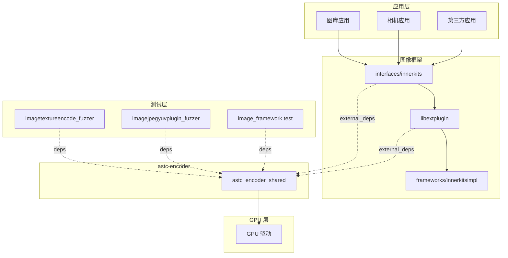

# 04_Usage_in_OH.md - 依赖关系与使用场景

## 1. 依赖关系概览

### 1.1 本库依赖

根据 `README.OpenSource`，astc-encoder **无外部依赖**。

```json
{
  "Name": "astc-encoder",
  "Dependencies": ""
}
```

### 1.2 被依赖情况

通过 `grep` 搜索 `BUILD.gn` 文件，找到以下依赖者：

| 模块 | BUILD.gn 路径 | 引用方式 | 说明 |
|------|--------------|---------|------|
| image_framework interfaces | `foundation/multimedia/image_framework/interfaces/innerkits/BUILD.gn` | `external_deps` | 图像框架接口层 |
| libextplugin | `foundation/multimedia/image_framework/plugins/common/libs/image/libextplugin/BUILD.gn` | `external_deps` | 图像扩展插件 |
| imagetextureencode_fuzzer | `foundation/multimedia/image_framework/frameworks/innerkitsimpl/test/fuzztest/imagetextureencode_fuzzer/BUILD.gn` | `deps` | 纹理编码 Fuzz 测试 |
| imagejpegyuvplugin_fuzzer | `foundation/multimedia/image_framework/frameworks/innerkitsimpl/test/fuzztest/imagejpegyuvplugin_fuzzer/BUILD.gn` | `deps` | JPEG YUV 插件 Fuzz 测试 |
| image_framework test | `foundation/multimedia/image_framework/frameworks/innerkitsimpl/test/BUILD.gn` | `deps` | 图像框架测试 |

---

## 2. 主要依赖者详细分析

### 2.1 image_framework 接口层

**BUILD.gn 路径**：
```
foundation/multimedia/image_framework/interfaces/innerkits/BUILD.gn
```

**依赖声明**：
```gn
external_deps = [
  "astc-encoder:astc_encoder_shared",
  # ... 其他依赖
]
```

**作用分析**：
- 这是图像框架的**接口层（innerkits）**
- 提供图像处理的标准 API 接口
- astc-encoder 用于 ASTC 纹理的编码和解码功能
- 被上层应用和框架通过 `external_deps` 间接使用

**代码片段**（第 250 行附近）：
```gn
external_deps = [
  "astc-encoder:astc_encoder_shared",
  "c_utils:utils",
  "drivers_interface_display:libdisplay_commontype_proxy_1.0",
  # ... 其他依赖
]
```

### 2.2 libextplugin（图像扩展插件）

**BUILD.gn 路径**：
```
foundation/multimedia/image_framework/plugins/common/libs/image/libextplugin/BUILD.gn
```

**依赖声明**：
```gn
external_deps = [
  "astc-encoder:astc_encoder_shared",
  # ... 其他依赖
]
```

**作用分析**：
- 图像框架的**扩展插件库**
- 支持多种图像格式的编解码
- astc-encoder 提供 ASTC 格式的支持
- 与 libjpeg-turbo、ffmpeg 等库并列

**代码片段**（第 222 行附近）：
```gn
external_deps = [
  "astc-encoder:astc_encoder_shared",
  "c_utils:utils",
  "drivers_interface_display:libdisplay_commontype_proxy_1.0",
  "ffmpeg:libohosffmpeg",
  "ffrt:libffrt",
  "graphic_2d:color_manager",
  # ... 其他依赖
]
```

### 2.3 Fuzz 测试模块

#### 2.3.1 imagetextureencode_fuzzer

**BUILD.gn 路径**：
```
foundation/multimedia/image_framework/frameworks/innerkitsimpl/test/fuzztest/imagetextureencode_fuzzer/BUILD.gn
```

**依赖声明**：
```gn
deps = [
  "//third_party/astc-encoder:astc_encoder_shared",
  # ... 其他依赖
]
```

**作用**：ASTC 纹理编码的 Fuzz 测试

#### 2.3.2 imagejpegyuvplugin_fuzzer

**BUILD.gn 路径**：
```
foundation/multimedia/image_framework/frameworks/innerkitsimpl/test/fuzztest/imagejpegyuvplugin_fuzzer/BUILD.gn
```

**依赖声明**：
```gn
deps = [
  "//third_party/astc-encoder:astc_encoder_shared",
  # ... 其他依赖
]
```

**作用**：JPEG YUV 插件的 Fuzz 测试（包含 ASTC 相关测试）

#### 2.3.3 image_framework 测试

**BUILD.gn 路径**：
```
foundation/multimedia/image_framework/frameworks/innerkitsimpl/test/BUILD.gn
```

**依赖声明**：
```gn
deps = [
  "//third_party/astc-encoder:astc_encoder_shared",
  # ... 其他依赖
]
```

**作用**：图像框架的功能测试

---

## 3. 依赖关系图

### 3.1 简化依赖图

```
┌─────────────────────────────────────────────────────────────┐
│                        应用层                                │
│  （图库应用、相机应用、第三方应用）                          │
└─────────────────────────────────────────────────────────────┘
                              │
                              ▼
┌─────────────────────────────────────────────────────────────┐
│                  image_framework（图像框架）                 │
│  ┌──────────────────────────────────────────────────────┐  │
│  │              interfaces/innerkits                     │  │
│  │                    ↑ 依赖 astc-encoder               │  │
│  └──────────────────────────────────────────────────────┘  │
│                              │
│                              ▼
│  ┌──────────────────────────────────────────────────────┐  │
│  │        plugins/common/libs/image/libextplugin        │  │
│  │                    ↑ 依赖 astc-encoder               │  │
│  └──────────────────────────────────────────────────────┘  │
│                              │
│                              ▼
│  ┌──────────────────────────────────────────────────────┐  │
│  │          frameworks/innerkitsimpl（实现层）          │  │
│  └──────────────────────────────────────────────────────┘  │
└─────────────────────────────────────────────────────────────┘
                              │
                              ▼
┌─────────────────────────────────────────────────────────────┐
│              third_party/astc-encoder                       │
│                  （本库：ASTC 编解码器）                    │
└─────────────────────────────────────────────────────────────┘
                              │
                              ▼
┌─────────────────────────────────────────────────────────────┐
│                   GPU 驱动层                                 │
│         （直接解码 ASTC 纹理，无需 CPU 参与）                │
└─────────────────────────────────────────────────────────────┘
```

### 3.2 Mermaid 依赖图



---

## 4. 使用场景分析

### 4.1 主要使用场景

根据 `README_zh.md` 和代码分析：

#### 场景 1：图库缩略图压缩

**描述**：
- 图库应用显示大量图片缩略图
- 使用 ASTC 压缩缩略图
- GPU 直接解码显示，无需 CPU 参与

**优势**：
- 减少内存占用
- 降低 CPU 负载
- 提高滚动流畅度

**调用链**：
```
图库应用 → image_framework API → libextplugin → astc-encoder → GPU 解码
```

#### 场景 2：应用预置图压缩

**描述**：
- 应用包含的预置图片资源
- 使用 ASTC 格式打包
- 应用启动时直接加载压缩纹理

**优势**：
- 减少 APK/IPA 包大小
- 加速资源加载
- 降低运行时内存

#### 场景 3：动态纹理压缩

**描述**：
- 相机拍照后的实时压缩
- 截图压缩
- 动态生成纹理

### 4.2 技术价值

| 价值点 | 具体说明 |
|--------|---------|
| **降低 CPU 负载** | GPU 直接解码 ASTC，无需 CPU 软解 |
| **减少内存占用** | 压缩纹理比原始图像小 4-8 倍 |
| **减少带宽** | 传输压缩数据，I/O 带宽降低 |
| **节省电量** | 内存带宽降低带来功耗节省 |
| **提高性能** | 纹理缓存效率提升，渲染更流畅 |

---

## 5. 集成示例

### 5.1 在 BUILD.gn 中添加依赖

```gn
# 方式 1：使用 deps（同一仓库内）
ohos_shared_library("my_module") {
  deps = [
    "//third_party/astc-encoder:astc_encoder_shared",
  ]
}

# 方式 2：使用 external_deps（推荐，跨子系统）
ohos_shared_library("my_module") {
  external_deps = [
    "astc-encoder:astc_encoder_shared",
  ]
}
```

### 5.2 在 C++ 代码中使用

```cpp
#include "astcenc.h"
#include <cstdio>

// 压缩图像示例
void compress_image_example() {
    // 1. 初始化配置
    astcenc_config config;
    astcenc_error status = astcenc_config_init(
        ASTCENC_PRF_LDR,        // LDR 配置文件
        6, 6,                   // 块大小 6x6
        ASTCENC_PRE_MEDIUM,     // 中等质量预设
        ASTCENC_FLG_NONE,       // 无特殊标志
        1,                      // 线程数
        &config
    );
    
    if (status != ASTCENC_SUCCESS) {
        printf("Config init failed: %s\n", astcenc_get_error_string(status));
        return;
    }
    
    // 2. 分配上下文
    astcenc_context* context;
    status = astcenc_context_alloc(&config, 1, &context);
    if (status != ASTCENC_SUCCESS) {
        printf("Context alloc failed: %s\n", astcenc_get_error_string(status));
        return;
    }
    
    // 3. 准备输入图像（示例）
    astcenc_image input_image;
    input_image.dim_x = 256;
    input_image.dim_y = 256;
    input_image.dim_z = 1;
    input_image.data_type = ASTCENC_TYPE_U8;
    // ... 填充图像数据
    
    // 4. 压缩图像
    uint8_t output_buffer[256 * 256];  // 根据块大小计算
    size_t output_size;
    status = astcenc_compress_image(
        context,
        &input_image,
        output_buffer,
        sizeof(output_buffer),
        &output_size,
        0  // 线程索引
    );
    
    if (status != ASTCENC_SUCCESS) {
        printf("Compress failed: %s\n", astcenc_get_error_string(status));
    }
    
    // 5. 清理
    astcenc_context_free(context);
}
```

### 5.3 解压图像示例

```cpp
void decompress_image_example() {
    // 1. 创建解压专用上下文
    astcenc_config config;
    astcenc_config_init(
        ASTCENC_PRF_LDR,
        6, 6,
        ASTCENC_PRE_FASTEST,  // 解压不需要质量预设
        ASTCENC_FLG_DECOMPRESS_ONLY,
        1,
        &config
    );
    
    astcenc_context* context;
    astcenc_context_alloc(&config, 1, &context);
    
    // 2. 准备 ASTC 数据
    uint8_t astc_data[] = { /* ASTC 压缩数据 */ };
    
    // 3. 解压
    astcenc_image output_image;
    output_image.dim_x = 256;
    output_image.dim_y = 256;
    output_image.dim_z = 1;
    output_image.data_type = ASTCENC_TYPE_U8;
    // ... 分配输出缓冲区
    
    astcenc_decompress_image(
        context,
        astc_data,
        sizeof(astc_data),
        &output_image,
        nullptr,  // 无 swizzle
        0         // 线程索引
    );
    
    // 4. 清理
    astcenc_context_free(context);
}
```

---

## 6. 运行时依赖

### 6.1 库文件位置

编译输出：
```
out/{product}/thirdparty/astc-encoder/libastc_encoder_shared.z.so
```

系统安装位置：
```
system/lib/libastc_encoder_shared.z.so
```

### 6.2 运行时加载

- **自动加载**：依赖此库的模块在启动时自动加载
- **符号可见性**：通过 `innerapi_tags = ["platformsdk"]` 控制
- **版本兼容**：共享库版本随 OH 版本更新

---

## 7. 性能考虑

### 7.1 压缩性能

| 质量预设 | 速度 | 质量 | 建议用途 |
|---------|------|------|---------|
| `-fastest` | 最快 | 较低 | 实时预览 |
| `-fast` | 快 | 中等 | 开发调试 |
| `-medium` | 中等 | 良好 | 常规使用 ⭐ |
| `-thorough` | 慢 | 很好 | 生产发布 |
| `-exhaustive` | 极慢 | 最优 | 离线处理 |

**OH 中推荐**：使用 `-medium` 预设，平衡速度和质量

### 7.2 块大小选择

| 块大小 | 比特率 | 质量 | 用途 |
|--------|--------|------|------|
| 4x4 | 8.0 bpp | 最高 | 高质量纹理 |
| 6x6 | 3.56 bpp | 良好 | 通用纹理 ⭐ |
| 8x8 | 2.0 bpp | 中等 | 低分辨率纹理 |
| 12x12 | 0.89 bpp | 较低 | 大色块纹理 |

**OH 中推荐**：图库缩略图使用 6x6 或 8x8

### 7.3 多线程使用

```cpp
// 多线程压缩示例
astcenc_context_alloc(&config, 4, &context);  // 4 线程

// 每个线程调用一次 astcenc_compress_image
// 线程索引 0-3
for (int i = 0; i < 4; i++) {
    // 在线程中调用
    astcenc_compress_image(context, &input, output, size, &out_size, i);
}
```

---

## 8. 总结

### 8.1 依赖关系特点

1. **集中使用**：主要在 `image_framework` 子系统中使用
2. **间接依赖**：上层应用通过 image_framework API 间接使用
3. **测试覆盖**：有专门的 Fuzz 测试和功能测试

### 8.2 使用建议

| 场景 | 建议 |
|------|------|
| 新模块集成 | 通过 `external_deps` 依赖 `astc-encoder:astc_encoder_shared` |
| 质量选择 | 图库缩略图使用 `-medium`，预览使用 `-fast` |
| 块大小选择 | 6x6 适合大多数场景，8x8 适合缩略图 |
| 多线程 | 根据 CPU 核心数配置线程数 |

### 8.3 关键参考

- **API 文档**：`Source/astcenc.h` 头文件注释
- **使用示例**：`Utils/Example/` 目录
- **测试参考**：`Source/UnitTest/` 目录
- **上游文档**：`Docs/Encoding.md`
