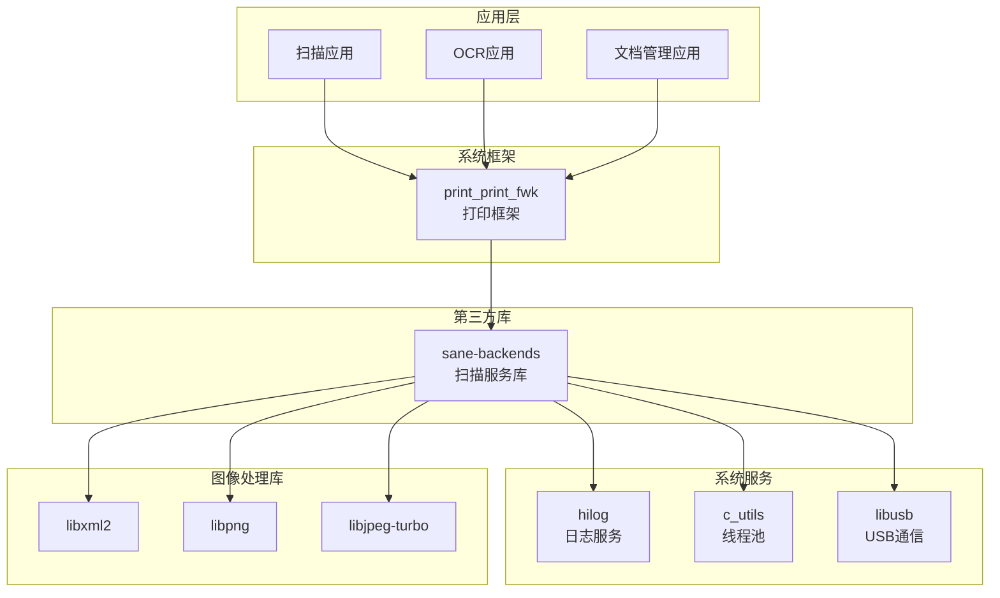

# 04 - 在 OpenHarmony 中的使用

本文档说明 SANE-backends 在 OpenHarmony 中的依赖关系、使用方式和使用场景。

---

## 依赖关系

### SANE-backends 的依赖

#### OH 组件依赖

| 组件 | 用途 | 必需 |
|------|------|------|
| **hilog** | 日志输出服务 | 可选 (enable_hilog) |
| **c_utils** | ThreadPool 线程池 | 可选 (enable_thread_pool) |
| **libusb** | USB 设备通信 | 是 |

#### 第三方库依赖

| 库 | 用途 | 必需 |
|-----|------|------|
| **libxml2** | XML 解析（escl 后端） | 是 |
| **libpng** | PNG 图像处理 | 是 |
| **libjpeg-turbo** | JPEG 图像处理 | 是 |

### 依赖声明

在 `bundle.json` 中声明：

```json
{
  "name": "@ohos/backends",
  "component": {
    "deps": {
      "components": [
        "hilog",
        "c_utils",
        "libusb"
      ],
      "third_party": [
        "libxml2",
        "libpng",
        "libjpeg-turbo"
      ]
    }
  }
}
```

---

## 谁在使用 SANE-backends

### 直接依赖者

| 模块 | 仓库 | 用途 |
|------|------|------|
| **print_print_fwk** | [openharmony/print_print_fwk](https://gitee.com/openharmony/print_print_fwk) | 打印框架中的扫描服务功能 |

### 使用方式

其他模块通过以下方式依赖 SANE-backends：

#### 1. 在 bundle.json 中声明

```json
{
  "component": {
    "deps": {
      "third_party": [
        "backends"
      ]
    }
  }
}
```

#### 2. 在 BUILD.gn 中声明

```gn
deps += [ "//third_party/backends:third_sane" ]
```

#### 3. 头文件引用

```c
#include <sane/sane.h>
#include <sane/saneopts.h>
```

---

## SANE 在 OH 中的依赖关系图



---

## 典型使用场景

### 场景 1: 文档扫描应用

**流程**:
```
用户打开扫描应用
    ↓
应用调用 print_print_fwk 扫描接口
    ↓
扫描服务调用 sane_init()
    ↓
扫描服务调用 sane_get_devices() 发现设备
    │   └─> 线程池并发扫描各后端 (escl, pixma, etc.)
    ↓
用户选择设备
    ↓
扫描服务调用 sane_open() 打开设备
    ↓
扫描服务调用 sane_start() 开始扫描
    ↓
循环调用 sane_read() 读取图像数据
    ↓
调用 sane_cancel() 和 sane_close() 清理
    ↓
应用接收图像数据进行显示/保存
```

### 场景 2: 网络扫描仪访问

**流程**:
```
escl 后端通过 Avahi/mDNS 发现网络扫描仪
    ↓
使用 HTTP/ESCL 协议与扫描仪通信
    ↓
获取扫描仪能力信息
    ↓
执行扫描操作（同场景 1）
```

### 场景 3: 多功能一体机扫描

**流程**:
```
pixma/epsonds/fujitsu 等后端通过 USB 发现设备
    ↓
使用厂商协议与设备通信
    ↓
支持 ADF（自动文档进纸器）多页扫描
    ↓
支持平板扫描模式
```

---

## 接口使用示例

### 完整扫描流程代码示例

```c
#include <sane/sane.h>
#include <stdio.h>
#include <stdlib.h>

// 错误处理宏
#define CHECK_STATUS(status, msg) \
    if (status != SANE_STATUS_GOOD) { \
        fprintf(stderr, "Error: %s - %s\n", msg, sane_strstatus(status)); \
        goto cleanup; \
    }

int main() {
    SANE_Status status;
    SANE_Handle handle;
    const SANE_Device **device_list;
    SANE_Parameters params;
    SANE_Byte buffer[32 * 1024];  // 32KB 缓冲区
    int bytes_read;
    FILE *output_file = NULL;
    
    // 1. 初始化 SANE
    status = sane_init(NULL, NULL);
    CHECK_STATUS(status, "sane_init failed");
    
    printf("SANE initialized successfully\n");
    
    // 2. 获取设备列表（会触发线程池并发发现）
    status = sane_get_devices(&device_list, SANE_FALSE);
    CHECK_STATUS(status, "sane_get_devices failed");
    
    // 3. 检查设备
    if (!device_list || !device_list[0]) {
        printf("No scanners found\n");
        goto cleanup;
    }
    
    printf("Found scanner: %s %s %s\n",
           device_list[0]->vendor,
           device_list[0]->model,
           device_list[0]->name);
    
    // 4. 打开设备
    status = sane_open(device_list[0]->name, &handle);
    CHECK_STATUS(status, "sane_open failed");
    
    printf("Scanner opened\n");
    
    // 5. 获取扫描参数
    status = sane_get_parameters(handle, &u0026params);
    CHECK_STATUS(status, "sane_get_parameters failed");
    
    printf("Scan parameters:\n");
    printf("  Format: %d\n", params.format);
    printf("  Resolution: %d dpi\n", params.resolution);
    printf("  Size: %dx%d pixels\n", params.pixels_per_line, params.lines);
    
    // 6. 开始扫描
    status = sane_start(handle);
    CHECK_STATUS(status, "sane_start failed");
    
    printf("Scanning started...\n");
    
    // 7. 读取扫描数据
    output_file = fopen("scan.pnm", "wb");
    if (!output_file) {
        perror("Failed to create output file");
        goto cleanup;
    }
    
    // 写入 PNM 文件头
    fprintf(output_file, "P6\n%d %d\n255\n", 
            params.pixels_per_line, params.lines);
    
    // 循环读取数据
    while (1) {
        status = sane_read(handle, buffer, sizeof(buffer), &bytes_read);
        
        if (status == SANE_STATUS_EOF) {
            break;  // 扫描完成
        }
        
        if (status != SANE_STATUS_GOOD) {
            fprintf(stderr, "Read error: %s\n", sane_strstatus(status));
            goto cleanup;
        }
        
        fwrite(buffer, 1, bytes_read, output_file);
    }
    
    printf("Scan completed successfully\n");
    
cleanup:
    if (output_file) fclose(output_file);
    if (handle) {
        sane_cancel(handle);
        sane_close(handle);
    }
    sane_exit();
    
    return (status == SANE_STATUS_GOOD || status == SANE_STATUS_EOF) ? 0 : 1;
}
```

---

## 编译依赖示例

### BUILD.gn 示例

```gn
import("//build/ohos.gni")

ohos_executable("my_scanner_app") {
  sources = [ "main.c" ]
  
  deps = [
    "//third_party/backends:third_sane",
  ]
  
  # 如果需要直接引用头文件路径
  include_dirs = [
    "//third_party/backends/include",
  ]
}
```

### bundle.json 示例

```json
{
  "name": "@ohos/my_scanner_app",
  "component": {
    "name": "my_scanner_app",
    "subsystem": "applications",
    "deps": {
      "components": [],
      "third_party": [
        "backends"
      ]
    }
  }
}
```

---

## 运行时文件结构

SANE-backends 在设备运行时依赖以下目录结构：

```
/data/service/el1/public/print_service/sane/
├── backend/                    # 后端驱动库
│   ├── libsane-escl.so         # eSCL/AirPrint 后端
│   ├── libsane-pixma.so        # Canon PIXMA 后端
│   ├── libsane-epsonds.so      # Epson DS 系列后端
│   └── ...
├── config/                     # 配置文件
│   ├── dll.conf               # 后端加载列表
│   ├── escl.conf              # eSCL 后端配置
│   └── ...
├── data/                       # 数据文件
│   └── (后端特定数据)
└── lock/                       # 锁文件
    └── (设备锁定文件)
```

### 重要配置文件

#### dll.conf
控制哪些后端会被加载：
```
# SANE 后端加载列表
escl
pixma
epsonds
fujitsu
avision
```

#### 后端特定配置
每个后端可能有独立的 `.conf` 文件：
- `escl.conf` - 网络扫描仪配置
- `pixma.conf` - Canon 设备配置
- `saned.conf` - 网络守护进程配置（如使用）

---

## 性能优化建议

### 1. 设备发现优化

**使用线程池**（默认已启用）：
- 设备发现会自动并发执行
- 无需额外配置

**限制后端数量**：
- 在 `dll.conf` 中只加载需要的后端
- 减少不必要的后端加载时间

### 2. 扫描性能

**缓冲区大小**：
- 使用较大的缓冲区（如 32KB-128KB）
- 减少 `sane_read()` 调用次数

**图像格式**：
- 如果设备支持，使用 JPEG 压缩传输
- 减少数据传输量

### 3. 内存使用

**流式处理**：
- 避免一次性加载整页图像
- 使用 `sane_read()` 分块读取

**及时释放**：
- 扫描完成后立即调用 `sane_cancel()` 和 `sane_close()`
- 及时调用 `sane_exit()` 释放资源

---

## 调试和故障排除

### 启用调试日志

SANE 支持通过环境变量启用调试：

```bash
# 启用所有后端的调试（级别 1-255）
export SANE_DEBUG_DLL=255
export SANE_DEBUG_ESCL=255
export SANE_DEBUG_PIXMA=255

# 运行应用
./my_scanner_app
```

### 常见问题

#### Q: 设备发现很慢

**A**: 
- 检查 `dll.conf`，移除不需要的后端
- 确认线程池功能已启用（默认启用）
- 检查网络后端（escl）超时设置

#### Q: 无法找到 USB 扫描仪

**A**:
- 检查设备是否有权限访问 `/dev/bus/usb`
- 确认 libusb 依赖正常
- 检查设备是否被其他进程占用

#### Q: 扫描图像质量差

**A**:
- 检查扫描参数设置（分辨率、色彩模式）
- 确认校准正确
- 清洁扫描仪玻璃面板

#### Q: 多页 ADF 扫描失败

**A**:
- 确认后端支持 ADF
- 检查 ADF 中纸张放置正确
- 查看后端特定配置选项

---

## 安全注意事项

### 1. 路径安全

- 所有路径限制在沙箱目录内
- 防止路径遍历攻击

### 2. 网络扫描

- 网络扫描仪通信可能未加密
- 敏感文档扫描建议使用本地连接

### 3. 权限控制

- 扫描服务应有最小权限原则
- USB 设备访问需要适当权限

---

## 参考链接

- [SANE API 文档](https://sane-project.gitlab.io/standard/)
- [后端列表和设备支持](http://www.sane-project.org/sane-supported-devices.html)
- [OpenHarmony 打印框架](https://gitee.com/openharmony/print_print_fwk)
