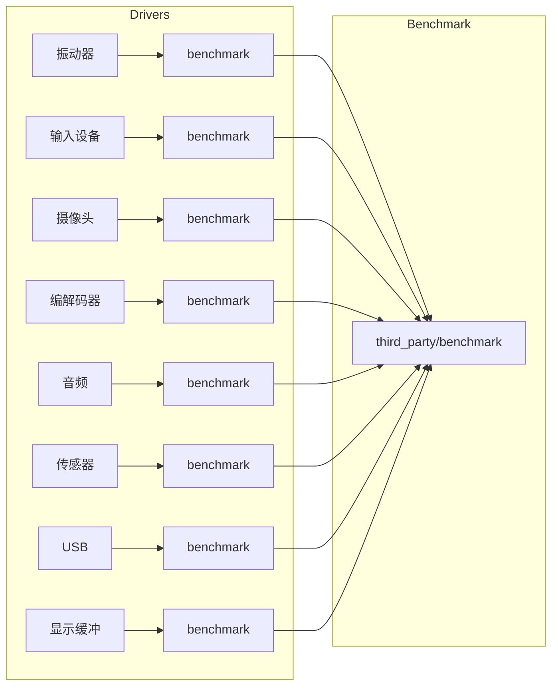
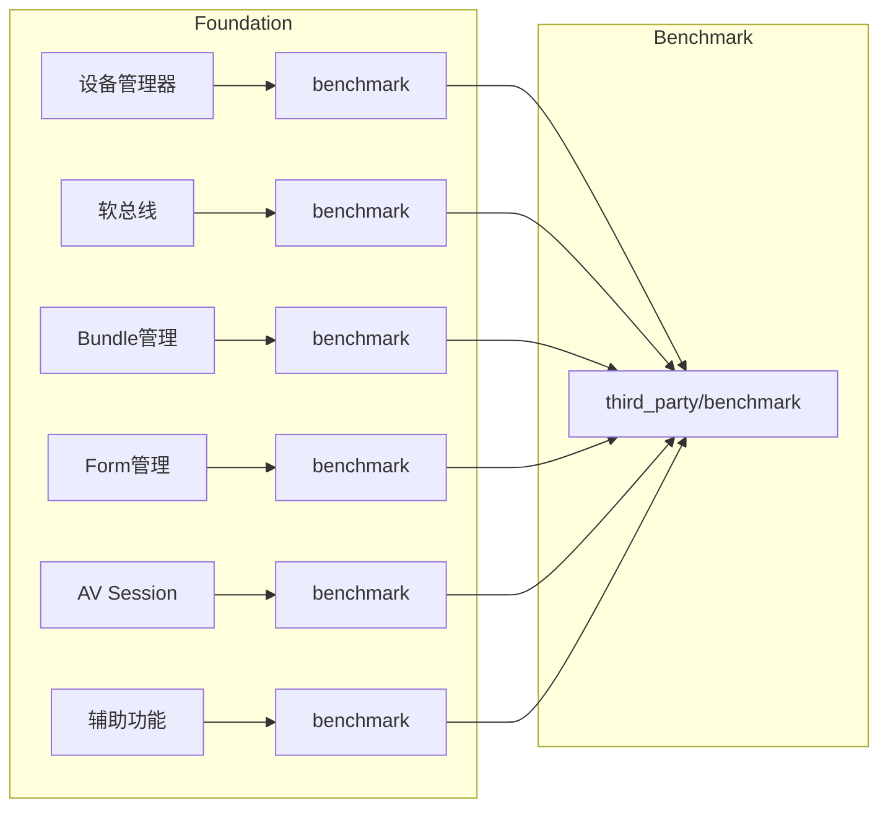

# 04_Usage_in_OH - OH 使用场景与依赖关系

## 4.1 依赖概览

### 依赖统计

| 统计项 | 数值 |
|--------|------|
| **直接依赖模块数** | 30+ |
| **benchmarktest 目录数** | 20+ |
| **子系统覆盖** | 6+ |

### 依赖模块分类

```
third_party/benchmark
│
├── drivers/peripheral/        # 驱动性能测试 (8个模块)
│   ├── vibrator/
│   ├── input/
│   ├── camera/
│   ├── codec/
│   ├── usb/
│   ├── audio/
│   ├── sensor/
│   └── display/buffer/
│
├── foundation/               # 系统服务性能测试 (7个模块)
│   ├── ability/form_fwk/
│   ├── accessibility/
│   ├── bundlemanager/
│   ├── communication/dsoftbus/
│   ├── distributedhardware/
│   ├── multimedia/av_session/
│   └── ...
│
├── commonlibrary/            # 公共库性能测试
│   └── c_utils/
│
└── test/                    # 测试框架示例
    └── xts/hats/
```

## 4.2 详细依赖列表

### 驱动层 (drivers/peripheral)

| 模块 | 路径 | 用途 |
|------|------|------|
| **振动器** | `drivers/peripheral/vibrator/test/benchmarktest` | HDF 振动器性能测试 |
| **输入设备** | `drivers/peripheral/input/test/benchmarktest` | 输入事件处理性能 |
| **摄像头** | `drivers/peripheral/camera/test/benchmarktest` | 摄像头驱动性能测试 (v1.0-v1.3) |
| **编解码器** | `drivers/peripheral/codec/test/benchmarktest` | 编解码性能测试 |
| **USB** | `drivers/peripheral/usb/test/benchmarktest` | USB 通信性能 |
| **音频** | `drivers/peripheral/audio/test/benchmarktest` | 音频处理性能 |
| **传感器** | `drivers/peripheral/sensor/test/benchmarktest` | 传感器数据采集性能 |
| **显示缓冲** | `drivers/peripheral/display/buffer/test/benchmarktest` | 缓冲管理性能 |

### 系统服务层 (foundation)

| 模块 | 路径 | 用途 |
|------|------|------|
| **设备管理器** | `foundation/distributedhardware/device_manager/test/benchmarktest` | 设备发现与连接性能 |
| **软总线** | `foundation/communication/dsoftbus/tests/sdk/` | 分布式通信性能测试 |
| **Bundle 管理** | `foundation/bundlemanager/bundle_framework/test/benchmarktest` | Bundle 安装/更新性能 |
| **辅助功能** | `foundation/barrierfree/accessibility/interfaces/innerkits/test/benchmarktest` | 无障碍服务性能 |
| **Form 管理** | `foundation/ability/form_fwk/test/benchmarktest` | Form 组件性能 |
| **AV Session** | `foundation/multimedia/av_session/frameworks/native/session/test/benchmarktest` | 多媒体会话性能 |

### 基础库层 (commonlibrary)

| 模块 | 路径 | 用途 |
|------|------|------|
| **c_utils** | `commonlibrary/c_utils/base/test/benchmarktest` | 基础工具库性能测试 |

### 测试框架层 (test)

| 模块 | 路径 | 用途 |
|------|------|------|
| **HDF 基准测试** | `test/xts/hats/hdf/codec/benchmarktest` | HDF 接口性能测试套件 |
| **开发者测试** | `test/testfwk/developer_test/examples/calculator/test/benchmarktest` | 开发者测试示例 |

## 4.3 标准使用模式

### 模式 1: 独立 benchmarktest 模块

```
目录结构:
test/benchmarktest/
├── BUILD.gn
└── my_benchmark_test.cpp
```

**BUILD.gn 示例**:
```gn
ohos_benchmarktest("my_benchmark_test") {
    sources = [ "my_benchmark_test.cpp" ]

    # 核心依赖
    deps = [ "//third_party/benchmark" ]

    # 可选: 包含被测试模块
    # deps += [ ":my_module" ]
}
```

**my_benchmark_test.cpp 示例**:
```cpp
#include "benchmark/benchmark.h"

// 测试被测模块的性能
static void BM_MyModuleOperation(benchmark::State& state) {
    // 初始化代码（仅执行一次）
    MyModuleInit();

    for (auto _ : state) {
        // 性能测试代码 - 会被多次迭代执行
        MyModuleOperation();
    }

    // 清理代码（仅执行一次）
    MyModuleCleanup();
}
BENCHMARK(BM_MyModuleOperation);

// 可选: 参数化测试
static void BM_Parameterized(benchmark::State& state) {
    for (auto _ : state) {
        ParameterizedOperation(state.range(0));
    }
}
BENCHMARK(BM_Parameterized)->Range(8, 8<<10);

BENCHMARK_MAIN();
```

### 模式 2: 内嵌在现有模块中

```gn
# 在模块的 BUILD.gn 中添加 benchmarktest
ohos_benchmarktest("my_module_benchmark") {
    sources = [
        "src/my_module.cpp",
        "test/benchmark/my_module_benchmark.cpp",
    ]

    deps = [
        ":my_module",
        "//third_party/benchmark",
    ]
}
```

### 模式 3: 使用 benchmark_main 简化

```gn
ohos_benchmarktest("my_simple_test") {
    sources = [ "simple_test.cpp" ]

    # 使用 benchmark_main，无需 BENCHMARK_MAIN()
    deps = [ "//third_party/benchmark:benchmark_main" ]
}
```

```cpp
// simple_test.cpp - 无需 BENCHMARK_MAIN()
#include "benchmark/benchmark.h"

static void BM_Simple(benchmark::State& state) {
    for (auto _ : state) {
        SimpleOperation();
    }
}
BENCHMARK(BM_Simple);
// 不需要 BENCHMARK_MAIN()，由 benchmark_main 库提供
```

## 4.4 依赖关系图

### 全局依赖关系

```mermaid
graph TD
    A[third_party/benchmark] --> B[drivers/peripheral/vibrator/test]
    A --> C[drivers/peripheral/input/test]
    A --> D[drivers/peripheral/camera/test]
    A --> E[drivers/peripheral/codec/test]
    A --> F[drivers/peripheral/audio/test]
    A --> G[drivers/peripheral/sensor/test]
    A --> H[drivers/peripheral/usb/test]
    A --> I[drivers/peripheral/display/buffer/test]

    A --> J[foundation/distributedhardware/device_manager/test]
    A --> K[foundation/communication/dsoftbus/tests]
    A --> L[foundation/bundlemanager/bundle_framework/test]
    A --> M[foundation/ability/form_fwk/test]
    A --> N[foundation/multimedia/av_session/test]
    A --> O[foundation/barrierfree/accessibility/test]

    A --> P[commonlibrary/c_utils/base/test]
    A --> Q[test/xts/hats/hdf/codec/benchmarktest]
```



### 驱动层依赖详情



### 系统服务层依赖详情



## 4.5 实际使用示例

### 示例 1: 摄像头驱动性能测试

**文件路径**: `drivers/peripheral/camera/test/benchmarktest/v1_0/BUILD.gn`

```gn
config("hdf_camera_benchmark_test_config") {
  # 摄像头测试特有配置
}

ohos_benchmarktest("hdf_camera_benchmark_test") {
  sources = [
    "./src/camera_benchmark_test.cpp",
  ]

  deps = [
    "//third_party/benchmark",
    # 被测试的摄像头模块依赖
    "//drivers/peripheral/camera/frameworks:v1_0",
  ]

  public_configs = [ ":hdf_camera_benchmark_test_config" ]
}
```

### 示例 2: 振动器驱动性能测试

**文件路径**: `drivers/peripheral/vibrator/test/BUILD.gn`

```gn
ohos_benchmarktest("hdf_vibrator_benchmark_test") {
  sources = [ "hdf_vibrator_benchmark_test.cpp" ]

  deps = [
    "//third_party/benchmark",
    "//drivers/peripheral/vibrator/frameworks:vibrator_impl",
  ]
}
```

### 示例 3: 设备管理器性能测试

**文件路径**: `foundation/distributedhardware/device_manager/test/BUILD.gn`

```gn
benchmarktest("device_manager_benchmark") {
  sources = [ "dm_benchmark_test.cpp" ]

  deps = [
    "//third_party/benchmark",
    "//foundation/distributedhardware/device_manager/services/device_manager:dm_service",
  ]
}
```

## 4.6 最佳实践

### 命名规范

```gn
# 标准命名: 模块名_benchmark
ohos_benchmarktest("hdf_vibrator_benchmark_test")      # ✅ 正确
ohos_benchmarktest("vibrator_benchmark")               # ✅ 可接受
ohos_benchmarktest("vibrator_test_performance")         # ❌ 过长
ohos_benchmarktest("vibrator_bench")                   # ❌ 不清晰
```

### 目录结构

```
模块目录/
├── src/                      # 源代码
├── include/                  # 头文件
├── test/
│   ├── unit_test/           # 单元测试
│   ├── benchmarktest/       # 性能测试 (固定目录名)
│   │   ├── BUILD.gn
│   │   └── *benchmark_test.cpp
│   └── ...
└── BUILD.gn
```

### 测试文件命名

| 文件类型 | 命名模式 | 示例 |
|----------|----------|------|
| 性能测试 | `*_benchmark_test.cpp` | `camera_benchmark_test.cpp` |
| 简单测试 | `*_bench.cpp` | `simple_bench.cpp` |

## 4.7 运行 benchmarktest

### 构建命令

```bash
# 构建特定模块的 benchmarktest
./build.sh --product-name xxx --build-target 模块名:benchmarktest名称

# 示例: 构建摄像头 benchmarktest
./build.sh --product-name hisilicon --build-target drivers/peripheral/camera:test/benchmarktest/v1_0:hdf_camera_benchmark_test
```

### 运行命令

```bash
# 在设备上运行
hdc shell ./data/test/xxx_benchmark_test

# 查看帮助
./xxx_benchmark_test --help
```

### 常用参数

| 参数 | 说明 |
|------|------|
| `--benchmark_list_tests` | 列出所有测试用例 |
| `--benchmark_filter=*` | 运行匹配的测试 |
| `--benchmark_min_time=1000` | 最小运行时间 (ms) |
| `--benchmark_repetitions=3` | 重复运行次数 |
| `--benchmark_format=console` | 输出格式 (console/json/csv) |

## 4.8 性能测试报告示例

### 控制台输出

```
Running ./hdf_camera_benchmark_test
Run on (8 X  s2800 MHz CPU):
CPU Caches:
  L1 Data 32 KiB (x8)
  L1 Instruction 32 KiB (x8)
  L2 Unified 1024 KiB (x8)

*** No benchmarks to run ***
```

### 典型性能指标

| 指标 | 说明 |
|------|------|
| **CPU 时间** | 单次迭代的 CPU 使用时间 |
| **Wall 时间** | 实际经过的时间 |
| **迭代次数** | 测试循环执行次数 |
| **内存分配** | 每次迭代的内存分配次数 |
| **吞吐量** | 单位时间内的操作次数 |

## 4.9 常见问题

### Q1: benchmarktest 与 unittest 的区别?

| 对比 | benchmarktest | unittest |
|------|---------------|----------|
| **目的** | 性能测量 | 功能验证 |
| **关注点** | 时间/资源消耗 | 正确性 |
| **结果** | 数值统计 | 通过/失败 |
| **运行时间** | 可配置，较长 | 通常较短 |

### Q2: 如何过滤不运行的测试?

```bash
./test_benchmark --benchmark_filter=BM_Specific*
```

### Q3: 如何增加测试迭代次数?

```bash
./test_benchmark --benchmark_min_time=5000     # 最小 5 秒
./test_benchmark --benchmark_repetitions=10     # 重复 10 次
```
