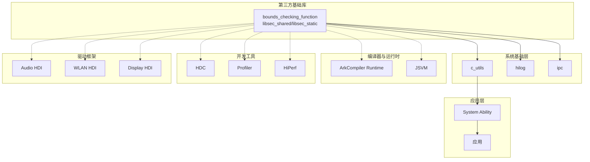
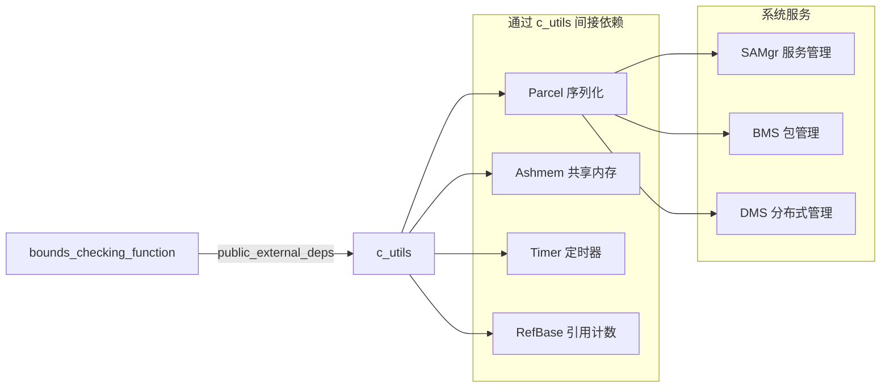

# bounds_checking_function 在 OpenHarmony 中的使用

## 1. 依赖关系概览

### 1.1 统计数据

| 指标 | 数值 |
|------|------|
| **依赖文件数** | 1941 个 BUILD.gn 文件 |
| **覆盖子系统** | 几乎所有 OH 子系统 |
| **直接暴露目标** | libsec_shared, libsec_static |
| **主要引用方式** | external_deps 和 deps |

### 1.2 依赖强度分类

| 依赖层级 | 说明 | 典型模块 |
|----------|------|----------|
| **核心依赖** | 构建必需的基础依赖 | c_utils, arkcompiler, hilog |
| **主要依赖** | 重要的功能组件 | hdc, profiler, audio |
| **普通依赖** | 使用安全函数的组件 | drivers, tests, tools |

---

## 2. 主要依赖者分析

### 2.1 编译器与运行时 (arkcompiler)

| 模块 | BUILD.gn 路径 | 用途 |
|------|--------------|------|
| runtime_core | arkcompiler/runtime_core/libpandabase | 运行时基础库内存操作 |
| runtime_core | arkcompiler/runtime_core/libpandafile | 字节码文件处理 |
| runtime_core | arkcompiler/runtime_core/libziparchive | 压缩包解压安全操作 |
| runtime_core | arkcompiler/runtime_core/assembler | 汇编器字符串处理 |
| runtime_core | arkcompiler/runtime_core/compiler | 编译器内存管理 |
| runtime_core | arkcompiler/runtime_core/bytecode_optimizer | 字节码优化 |
| runtime_core | arkcompiler/runtime_core/abc2program | ABC 转换 |
| runtime_core | arkcompiler/runtime_core/common_runtime | 公共运行时 |
| jsvm | arkcompiler/jsvm | JS 虚拟机安全操作 |
| toolchain | arkcompiler/toolchain/inspector | 调试器工具 |
| toolchain | arkcompiler/toolchain/tooling | 开发工具 |
| toolchain | arkcompiler/toolchain/websocket | WebSocket 工具 |

**使用场景**:
- JavaScript/ArkTS 字符串转换和内存分配
- 字节码文件的读写操作
- 编译过程中的临时缓冲区管理

**代码示例**:
```cpp
// arkcompiler/runtime_core/libpandabase 示例
#include "securec.h"

// 安全复制类名
char className[256];
strcpy_s(className, sizeof(className), descriptor);
```

### 2.2 系统基础库 (commonlibrary)

#### 2.2.1 c_utils - C++ 工具库

| BUILD.gn 路径 | 依赖类型 |
|--------------|----------|
| commonlibrary/c_utils/base | public_external_deps |

**使用方式**:
```gn
# c_utils 的 BUILD.gn
ohos_static_library("c_utils") {
  public_external_deps = [ "bounds_checking_function:libsec_static" ]
}
```

**c_utils 是核心中转依赖**，大量模块通过 c_utils 间接依赖 bounds_checking_function：

```
bounds_checking_function → c_utils → [数百个下游模块]
```

#### 2.2.2 ETS Utils (JavaScript 运行时模块)

| 模块 | 用途 |
|------|------|
| js_api_module/buffer | Buffer 对象的字符串操作 |
| js_api_module/uri | URI 解析的字符串处理 |
| js_api_module/xml | XML 解析的安全操作 |
| js_api_module/url | URL 解析的安全操作 |
| js_concurrent_module/taskpool | 任务池的内存管理 |
| js_concurrent_module/worker | Worker 线程的通信安全 |
| js_sys_module/console | 控制台输出的格式化 |
| js_sys_module/process | 进程参数的字符串处理 |
| js_sys_module/timer | 定时器回调的安全操作 |
| js_util_module/collections | 集合类的内存操作 |
| js_util_module/json | JSON 解析的安全操作 |
| js_util_module/util | 工具函数的字符串处理 |

**使用场景**:
- JS 与 C++ 之间的字符串转换
- 内存缓冲区的安全操作
- 格式化输出（console.log）

### 2.3 开发工具 (developtools)

#### 2.3.1 HDC (设备连接器)

| BUILD.gn 路径 | 依赖方式 |
|--------------|----------|
| developtools/hdc | libsec_shared + libsec_static |
| developtools/hdc/hdc_rust | libsec_static (Rust FFI) |
| developtools/hdc/credential | libsec_shared |

**使用场景**:
- 命令解析的字符串操作
- 文件传输的缓冲区管理
- 设备认证的密钥处理

#### 2.3.2 Profiler 性能分析工具

| 模块 | 子模块数量 |
|------|-----------|
| profiler/device | 20+ 个子模块 |
| profiler/hiebpf | eBPF 性能分析 |
| profiler/hidebug | 调试接口 |
| profiler/proto_encoder | 协议编码 |

**覆盖的插件类型**:
- cpu_plugin - CPU 性能分析
- memory_plugin - 内存分析
- network_plugin - 网络分析
- gpu_plugin - GPU 分析
- ftrace_plugin - 内核追踪
- hisysevent_plugin - 系统事件
- native_hook - 原生钩子
- native_daemon - 守护进程

#### 2.3.3 其他开发工具

| 工具 | 用途 |
|------|------|
| hiperf | 性能分析数据的字符串处理 |
| smartperf_host | Trace 数据分析的安全操作 |
| packing_tool | HAP 打包的安全字符串操作 |
| syscap_codec | 系统能力编解码 |
| global_resource_tool | 资源编译的安全操作 |

### 2.4 驱动框架 (drivers/peripheral)

#### 2.4.1 HDI 接口层

| 驱动类型 | BUILD.gn 路径 |
|----------|--------------|
| 显示驱动 | drivers/peripheral/display/hal/default |
| 音频驱动 | drivers/peripheral/audio/hdi_service |
| WLAN 驱动 | drivers/peripheral/wlan/client, hal |
| 传感器驱动 | drivers/peripheral/sensor |
| 灯光驱动 | drivers/peripheral/light |
| 安全密钥 | drivers/peripheral/huks/hdi_service |

**使用场景**:
- HDI 接口的参数校验
- 硬件配置数据的解析
- IOCTL 命令的字符串处理

**代码示例**:
```cpp
// 音频驱动配置解析
#include "securec.h"

char codecName[64];
if (strcpy_s(codecName, sizeof(codecName), config-&gt;name) != EOK) {
    return HDF_FAILURE;
}
```

### 2.5 内核相关

| 模块 | 说明 |
|------|------|
| kernel/uniproton | UniProton 内核使用 libsec_static |
| kernel/linux/build | Linux 内核测试使用 |

**特殊说明**: LiteOS-M 内核有自己的安全函数实现，不依赖本库

### 2.6 IDE 工具 (ide/tools/previewer)

| BUILD.gn 路径 | 用途 |
|--------------|------|
| ide/tools/previewer | 预览器工具的安全操作 |
| ide/tools/previewer/util | 工具库 |
| ide/tools/previewer/test | 测试用例 |

### 2.7 设备厂商适配 (vendor, device, drivers)

| 厂商/设备 | 模块 |
|-----------|------|
| hisilicon | utils/token, security/permission_lite |
| qemu | display, riscv32_virt |
| ohemu | security/permission_lite |

---

## 3. 依赖关系图

### 3.1 整体依赖拓扑



### 3.2 c_utils 中转依赖详细图



---

## 4. 典型使用场景详解

### 4.1 IPC (进程间通信)

**场景**: System Ability 之间的数据传递

```cpp
// commonlibrary/c_utils/base/src/message_parcel.cpp
#include "securec.h"

bool MessageParcel::WriteString(const std::string &value) {
    size_t len = value.length();
    char *buffer = new char[len + 1];
    
    // 使用 strcpy_s 安全复制
    if (strcpy_s(buffer, len + 1, value.c_str()) != EOK) {
        delete[] buffer;
        return false;
    }
    
    // 写入 Parcel
    bool result = WriteBuffer(buffer, len + 1);
    delete[] buffer;
    return result;
}
```

### 4.2 日志输出 (Hilog)

**场景**: 系统日志的格式化输出

```cpp
// 内部实现使用 snprintf_s 替代 snprintf
char logBuffer[LOG_BUFFER_SIZE];
int ret = snprintf_s(logBuffer, sizeof(logBuffer), sizeof(logBuffer) - 1,
                     "[%{public}s] %{public}s", tag, msg);
if (ret == -1) {
    // 处理错误
}
```

### 4.3 驱动配置解析

**场景**: 从配置文件读取硬件参数

```cpp
// drivers/peripheral/audio 示例
#include "securec.h"

int32_t ParseAudioConfig(const char *configPath) {
    char line[256];
    FILE *fp = fopen(configPath, "r");
    
    while (fgets(line, sizeof(line), fp) != NULL) {
        char key[64], value[128];
        // 使用 sscanf_s 安全解析
        if (sscanf_s(line, "%63s = %127s", key, sizeof(key), value, sizeof(value)) == 2) {
            // 处理配置项
        }
    }
    
    fclose(fp);
    return HDF_SUCCESS;
}
```

### 4.4 设备连接器 (HDC)

**场景**: 命令解析和数据传输

```cpp
// developtools/hdc 示例
#include "securec.h"

bool HdcCommand::ParseCommand(const char *cmdLine) {
    char cmd[64], arg1[256], arg2[256];
    
    // 安全解析命令行
    int n = sscanf_s(cmdLine, "%63s %255s %255s", 
                     cmd, sizeof(cmd),
                     arg1, sizeof(arg1), 
                     arg2, sizeof(arg2));
    
    if (n < 1) {
        return false;
    }
    
    // 处理命令
    return ExecuteCommand(cmd, arg1, arg2);
}
```

### 4.5 JavaScript 运行时

**场景**: JS 字符串转换为 C 字符串

```cpp
// arkcompiler/runtime_core 示例
#include "securec.h"

char *JSStringToCString(JSString *str) {
    size_t len = str->Length();
    char *buffer = new char[len + 1];
    
    // 安全复制 JS 字符串内容
    if (memcpy_s(buffer, len + 1, str->GetData(), len) != EOK) {
        delete[] buffer;
        return nullptr;
    }
    buffer[len] = '\0';
    
    return buffer;
}
```

---

## 5. 使用方式统计

### 5.1 引用方式分布

| 引用方式 | 文件数 | 占比 | 典型场景 |
|----------|--------|------|----------|
| external_deps | ~1200 | 62% | 标准系统模块 |
| deps | ~400 | 20% | Lite 系统、芯片厂商 |
| include_dirs | ~300 | 15% | 仅需要头文件 |
| 直接源码引用 | ~41 | 3% | 独立工具程序 |

### 5.2 库类型选择

| 库类型 | 使用场景 |
|--------|----------|
| libsec_shared | 大多数场景，共享库减少内存占用 |
| libsec_static | 独立程序、host 端工具、特殊场景 |

---

## 6. 移除影响评估

### 6.1 如果移除 bounds_checking_function

**直接影响**:
- 1941 个 BUILD.gn 文件编译失败
- 几乎所有系统服务无法构建
- 开发工具链失效

**需要修改的代码量**:
```
估算涉及文件: 5000+ 个源文件
涉及代码行数: 100,000+ 行
```

**替代方案成本**:
- 使用标准 C 库: 需要全面审计缓冲区溢出风险
- 使用其他安全库: 需要大规模 API 迁移

### 6.2 降级影响评估

如果将 libsec_shared 降级为标准 C 库函数：

| 风险类别 | 风险等级 | 说明 |
|----------|----------|------|
| 缓冲区溢出 | 极高 | strcpy, sprintf 等极易溢出 |
| 格式化字符串 | 高 | %n 等格式说明符的风险 |
| 整数溢出 | 中 | 长度参数计算溢出 |
| ROP 攻击 | 高 | 缺少 PAC 保护 |

---

## 7. 最佳实践

### 7.1 对于模块开发者

#### ✅ 推荐做法

```gn
# BUILD.gn
ohos_shared_library("my_module") {
  external_deps = [
    "bounds_checking_function:libsec_shared",
    # 其他依赖...
  ]
}
```

```cpp
// 源码中始终使用安全函数
#include "securec.h"

void SafeFunction(char *dest, const char *src, size_t destSize) {
    // ✅ 使用 strcpy_s
    if (strcpy_s(dest, destSize, src) != EOK) {
        // 错误处理
        return;
    }
}
```

#### ❌ 避免做法

```cpp
#include <string.h>  // 避免直接包含标准头文件

void UnsafeFunction(char *dest, const char *src) {
    // ❌ 使用 strcpy - 危险！
    strcpy(dest, src);
}
```

### 7.2 错误处理模式

```cpp
#include "securec.h"
#include "hilog/log.h"

bool ProcessData(const char *input) {
    char buffer[256];
    
    errno_t ret = strcpy_s(buffer, sizeof(buffer), input);
    if (ret != EOK) {
        switch (ret) {
            case EINVAL:
                HILOG_ERROR("Invalid parameter");
                break;
            case ERANGE:
                HILOG_ERROR("Buffer too small");
                break;
            case EOVERLAP_AND_RESET:
                HILOG_ERROR("Buffer overlap detected");
                break;
            default:
                HILOG_ERROR("Unknown error: %d", ret);
        }
        return false;
    }
    
    // 继续处理...
    return true;
}
```

---

## 8. 总结

### 8.1 核心结论

bounds_checking_function 是 OpenHarmony **最基础的安全库**，具有以下特点：

1. **无处不在** - 1941+ 个 BUILD.gn 文件依赖
2. **全系统覆盖** - 从内核到应用层均有使用
3. **启动必需** - system/updater/ramdisk 三个阶段都需要
4. **不可替代** - 移除成本极高，安全风险极大

### 8.2 关键数据

| 指标 | 数值 |
|------|------|
| 直接依赖模块数 | 1941+ |
| 间接依赖模块数 | 5000+ |
| 覆盖子系统 | 全部 |
| 启动阶段 | 3/3 (100%) |
| SDK 层级 | 3 层全部 |

### 8.3 维护建议

1. **保持升级** - 及时同步上游 libboundscheck 版本
2. **持续推广** - 确保新代码使用安全函数
3. **静态检查** - 配置编译器警告，禁止不安全函数
4. **安全审计** - 定期检查是否误用标准 C 函数
