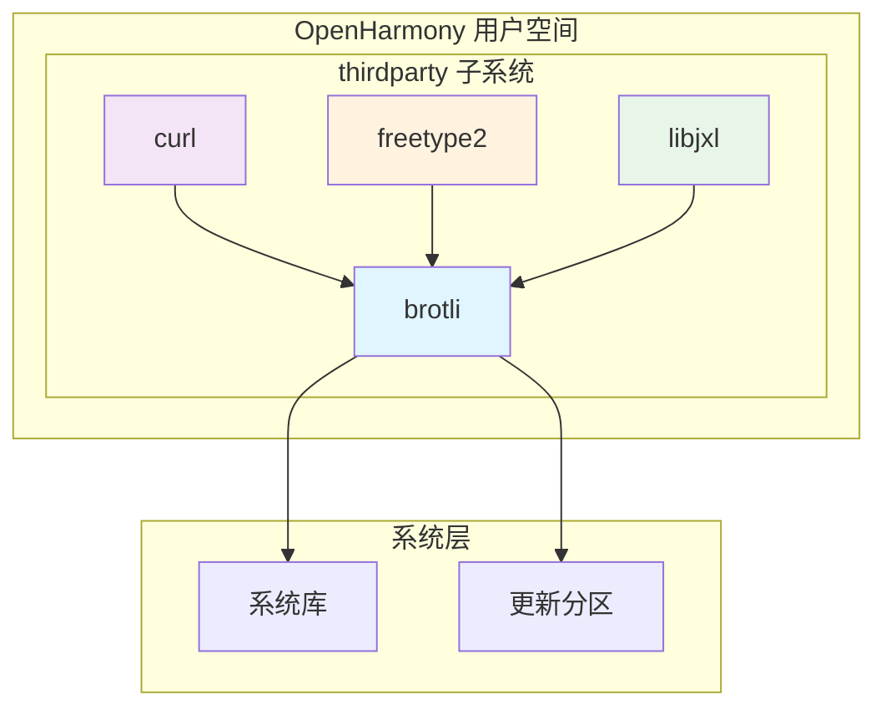

# 依赖关系与使用

## 直接依赖者

### 主要依赖模块

| 模块 | BUILD.gn 路径 | 依赖方式 | 用途 |
|-----|--------------|---------|------|
| **curl** | //third_party/curl/BUILD.gn | 动态链接 | HTTP Brotli 压缩传输 |
| **skia/freetype2** | //third_party/skia/m133/third_party/freetype2/BUILD.gn | 静态链接 | 字体压缩 |
| **skia/libjxl** | //third_party/skia/m133/third_party/libjxl/BUILD.gn | 静态链接 | JPEG XL 图像格式 |

### curl 依赖详情

curl 是 Brotli 在 OpenHarmony 中最重要的使用者：

```gn
# //third_party/curl/BUILD.gn 中的依赖配置

# HTTP 压缩模块依赖
deps += [ "//third_party/brotli:brotli_shared" ]

# libwebsockets 中的 Brotli 压缩
deps += [ "//third_party/brotli:brotli_shared" ]
```

**依赖位置**：
- 第 468 行
- 第 473 行
- 第 653 行
- 第 658 行

---

## 使用场景详解

### 场景一：HTTP 压缩传输（curl）

#### 功能说明

curl 通过 Brotli 提供 HTTP 请求和响应的 Brotli 压缩支持：

```c
// curl 使用 Brotli 的典型场景

// 1. 客户端请求（Accept-Encoding）
CURL *curl = curl_easy_init();
struct curl_slist *headers = NULL;
headers = curl_slist_append(headers, "Accept-Encoding: br");
curl_easy_setopt(curl, CURLOPT_HTTPHEADER, headers);

// 2. 客户端接收（Content-Encoding: br）
// Brotli 解码由 curl 内部处理

// 3. 客户端发送（Content-Encoding: br）
// Brotli 编码由 curl 内部处理
```

#### 压缩效率对比

| 压缩格式 | 压缩比 | 压缩速度 | 解压速度 |
|---------|-------|---------|---------|
| **Brotli** | 最高 | 中等 | 快 |
| gzip | 中等 | 快 | 快 |
| deflate | 较低 | 最快 | 最快 |

**优势**：Brotli 比 gzip 压缩比高 15-25%

#### OH 中的应用

```
┌──────────────────────────────────────────────────────┐
│                   OpenHarmony                         │
│  ┌────────────────────────────────────────────────┐  │
│  │                   应用层                        │  │
│  └────────────────────────────────────────────────┘  │
│                         │                             │
│                         ▼                             │
│  ┌────────────────────────────────────────────────┐  │
│  │              libcurl (HTTP 客户端)              │  │
│  │  ┌──────────┐    ┌──────────┐    ┌──────────┐ │  │
│  │  │ HTTP请求  │───▶│ brotli   │───▶│ 网络传输 │ │  │
│  │  │ 压缩请求  │    │ 编码器   │    │         │ │  │
│  │  └──────────┘    └──────────┘    └──────────┘ │  │
│  │  ┌──────────┐    ┌──────────┐    ┌──────────┐ │  │
│  │  │ 网络接收  │───▶│ brotli   │───▶│ 响应解析 │ │  │
│  │  │         │    │ 解码器   │    │         │ │  │
│  │  └──────────┘    └──────────┘    └──────────┘ │  │
│  └────────────────────────────────────────────────┘  │
│                         │                             │
│                         ▼                             │
│  ┌────────────────────────────────────────────────┐  │
│  │              网络层 (HTTP/HTTPS)                │  │
│  └────────────────────────────────────────────────┘  │
└──────────────────────────────────────────────────────┘
```

### 场景二：字体压缩（freetype2）

#### 功能说明

WOFF2（Web Open Font Format 2）使用 Brotli 作为压缩算法：

```c
// WOFF2 压缩流程
woff2_buffer_t *buffer = CreateWOFF2Buffer();
CompressFontToWOFF2(font_data, font_size, buffer);
// 内部使用 Brotli 压缩
```

#### OH 中的应用

- **WebView**：网页字体的压缩传输
- **系统字体**：字体资源的压缩存储
- **应用资源**：APK/HAP 中的字体文件

### 场景三：图像格式集成（libjxl）

#### 功能说明

JPEG XL 是一种现代图像格式，使用 Brotli 作为可选的压缩后端：

```c
// JPEG XL 编码选项
JxlEncoderOptions *options = JxlEncoderOptionsCreate(encoder, NULL);
JxlEncoderSetOption(options, "extensible_box", "brotli");
// 使用 Brotli 扩展框
```

#### OH 中的应用

- **图像解码**：支持 Brotli 压缩的 JPEG XL 图像
- **图像编码**：高质量图像的压缩存储

---

## 依赖关系图



---

## 头文件引用

### 必需头文件

```c
// Brotli 编码器头文件
#include <brotli/encode.h>

// Brotli 解码器头文件
#include <brotli/decode.h>

// Brotli 共享字典头文件
#include <brotli/shared_dictionary.h>

// Brotli 平台配置头文件
#include <brotli/port.h>

// Brotli 类型定义
#include <brotli/types.h>
```

### 头文件路径

```
//third_party/brotli/
└── c/
    └── include/
        └── brotli/
            ├── decode.h          # 解码 API
            ├── encode.h          # 编码 API
            ├── shared_dictionary.h  # 共享字典 API
            ├── port.h            # 平台配置
            └── types.h           # 类型定义
```

---

## 链接方式

### 动态链接（推荐）

```gn
# 在模块的 BUILD.gn 中
deps += [ "//third_party/brotli:brotli_shared" ]
```

**优点**：
- 减少最终二进制体积
- 便于库的统一更新
- 符合 OH 系统库设计原则

### 静态链接（不推荐）

当前 OH 配置不支持静态链接。如需静态链接：
1. 修改 `BUILD.gn` 添加 `ohos_static_library` 目标
2. 更新 `bundle.json` 的 `build.sub_component`

---

## 使用示例

### 基本压缩流程

```c
#include <brotli/encode.h>

// Brotli 压缩函数
int brotli_compress(const uint8_t *input, size_t input_size,
                    uint8_t *output, size_t *output_size) {
    BrotliEncoderState *state = BrotliEncoderCreateInstance(
        NULL, NULL, NULL);

    if (!state) {
        return -1;  // 创建实例失败
    }

    // 设置压缩质量 (0-11)
    BrotliEncoderSetParameter(state,
                              BROTLI_PARAM_QUALITY,
                              11);

    // 设置窗口大小 (10-24)
    BrotliEncoderSetParameter(state,
                              BROTLI_PARAM_LGWIN,
                              22);

    // 执行压缩
    BROTLI_BOOL result = BrotliEncoderCompressStream(
        state,
        BROTLI_OPERATION_FINISH,
        &input_size,
        input,
        output_size,
        output,
        NULL);

    BrotliEncoderDestroyInstance(state);

    return result == BROTLI_TRUE ? 0 : -1;
}
```

### 基本解压流程

```c
#include <brotli/decode.h>

// Brotli 解压函数
int brotli_decompress(const uint8_t *input, size_t input_size,
                      uint8_t *output, size_t *output_size) {
    BrotliDecoderState *state = BrotliDecoderCreateInstance(
        NULL, NULL, NULL);

    if (!state) {
        return -1;
    }

    BrotliDecoderResult result = BrotliDecoderDecompress(
        &input_size,
        input,
        output_size,
        output);

    BrotliDecoderDestroyInstance(state);

    return result == BROTLI_DECODER_RESULT_SUCCESS ? 0 : -1;
}
```

---

## 最佳实践

### 1. 压缩质量选择

| 场景 | 推荐质量 | 说明 |
|-----|---------|------|
| **实时传输** | 4-6 | 平衡压缩率和速度 |
| **文件存储** | 9-11 | 最大压缩率 |
| **资源预压缩** | 8-9 | Web 资源优化 |

### 2. 内存管理

```c
// 推荐：使用自定义内存分配器
void *my_alloc(void *opaque, size_t size) {
    return malloc(size);
}

void my_free(void *opaque, void *address) {
    free(address);
}

BrotliEncoderState *state = BrotliEncoderCreateInstance(
    my_alloc, my_free, opaque);
```

### 3. 流式处理

```c
// 对于大文件，使用流式 API
#define BUFFER_SIZE 4096

uint8_t input_buffer[BUFFER_SIZE];
uint8_t output_buffer[BUFFER_SIZE];

while ((read_size = fread(input_buffer, 1, BUFFER_SIZE, input_file)) > 0) {
    size_t available_in = read_size;
    size_t available_out = BUFFER_SIZE;

    BrotliEncoderCompressStream(state,
                                 BROTLI_OPERATION_PROCESS,
                                 &available_in,
                                 input_buffer,
                                 &available_out,
                                 output_buffer,
                                 NULL);

    // 处理压缩输出
    fwrite(output_buffer, 1, BUFFER_SIZE - available_out, output_file);
}

// 完成压缩
BrotliEncoderCompressStream(state,
                            BROTLI_OPERATION_FINISH,
                            &available_in,
                            input_buffer,
                            &available_out,
                            output_buffer,
                            NULL);
```

---

## 性能考虑

### 压缩速度对比

| 质量级别 | 相对速度 | 压缩比 | 推荐场景 |
|---------|---------|-------|---------|
| 0 | 最快 | 最低 | 实时数据流 |
| 1 | 快 | 较低 | 快速压缩 |
| 4-6 | 中等 | 中等 | 通用场景 |
| 9 | 较慢 | 较高 | 文件压缩 |
| 11 | 最慢 | 最高 | 最大压缩 |

### 内存使用

```c
// 编码器内存估算
// 内存 ≈ 2^window * 质量因子
// 例如：window=22, quality=11
// 内存 ≈ 4MB * 11 ≈ 44MB
```

---

## 相关资源

- **依赖模块**：
  - [curl](../curl/README.md)
  - [skia/freetype2](../skia/m133/third_party/freetype2/README.md)
  - [skia/libjxl](../skia/m133/third_party/libjxl/README.md)

- **上游文档**：
  - [Brotli 官方文档](http://brotli.org)
  - [Brotli GitHub](http://github.com/google/brotli)

- **相关 API**：
  - [encode.h](../c/include/brotli/encode.h)
  - [decode.h](../c/include/brotli/decode.h)
