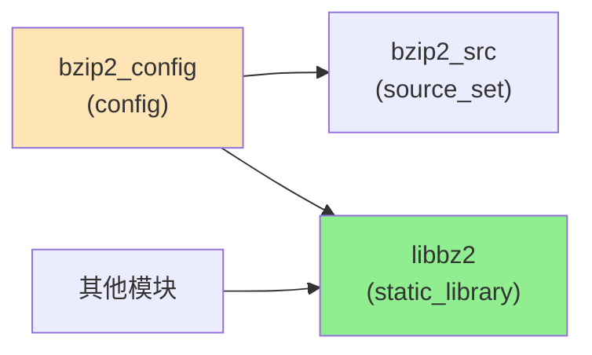

# OH 构建适配

> **bzip2 通过简单的 GN 构建包装集成到 OpenHarmony，无需源码修改。**

---

## 📋 概述

| 属性 | 值 |
|------|------|
| **构建系统** | GN (Generate Ninja) |
| **输出类型** | 静态库 |
| **目标名称** | `libbz2` |
| **依赖关系** | 无外部依赖（仅标准 C 库） |
| **构建复杂度** | ⭐ 极低 |

---

## 🔧 BUILD.gn 详解

### 文件位置

```
/Volumes/lexar/code/d/work/oh/third_party/bzip2/BUILD.gn
```

### 完整内容

```gn
# Copyright (c) 2021 Huawei Device Co., Ltd.
# Licensed under the Apache License, Version 2.0

import("//build/ohos.gni")

config("bzip2_config") {
  include_dirs = [ "." ]
}

ohos_source_set("bzip2_src") {
  sources = [
    "blocksort.c",
    "bzlib.c",
    "compress.c",
    "crctable.c",
    "decompress.c",
    "huffman.c",
    "randtable.c",
  ]
  configs = [ ":bzip2_config" ]

  part_name = "bzip2"
  subsystem_name = "thirdparty"
}

ohos_static_library("libbz2") {
  sources = [
    "blocksort.c",
    "bzlib.c",
    "compress.c",
    "crctable.c",
    "decompress.c",
    "huffman.c",
    "randtable.c",
  ]
  public_configs = [ ":bzip2_config" ]

  part_name = "bzip2"
  subsystem_name = "thirdparty"
}
```

---

## 📦 构建目标详解

### 1. `bzip2_config` 配置目标

```gn
config("bzip2_config") {
  include_dirs = [ "." ]
}
```

**作用**:
- 定义公共头文件路径
- 包含 `bzlib.h` 和 `bzlib_private.h`

**影响**:
- 依赖 `libbz2` 的目标自动获得 `include_dirs = [ "." ]`
- 可以通过 `#include "bzlib.h"` 直接引用头文件

---

### 2. `bzip2_src` 源码集合

```gn
ohos_source_set("bzip2_src") {
  sources = [
    "blocksort.c",
    "bzlib.c",
    "compress.c",
    "crctable.c",
    "decompress.c",
    "huffman.c",
    "randtable.c",
  ]
  configs = [ ":bzip2_config" ]

  part_name = "bzip2"
  subsystem_name = "thirdparty"
}
```

**作用**:
- 定义源码集合，可被其他 GN 目标复用
- 类似于静态库，但不生成归档文件

**使用场景**:
- 当需要将 bzip2 源码直接编译到其他库或可执行文件时使用

**示例**:
```gn
# 在其他 BUILD.gn 中复用
ohos_executable("my_tool") {
  sources = [ "my_tool.c" ]
  deps = [ "//third_party/bzip2:bzip2_src" ]
}
```

---

### 3. `libbz2` 静态库（主要目标）

```gn
ohos_static_library("libbz2") {
  sources = [
    "blocksort.c",
    "bzlib.c",
    "compress.c",
    "crctable.c",
    "decompress.c",
    "huffman.c",
    "randtable.c",
  ]
  public_configs = [ ":bzip2_config" ]

  part_name = "bzip2"
  subsystem_name = "thirdparty"
}
```

**作用**:
- 生成静态库文件 `libbz2.a`
- 对外暴露的主要 GN 目标

**关键区别**:

| 属性 | bzip2_src | libbz2 |
|------|-----------|---------|
| **类型** | `ohos_source_set` | `ohos_static_library` |
| **输出** | 无（源码集合） | `libbz2.a` 静态库 |
| **configs** | `configs = [ ":bzip2_config" ]` | `public_configs = [ ":bzip2_config" ]` |
| **传播** | 不传播头文件路径 | 向依赖者传播头文件路径 |

---

## 📁 源文件说明

### 包含的源文件

| 文件 | 功能 | 代码行数（约） |
|------|------|--------------|
| `blocksort.c` | 块排序算法（BWT） | ~900 行 |
| `bzlib.c` | 库顶层函数 | ~1500 行 |
| `compress.c` | 压缩实现 | ~500 行 |
| `crctable.c` | CRC 表生成 | ~150 行 |
| `decompress.c` | 解压实现 | ~500 行 |
| `huffman.c` | Huffman 编码 | ~200 行 |
| `randtable.c` | 随机表生成 | ~100 行 |

**总计**: 约 3850 行核心代码

### 未包含的文件

| 文件 | 原因 |
|------|------|
| `bzip2.c` | 命令行工具，OH 不包含 |
| `bzip2recover.c` | 损坏文件恢复工具，OH 不包含 |
| `dlltest.c` | Windows DLL 测试，OH 不包含 |
| 其他测试工具 | 测试程序，不随 OH 分发 |

---

## 🔗 依赖关系

### 外部依赖

| 依赖 | 说明 |
|------|------|
| **标准 C 库** | `stdio.h`, `stdlib.h`, `string.h` 等 |
| **数学库** | 无 |
| **其他 OH 库** | 无 |

**结论**: bzip2 无任何外部依赖，完全独立。

### GN 目标依赖图



**说明**:
- `libbz2` 是主要目标，被其他模块依赖
- `bzip2_src` 是备用的源码集合，较少使用
- `bzip2_config` 提供公共头文件路径

---

## ⚙️ 编译选项

### 默认编译选项

| 选项 | 值 | 说明 |
|------|-----|------|
| **优化级别** | 由 OH 构建系统控制 | 通常为 `-O2` 或 `-Os` |
| **警告级别** | 由 OH 构建系统控制 | `-Wall -Werror` |
| **C 标准** | C89 | bzip2 兼容 C89 |
| **调试符号** | 可选 | Debug 模式下启用 |

### 未定义的宏

bzip2 的 BUILD.gn **未定义任何特殊的编译宏**：

| 宏 | 定义？ | 说明 |
|-----|--------|------|
| `BZ_NO_STDIO` | ❌ 未定义 | 启用文件 API |
| `BZ_DEBUG` | ❌ 未定义 | 无调试输出 |
| `BZ_EXPORT` | ❌ 未定义 | 使用默认导出 |

### 与上游 Makefile 的差异

| 方面 | 上游 Makefile | OH BUILD.gn |
|------|-------------|------------|
| **编译器** | GCC/Clang | OH 默认编译器 |
| **优化** | `-O2` | 由 OH 控制层级 |
| **警告** | `-Wall -W` | OH 统一警告标准 |
| **输出** | `.a` 静态库 + `.so` 共享库 | `.a` 静态库 |

---

## 📊 bundle.json 配置

### 组件定义

```json
{
  "component": {
    "name": "bzip2",
    "subsystem": "thirdparty",
    "syscap": [],
    "features": [],
    "adapted_system_type": ["standard"],
    "rom": "",
    "ram": "",
    "deps": {
      "components": [],
      "third_party": []
    },
    "build": {
      "sub_component": [],
      "inner_kits": [
        {
          "name": "//third_party/bzip2:libbz2",
          "header": {
            "header_files": [
              "bzlib_private.h",
              "bzlib.h"
            ],
            "header_base": "//third_party/bzip2"
          }
        }
      ],
      "test": []
    }
  }
}
```

### 内部库（inner_kits）

| 字段 | 值 | 说明 |
|------|-----|------|
| **name** | `//third_party/bzip2:libbz2` | GN 目标路径 |
| **header_files** | `bzlib_private.h`, `bzlib.h` | 公共头文件 |
| **header_base** | `//third_party/bzip2` | 头文件基础路径 |

**⚠️ 注意**:
- `bzlib_private.h` 是私有头文件，不应列为公共头文件
- 这是一个配置错误，建议修正为仅 `["bzlib.h"]`

---

## 🏗️ 构建流程

### 构建步骤

```bash
# 1. 进入 OH 根目录
cd /path/to/OpenHarmony

# 2. 设置构建环境（可选）
source build/envsetup.sh

# 3. 选择产品
hb set -p <product_name>

# 4. 构建 bzip2
hb build -f --build-target bzip2

# 或完整构建（包含 bzip2）
hb build -f
```

### 输出产物

| 产物 | 路径 | 说明 |
|------|------|------|
| `libbz2.a` | `out/<product>/libs/` | 静态库 |
| `bzlib.h` | `out/<product>/gen/third_party/bzip2/` | 公共头文件 |

---

## 🔍 构建调试

### 查看详细构建日志

```bash
# 使用 GN 生成详细配置
hb build -f --build-target bzip2 --gn-args="is_component_build=true"
```

### 查看依赖关系

```bash
# 查看哪些模块依赖 bzip2
grep -r "//third_party/bzip2:libbz2" --include="BUILD.gn"
```

### 检查头文件包含

```bash
# 查看实际使用的头文件
gn desc out/<product> //third_party/bzip2:libbz2 sources
```

---

## 📝 在 OH 中使用 bzip2

### 添加依赖

**在你的 BUILD.gn 中**:

```gn
import("//build/ohos.gni")

ohos_executable("my_app") {
  sources = [
    "main.c",
    "compress.c",
  ]

  # 添加 bzip2 依赖
  deps = [
    "//third_party/bzip2:libbz2",
  ]

  # 可以访问 bzip2 的头文件
  # #include "bzlib.h"

  external_deps = [ ... ]
}
```

### 代码示例

**C/C++ 代码**:

```c
#include "bzlib.h"  // 自动包含，无需额外路径

int main() {
    char source[10000] = "Hello, OpenHarmony!";
    char dest[10000];
    unsigned int destLen = sizeof(dest);

    // 压缩
    int rc = BZ2_bzBuffToBuffCompress(
        dest, &destLen,
        source, sizeof(source),
        9,  // blockSize100k
        0,   // verbosity
        0    // workFactor
    );

    if (rc == BZ_OK) {
        printf("Compressed: %u -> %u bytes\n",
               (unsigned int)sizeof(source), destLen);
    }

    return 0;
}
```

---

## 🎯 与其他构建系统的对比

### 与上游 Makefile

| 特性 | 上游 Makefile | OH BUILD.gn |
|------|--------------|-------------|
| **支持目标** | 静态库 + 共享库 + 命令行工具 | 静态库 |
| **源文件** | 15 个 C 文件 | 7 个核心文件 |
| **平台** | Unix/Linux | 跨平台（通过 GN） |
| **依赖管理** | 手动 | 自动（GN 解析） |
| **并行编译** | 支持 | 支持 |

### 与其他 OH 第三方库

| 库 | 构建复杂度 | 配置文件数量 |
|----|-----------|-------------|
| **bzip2** | ⭐ 极低 | 1 (BUILD.gn) |
| curl | ⭐⭐⭐ 高 | 多个（patches + config） |
| openssl | ⭐⭐⭐⭐⭐ 极高 | 大量（配置脚本） |

---

## ⚠️ 常见问题

### Q1: 为什么不提供共享库？

**A**: OH 采用静态链接策略：
- ✅ 减小 ROM/RAM 占用（无运行时加载开销）
- ✅ 简化部署（无需 .so 文件）
- ✅ 提高性能（无动态链接开销）

### Q2: 如何使用命令行工具？

**A**: OH 中不包含 bzip2 命令行工具：
- 可以在宿主机使用系统提供的 bzip2 工具
- 或通过 OH 的 NDK 编译独立的命令行工具

### Q3: 如何启用调试输出？

**A**: 可以通过 GN args 添加：

```bash
hb build -f --gn-args="is_debug=true"
```

或修改 BUILD.gn：

```gn
config("bzip2_debug_config") {
  defines = [ "BZ_DEBUG" ]
}

ohos_static_library("libbz2") {
  # ...
  configs += [ ":bzip2_debug_config" ]  # 添加调试配置
}
```

### Q4: 如何禁用文件 API（使用纯内存 API）？

**A**: 修改 BUILD.gn 添加宏：

```gn
config("bzip2_no_stdio") {
  defines = [ "BZ_NO_STDIO" ]
}

ohos_static_library("libbz2") {
  # ...
  configs += [ ":bzip2_no_stdio" ]  # 禁用 stdio
}
```

---

## 🔧 构建优化建议

### 针对不同场景的优化

| 场景 | 优化建议 | BUILD.gn 配置 |
|------|----------|---------------|
| **ROM 优先** | 使用 `-Os` | 添加 `cflags = [ "-Os" ]` |
| **速度优先** | 使用 `-O2` 或 `-O3` | 添加 `cflags = [ "-O2" ]` |
| **调试模式** | 启用调试符号 | `is_debug = true` |
| **最小体积** | 使用 LTO | 添加 `cflags_cc = [ "-flto" ]` |

### 示例：优化为最小体积

```gn
ohos_static_library("libbz2") {
  sources = [ ... ]
  public_configs = [ ":bzip2_config" ]

  # 优化为最小体积
  cflags = [
    "-Os",          # 优化大小
    "-ffunction-sections",  # 独立函数段
    "-fdata-sections",     # 独立数据段
  ]

  # 链接时优化
  ldflags = [
    "-Wl,--gc-sections",  # 移除未使用的段
  ]

  part_name = "bzip2"
  subsystem_name = "thirdparty"
}
```

---

## 📚 参考资源

### GN 官方文档

- **GN 语言参考**: https://gn.googlesource.com/gn/+/main/docs/reference.md
- **OH 构建指南**: OH 文档中心

### bzip2 相关

- **上游 Makefile**: `Makefile` 和 `Makefile-libbz2_so`
- **上游构建选项**: 查看 README 文件

---

## 📝 总结

### 核心要点

1. ✅ **简单清晰**: BUILD.gn 仅 50 行，无复杂配置
2. ✅ **零源码修改**: 纯 GN 包装，无任何代码修改
3. ✅ **静态库输出**: 仅提供 `libbz2.a` 静态库
4. ✅ **无外部依赖**: 仅依赖标准 C 库
5. ✅ **易于集成**: 标准的 GN 依赖声明

### 维护建议

1. **保持简单**: 不要引入不必要的复杂性
2. **修复错误**: 将 `bzlib_private.h` 从公共头文件中移除
3. **文档完善**: 添加使用示例和最佳实践
4. **性能测试**: 针对不同场景优化编译选项

---

**文档版本**: 1.0
**最后更新**: 2026-02-07
**相关文档**: [02_Patches.md](./02_Patches.md)
