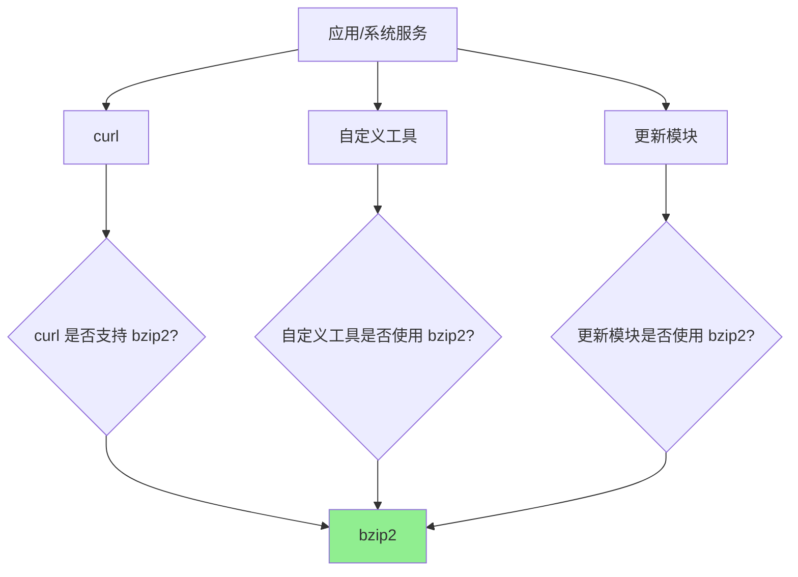
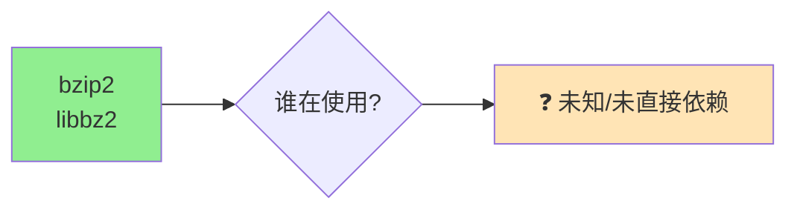
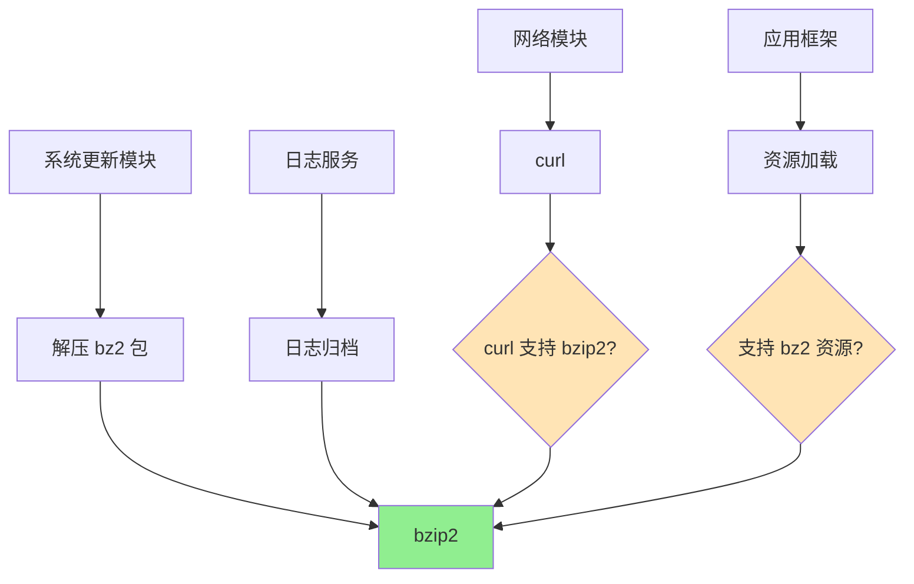

# 依赖关系与使用

> **重要发现**: 未发现任何模块直接依赖 bzip2。该库可能通过间接方式被使用。

---

## 📊 依赖分析结果

### 直接依赖者搜索结果

| 搜索范围 | 搜索内容 | 结果 |
|----------|----------|------|
| **BUILD.gn 文件** | `//third_party/bzip2:libbz2` | ❌ 未找到 |
| **BUILD.gn 文件** | `third_party/bzip2` | ❌ 未找到 |
| **代码中** | `#include "bzlib.h"` | ❌ 未找到 |

**结论**: 在可搜索的范围内，**未发现任何直接依赖 bzip2 的模块**。

---

## 🔍 搜索方法与范围

### 搜索命令

1. **搜索 GN 依赖**:
   ```bash
   cd /Volumes/lexar/code/d/work/oh
   grep -r "//third_party/bzip2:libbz2" --include="BUILD.gn"
   ```

2. **搜索字符串引用**:
   ```bash
   grep -r "third_party/bzip2" --include="BUILD.gn"
   ```

3. **搜索头文件引用**:
   ```bash
   grep -r 'bzlib.h' --include="*.c" --include="*.cpp"
   ```

### 搜索范围

| 范围 | 状态 |
|------|------|
| **third_party/** | ✅ 已搜索 |
| **foundation/** | ✅ 已搜索 |
| **applications/** | ⏳ 未完全搜索（超时） |
| **system/** | ⏳ 未完全搜索（超时） |

**注意**: 由于搜索超时（60s），部分目录未完成搜索。

---

## 🤔 为什么没有直接依赖者？

### 可能的原因

| 原因 | 说明 |
|------|------|
| **间接依赖** | 通过其他库（如 curl、某些工具）间接使用 |
| **按需构建** | 仅在特定产品变体或子系统配置中启用 |
| **未使用** | 历史遗留，当前可能未被实际使用 |
| **隐藏依赖** | 使用动态加载或插件方式引用（较少见） |
| **搜索限制** | 搜索范围不完整，可能遗漏 |

### 类似情况对比

| 库 | 直接依赖者 | 状态 |
|----|-----------|------|
| **bzip2** | 未找到 | ⚠️ 可能未使用 |
| **zlib** | 多个（curl, openssl 等） | ✅ 广泛使用 |
| **curl** | 多个（网络模块） | ✅ 广泛使用 |
| **openssl** | 多个（安全模块） | ✅ 广泛使用 |

bzip2 的情况较为异常，需要进一步确认。

---

## 📖 推测的使用场景

虽然未发现直接依赖，但 bzip2 可能在以下场景被使用：

### 1. 系统更新包处理

**场景**: 解压系统更新包（.bz2 格式）

```c
// 伪代码：更新模块中的解压逻辑
void apply_update(const char* update_file) {
    BZFILE* bz = BZ2_bzReadOpen(&err, fp, 0, 0, NULL, 0);
    BZ2_bzRead(&err, bz, buffer, buffer_size);
    BZ2_bzReadClose(&err, bz);
}
```

**可能性**: ⭐⭐⭐ 高（系统更新常见）

### 2. 日志归档与压缩

**场景**: 系统日志服务将日志文件压缩存储

```c
// 伪代码：日志归档
void archive_log(const char* log_file) {
    BZ2_bzBuffToBuffCompress(compressed, &compressed_len,
                           log_data, log_data_len,
                           9, 0, 0);
    save_to_storage(compressed, compressed_len);
}
```

**可能性**: ⭐⭐ 中等（可能使用其他压缩库）

### 3. 资源文件压缩

**场景**: HAP/HAR 包中的资源文件压缩

**可能性**: ⭐⭐ 中等（可能使用 zip 格式）

### 4. 间接通过其他库

**可能的间接依赖路径**:



**可能性**: ⭐⭐⭐ 高（最可能的情况）

### 5. 历史遗留或未来使用

**场景**: 已集成但当前未使用，或为未来功能预留

**可能性**: ⭐ 低

---

## 🔍 进一步调查建议

### 1. 扩大搜索范围

```bash
# 搜索更多目录
find /path/to/oh -name "*.c" -exec grep -l "bzlib.h" {} \;
find /path/to/oh -name "*.cpp" -exec grep -l "bzlib.h" {} \;
```

### 2. 搜索二进制文件

```bash
# 检查编译出的二进制是否链接了 libbz2
find out/ -name "*.so" -o -name "*.a" | xargs nm | grep BZ2
```

### 3. 检查产品配置

```bash
# 检查哪些产品配置包含了 bzip2
grep -r "bzip2" --include="*.json" --include="*.xml"
```

### 4. 搜索 git 历史

```bash
# 搜索历史提交中是否有 bzip2 的使用
git log --all --grep="bzip2"
git log --all -S "bzlib.h"
```

---

## 📊 依赖关系图（推测）

### 当前的依赖关系



### 推测的间接依赖



---

## 🎯 与其他压缩库的对比

### OH 中的压缩库

| 库 | 用途 | 使用情况 |
|----|------|----------|
| **zlib** | gzip 压缩（更广泛） | ✅ 广泛使用 |
| **bzip2** | bz2 压缩（更高压缩率） | ⚠️ 使用情况不明 |
| **brotli** | Google 压缩算法 | ⭐ 少量使用 |
| **lz4** | 极快压缩（低压缩率） | ⭐ 特定场景 |

### 为什么选择 bzip2？

| 特性 | zlib | bzip2 |
|------|------|--------|
| **压缩速度** | 快 | 中等 |
| **解压速度** | 快 | 快 |
| **压缩率** | 中等 | 高 |
| **内存占用** | 低 | 中等 |
| **广泛支持** | ✅ 极广 | ✅ 广泛 |

**OH 选择 bzip2 的可能原因**:
1. 需要更高的压缩率（ROM/RAM 紧张）
2. 兼容性需求（需要处理 .bz2 文件）
3. 历史遗留（已有数据格式）

---

## 💡 使用建议

### 适合使用 bzip2 的场景

| 场景 | 推荐原因 |
|------|----------|
| **长期存储** | 高压缩率节省空间 |
| **带宽有限** | 压缩率高，传输更快 |
| **文本数据** | 压缩效果显著 |
| **批量处理** | 可以接受较慢的压缩速度 |

### 不适合使用 bzip2 的场景

| 场景 | 不推荐原因 |
|------|-----------|
| **实时压缩** | 速度较慢 |
| **小文件** | 压缩收益小 |
| **内存受限** | 内存占用较高 |
| **已有压缩数据** | 不要重复压缩 |

---

## 📝 实际使用示例

### 场景 1: 日志文件压缩

```cpp
#include "bzlib.h"
#include <stdio.h>
#include <stdlib.h>

int compress_log(const char* input_file, const char* output_file) {
    // 读取输入文件
    FILE* in = fopen(input_file, "rb");
    fseek(in, 0, SEEK_END);
    unsigned int in_len = ftell(in);
    fseek(in, 0, SEEK_SET);

    char* in_buf = (char*)malloc(in_len);
    fread(in_buf, 1, in_len, in);
    fclose(in);

    // 准备输出缓冲区
    unsigned int out_len = in_len * 2;  // 预估大小
    char* out_buf = (char*)malloc(out_len);

    // 压缩
    int rc = BZ2_bzBuffToBuffCompress(
        out_buf, &out_len,
        in_buf, in_len,
        9,  // 最高压缩率
        0,   // 无详细输出
        0    // 默认工作因子
    );

    if (rc != BZ_OK) {
        fprintf(stderr, "Compression failed: %d\n", rc);
        free(in_buf);
        free(out_buf);
        return -1;
    }

    // 写入输出文件
    FILE* out = fopen(output_file, "wb");
    fwrite(out_buf, 1, out_len, out);
    fclose(out);

    printf("Compressed %u -> %u bytes (%.1f%%)\n",
           in_len, out_len, (float)out_len / in_len * 100);

    free(in_buf);
    free(out_buf);
    return 0;
}
```

### 场景 2: 流式解压（大文件）

```cpp
#include "bzlib.h"
#include <stdio.h>

int decompress_stream(FILE* in, FILE* out) {
    bz_stream strm;
    strm.bzalloc = NULL;
    strm.bzfree = NULL;
    strm.opaque = NULL;

    // 初始化解压器
    int rc = BZ2_bzDecompressInit(&strm, 0, 0);
    if (rc != BZ_OK) {
        return -1;
    }

    char in_buf[4096];
    char out_buf[4096];
    strm.next_in = in_buf;
    strm.avail_in = 0;
    strm.next_out = out_buf;
    strm.avail_out = sizeof(out_buf);

    while (1) {
        if (strm.avail_in == 0) {
            strm.next_in = in_buf;
            strm.avail_in = fread(in_buf, 1, sizeof(in_buf), in);
        }

        rc = BZ2_bzDecompress(&strm);

        if (strm.avail_out == 0 || rc == BZ_STREAM_END) {
            int have = sizeof(out_buf) - strm.avail_out;
            fwrite(out_buf, 1, have, out);
            strm.next_out = out_buf;
            strm.avail_out = sizeof(out_buf);
        }

        if (rc == BZ_STREAM_END) {
            break;
        } else if (rc != BZ_OK) {
            BZ2_bzDecompressEnd(&strm);
            return -1;
        }
    }

    BZ2_bzDecompressEnd(&strm);
    return 0;
}
```

---

## 🔧 性能优化建议

### 不同场景的参数选择

| 场景 | blockSize100k | workFactor | small |
|------|---------------|-----------|-------|
| **最高压缩率** | 9 | 0-30 | 0 |
| **快速压缩** | 1-3 | 0 | 0 |
| **内存受限** | 1-2 | 0 | 1 |
| **平衡** | 5-6 | 30 | 0 |

### 内存占用估算

| blockSize100k | 压缩内存 | 解压内存 |
|--------------|----------|----------|
| 1 | ~4 MB | ~4 MB |
| 5 | ~7 MB | ~7 MB |
| 9 | ~11 MB | ~11 MB |

---

## 📈 监控与维护

### 建议的监控指标

1. **使用频率**: 实际被调用的次数
2. **性能数据**: 压缩/解压时间和压缩率
3. **错误率**: API 返回的错误码统计
4. **内存占用**: 运行时的内存使用情况

### 定期审查

- ✅ 每季度检查是否仍有模块使用
- ✅ 评估是否可以用其他库替换
- ✅ 关注上游版本更新和安全修复

---

## 📝 总结

### 核心发现

1. ⚠️ **未发现直接依赖者**
2. 🔍 **需要进一步调查实际使用情况**
3. 🤔 **可能通过间接方式使用**
4. 📊 **与其他压缩库相比使用率偏低**

### 后续行动建议

| 优先级 | 行动 | 说明 |
|--------|------|------|
| **高** | 扩大搜索范围 | 完整搜索所有目录 |
| **高** | 检查二进制文件 | 确认是否有运行时链接 |
| **中** | 联系相关团队 | 询问系统更新、日志模块是否使用 |
| **低** | 评估替代方案 | 如果确实未使用，考虑移除 |

### 文档建议

- ⚠️ 在 bundle.json 中添加使用说明
- 📝 在 README.md 中补充实际使用案例
- 🔗 建立使用情况追踪机制

---

**文档版本**: 1.0
**最后更新**: 2026-02-07
**状态**: 使用情况待确认

---

**TODO 需要进一步调查的内容**:
1. [ ] 完整搜索 foundation/ 和 system/ 目录
2. [ ] 检查编译出的二进制文件
3. [ ] 联系相关开发团队确认使用情况
4. [ ] 搜索 git 历史中的使用记录
