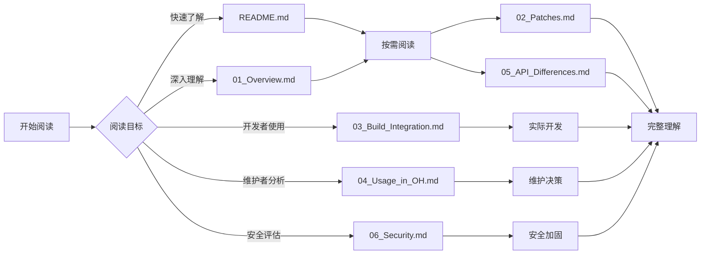

# 文档阅读路线建议

本文档提供 bzip2 OpenHarmony 集成文档的阅读指南，帮助不同需求的读者快速找到所需信息。

---

## 📊 阅读路线图

---

## 🎯 按角色阅读

### 开发者（首次使用 bzip2）

**阅读顺序**: `README.md` → `01_Overview.md` → `03_Build_Integration.md` → **开始开发**

**重点关注**:
- bzip2 能做什么
- 如何在 OH 中引用 bzip2
- API 使用示例

**预计耗时**: 15-20 分钟

---

### 维护者（评估 bzip2 在 OH 中的状态）

**阅读顺序**: `README.md` → `ASSESSMENT.md` → `04_Usage_in_OH.md` → `03_Build_Integration.md`

**重点关注**:
- OH 修改情况（几乎为零）
- 依赖关系（当前未发现直接依赖）
- 升级难度（极低）
- 维护建议

**预计耗时**: 30-40 分钟

---

### 安全审计员（评估安全风险）

**阅读顺序**: `06_Security.md` → `ASSESSMENT.md` → `01_Overview.md`

**重点关注**:
- 已修复的 CVE 列表
- OH 特定安全风险（无）
- 潜在安全风险
- 安全加固建议

**预计耗时**: 20-30 分钟

---

### 文档编写者（了解 bzip2 的 OH 集成模式）

**阅读顺序**: `ASSESSMENT.md` → `02_Patches.md` → `03_Build_Integration.md`

**重点关注**:
- 零修改集成的模式
- 构建系统适配方法
- 依赖分析方法

**预计耗时**: 40-50 分钟

---

## 📖 按主题阅读

### 主题 1: bzip2 基础知识

**必读**:
- [README.md](./README.md) - 快速概览
- [01_Overview.md](./01_Overview.md) - 原始库详细介绍

**可选**:
- 上游文档: https://sourceware.org/bzip2/manual.html

---

### 主题 2: OH 构建集成

**必读**:
- [03_Build_Integration.md](./03_Build_Integration.md) - BUILD.gn 详细说明

**相关**:
- `BUILD.gn` 源码
- `bundle.json` 配置

---

### 主题 3: OH 修改与适配

**必读**:
- [02_Patches.md](./02_Patches.md) - Patch 分析（说明无 Patch）
- [05_API_Differences.md](./05_API_Differences.md) - API 差异（说明无差异）

**相关**:
- [ASSESSMENT.md](./_work/ASSESSMENT.md) - 完整评估

---

### 主题 4: OH 使用情况

**必读**:
- [04_Usage_in_OH.md](./04_Usage_in_OH.md) - 依赖关系分析

**相关**:
- [ASSESSMENT.md](./_work/ASSESSMENT.md) - 使用情况推测

---

### 主题 5: 安全与合规

**必读**:
- [06_Security.md](./06_Security.md) - 安全风险分析

**相关**:
- [ASSESSMENT.md](./_work/ASSESSMENT.md) - CVE 列表

---

## 📝 文档完整度矩阵

| 文档 | 完成度 | 内容完整度 | 更新日期 |
|------|--------|-----------|----------|
| README.md | ✅ | 100% | 2026-02-07 |
| SUMMARY.md | ✅ | 100% | 2026-02-07 |
| 01_Overview.md | ⏳ | 待创建 | - |
| 02_Patches.md | ⏳ | 待创建 | - |
| 03_Build_Integration.md | ⏳ | 待创建 | - |
| 04_Usage_in_OH.md | ⏳ | 待创建 | - |
| 05_API_Differences.md | ⏳ | 待创建 | - |
| 06_Security.md | ⏳ | 待创建 | - |
| ASSESSMENT.md | ✅ | 100% | 2026-02-07 |

---

## 🔍 快速查找

### 我想了解...

| 问题 | 查看文档 |
|------|----------|
| bzip2 是什么？ | [01_Overview.md](./01_Overview.md) |
| OH 对 bzip2 做了什么修改？ | [02_Patches.md](./02_Patches.md) |
| 如何在 OH 项目中使用 bzip2？ | [03_Build_Integration.md](./03_Build_Integration.md) |
| OH 中哪些模块使用了 bzip2？ | [04_Usage_in_OH.md](./04_Usage_in_OH.md) |
| bzip2 的 API 有什么变化？ | [05_API_Differences.md](./05_API_Differences.md) |
| bzip2 有哪些安全风险？ | [06_Security.md](./06_Security.md) |
| 升级 bzip2 上游版本需要注意什么？ | [ASSESSMENT.md](./_work/ASSESSMENT.md) |

---

## 💡 阅读提示

### bzip2 的特殊性

bzip2 是 OpenHarmony 中**集成最简单**的第三方库之一：
- ✅ 无任何源码修改
- ✅ 无任何 Patch
- ✅ 无任何 OH 特定 API

因此：
- 如果你想了解 OH 如何**简单**集成第三方库 → 完整阅读
- 如果你想了解复杂的 OH 适配案例 → 可能需要查看其他库（如 curl、openssl）

### 关键发现

**ASSESSMENT.md** 中最重要的发现：
1. bzip2 在 OH 中几乎没有修改
2. 未发现直接依赖者（TODO: 需要进一步确认）
3. bundle.json 中有错误：`bzlib_private.h` 不应作为公共头文件

---

## 📞 反馈与贡献

如果你发现文档中的错误或有改进建议，请：
- 提交 Issue 到 OpenHarmony 仓库
- 参考其他第三方库的 Wiki 文档结构
- 保持文档与代码同步更新

---

**文档版本**: 1.0
**最后更新**: 2026-02-07
