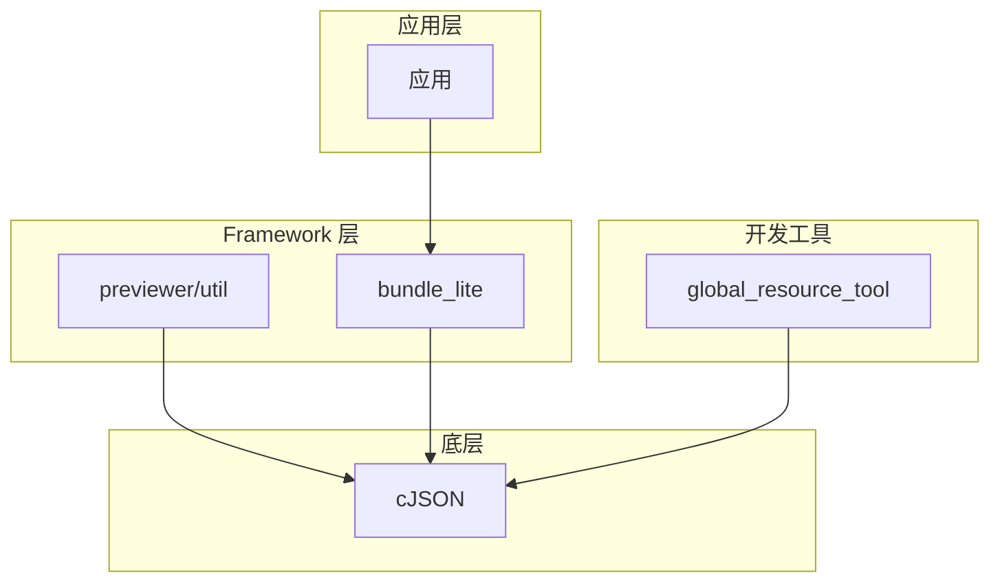
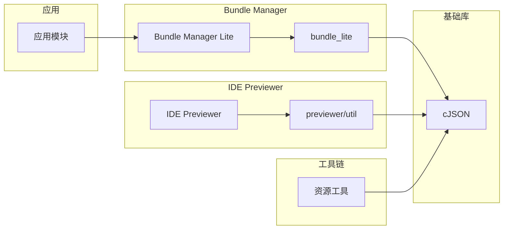

# 依赖关系与使用

## 概述

cJSON 库在 OpenHarmony 中被多个模块依赖，主要用于 JSON 数据的解析和生成。本文档详细说明 cJSON 在 OH 系统中的使用方式。

## 直接依赖者

### 依赖模块列表

| 模块 | BUILD.gn 路径 | 用途 | 链接方式 |
|-----|--------------|------|---------|
| **bundle_lite** | `foundation/bundlemanager/bundle_framework_lite/frameworks/bundle_lite/BUILD.gn` | Bundle 配置解析 | 静态/动态 |
| **global_resource_tool** | `developtools/global_resource_tool/BUILD.gn` | 资源配置工具 | 静态 |
| **previewer/util** | `ide/tools/previewer/util/BUILD.gn` | 预览器工具 | 静态/动态 |

### 主要依赖场景

#### 1. bundle_lite 模块

**用途**：应用 Bundle 配置文件的解析

**典型使用**：

```c
#include <cjson/cJSON.h>

// 解析应用的配置文件
cJSON *ParseBundleConfig(const char *json_string) {
    return cJSON_Parse(json_string);
}

// 获取配置项
const char *GetBundleVersion(cJSON *bundle) {
    cJSON *version = cJSON_GetObjectItem(bundle, "version");
    if (cJSON_IsString(version)) {
        return version->valuestring;
    }
    return NULL;
}
```

**功能**：
- 解析应用的 `config.json` 配置文件
- 解析模块信息配置
- 处理权限声明

#### 2. global_resource_tool

**用途**：全球化资源配置工具

**典型使用**：

```c
#include <cjson/cJSON.h>

// 生成资源配置
char *GenerateResourceConfig(const char *resource_path) {
    cJSON *root = cJSON_CreateObject();
    cJSON_AddStringToObject(root, "path", resource_path);
    cJSON_AddStringToObject(root, "type", "globalization");
    return cJSON_PrintUnformatted(root);
}
```

**功能**：
- 解析资源描述文件
- 生成资源配置 JSON
- 处理多语言资源映射

#### 3. previewer/util

**用途**：IDE 预览器工具模块

**典型使用**：

```c
#include <cjson/cJSON.h>

// 预览器数据交换
char *SerializePreviewData(cJSON *preview_info) {
    return cJSON_Print(preview_info);
}

cJSON *DeserializePreviewData(const char *json_data) {
    return cJSON_ParseWithOpts(json_data, NULL, true);
}
```

**功能**：
- 序列化预览数据
- 反序列化用户输入
- 配置数据交换

## 依赖关系图



### 详细依赖图



## 使用方式详解

### 头文件引用

```c
// 标准引用方式
#include <cjson/cJSON.h>

// 或者相对路径（不推荐）
#include "../../third_party/cJSON/cJSON.h"
```

### 内存管理

cJSON 支持自定义内存分配函数：

```c
#include <cjson/cJSON.h>

// 自定义内存钩子
static void *custom_malloc(size_t size) {
    return my_allocator(size);
}

static void custom_free(void *ptr) {
    my_deallocator(ptr);
}

// 初始化钩子
void InitCjsonHooks(void) {
    cJSON_Hooks hooks = {
        .malloc_fn = custom_malloc,
        .free_fn = custom_free
    };
    cJSON_InitHooks(&hooks);
}
```

### 典型使用模式

#### 模式 1：解析配置文件

```c
#include <cjson/cJSON.h>

int LoadConfig(const char *filename, cJSON **config_out) {
    FILE *fp = fopen(filename, "r");
    if (!fp) return -1;

    // 读取文件内容
    fseek(fp, 0, SEEK_END);
    long size = ftell(fp);
    fseek(fp, 0, SEEK_SET);

    char *buffer = malloc(size + 1);
    fread(buffer, 1, size, fp);
    buffer[size] = '\0';
    fclose(fp);

    // 解析 JSON
    *config_out = cJSON_Parse(buffer);
    free(buffer);

    return *config_out ? 0 : -1;
}

void FreeConfig(cJSON *config) {
    cJSON_Delete(config);
}
```

#### 模式 2：生成配置

```c
#include <cjson/cJSON.h>

char *CreateConfigJson(const char *name, int version) {
    cJSON *root = cJSON_CreateObject();
    if (!root) return NULL;

    cJSON_AddStringToObject(root, "name", name);
    cJSON_AddNumberToObject(root, "version", version);
    cJSON_AddBoolToObject(root, "enabled", true);

    char *json = cJSON_Print(root);
    cJSON_Delete(root);

    return json;
}
```

#### 模式 3：遍历数据

```c
#include <cjson/cJSON.h>

void PrintAllItems(cJSON *array) {
    cJSON *item = NULL;
    cJSON_ArrayForEach(item, array) {
        if (cJSON_IsString(item)) {
            printf("Item: %s\n", item->valuestring);
        } else if (cJSON_IsNumber(item)) {
            printf("Number: %.2f\n", item->valuedouble);
        }
    }
}

void PrintObjectMembers(cJSON *object) {
    cJSON *member = NULL;
    cJSON_ArrayForEach(member, object) {
        printf("%s: ", member->string);
        if (cJSON_IsString(member)) {
            printf("%s\n", member->valuestring);
        } else if (cJSON_IsNumber(member)) {
            printf("%.2f\n", member->valuedouble);
        }
    }
}
```

## 链接方式

### 静态链接

```gn
# BUILD.gn
deps = [ "//third_party/cJSON:cjson_static" ]
```

**优点**：
- 减少运行时依赖
- 更快的加载速度
- 适合资源受限设备

**适用场景**：
- 轻量级应用
- 系统核心组件
- 不需要动态更新的模块

### 动态链接

```gn
# BUILD.gn
deps = [ "//third_party/cJSON:cjson" ]
```

**优点**：
- 减少最终二进制大小
- 可独立更新库
- 节省内存（共享库）

**适用场景**：
- 多模块共享使用
- 需要库独立升级
- 系统分区管理

## 依赖关系统计

### 按子系统统计

| 子系统 | 依赖模块数 |
|-------|----------|
| foundation | 1 |
| developtools | 1 |
| ide/tools | 1 |

### 按链接方式统计

| 链接方式 | 模块数 |
|---------|-------|
| 静态链接 | 3 |
| 动态链接 | 2 |

## 性能考虑

### 内存使用

cJSON 设计的内存占用极小：

| 指标 | 值 |
|-----|---|
| 单个 cJSON 结构体 | 32 字节 |
| 最小解析内存 | ~1KB |
| 推荐栈大小 | ~4KB |

### 性能特点

- **解析速度**：极快（单文件，无依赖）
- **生成速度**：快速（简单字符串拼接）
- **内存效率**：高（按需分配）

## 常见问题

### Q1: 何时使用静态链接，何时使用动态链接？

**回答**：
- **静态链接**：系统核心模块、单个模块使用
- **动态链接**：多个模块共享、不需要频繁更新

### Q2: 如何处理 cJSON 的内存泄漏？

**回答**：
- 每个 `cJSON_Parse()` 必须对应 `cJSON_Delete()`
- 每个 `cJSON_Print()` 返回的字符串需要 `free()`
- 使用 `cJSON_AddItemToArray/Object` 后不要单独删除子项

### Q3: cJSON 是否线程安全？

**回答**：
- 单一 cJSON 树的操作是线程安全的
- `cJSON_GetErrorPtr()` 在多线程中有竞争条件
- 建议使用 `cJSON_ParseWithOpts()` 的 `return_parse_end` 参数

## 最佳实践

1. **始终检查返回值**：所有返回 cJSON 的函数都可能返回 NULL
2. **及时释放内存**：避免长时间持有未释放的 cJSON 树
3. **使用类型检查函数**：使用 `cJSON_IsString()` 等函数检查类型
4. **配置嵌套限制**：根据设备资源情况配置合适的嵌套深度

## 相关文档

- [01_Overview.md](01_Overview.md)：cJSON 原始功能介绍
- [03_Build_Integration.md](03_Build_Integration.md)：构建适配详解
- [05_API_Differences.md](05_API_Differences.md)：API 差异分析
