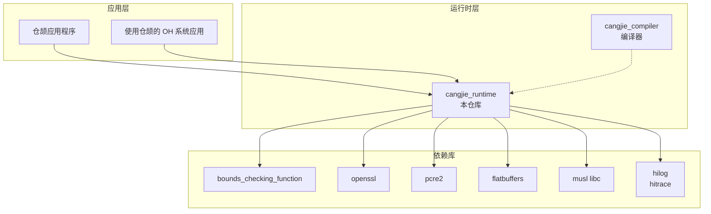
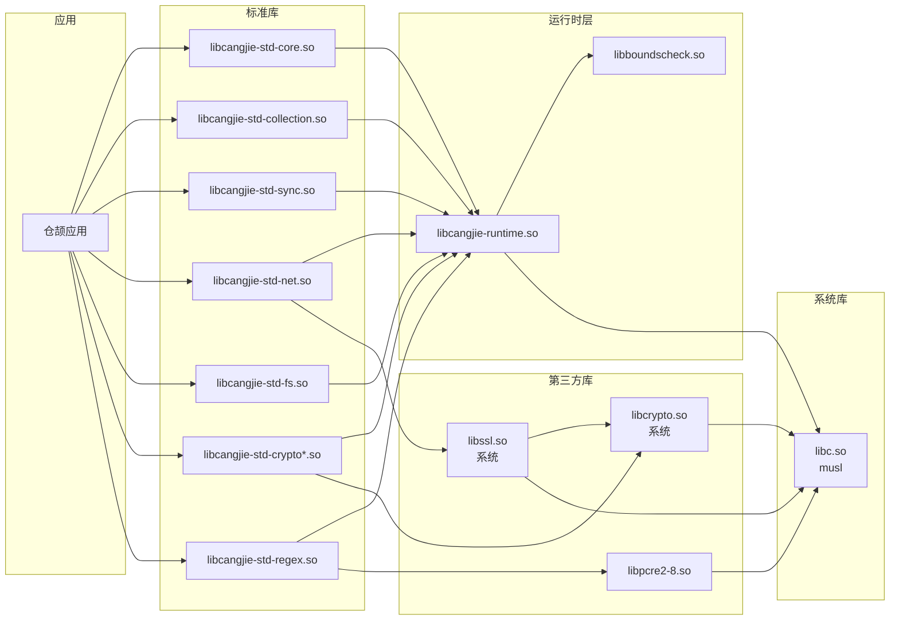

# 04 - 依赖关系与使用

## 4.1 组件依赖图

### 整体架构



## 4.2 bundle.json 依赖声明

**文件位置**: `//third_party/cangjie_runtime/bundle.json`

```json
{
  "name": "@ohos/cangjie_runtime",
  "description": "仓颉编程语言运行时和标准库",
  "version": "6.1",
  "license": "Apache-2.0 with Runtime Library Exceptions",
  "component": {
    "name": "cangjie_runtime",
    "subsystem": "thirdparty",
    "syscap": [ "SystemCapability.Utils.Cangjie" ],
    "adapted_system_type": [ "standard" ],
    "rom": "25MB",
    "ram": "20MB",
    "deps": {
      "components": [
        "bounds_checking_function",
        "openssl",
        "pcre2",
        "flatbuffers"
      ],
      "third_party": []
    },
    "build": {
      "sub_component": [
        "//third_party/cangjie_runtime:cangjie_prebuilts_package"
      ]
    }
  }
}
```

### 依赖说明

| 依赖组件 | 用途 | 链接方式 |
|---------|------|---------|
| `bounds_checking_function` | 边界检查函数 | 静态链接（编译集成） |
| `openssl` | 加密功能 | 动态链接（系统库） |
| `pcre2` | 正则表达式 | 动态链接（预编译 so） |
| `flatbuffers` | 序列化（ast 模块） | 静态链接（编译集成） |

### 系统能力声明

```
SystemCapability.Utils.Cangjie
```

此声明表示仓颉运行时提供系统能力「Cangjie 工具支持」。

### 资源占用

| 资源类型 | 大小 |
|---------|------|
| ROM | 25MB |
| RAM | 20MB |

## 4.3 被依赖情况分析

### 间接依赖模式

cangjie_runtime 作为**底层基础设施**，不直接被应用层依赖，而是通过以下方式使用：

```
应用层
  └── 仓颉编译后的应用/系统服务
       └── 仓颉运行时（本仓库）
            └── 第三方依赖（openssl、pcre2 等）
```

### 典型使用场景

#### 1. 仓颉系统应用

使用仓颉语言开发的 OH 系统应用，例如：
- 系统工具
- 框架服务
- 设备管理

**使用方式**:
- 应用由仓颉源码编译为 Native 二进制
- 运行时自动链接 `libcangjie-runtime.so`
- 标准库功能通过 `libcangjie-std-*.so` 提供

#### 2. 仓颉 ArkTS 互操作

通过 FFI 机制，ArkTS 应用可调用仓颉模块：

```
ArkTS 应用
  └── 仓颉 FFI 模块 (.so)
       └── libcangjie-runtime.so
```

**使用方式**:
- 仓颉模块编译为动态库
- ArkTS 通过 NAPI 加载仓颉模块
- 仓颉模块内部使用运行时和标准库

#### 3. 系统服务

部分底层系统服务可能使用仓颉实现：
- 文件系统服务
- 网络服务
- 加密服务

### 安装路径

预编译库在 OH 系统中的安装位置：

```
/system/lib/platformsdk/cjsdk/              # 标准库
├── libcangjie-std-core.so
├── libcangjie-std-net.so
├── libcangjie-std-fs.so
└── ... (31个)

/system/lib/platformsdk/cjsdk/runtime/      # 运行时核心
├── libcangjie-runtime.so
└── libboundscheck.so

/system/lib/chipset-sdk/                    # 底层工具
└── libcangjie-demangle.so

/system/lib/                                # 第三方依赖
└── libpcre2-8.so
```

## 4.4 链接方式详解

### 标准库链接方式

| 库类型 | 链接方式 | 说明 |
|-------|---------|------|
| cangjie-runtime | 动态链接 | 应用启动时加载 |
| cangjie-std-* | 动态链接 | 按需延迟加载 |
| boundscheck | 动态链接 | GC/安全相关 |
| pcre2 | 动态链接 | 正则表达式 |
| openssl | 动态链接 | 使用系统预装版本 |

### 头文件引用

仓颉应用开发不需要直接引用 C/C++ 头文件，而是通过仓颉的 `import` 语法使用：

```cangjie
// 使用标准库
import std.collection.*
import std.sync.*
import std.net.http.*

// 使用运行时 API（较少直接使用）
import std.runtime.*
```

### 运行时初始化

仓颉应用在启动时自动完成运行时初始化：

```
1. 系统加载器加载应用二进制
2. 动态链接器加载 libcangjie-runtime.so
3. 运行时初始化：
   - 堆管理器初始化
   - GC 线程启动
   - 线程调度器初始化
   - 信号处理注册
4. 执行 main 函数
```

## 4.5 关键使用场景

### 场景 1：网络通信

**涉及模块**: `std.net`

```cangjie
import std.net.http.*

main() {
    let client = Client()
    let response = client.get("https://example.com")
    println(response.text())
}
```

**底层依赖**:
- `libcangjie-std-net.so`
- 系统 OpenSSL（HTTPS）

### 场景 2：文件操作

**涉及模块**: `std.fs`

```cangjie
import std.fs.*

main() {
    let content = File.readToString("/path/to/file.txt")
    println(content)
}
```

**底层依赖**:
- `libcangjie-std-fs.so`
- OHOS Musl libc

### 场景 3：并发编程

**涉及模块**: `std.sync`, `std.collection.concurrent`

```cangjie
import std.sync.*
import std.collection.concurrent.*

main() {
    let queue = ConcurrentQueue<Int>()
    // 多线程操作队列...
}
```

**底层依赖**:
- `libcangjie-std-sync.so`
- `libcangjie-std-collection.concurrent.so`
- CJThread 线程管理

### 场景 4：正则表达式

**涉及模块**: `std.regex`

```cangjie
import std.regex.*

main() {
    let pattern = Regex("\\d+")
    let matches = pattern.matches("abc123def")
}
```

**底层依赖**:
- `libcangjie-std-regex.so`
- `libpcre2-8.so`

### 场景 5：数据加密

**涉及模块**: `std.crypto`

```cangjie
import std.crypto.digest.*

main() {
    let hash = SHA256.hash("hello world".toArray())
    println(hash.toHex())
}
```

**底层依赖**:
- `libcangjie-std-crypto*.so`
- 系统 OpenSSL

## 4.6 依赖关系图（详细）



## 4.7 模块依赖矩阵

| 应用功能 | 标准库模块 | 运行时依赖 | 第三方依赖 |
|---------|-----------|-----------|-----------|
| 基础类型 | std.core | libcangjie-runtime.so | - |
| 集合/数据结构 | std.collection | libcangjie-runtime.so | - |
| 并发编程 | std.sync | libcangjie-runtime.so | - |
| 网络通信 | std.net | libcangjie-runtime.so | libssl.so (系统) |
| 文件操作 | std.fs | libcangjie-runtime.so | libc.so (musl) |
| 正则表达式 | std.regex | libcangjie-runtime.so | libpcre2-8.so |
| 加密/摘要 | std.crypto | libcangjie-runtime.so | libcrypto.so (系统) |
| 时间处理 | std.time | libcangjie-runtime.so | libc.so (musl) |
| 数据库 | std.database | libcangjie-runtime.so | SQLite (系统) |
| 数学计算 | std.math | libcangjie-runtime.so | - |

## 4.8 版本兼容性

### 运行时版本与 OH 版本对应

| cangjie_runtime 版本 | OH 版本 | 状态 |
|---------------------|---------|------|
| 1.1.0-alpha.69 | 6.1 | 当前版本 |

### 兼容性规则

1. **应用与运行时版本**: 
   - 应用编译时依赖特定版本的运行时
   - 运行时升级需重新编译应用

2. **运行时与系统版本**:
   - 运行时依赖 OH 6.1+ 的底层接口
   - 向后兼容性由 OH 系统保证

3. **第三方库版本**:
   - OpenSSL: 使用系统预装版本
   - PCRE2: 捆绑特定版本（0.14.0）

## 4.9 资源占用详情

### 磁盘空间占用

| 组件 | 大小 | 说明 |
|-----|------|------|
| libcangjie-runtime.so | ~5MB | 运行时核心 |
| libboundscheck.so | ~1MB | 边界检查 |
| libcangjie-std-*.so (31个) | ~15MB | 标准库模块（平均每个 ~0.5MB） |
| libpcre2-8.so | ~1MB | 正则表达式 |
| libcangjie-demangle.so | ~0.5MB | 符号反混淆 |
| **总计** | **~25MB** | 符合 bundle.json 声明 |

### 内存占用

| 组件 | 运行时内存 | 说明 |
|-----|-----------|------|
| 运行时核心 | ~5MB | GC、线程管理等 |
| 堆内存 | 应用决定 | 默认最大堆大小在 OH 上受限 |
| 标准库 | 按需加载 | 延迟加载，不占用则不加 |
| **基础总计** | **~20MB** | 符合 bundle.json 声明 |

## 4.10 使用限制

### 平台限制

| 平台 | 支持状态 | 说明 |
|-----|---------|------|
| ARM64 (aarch64) | ✅ 完全支持 | 主要目标平台 |
| x86_64 | ✅ 支持 | 模拟器/开发用途 |
| ARM32 (arm) | ⏳ 计划中 | 预计 2025 Q4 支持 |
| RISC-V | ❌ 不支持 | 无支持计划 |

### 功能限制

详见 [05_API_Differences.md](./05_API_Differences.md)，主要包括：

- 部分并行流 API 不支持
- WorkerThread 相关 API 不支持
- 部分底层同步原语不支持

---

*本文档基于 cangjie_runtime 1.1.0-alpha.69 版本编写*
