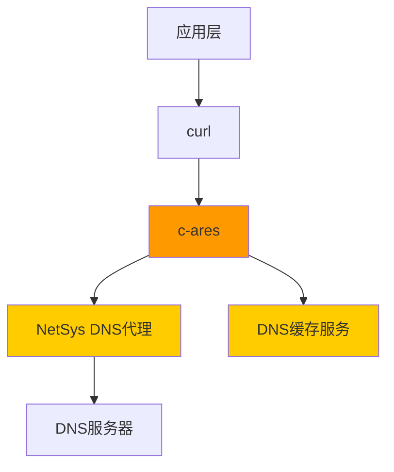

# 原始库简介

**概述**: c-ares 原始库的基础信息、功能特性和在 OpenHarmony 中的定位。

---

## 基本信息

| 属性 | 值 |
|-----|-----|
| **库名称** | c-ares |
| **全称** | C Asynchronous Resolver Library |
| **上游版本** | 1.34.5 (OH 当前版本) |
| **上游最新版本** | 1.34.6 (2025-12-08 发布) |
| **许可证** | MIT License |
| **编程语言** | C (C89 兼容) |
| **上游地址** | https://github.com/c-ares/c-ares |
| **官方网站** | https://c-ares.org/ |
| **维护状态** | 活跃维护（20+ 年历史） |

---

## 核心功能

### 1. 异步 DNS 解析

c-ares 的核心功能是提供**非阻塞的域名解析**，适用于需要高性能网络操作的应用：

```c
// 标准异步查询接口
typedef void (*ares_callback)(void *arg, int status,
                                 int timeouts,
                                 unsigned char *abuf, int alen);

void ares_query(ares_channel_t *channel,
               const char *name,
               int dnsclass,
               int type,
               ares_callback callback,
               void *arg);
```

**优势**：
- ✅ 不阻塞主线程
- ✅ 支持多个并发查询
- ✅ 事件驱动架构

### 2. 现代 DNS 协议支持

c-ares 实现了完整的 DNS 协议栈：

| 协议/RFC | 支持状态 | OH 适配状态 |
|----------|---------|-----------|
| RFC 1035（基础 DNS） | ✅ 完全支持 | ✅ 完全支持 |
| RFC 3596（IPv6/AAAA） | ✅ 完全支持 | ✅ 完全支持 |
| RFC 2782（SRV 记录） | ✅ 完全支持 | ✅ 完全支持 |
| RFC 6698（DANE/TLSA） | ✅ 完全支持 | ✅ 完全支持 |
| RFC 9460（SVCB/HTTPS） | ✅ 完全支持 | ✅ 完全支持 |
| RFC 7873/9018（DNS Cookies） | ✅ 完全支持 | ✅ 完全支持 |
| DNS 0x20 随机化 | ✅ 完全支持 | ✅ 完全支持 |

### 3. 平台抽象

c-ares 在设计上高度可移植，支持多种平台和事件系统：

| 平台 | 事件系统 | 配置源 |
|-----|---------|--------|
| **Linux** | epoll | `/etc/resolv.conf` |
| **FreeBSD/macOS** | kqueue | `/etc/resolv.conf` |
| **Windows** | Win32 | 注册表 |
| **OpenHarmony** | epoll/select | NetSys 服务 |

### 4. 安全特性

- ✅ **安全解析器**: 实现安全的数据解析器，避免常见 C 库的安全陷阱
- ✅ **输入验证**: 严格的 DNS 响应验证
- ✅ **持续 Fuzzing**: 通过 OSS Fuzz 持续测试
- ✅ **DNS Cookies**: 支持 RFC 7873/9018 防止 DNS 投毒
- ✅ **随机化查询 ID**: 防止缓存投毒攻击

### 5. 性能优化

- ✅ **查询缓存**: 内部缓存减少重复查询
- ✅ **失败服务器隔离**: 自动隔离失败服务器
- ✅ **动态超时**: 基于延迟历史的自适应超时
- ✅ **TCP Fast Open**: 支持 0-RTT 连接恢复

---

## 主要 API 类别

### 1. 通道管理 API

```c
// 初始化/清理
int ares_init(ares_channel_t **channelptr);
void ares_destroy(ares_channel_t *channel);
void ares_cleanup(ares_channel_t *channel);

// 选项配置
int ares_init_options(ares_channel_t **channelptr,
                        struct ares_options *options,
                        int optmask);
```

### 2. DNS 查询 API

```c
// 主查询函数
void ares_query(ares_channel_t *channel,
               const char *name,
               int dnsclass,
               int type,
               ares_callback callback,
               void *arg);

// getaddrinfo 接口（推荐）
void ares_getaddrinfo(ares_channel_t *channel,
                     const char *name,
                     const char *service,
                     const struct ares_addrinfo_hints *hints,
                     ares_addrinfo_callback callback,
                     void *arg);
```

### 3. 传统 API（兼容性）

```c
// hostent 接口（gethostbyname 风格）
void ares_gethostbyname(ares_channel_t *channel,
                        const char *name,
                        ares_host_callback callback,
                        void *arg);

void ares_gethostbyaddr(ares_channel_t *channel,
                        const void *addr,
                        int addrlen,
                        int family,
                        ares_host_callback callback,
                        void *arg);
```

### 4. 配置管理 API

```c
// 设置服务器
int ares_set_servers(ares_channel_t *channel,
                      const struct ares_addr_node *servers,
                      ares_bool_t rotate);

// 设置超时/重试
void ares_set_timeout(ares_channel_t *channel, int timeout);
void ares_set_trying_timeout(ares_channel_t *channel, int timeout);
void ares_set_maxtries(ares_channel_t *channel, int tries);
```

---

## OpenHarmony 中的定位

### 系统角色

在 OpenHarmony 网络栈中，c-ares 承担以下角色：



### 核心职责

| 职责 | 说明 | OH 扩展 |
|-----|------|---------|
| **域名解析** | 将域名解析为 IP 地址 | ✅ NetSys 集成 |
| **多网络管理** | 支持多个网络环境的 DNS | ✅ netId 支持 |
| **缓存协调** | 协调系统级缓存 | ✅ 缓存 API 集成 |
| **性能监控** | 提供查询指标 | ✅ 遥测集成 |

### 使用场景

| 场景 | c-ares 作用 | OH 特性使用 |
|-----|----------|------------|
| **HTTP/HTTPS 请求** | 解析目标服务器域名 | netId 绑定 |
| **媒体播放** | 解析流媒体服务器 URL | DNS 缓存利用 |
| **代理服务器** | 解析代理服务器域名 | 多网络支持 |
| **网络切换** | 动态更新 DNS 配置 | NetSys 配置同步 |

---

## 上游版本 vs OH 版本

### 版本对照

| 版本 | 上游 | OH | 状态 |
|-----|------|-----|------|
| **当前使用** | 1.34.5 | 1.34.5 | ✅ 同步 |
| **最新版本** | 1.34.6 | 1.34.5 | ⚠️ 滞后 1 个补丁 |

### 差异说明

OH 版本（1.34.5）相对于最新上游（1.34.6）：

**未包含的修复**：
- CVE-2025-62408: `read_answers()` 中使用后释放

**影响评估**：
- **严重程度**: 中等
- **利用难度**: 需要 DNS 服务器配合
- **OH 特定风险**: OH 使用 NetSys 代理，可能降低直接暴露风险

**升级建议**: 建议在下次 OpenHarmony 版本更新时合并此修复。

---

## 主要使用者

### 上游知名用户

| 项目 | 使用方式 | 模块 |
|-----|---------|------|
| **libcurl** | HTTP 客户端库 | 主要 DNS 解析器 |
| **Node.js** | JavaScript 运行时 | 域名解析 |
| **Wireshark** | 网络分析工具 | DNS 流量解析 |
| **aria2** | 下载工具 | 多线程域名解析 |
| **Apache Arrow** | 数据分析框架 | 网络通信 |

### OpenHarmony 中的使用

c-ares 在 OpenHarmony 中主要通过以下方式使用：

1. **直接使用**: 少量系统组件直接调用 c-ares API
2. **通过 curl**: 大部分网络请求通过 curl 间接使用
3. **间接使用**: 通过依赖 curl 的上层应用

详见 [04_Usage_in_OH.md](04_Usage_in_OH.md)。

---

## 性能特征

### 延迟性能

| 查询类型 | 典型延迟 | 说明 |
|---------|---------|------|
| **缓存命中** | < 1ms | 内存/系统缓存 |
| **本地网络** | 10-50ms | LAN 环境查询 |
| **互联网查询** | 50-200ms | 典型互联网 DNS |
| **超时重试** | 2-3x | OH 默认 2 次重试 |

### 吞吐量

| 场景 | 查询/秒 | 并发数 |
|-----|----------|--------|
| **单线程顺序** | 10-50 | 1 |
| **单线程并行** | 100-500 | 10-50 |
| **多线程** | 1000-5000 | 10-100 |

---

## 总结

### 核心价值

c-ares 在 OpenHarmony 中的核心价值：

1. **高性能**: 异步非阻塞设计，适合高并发场景
2. **可靠稳定**: 20+ 年成熟代码，持续安全加固
3. **深度集成**: 通过 NetSys 和 DNS 缓存深度集成到 OH 网络栈
4. **灵活可配**: 支持多种配置选项和网络环境

### 技术特点

- ✅ **C89 兼容**: 可在广泛的平台上编译
- ✅ **线程安全**: 支持多线程并发使用
- ✅ **跨平台**: 统一接口，不同平台实现不同
- ✅ **安全优先**: 持续安全加固和 fuzzing
- ✅ **性能优化**: 内部缓存和自适应算法

### 文档建议

- 📖 [02_Patches.md](02_Patches.md): 了解 OH 特定修改
- 📖 [03_Build_Integration.md](03_Build_Integration.md): 了解构建配置
- 📖 [05_API_Differences.md](05_API_Differences.md): 了解 API 扩展

---

**最后更新**: 2026-02-08
