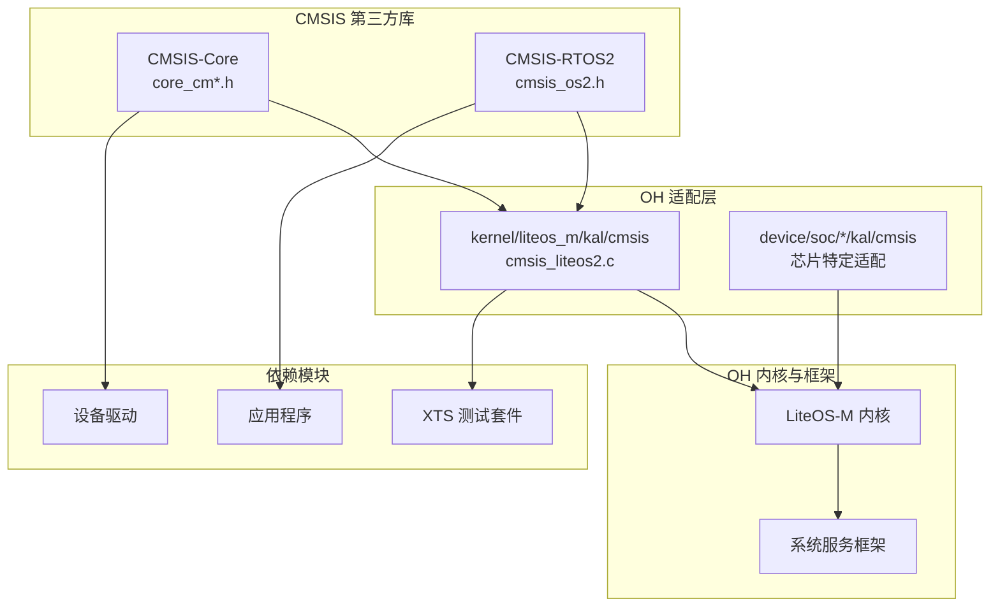

# 01 - CMSIS 原始库简介与 OH 定位

## 1.1 原始库信息

### 基本信息

| 属性 | 内容 |
|------|------|
| **库全称** | CMSIS (Cortex Microcontroller Software Interface Standard) |
| **版本** | 6.0.0 (CMSIS_6) |
| **许可证** | Apache License V2.0 |
| **上游维护者** | ARM-software |
| **上游仓库** | https://github.com/ARM-software/CMSIS_6 |
| **官方文档** | https://arm-software.github.io/CMSIS_6/ |

### 库功能简介

CMSIS 是 ARM 推出的**微控制器软件接口标准**，旨在为基于 Arm Cortex 处理器的微控制器提供：

1. **硬件抽象层 (CMSIS-Core)**
   - 统一的处理器寄存器访问接口
   - 编译器抽象层（支持 GCC、ARMCC、IAR 等）
   - 系统启动和初始化辅助

2. **RTOS 接口标准 (CMSIS-RTOS2)**
   - 标准化的实时操作系统 API
   - 应用代码可移植性
   - 中间件兼容性

### 原始目录结构

```
CMSIS/
├── Core/                           # CMSIS-Core (硬件抽象)
│   ├── Include/                    # 头文件
│   │   ├── core_cm0.h              # Cortex-M0 支持
│   │   ├── core_cm0plus.h          # Cortex-M0+ 支持
│   │   ├── core_cm3.h              # Cortex-M3 支持
│   │   ├── core_cm4.h              # Cortex-M4 支持
│   │   ├── core_cm7.h              # Cortex-M7 支持
│   │   ├── core_cm23.h             # Cortex-M23 支持
│   │   ├── core_cm33.h             # Cortex-M33 支持
│   │   ├── core_cm55.h             # Cortex-M55 支持
│   │   ├── core_cm85.h             # Cortex-M85 支持
│   │   ├── core_ca.h               # Cortex-A 支持
│   │   ├── m-profile/              # M-profile 编译器抽象
│   │   │   ├── cmsis_gcc_m.h       # GCC 编译器支持
│   │   │   ├── cmsis_clang_m.h     # Clang 编译器支持
│   │   │   ├── cmsis_armclang_m.h  # ARM Compiler 支持
│   │   │   ├── armv8m_mpu.h        # ARMv8-M MPU
│   │   │   └── ...
│   │   └── a-profile/              # A-profile 编译器抽象
│   │       ├── cmsis_gcc_a.h
│   │       └── ...
│   └── Template/                   # 启动代码模板
├── RTOS2/                          # CMSIS-RTOS2 (OS API)
│   ├── Include/
│   │   ├── cmsis_os2.h             # RTOS2 API 头文件
│   │   └── os_tick.h               # OS Tick 接口
│   └── Template/                   # 实现模板
└── Driver/                         # CMSIS-Driver (外设驱动接口)
    └── Include/
```

---

## 1.2 CMSIS 在 OpenHarmony 中的定位

### 所属子系统

| 属性 | 值 |
|------|-----|
| **OH 组件名** | @ohos/cmsis |
| **组件版本** | 3.1 |
| **所属子系统** | thirdparty |
| **适配系统类型** | mini（轻量级系统） |
| **资源占用** | ROM: 7KB, RAM: 14KB |

### 在 OH 中的作用

#### 1. 硬件抽象标准化

CMSIS-Core 为 OpenHarmony 轻量级系统提供**统一的处理器寄存器访问接口**：

```c
// 通过 CMSIS 统一接口访问 NVIC（嵌套向量中断控制器）
NVIC_EnableIRQ(TIM0_IRQn);      // 使能中断
NVIC_SetPriority(TIM0_IRQn, 5); // 设置优先级
```

**价值**：
- 芯片厂商无需重复定义寄存器地址
- 驱动代码跨芯片平台可移植
- 降低新芯片适配工作量

#### 2. RTOS 接口标准化

CMSIS-RTOS2 为 LiteOS-M 提供**标准 RTOS API 封装**：

```c
// 应用程序使用标准 CMSIS-RTOS2 API
osThreadId_t thread_id = osThreadNew(ThreadFunc, NULL, NULL);
osDelay(100);  // 延时 100 ticks
osMutexAcquire(mutex_id, osWaitForever);
```

**价值**：
- 基于 CMSIS-RTOS2 的应用可直接运行在 LiteOS-M 上
- 中间件（如网络栈、文件系统）可跨 RTOS 移植
- 开发者学习成本低（标准 API）

#### 3. 内核与硬件解耦

```
┌─────────────────────────────────────────┐
│           应用程序/中间件                │
│      (使用 CMSIS-RTOS2 API)              │
├─────────────────────────────────────────┤
│  CMSIS-RTOS2 API (cmsis_os2.h)          │ ← 本库提供
├─────────────────────────────────────────┤
│  OH 适配层 (cmsis_liteos2.c)             │ ← OH 实现
├─────────────────────────────────────────┤
│         LiteOS-M 内核                    │
├─────────────────────────────────────────┤
│  CMSIS-Core (core_cm*.h)                │ ← 本库提供
├─────────────────────────────────────────┤
│         硬件抽象层 (HAL)                  │
├─────────────────────────────────────────┤
│      ARM Cortex-M 处理器                 │
└─────────────────────────────────────────┘
```

---

## 1.3 与其他组件的关系

### 上游依赖关系

| 依赖类型 | 说明 |
|----------|------|
| **编译器** | GCC、Clang、ARM Compiler（通过条件编译支持） |
| **处理器** | ARM Cortex-M0/M0+/M1/M3/M4/M7/M23/M33/M55/M85 |

### OH 内部依赖关系



### 主要依赖者

| 模块 | 依赖方式 | 用途 |
|------|----------|------|
| kernel/liteos_m/kal/cmsis | 编译依赖 | RTOS 适配实现 |
| test/xts/acts/kernel_lite | 测试依赖 | 功能验证 |
| device/soc/* | 编译依赖 | 芯片启动代码 |
| foundation/* | 编译依赖 | 系统服务 |

---

## 1.4 版本说明

### 上游版本 vs OH 版本

| 版本类型 | 版本号 | 说明 |
|----------|--------|------|
| **上游 CMSIS** | 6.0.0 | ARM 官方发布的 CMSIS 6 版本 |
| **OH 组件版本** | 3.1 | OpenHarmony 组件版本号 |

**版本差异说明**：
- 上游版本号遵循 ARM 的发布节奏
- OH 组件版本号遵循 OpenHarmony 的版本管理规范
- 两者无直接对应关系

### 版本更新历史

| 日期 | 事件 | 说明 |
|------|------|------|
| 2023 | 引入 CMSIS 6.0.0 | 从 CMSIS 5.x 升级至 6.0.0 |
| - | - | （无详细 CHANGELOG 记录） |

---

## 1.5 设计特点

### 为什么 CMSIS 适合作为头文件库？

1. **内联优化**：核心访问函数（如 `__disable_irq()`）通过 `static inline` 定义，编译器可直接优化
2. **零运行时开销**：无库函数调用开销，直接映射到处理器指令
3. **编译器无关**：通过条件编译支持多种编译器
4. **配置灵活**：通过宏定义配置功能（如 `__FPU_USED`）

### OH 为什么选择外部适配而非 Patch？

1. **保持上游纯净**：便于跟踪上游更新
2. **解耦设计**：适配逻辑与接口定义分离
3. **多场景支持**：不同芯片可使用不同适配实现
4. **测试便利**：可独立测试适配层

---

## 1.6 参考资源

### 官方文档

- [CMSIS 6 文档中心](https://arm-software.github.io/CMSIS_6/)
- [CMSIS-Core (M) 文档](https://arm-software.github.io/CMSIS_6/latest/Core/index.html)
- [CMSIS-RTOS2 文档](https://arm-software.github.io/CMSIS_6/latest/RTOS2/index.html)

### 相关仓库

- [ARM-software/CMSIS_6](https://github.com/ARM-software/CMSIS_6) - 上游仓库
- [ARM-software/CMSIS-DSP](https://github.com/ARM-software/CMSIS-DSP) - DSP 库
- [ARM-software/CMSIS-NN](https://github.com/ARM-software/CMSIS-NN) - 神经网络库

### OpenHarmony 相关

- `kernel/liteos_m` - LiteOS-M 内核实现
- `device/soc` - 芯片适配层
- `test/xts` - 兼容性测试套件

---

*文档版本: 1.0*  
*最后更新: 2025-02-08*
