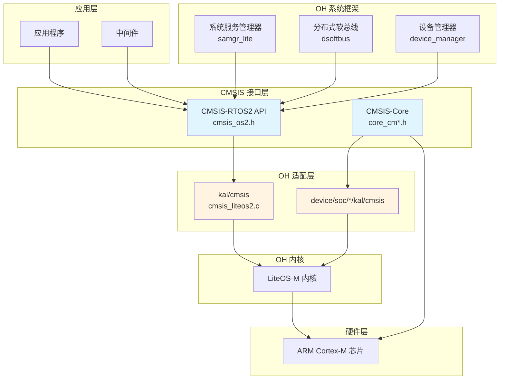

# 04 - 依赖关系与使用场景

## 4.1 直接依赖者清单

### 完整依赖列表

| # | 模块路径 | BUILD.gn 文件 | 用途说明 |
|---|----------|--------------|----------|
| 1 | `kernel/liteos_m/kal/cmsis` | `kernel/liteos_m/kal/cmsis/BUILD.gn` | **核心适配层**：CMSIS-RTOS2 → LiteOS-M 适配实现 |
| 2 | `device/qemu/arm_mps3_an547/liteos_m/board` | `device/qemu/arm_mps3_an547/liteos_m/board/BUILD.gn` | QEMU 模拟器板级支持 |
| 3 | `device/soc/hisilicon/hi3861v100/hi3861_adapter/kal/cmsis` | `device/soc/hisilicon/hi3861v100/hi3861_adapter/kal/cmsis/BUILD.gn` | 海思 Hi3861 SoC 适配 |
| 4 | `device/soc/hisilicon/ws63v100/adapter/kal/cmsis` | `device/soc/hisilicon/ws63v100/adapter/kal/cmsis/BUILD.gn` | 海思 WS63 SoC 适配 |
| 5 | `test/xts/acts/kernel_lite/kernelcmsis_hal` | `test/xts/acts/kernel_lite/kernelcmsis_hal/BUILD.gn` | CMSIS HAL 功能测试 |
| 6 | `kernel/liteos_m/testsuites/unittest/xts/cmsis` | `kernel/liteos_m/testsuites/unittest/xts/cmsis/BUILD.gn` | 内核单元测试：CMSIS 测试 |
| 7 | `kernel/liteos_m/testsuites/sample/cmsis` | `kernel/liteos_m/testsuites/sample/cmsis/BUILD.gn` | CMSIS 示例代码 |
| 8 | `foundation/systemabilitymgr/samgr_lite/samgr/adapter` | `foundation/systemabilitymgr/samgr_lite/samgr/adapter/BUILD.gn` | 系统服务管理器适配 |
| 9 | `foundation/communication/dsoftbus/adapter` | `foundation/communication/dsoftbus/adapter/BUILD.gn` | 分布式软总线适配 |
| 10 | `foundation/distributedhardware/device_manager/interfaces/inner_kits/native_cpp` | `foundation/distributedhardware/device_manager/interfaces/inner_kits/native_cpp/BUILD.gn` | 分布式设备管理器 |
| 11 | `base/update/sys_installer_lite/frameworks/source` | `base/update/sys_installer_lite/frameworks/source/BUILD.gn` | 轻量级系统更新安装器 |
| 12 | `applications/sample/wifi-iot/app/samgr` | `applications/sample/wifi-iot/app/samgr/BUILD.gn` | WiFi-IoT 示例：服务管理 |
| 13 | `applications/sample/wifi-iot/app/iothardware` | `applications/sample/wifi-iot/app/iothardware/BUILD.gn` | WiFi-IoT 示例：硬件操作 |
| 14 | `device/soc/rockchip/rk2206/hardware` | `device/soc/rockchip/rk2206/hardware/BUILD.gn` | 瑞芯微 RK2206 硬件支持 |

---

## 4.2 核心依赖者详细分析

### 4.2.1 kernel/liteos_m/kal/cmsis（核心适配层）

**重要性**: ⭐⭐⭐⭐⭐

**作用**：将 CMSIS-RTOS2 标准 API 适配到 LiteOS-M 内核实现。

**文件结构**：
```
kernel/liteos_m/kal/cmsis/
├── BUILD.gn              # 模块构建配置
├── cmsis_liteos2.c       # 适配实现（~1800行）
└── cmsis_liteos2.h       # 适配层头文件
```

**实现的功能模块**：

| 功能模块 | CMSIS-RTOS2 API | LiteOS-M 对应实现 |
|----------|-----------------|-------------------|
| **内核管理** | `osKernelInitialize`, `osKernelStart` | `LOS_KernelInit`, `LOS_Start` |
| **线程管理** | `osThreadNew`, `osThreadTerminate` | `LOS_TaskCreate`, `LOS_TaskDelete` |
| **线程同步** | `osThreadFlagsSet`, `osThreadFlagsWait` | `LOS_EventWrite`, `LOS_EventRead` |
| **定时器** | `osTimerNew`, `osTimerStart` | `LOS_SwtmrCreate`, `LOS_SwtmrStart` |
| **事件标志** | `osEventFlagsNew`, `osEventFlagsSet` | `LOS_EventInit`, `LOS_EventWrite` |
| **互斥锁** | `osMutexNew`, `osMutexAcquire` | `LOS_MuxCreate`, `LOS_MuxPend` |
| **信号量** | `osSemaphoreNew`, `osSemaphoreAcquire` | `LOS_SemCreate`, `LOS_SemPend` |
| **消息队列** | `osMessageQueueNew`, `osMessageQueuePut` | `LOS_QueueCreate`, `LOS_QueueWriteCopy` |
| **内存池** | `osMemoryPoolNew`, `osMemoryPoolAlloc` | `LOS_MemBox` 实现 |

**代码示例**：优先级映射
```c
// kernel/liteos_m/kal/cmsis/cmsis_liteos2.c

/* CMSIS-RTOS2 优先级 → LiteOS-M 优先级映射 */
#define LOS_PRIORITY(cmsisPriority) \
    (LOSCFG_BASE_CORE_TSK_DEFAULT_PRIO - ((cmsisPriority) - osPriorityNormal))

osThreadId_t osThreadNew(osThreadFunc_t func, void *argument, const osThreadAttr_t *attr) {
    // ...
    priority = LOS_PRIORITY(attr->priority);  // 转换优先级
    stTskInitParam.usTaskPrio = priority;
    ret = LOS_TaskCreate(&tid, &stTskInitParam);
    // ...
}
```

### 4.2.2 test/xts/acts/kernel_lite/kernelcmsis_hal（功能测试）

**重要性**: ⭐⭐⭐⭐

**作用**：验证 CMSIS-RTOS2 适配实现的正确性。

**测试覆盖**：

| 测试文件 | 测试功能 |
|----------|----------|
| `cmsis_event_func_test.c` | 事件标志（Event Flags） |
| `cmsis_msg_func_test.c` | 消息队列（Message Queue） |
| `cmsis_mutex_func_test.c` | 互斥锁（Mutex） |
| `cmsis_sem_func_test.c` | 信号量（Semaphore） |
| `cmsis_task_func_test.c` | 任务管理（Thread） |
| `cmsis_task_pri_func_test.c` | 任务优先级 |
| `cmsis_timer_func_test.c` | 定时器（Timer） |

### 4.2.3 device/soc/*/kal/cmsis（芯片适配）

**海思 Hi3861V100 示例**：

```c
// device/soc/hisilicon/hi3861v100/hi3861_adapter/kal/cmsis/cmsis_liteos.c

// 芯片特定的 CMSIS 适配
#include "cmsis_os2.h"
#include "los_config.h"

// 启动代码中使用 CMSIS-Core
void SystemInit(void) {
    // 使用 CMSIS 定义的寄存器地址
    SCB->CPACR |= ((3UL << 10*2) | (3UL << 11*2));  // 启用 FPU
}
```

---

## 4.3 依赖关系图

### 整体架构图



### 调用链路示例

#### 场景：应用程序创建任务

```
┌─────────────────────────────────────────────────────────────────┐
│  应用程序                                                       │
│  osThreadId_t tid = osThreadNew(MyTask, NULL, NULL);          │
└─────────────────────────────────────────────────────────────────┘
                              ↓
┌─────────────────────────────────────────────────────────────────┐
│  CMSIS-RTOS2 API (third_party/cmsis)                           │
│  // cmsis_os2.h - 接口声明                                      │
│  osThreadId_t osThreadNew(...);                                │
└─────────────────────────────────────────────────────────────────┘
                              ↓
┌─────────────────────────────────────────────────────────────────┐
│  OH 适配层 (kernel/liteos_m/kal/cmsis)                         │
│  // cmsis_liteos2.c - 实现                                      │
│  osThreadId_t osThreadNew(...) {                               │
│      priority = LOS_PRIORITY(attr->priority);                  │
│      ret = LOS_TaskCreate(&tid, &stTskInitParam);              │
│      ...                                                        │
│  }                                                              │
└─────────────────────────────────────────────────────────────────┘
                              ↓
┌─────────────────────────────────────────────────────────────────┐
│  LiteOS-M 内核 (kernel/liteos_m)                               │
│  // task 模块                                                   │
│  UINT32 LOS_TaskCreate(...) { ... }                            │
└─────────────────────────────────────────────────────────────────┘
```

---

## 4.4 使用方式分类

### 4.4.1 静态链接 vs 动态链接

| 方式 | 说明 | CMSIS 情况 |
|------|------|------------|
| **静态链接** | 库代码编译进可执行文件 | ✅ 适配层代码静态链接 |
| **动态链接** | 运行时加载共享库 | ❌ 不适用（头文件库） |

**说明**：
- CMSIS 本身是头文件库，无链接过程
- CMSIS 适配层（`cmsis_liteos2.c`）编译为内核的一部分
- 应用程序直接包含头文件使用

### 4.4.2 头文件引用方式

#### 方式一：通过 kal 框架（推荐）

```c
// 应用程序代码
#include "kal.h"  // KAL (Kernel Abstraction Layer) 框架

// kal.h 内部已包含 cmsis_os2.h
```

#### 方式二：直接引用 CMSIS

```c
// 应用程序代码
#include "cmsis_os2.h"  // 直接引用 CMSIS-RTOS2
```

**推荐**：使用 `kal.h`，因为：
- 提供更高层次的抽象
- 隐藏底层实现差异
- 更好的可移植性

### 4.4.3 关键使用场景

| 场景 | 使用者 | 使用方式 |
|------|--------|----------|
| **RTOS 功能** | 应用程序 | `#include "cmsis_os2.h"` → 调用 API |
| **寄存器访问** | 驱动代码 | `#include "core_cm4.h"` → 直接访问 NVIC/SCB |
| **启动代码** | 芯片适配层 | 包含头文件 + 汇编代码配合 |
| **中断管理** | 内核/驱动 | 使用 CMSIS 内联函数 |

---

## 4.5 依赖关系统计

### 按子系统统计

| 子系统 | 依赖模块数 | 主要用途 |
|--------|-----------|----------|
| **kernel** | 4 | RTOS 适配、测试 |
| **device** | 4 | 芯片适配、板级支持 |
| **foundation** | 3 | 系统服务、通信框架 |
| **test** | 1 | 功能测试 |
| **base** | 1 | 系统更新 |
| **applications** | 2 | 示例程序 |

### 使用频率分析

```
kernel/liteos_m/kal/cmsis          ████████████████████ 高频（核心适配）
test/xts/*                         ██████████████       中高频（测试）
device/soc/*/kal/cmsis             ██████████           中频（芯片适配）
foundation/*/adapter               ██████               低频（框架）
applications/*                     ████                 低频（示例）
```

---

## 4.6 依赖管理建议

### 新增依赖者指南

#### 步骤 1：引入 CMSIS

```gn
# 在 BUILD.gn 中添加
import("//third_party/cmsis/cmsis.gni")

static_library("my_module") {
  sources = [ ... ]
  include_dirs = CMSIS_INCLUDE_DIRS
}
```

#### 步骤 2：选择 API 层级

| 需求 | 推荐 API |
|------|----------|
| 仅需 RTOS 功能 | `#include "cmsis_os2.h"` |
| 需要内核高级功能 | `#include "kal.h"` |
| 驱动开发 | `#include "core_cm*.h"` |

#### 步骤 3：配置芯片支持

确保芯片配置正确定义了：
- `-mcpu` 编译器标志
- `__CORTEX_Mx` 宏
- `__FPU_PRESENT` 宏（如有 FPU）

---

## 4.7 总结

### 依赖关系特点

| 特点 | 说明 |
|------|------|
| **核心枢纽** | `kal/cmsis` 是 CMSIS 在 OH 中的核心适配层 |
| **广泛依赖** | 被内核、芯片、框架、应用多层依赖 |
| **分层设计** | 接口定义 → 适配实现 → 内核 → 硬件 |
| **标准化** | 统一使用 `CMSIS_INCLUDE_DIRS` 引入 |

### 关键要点

1. **适配层是核心**：`kernel/liteos_m/kal/cmsis/cmsis_liteos2.c` 是 CMSIS 在 OH 中工作的关键
2. **头文件库特性**：CMSIS 本身无编译产物，依赖通过头文件传递
3. **测试覆盖完整**：XTS 测试套件覆盖所有 CMSIS-RTOS2 功能
4. **芯片适配标准化**：各 SoC 通过统一的 `kal/cmsis` 模式适配

---

*文档版本: 1.0*  
*最后更新: 2025-02-08*
