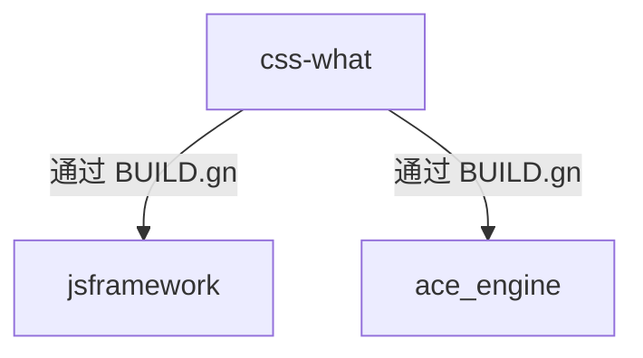

# 03\_构建适配

## 3.1 BUILD.gn 文件分析

### 完整配置

```gn
# Copyright (c) 2023 Huawei Device Co., Ltd.
# Licensed under the Apache License, Version 2.0 (the "License");
# you may not use this file except in compliance with the License.
# You may obtain a copy of the License at
#
#     http://www.apache.org/licenses/LICENSE-2.0
#
# Unless required by applicable law or agreed to in writing, software
# distributed under the License is distributed on an "AS IS" BASIS,
# WITHOUT WARRANTIES OR CONDITIONS OF ANY KIND, either express or implied.
# See the License for the specific language governing permissions and
# limitations under the License.

import("//build/ohos.gni")

ohos_prebuilt_etc("css_what_sources") {
  source = "src"
  output = "../jsframework/runtime"
  license_file = "LICENSE"

  install_enable = false

  part_name = "css-what"
  subsystem_name = "thirdparty"
}
```

### 配置解析

| 配置项             | 值                         | 说明             |
| ------------------ | -------------------------- | ---------------- |
| **模板类型**       | `ohos_prebuilt_etc`        | 预编译源文件模板 |
| **source**         | `"src"`                    | 源文件目录       |
| **output**         | `"../jsframework/runtime"` | 输出路径         |
| **license_file**   | `"LICENSE"`                | 许可证文件       |
| **install_enable** | `false`                    | 禁用安装         |
| **part_name**      | `"css-what"`               | 部件名称         |
| **subsystem_name** | `"thirdparty"`             | 子系统名称       |

---

## 3.2 构建模板说明

### ohos_prebuilt_etc 模板

该库使用 `ohos_prebuilt_etc` 模板进行构建适配。

**模板特性**：

```gn
# ohos_prebuilt_etc 的主要行为：
1. 复制 source 目录到 output 目录
2. 收集 LICENSE 文件
3. 生成构建产物元数据
4. 支持 install_enable 控制是否安装
```

### 与上游构建系统的差异

| 方面         | 上游构建系统              | OH 构建系统     |
| ------------ | ------------------------- | --------------- |
| **构建工具** | npm/tshy                  | GN + Ninja      |
| **构建产物** | dist/esm/, dist/commonjs/ | src/ (直接复制) |
| **类型定义** | tsc 生成                  | 使用上游源码    |
| **入口文件** | package.json exports      | 直接引用 src/   |

---

## 3.3 关键配置详解

### 3.3.1 source 配置

```gn
source = "src"
```

**说明**：直接使用上游源码目录，无需预处理。

**src 目录结构**：

```
src/
├── index.ts           # 入口文件，导出 parse/stringify
├── parse.ts          # 解析器核心实现 (~20KB)
├── stringify.ts      # AST 还原为字符串 (~6KB)
├── types.ts          # TypeScript 类型定义 (~2KB)
├── parse.spec.ts     # 单元测试
├── stringify.spec.ts # 单元测试
├── wpt.spec.ts       # Web Platform Tests
└── __fixtures__/     # 测试数据
```

### 3.3.2 output 配置

```gn
output = "../jsframework/runtime"
```

**说明**：将源码输出到 jsframework 的 runtime 目录。

**输出路径**：

```
third_party/css-what/
└── src/              →  ../jsframework/runtime/
```

**集成效果**：

```gn
# 在 jsframework 中的引用方式
css_what = "obj/binarys/third_party/css-what/innerapis/css_what_sources/src"
```

### 3.3.3 install_enable 配置

```gn
install_enable = false
```

**说明**：禁用独立安装，作为 jsframework 的依赖自动集成。

**影响**：

- ❌ 不会生成独立的 HAP/HSP 包
- ✅ 随 jsframework 一起构建和部署
- ✅ 减少构建产物大小

---

## 3.4 构建依赖关系

### 被依赖关系



### 依赖配置方式

#### 方式一：直接构建依赖（非独立编译器模式）

```gn
# jsframework/BUILD.gn
deps = [ "//third_party/css-what:css_what_sources" ]
```

#### 方式二：外部依赖（独立编译器模式）

```gn
# jsframework/BUILD.gn
external_deps = [ "css-what:css_what_sources" ]
css_what = "obj/binarys/third_party/css-what/innerapis/css_what_sources/src"
```

### 构建时机

| 构建场景 | 是否构建 | 说明                     |
| -------- | -------- | ------------------------ |
| 全量构建 | ✅       | 随 thirdparty 子系统构建 |
| 增量构建 | ✅       | 只在依赖变更时构建       |
| 独立构建 | ✅       | `hb build css-what`      |
| 单独测试 | ❌       | install_enable = false   |

---

## 3.5 与上游构建系统的映射

### 上游构建配置

```json
// package.json
{
    "tshy": {
        "exports": {
            "./package.json": "./package.json",
            ".": "./src/index.ts"
        }
    },
    "scripts": {
        "test": "npm run test:vi && npm run lint",
        "prepublishOnly": "tshy"
    }
}
```

### OH 构建映射

| 上游配置       | OH BUILD.gn 配置    | 说明                |
| -------------- | ------------------- | ------------------- |
| `tshy` 编译    | `ohos_prebuilt_etc` | 直接复制源码        |
| `npm test`     | 跳过                | OH 不运行单元测试   |
| `npm run lint` | 跳过                | OH 不进行 lint 检查 |

---

## 3.6 特殊处理

### 3.6.1 源文件直接使用

**特点**：OH 直接使用上游 TypeScript 源码，无需预编译。

**优势**：

- ✅ 简化构建流程
- ✅ 减少构建产物
- ✅ 便于问题排查

**注意事项**：

- 运行时需要 TypeScript 编译器或转译
- jsframework 构建脚本负责处理

### 3.6.2 无条件编译

**特点**：无 `#ifdef OHOS` 或类似宏。

**原因**：

- 库功能完全通用
- 无平台特定代码
- 无需条件编译

---

## 3.7 构建验证

### 验证方法

```bash
# 1. 查看构建产物
ls -la ../jsframework/runtime/

# 2. 检查依赖关系
grep -r "css-what" ../foundation/arkui/ace_engine/frameworks/bridge/js_frontend/engine/jsi/BUILD.gn

# 3. 验证构建
hb build css-what
```

### 构建产物检查

```bash
$ ls -la ../jsframework/runtime/
# 应该能看到 css-what 的 src 目录内容
```

---

## 3.8 构建适配总结

### 配置清单

| 配置项     | 值                       | 状态    |
| ---------- | ------------------------ | ------- |
| 构建模板   | `ohos_prebuilt_etc`      | ✅ 正确 |
| 源目录     | `src`                    | ✅ 正确 |
| 输出路径   | `../jsframework/runtime` | ✅ 正确 |
| 许可证     | `LICENSE`                | ✅ 正确 |
| 安装启用   | `false`                  | ✅ 正确 |
| 部件名称   | `css-what`               | ✅ 正确 |
| 子系统名称 | `thirdparty`             | ✅ 正确 |

### 适配质量评估

| 评估项     | 评分       | 说明                   |
| ---------- | ---------- | ---------------------- |
| 配置完整性 | ⭐⭐⭐⭐⭐ | 配置完整，无遗漏       |
| 构建简单性 | ⭐⭐⭐⭐⭐ | 使用标准模板，简单直接 |
| 维护便利性 | ⭐⭐⭐⭐⭐ | 无 Patch，易于升级     |
| 依赖清晰度 | ⭐⭐⭐⭐   | 依赖关系明确           |

### 建议

1. **保持当前配置**：适配简洁有效，无需修改
2. **关注上游更新**：及时同步新版本
3. **验证兼容性**：升级后验证 jsframework 构建正常

---

## 3.9 参考信息

### 相关文件

- [02_Patches.md](./02_Patches.md) - Patch 分析
- [04_Usage_in_OH.md](./04_Usage_in_OH.md) - 在 OH 中的使用
- bundle.json - OH 组件配置
- package.json - npm 包配置

### 构建系统文档

- [OH 构建系统概述]()
- [GN 构建语法]()
- [ohos_prebuilt_etc 模板]()

---

_文档版本：1.0_
_最后更新：2026-02-08_
