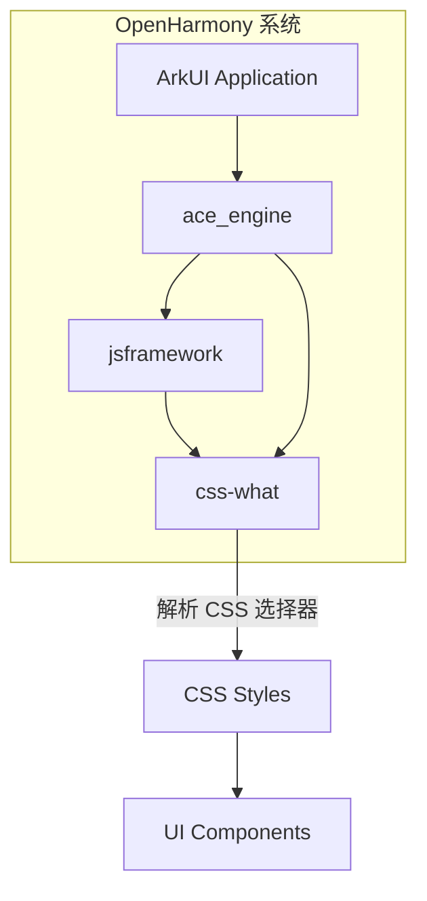
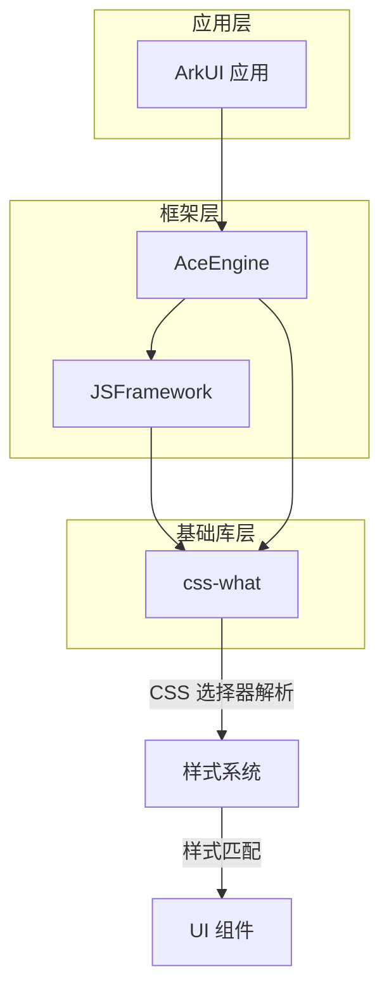

# 04\_在 OH 中的使用

## 4.1 依赖关系概览

### 直接依赖者

| 模块            | BUILD.gn 路径                                                                     | 用途        | 依赖类型   |
| --------------- | --------------------------------------------------------------------------------- | ----------- | ---------- |
| **jsframework** | `//third_party/jsframework/BUILD.gn`                                              | JS 框架构建 | 构建依赖   |
| **ace_engine**  | `//foundation/arkui/ace_engine/frameworks/bridge/js_frontend/engine/jsi/BUILD.gn` | JS 引擎     | 运行时依赖 |

### 依赖关系图



---

## 4.2 在 jsframework 中的使用

### 构建集成

#### 独立编译器模式

```gn
# //third_party/jsframework/BUILD.gn
if (ohos_indep_compiler_enable) {
  # 独立编译器模式下，作为外部依赖
  external_deps = [ "css-what:css_what_sources" ]
  css_what = "obj/binarys/third_party/css-what/innerapis/css_what_sources/src"
} else {
  # 非独立编译器模式下，作为直接构建依赖
  deps = [ "//third_party/css-what:css_what_sources" ]
}
```

### 集成路径

```
third_party/css-what/src/
                    ↓  (ohos_prebuilt_etc 复制)
jsframework/runtime/
```

### 使用场景

#### 场景一：CSS 样式解析

```typescript
// 伪代码：css-what 在 jsframework 中的使用
import { parse } from "css-what";

// 解析组件的选择器
const selector = '.container .item[data-type="card"]';
const ast = parse(selector);

// 用于样式匹配
function matchSelector(element, selector) {
    const ast = parse(selector);
    return evaluateAst(element, ast);
}
```

#### 场景二：动态样式支持

```typescript
// 支持动态选择器计算
function createDynamicSelector(base: string, modifier: string) {
    return `${base}.${modifier}:hover`;
}

const dynamicSelector = createDynamicSelector("button", "primary");
const ast = parse(dynamicSelector);
```

---

## 4.3 在 ace_engine 中的使用

### 依赖配置

```gn
# //foundation/arkui/ace_engine/frameworks/bridge/js_frontend/engine/jsi/BUILD.gn

# Android 平台
} else if (defined(config.build_for_android) && config.build_for_android) {
  deps += [
    "//third_party/css-what:css_what_sources",
    "//third_party/jsframework:ark_build",
  ]

# iOS 平台
} else if (defined(config.build_for_ios) && config.build_for_ios) {
  external_deps += [
    "css-what:css_what_sources",
    "jsframework:ark_build",
  ]

# 标准设备（默认）
} else {
  external_deps += [
    "css-what:css_what_sources",
    "image_framework:image",
    "image_framework:image_native",
    "jsframework:ark_build",
    "napi:ace_napi",
  ]
}
```

### 跨平台支持

| 平台         | 依赖方式      | 说明                 |
| ------------ | ------------- | -------------------- |
| **标准设备** | external_deps | 运行时通过 NAPI 调用 |
| **Android**  | deps          | 直接链接             |
| **iOS**      | external_deps | 运行时通过 NAPI 调用 |

---

## 4.4 使用场景详解

### 场景一：CSS 样式选择器解析

```typescript
// 解析复杂的选择器表达式
const selectors = [
    ".container",
    ".container > .item",
    '.container .item[data-active="true"]',
    ":host .header",
    "::part(title)",
];

selectors.forEach((selector) => {
    const ast = parse(selector);
    // 用于后续的样式匹配
});
```

### 场景二：样式规则处理

```typescript
// CSS 样式规则的解析
const styleRule = ".container { display: flex; }";
const selector = ".container";
const ast = parse(selector);

// 验证选择器语法正确性
function validateSelector(selector: string): boolean {
    try {
        parse(selector);
        return true;
    } catch (e) {
        return false;
    }
}
```

### 场景三：组件匹配

```typescript
// 组件与选择器的匹配
interface Element {
    classes: string[];
    attributes: Record<string, string>;
    tagName: string;
}

function matchesSelector(element: Element, selector: string): boolean {
    const ast = parse(selector);

    return ast.some((rule) => {
        return rule.every((token) => {
            switch (token.type) {
                case "tag":
                    return token.name === element.tagName;
                case "attribute":
                    return element.attributes[token.name] === token.value;
                // ... 其他匹配逻辑
            }
        });
    });
}
```

---

## 4.5 链接方式

### 静态链接 vs 动态链接

| 链接方式     | 描述       | 使用场景                       |
| ------------ | ---------- | ------------------------------ |
| **静态链接** | 编译时链接 | Android 平台（deps）           |
| **动态链接** | 运行时链接 | iOS、标准设备（external_deps） |

### 头文件引用方式

```typescript
// 直接引用源码（TypeScript）
import { parse, stringify } from "css-what";

// 或引用编译产物
import { parse, stringify } from "@ohos/css-what";
```

---

## 4.6 依赖图完整版



---

## 4.7 API 使用统计

### 主要 API

| API           | 使用频率 | 场景             |
| ------------- | -------- | ---------------- |
| `parse()`     | 高       | CSS 选择器解析   |
| `stringify()` | 中       | AST 还原为字符串 |

### 调用链路

```
用户样式定义
    ↓
parse(selector)
    ↓
AST 生成
    ↓
样式匹配引擎
    ↓
UI 组件渲染
```

---

## 4.8 版本兼容性

### 上游 API 兼容性

| 版本   | API 变化 | OH 影响      |
| ------ | -------- | ------------ |
| v7.0.0 | 当前版本 | 正常使用     |
| v6.x   | 略有差异 | 可能需要适配 |
| v5.x   | 差异较大 | 需要测试验证 |

### OH 版本策略

- **小版本升级**（如 7.0.0 → 7.0.1）：直接升级，无需修改
- **大版本升级**（如 7.x → 8.x）：评估 API 变更，测试兼容性

---

## 4.9 性能考量

### 性能特点

| 特性             | 评估                |
| ---------------- | ------------------- |
| **解析速度**     | 快（纯 TS，轻量级） |
| **内存占用**     | 低（无外部依赖）    |
| **解析结果大小** | 中等（AST 结构）    |
| **并发安全**     | 是（纯函数）        |

### 优化建议

1. **缓存解析结果**：对于重复使用的选择器，缓存 AST
2. **批量解析**：一次解析多个选择器
3. **选择器简化**：避免过度复杂的选择器

---

## 4.10 故障排查

### 常见问题

| 问题           | 可能原因     | 解决方案           |
| -------------- | ------------ | ------------------ |
| 选择器解析失败 | 语法错误     | 检查选择器语法     |
| 样式不生效     | 选择器不匹配 | 验证选择器与组件   |
| 构建失败       | 依赖缺失     | 检查 BUILD.gn 配置 |

### 调试方法

```typescript
// 1. 验证选择器解析
const ast = parse(selector);
console.log("AST:", JSON.stringify(ast, null, 2));

// 2. 检查选择器有效性
try {
    parse(selector);
    console.log("✓ 选择器有效");
} catch (e) {
    console.log("✗ 选择器无效:", e.message);
}
```

---

## 4.11 使用建议

### 最佳实践

1. **错误处理**：使用 try-catch 包裹 parse 调用
2. **类型安全**：使用 TypeScript 类型定义
3. **性能优化**：缓存常用选择器的解析结果
4. **兼容性**：测试跨版本兼容性

### 不建议的做法

```typescript
// ❌ 不建议：直接使用字符串拼接构造选择器
const selector = ".container " + type;

// ✅ 建议：使用参数化选择器
const selector = `.container .${type}`;

// ❌ 不建议：忽略解析错误
const ast = parse(selector);

// ✅ 建议：处理解析错误
let ast;
try {
    ast = parse(selector);
} catch (e) {
    console.error("Invalid selector:", selector);
}
```

---

## 4.12 小结

### 关键点

1. **双重依赖**：被 jsframework 和 ace_engine 同时依赖
2. **构建时集成**：作为源码直接集成到运行时
3. **核心功能**：CSS 选择器解析是样式系统的基础
4. **零适配**：无需 OH 特有修改，纯上游源码

### 依赖统计

| 指标               | 数值              |
| ------------------ | ----------------- |
| **直接依赖者数量** | 2                 |
| **静态链接平台**   | 1 (Android)       |
| **动态链接平台**   | 2 (iOS, 标准设备) |
| **Patch 数量**     | 0                 |

---

## 4.13 参考信息

### 相关文档

- [01_Overview.md](./01_Overview.md) - 库概述
- [03_Build_Integration.md](./03_Build_Integration.md) - 构建适配
- [05_API_Differences.md](./05_API_Differences.md) - API 差异

### 上游资源

- [css-what GitHub](https://github.com/fb55/css-what)
- [CSS Selectors W3C Spec](https://www.w3.org/TR/selectors-3/)

---

_文档版本：1.0_
_最后更新：2026-02-08_
