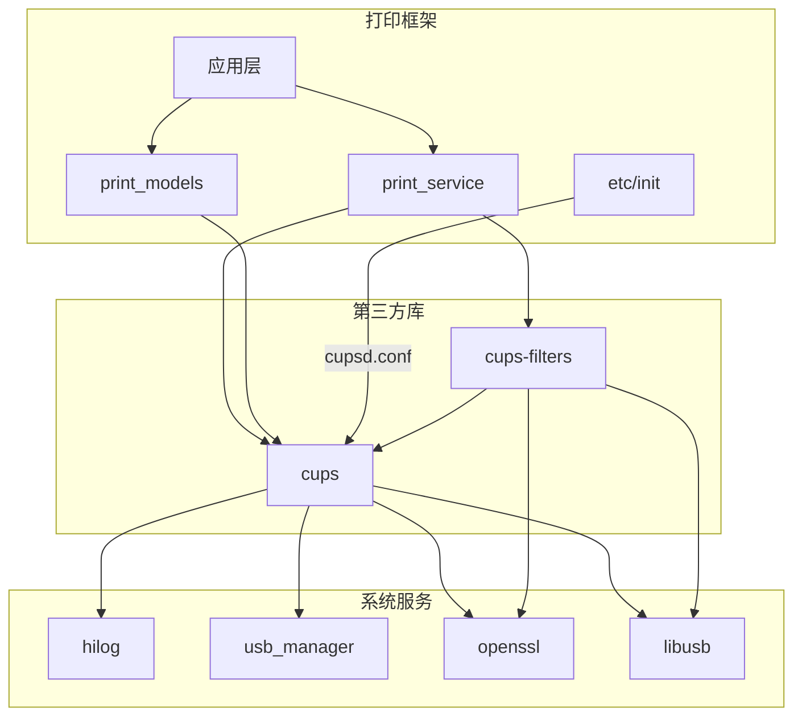

# CUPS 在 OpenHarmony 中的使用

## 依赖关系概览

```
┌─────────────────────────────────────────────────────────────────────┐
│                    OpenHarmony 打印系统架构                          │
├─────────────────────────────────────────────────────────────────────┤
│                                                                     │
│  应用层 (Applications)                                              │
│       │                                                             │
│       ▼                                                             │
│  base/print/print_fwk/ (打印框架)                                   │
│       │                                                             │
│       ├──► services/print_service/ (打印服务)                        │
│       │       │                                                     │
│       │       └──► third_party/cups/ (CUPS 核心)                   │
│       │                 │                                           │
│       │                 └──► 依赖: hilog, usb_manager, openssl      │
│       │                                                             │
│       ├──► frameworks/models/print_models/ (数据模型)                │
│       │       │                                                     │
│       │       └──► third_party/cups/                              │
│       │                                                             │
│       └──► etc/init/ (配置文件)                                      │
│               │                                                     │
│               └──► third_party/cups/ (cupsd.conf)                  │
│                                                                     │
│  third_party/cups-filters/ (过滤器库)                                │
│       │                                                             │
│       └──► third_party/cups/                                        │
│                                                                     │
└─────────────────────────────────────────────────────────────────────┘
```

---

## 直接依赖者

### 1. 打印框架服务 (print_service)

| 属性 | 值 |
|------|-----|
| **BUILD.gn 路径** | `base/print/print_fwk/services/print_service/BUILD.gn` |
| **依赖方式** | 条件编译 (`cups_enable = true`) |
| **依赖行** | 136-137, 202-203 |
| **用途** | CUPS 打印功能集成 |

**依赖配置**：

```gn
if (cups_enable) {
  sources += [
    "src/print_cups_attribute.cpp",
    "src/print_cups_ppd.cpp",
    "src/print_cups_client.cpp",
    "src/print_cups_wrapper.cpp",
  ]

  external_deps += [
    "cups:cups",
    "cups-filters:cupsfilters",
  ]
}
```

**CUPS 集成模块**：

| 文件 | 功能 |
|-----|------|
| `print_cups_attribute.cpp` | IPP 属性处理 |
| `print_cups_ppd.cpp` | PPD 文件解析 |
| `print_cups_client.cpp` | CUPS 客户端接口 |
| `print_cups_wrapper.cpp` | CUPS API 封装 |

### 2. 打印数据模型 (print_models)

| 属性 | 值 |
|------|-----|
| **BUILD.gn 路径** | `base/print/print_fwk/frameworks/models/print_models/BUILD.gn` |
| **依赖方式** | **无条件** (始终依赖) |
| **依赖行** | 76 |
| **用途** | 打印数据模型使用 CUPS API |

### 3. CUPS 过滤器 (cups-filters)

| 属性 | 值 |
|------|-----|
| **BUILD.gn 路径** | `third_party/cups-filters/BUILD.gn` |
| **依赖方式** | 构建依赖 |
| **用途** | PDF/图像过滤器使用 CUPS 库 |

### 4. 初始化配置 (etc/init)

| 属性 | 值 |
|------|-----|
| **BUILD.gn 路径** | `base/print/print_fwk/etc/init/BUILD.gn` |
| **配置内容** | CUPS 服务配置文件 |

**配置文件**：

| 文件 | 说明 |
|-----|------|
| `cupsd.conf` | CUPS 守护进程配置 |
| `cups-files.conf` | CUPS 文件路径配置 |
| `cups_service.cfg` | OH 服务配置 |
| `cupsd_enterprise.conf` | 企业版配置 |

---

## 测试依赖

所有测试目标都条件依赖于 `cups_enable`：

| 测试类型 | BUILD.gn 路径 | 数量 |
|---------|--------------|-----|
| **单元测试** | `test/unittest/*/` | 5 |
| **模糊测试** | `test/fuzztest/` | 11 |

**测试列表**：

| 测试模块 | 依赖 | 类型 |
|---------|------|------|
| `fwk_print_cups_client_test` | cups, cupsfilters | 单元测试 |
| `fwk_print_service_ability_test` | cups, cupsfilters | 单元测试 |
| `fwk_print_smb_printer_test` | cups, cupsfilters | 单元测试 |
| `service_test` | cups, cupsfilters | 单元测试 |
| `fwk_vendor_manager_test` | cups, cupsfilters | 单元测试 |
| `printcupsclient_fuzzer` | cups, cupsfilters | 模糊测试 |
| `printcupsattribute_fuzzer` | cups, cupsfilters | 模糊测试 |
| `printserviceprintjobfunction_fuzzer` | cups, cupsfilters | 模糊测试 |
| `printservicefunction_fuzzer` | cups, cupsfilters | 模糊测试 |
| `printserviceprintdiscoverfunction_fuzzer` | cups, cupsfilters | 模糊测试 |
| `printserviceconnectfunction_fuzzer` | cups, cupsfilters | 模糊测试 |
| `printserviceability_fuzzer` | cups, cupsfilters | 模糊测试 |
| `printserviceupdateprinterfunction_fuzzer` | cups, cupsfilters | 模糊测试 |
| `printserviceaddprinterfunction_fuzzer` | cups, cupsfilters | 模糊测试 |
| `printserviceprintjobstatefunction_fuzzer` | cups, cupsfilters | 模糊测试 |
| `printservicenotpublicfunction_fuzzer` | cups, cupsfilters | 模糊测试 |
| `printservicequeryprinter_fuzzer` | cups, cupsfilters | 模糊测试 |
| `vendormanager_fuzzer` | cups, cupsfilters | 模糊测试 |

---

## 使用场景

### 场景 1：网络 IPP 打印机

```cpp
// 使用 CUPS IPP 后端发现和连接 IPP 打印机

#include <cups/cups.h>

// 发现网络打印机
cups_dest_t *dests;
int num_dests = cupsGetDests(&dests);

// 连接 IPP 打印机
const char *uri = "ipp://192.168.1.100/ipp/print";
int job_id = cupsPrint2(dest, job_title, num_files,
                         files, options);
```

### 场景 2：USB 打印机

```cpp
// 使用 OH USB 后端

// USB 后端使用 ohos-usb-print.patch 实现的 usb-oh.c
// 通过 usb:// URI 访问 USB 打印机

const char *uri = "usb://HP/LaserJet_Pro?serial=CND12345";
int job_id = cupsPrint2(dest, job_title, 1, &file, options);
```

### 场景 3：PPD 驱动管理

```cpp
// 使用 cupsppdc 库解析 PPD 文件

#include <ppdc/ppdc.h>

// 打开 PPD 文件
ppdc_driver_t *driver = ppdcOpenDriver("HP-LaserJet.ppd");

// 获取打印机能力
ppdc_option_t *options = ppdcGetOptions(driver);

// 应用打印任务
ppdcPrintJob(job, options);
```

### 场景 4：打印过滤器

```cpp
// 使用 cupsfilters 库

#include <filter/filter.h>

// 图像转 PDF
filter_status_t image_to_pdf(input_file, output_file, options);

// CUPS 栅格格式转换
filter_status_t any_to_raster(input_file, output_file, options);
```

---

## API 使用方式

### CUPS 核心 API

| API | 功能 | 使用模块 |
|-----|------|---------|
| `cupsGetDests()` | 获取打印机列表 | print_cups_client |
| `cupsPrint2()` | 提交打印作业 | print_cups_client |
| `cupsGetPPD()` | 获取 PPD 文件 | print_cups_ppd |
| `cupsGetPPD2()` | 获取 PPD 文件 (扩展) | print_cups_ppd |
| `cupsAddDest()` | 添加打印机 | print_cups_client |
| `cupsDeleteDest()` | 删除打印机 | print_cups_client |

### IPP API

| API | 功能 |
|-----|------|
| `ippNew()` | 创建 IPP 请求 |
| `ippDelete()` | 删除 IPP 请求 |
| `ippAddString()` | 添加字符串属性 |
| `ippAddInteger()` | 添加整型属性 |
| `ippDoFileRequest()` | 发送 IPP 请求 |

---

## 依赖关系图



---

## 功能开关影响

### cups_enable = true

```gn
# 启用完整 CUPS 支持
print_service:
  - 添加 CUPS 源文件
  - 链接 cups, cupsfilters
  - 支持 IPP/USB/网络打印

print_models:
  - 始终链接 cups

测试模块:
  - 启用所有 CUPS 相关测试
```

### cups_enable = false

```gn
# 禁用 CUPS 支持
print_service:
  - 不添加 CUPS 源文件
  - 不链接 cups, cupsfilters
  - 可能仅支持部分打印功能

print_models:
  - 仍链接 cups (无条件)

测试模块:
  - 跳过 CUPS 相关测试
```

---

## 链接方式

| 目标 | 链接方式 | 说明 |
|-----|---------|------|
| `cups` | 动态链接 | `libcups.so` |
| `cupsimage` | 动态链接 | `libcupsimage.so` |
| `cupsppdc` | 动态链接 | `libcupsppdc.so` |
| `cupsmime` | 动态链接 | `libcupsmime.so` |
| `cups-filters` | 动态链接 | `libcupsfilters.so` |

---

## 相关文档

- [01_Overview.md](01_Overview.md) - 库概览
- [02_Patches.md](02_Patches.md) - Patch 详解
- [03_Build_Integration.md](03_Build_Integration.md) - 构建适配
- [06_Security.md](06_Security.md) - 安全分析
