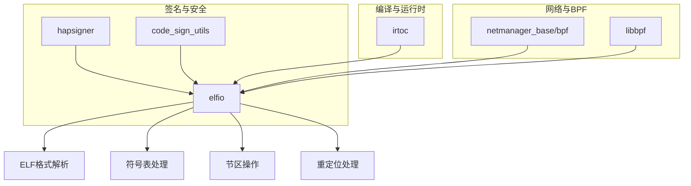

# 依赖关系与使用

## 直接依赖者

ELFIO 被以下 OpenHarmony 模块依赖：

| 模块 | BUILD.gn 路径 | 用途 | 依赖方式 |
|------|--------------|------|----------|
| **binary_sign_tool** | `developtools/hapsigner/binary_sign_tool/BUILD.gn` | ELF 文件签名处理 | `deps` |
| **netmanager_base (bpf)** | `foundation/communication/netmanager_base/services/netmanagernative/bpf/BUILD.gn` | eBPF 程序 ELF 解析 | `deps` |
| **irtoc** | `arkcompiler/runtime_core/static_core/irtoc/BUILD.gn` | 运行时编译器 ELF 处理 | `external_deps` |
| **libbpf** | `third_party/libbpf/BUILD.gn` | BPF 相关功能 | `deps` |
| **code_sign_utils** | `base/security/code_signature/interfaces/inner_api/code_sign_utils/BUILD.gn` | 代码签名工具 | `external_deps` |
| **netmanager_base_config** | `foundation/communication/netmanager_base/netmanager_base_config.gni` | 可选配置开关 | 配置项 |

---

## 详细依赖分析

### 1. hapsigner（二进制签名工具）

**路径**：`developtools/hapsigner/binary_sign_tool/BUILD.gn`

```gn
deps = [
  "elfio:elfio",
  ...
]
```

**用途**：
- 解析 ELF 文件结构
- 提取需要签名的节区
- 验证 ELF 头信息
- 处理符号表用于签名计算

**使用场景**：
- 应用签名工具
- 签名验证流程
- ELF 格式校验

### 2. netmanager_base/bpf

**路径**：`foundation/communication/netmanager_base/services/netmanagernative/bpf/BUILD.gn`

```gn
deps = [
  "elfio:elfio",
  ...
]
```

**用途**：
- 加载 eBPF 程序（通常以 ELF 格式存储）
- 解析 eBPF 程序的节区信息
- 提取重定位信息
- 处理符号表

**使用场景**：
- 网络 BPF 程序加载
- 内核功能扩展
- 网络流量过滤

### 3. irtoc（运行时编译器）

**路径**：`arkcompiler/runtime_core/static_core/irtoc/BUILD.gn`

```gn
external_deps = [ "elfio:elfio" ]

configs += [ "$ark_third_party_root/elfio:elfio_public_config" ]

cflags_cc = [ "-Wno-error=missing-field-initializers" ]
```

**用途**：
- 处理编译相关的 ELF 数据
- 符号解析
- 节区信息提取
- 重定位处理

**使用场景**：
- Ark 运行时字节码编译
- 静态编译优化
- 代码生成

### 4. libbpf

**路径**：`third_party/libbpf/BUILD.gn`

```gn
deps = [
  "elfio:elfio",
  ...
]
```

**用途**：
- 提供 BPF 程序的 ELF 解析
- 加载和管理 eBPF 程序
- 处理 BPF 相关的节区

**使用场景**：
- BPF 程序开发
- 内核网络功能
- 性能监控

### 5. code_sign_utils（代码签名工具）

**路径**：`base/security/code_signature/interfaces/inner_api/code_sign_utils/BUILD.gn`

```gn
external_deps += [ "elfio:elfio" ]
```

**用途**：
- 代码签名相关的 ELF 解析
- 提取签名所需信息
- 验证 ELF 文件完整性

**使用场景**：
- 代码完整性校验
- 签名验证
- 安全检查

---

## 依赖图



---

## 静态链接 vs 动态链接

### 链接方式统计

| 依赖者 | 链接方式 | 说明 |
|--------|----------|------|
| binary_sign_tool | 静态链接 | 直接链接 libelfio.so |
| netmanager_base/bpf | 静态链接 | 直接链接 libelfio.so |
| irtoc | 动态链接 | 通过 external_deps |
| libbpf | 静态链接 | 直接链接 libelfio.so |
| code_sign_utils | 动态链接 | 通过 external_deps |

### 链接方式说明

**静态链接（deps）**：
- 直接在编译时链接
- 产物中包含 ELFIO 代码
- 启动速度快

**动态链接（external_deps）**：
- 运行时动态加载
- 多个模块共享同一份库
- 节省空间

---

## 头文件引用方式

### 方式 1：C++ 接口

```cpp
#include <elfio/elfio.hpp>

// 使用命名空间
using namespace ELFIO;

// 调用接口
ELFIO::elfio elf_reader;
elf_reader.load("example.elf");
```

**路径配置**：
```
third_party/elfio/elfio/elfio.hpp
```

### 方式 2：C 接口

```c
#include <elfio_c_wrapper.h>

// 使用 C 接口
pelfio_t elf = elfio_new();
elfio_load(elf, "example.elf");
```

**路径配置**：
```
third_party/elfio/c_wrapper/elfio_c_wrapper.h
```

---

## 典型使用场景

### 场景 1：ELF 文件解析

```cpp
#include <elfio/elfio.hpp>

void parse_elf_file(const char* filepath) {
    ELFIO::elfio reader;
    
    // 加载文件
    if (!reader.load(filepath)) {
        printf("Failed to load ELF file\n");
        return;
    }
    
    // 获取 ELF 头信息
    printf("ELF Class: %s\n", 
           reader.get_class() == ELFCLASS32 ? "ELF32" : "ELF64");
    printf("Entry point: 0x%llx\n", reader.get_entry());
    
    // 遍历所有节区
    for (const auto& section : reader.sections) {
        printf("Section: %s, Size: %llu\n",
               section->get_name().c_str(),
               section->get_size());
    }
}
```

### 场景 2：符号表访问

```cpp
#include <elfio/elfio.hpp>

void list_symbols(ELFIO::elfio& reader) {
    // 获取符号表节区
    const auto& sym_section = reader.sections[".symtab"];
    if (!sym_section) return;
    
    // 创建符号访问器
    ELFIO::symbol_section_accessor symbols(reader, sym_section);
    
    // 遍历符号
    for (Elf_Xword i = 0; i < symbols.get_symbols_num(); ++i) {
        std::string name;
        Elf64_Addr value;
        Elf_Xword size;
        unsigned char bind, type, other;
        Elf_Half section_index;
        
        symbols.get_symbol(i, name, value, size, bind, 
                          type, section_index, other);
        
        printf("Symbol: %s, Value: 0x%llx\n", 
               name.c_str(), value);
    }
}
```

### 场景 3：C 接口使用

```c
#include <elfio_c_wrapper.h>

void c_interface_example(const char* filepath) {
    // 创建 ELF 读写器
    pelfio_t elf = elfio_new();
    
    // 加载文件
    if (!elfio_load(elf, filepath)) {
        printf("Failed to load file\n");
        elfio_delete(elf);
        return;
    }
    
    // 获取节区数量
    Elf_Half num_sections = elfio_get_sections_num(elf);
    printf("Number of sections: %d\n", num_sections);
    
    // 遍历节区
    for (int i = 0; i < num_sections; i++) {
        psection_t section = elfio_get_section_by_index(elf, i);
        char name[256];
        elfio_section_get_name(section, name, sizeof(name));
        printf("Section: %s\n", name);
    }
    
    // 清理
    elfio_delete(elf);
}
```

---

## 相关文档

- [README](./README.md)
- [构建适配](./03_Build_Integration.md)
- [Patch 分析](./02_Patches.md)
- [API 差异](./05_API_Differences.md)
