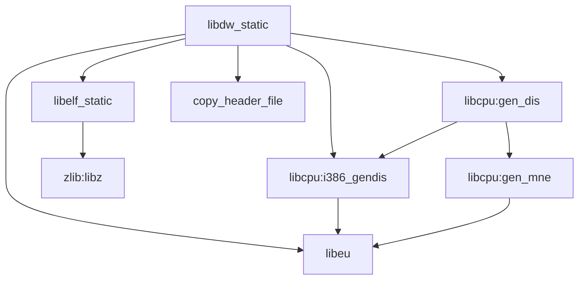

# OH 构建适配

---

## 概述

elfutils 在 OpenHarmony 中的主要适配是**构建系统迁移**：从 autotools (autoconf/make) 迁移到 GN (Generate Ninja)。

### 关键差异

| 方面 | 上游 (Autotools) | OpenHarmony (GN) |
|------|----------------|----------------|
| 构建工具 | autoconf + make | GN + ninja |
| 配置生成 | configure 脚本运行 | 预生成 config.h |
| 库类型 | 共享库 (.so) + 静态库 (.a) | 仅静态库 (.a) |
| 工具链 | 完整工具套件 | 仅库，不编译工具 |
| 守护进程 | debuginfod | 移除 |

---

## BUILD.gn 结构

### 根目录 BUILD.gn

位置：`/third_party/elfutils/BUILD.gn`

### 主要配置

```gn
import("//build/ohos.gni")
import("//third_party/elfutils/elfutils_config.gni")

config("elfutils_defaults") {
  defines = [
    "HAVE_CONFIG_H",      # 使用预生成 config.h
    "_GNU_SOURCE",       # GNU 扩展支持
    "NMNES=1000",       # 符号命名空间大小
  ]
  cflags = [ "-std=gnu99" ]  # GNU C99 标准
}

config("elfutils_public_config") {
  include_dirs = [
    "include",
    "$target_out_dir",
    "$target_out_dir/elfutils",
  ]
}
```

### 编译目标

#### 1. libelf_static

**基础 ELF 库**

```gn
ohos_static_library("libelf_static") {
  configs = [ ":elfutils_defaults" ]

  sources = sources_libelf  # 来自 elfutils_config.gni

  include_dirs = [
    "//third_party/elfutils",
    "//third_party/elfutils/lib",
    "//third_party/elfutils/libelf",
  ]

  deps = []

  external_deps = [ "zlib:libz" ]  # 唯一外部依赖

  subsystem_name = "thirdparty"
  part_name = "elfutils"
}
```

**输出**：libelf_static.a

#### 2. libdw_static

**DWARF 主库（聚合多个子库）**

```gn
ohos_static_library("libdw_static") {
  configs = [ ":elfutils_defaults" ]

  sources = [
    sources_backends,           # 架构特定后端
    sources_libcpu,            # CPU 反汇编
    sources_libdw,             # DWARF 核心库
    sources_libdwelf,          # ELF 工具
    sources_libdwfl,           # 高级 DWARF 处理
    sources_libebl,            # Backend 库
    sources_libdwfl_stacktrace, # 堆栈跟踪（实验性）
  ]

  include_dirs = [
    "//third_party/elfutils",
    "//third_party/elfutils/lib",
    "//third_party/elfutils/libasm",
    "//third_party/elfutils/libelf",
    "//third_party/elfutils/libcpu",
    "//third_party/elfutils/libdw",
    "//third_party/elfutils/libdwelf",
    "//third_party/elfutils/libdwfl",
    "//third_party/elfutils/libebl",
    "//third_party/elfutils/libdwfl_stacktrace",
    get_label_info("//third_party/elfutils/libcpu:gen_dis", "target_out_dir"),
  ]

  public_configs = [ ":elfutils_public_config" ]

  cflags_c = [ "-Wno-typedef-redefinition" ]  # 抑制类型重定义警告

  deps = [
    ":libelf_static",
    "//third_party/elfutils/libcpu:gen_dis",
    "//third_party/elfutils/libcpu:i386_gendis",
    ":copy_header_file",
    "//third_party/elfutils/lib:libeu",
  ]

  license_file = "COPYING-LGPLV3"
  subsystem_name = "thirdparty"
  part_name = "elfutils"
}
```

**输出**：libdw_static.a

**暴露**：作为 inner_kits 给 libabigail 使用

---

## elfutils_config.gni

位置：`/third_party/elfutils/elfutils_config.gni`

### 作用

定义所有库的源文件列表，避免在 BUILD.gn 中硬编码。

### 主要部分

#### 1. backends - 架构特定后端

```gni
sources_backends = [
  "//third_party/elfutils/backends/aarch64_cfi.c",
  "//third_party/elfutils/backends/aarch64_corenote.c",
  "//third_party/elfutils/backends/aarch64_init.c",
  // ... 更多 aarch64 文件
  "//third_party/elfutils/backends/arm_attrs.c",
  "//third_party/elfutils/backends/arm_cfi.c",
  // ... 更多 arm 文件
  "//third_party/elfutils/backends/riscv_init.c",
  "//third_party/elfutils/backends/riscv_cfi.c",
  // ... 更多 riscv 文件
  "//third_party/elfutils/backends/x86_64_cfi.c",
  // ... 更多 x86_64 文件
  // ... 其他架构
]
```

**支持的架构**：
- aarch64（ARM64，OH 主要目标）
- arm（ARM32）
- riscv, riscv64（RISC-V）
- x86_64（x86-64）
- 以及 20+ 其他架构（alpha, bpf, csky, ia64, m68k, ppc, ppc64, s390, sh, sparc 等）

#### 2. libdw - DWARF 核心库

```gni
sources_libdw = [
  "//third_party/elfutils/libdw/dwarf_begin.c",
  "//third_party/elfutils/libdw/dwarf_end.c",
  "//third_party/elfutils/libdw/dwarf_getsrclines.c",
  "//third_party/elfutils/libdw/dwarf_getfuncs.c",
  "//third_party/elfutils/libdw/dwarf_nextcu.c",
  // ... 更多 DWARF 操作文件
]
```

#### 3. libelf - ELF 操作库

```gni
sources_libelf = [
  "//third_party/elfutils/libelf/elf_begin.c",
  "//third_party/elfutils/libelf/elf_end.c",
  "//third_party/elfutils/libelf/elf_getdata.c",
  "//third_party/elfutils/libelf/elf_update.c",
  // ... 更多 ELF 操作文件
]
```

#### 4. libdwfl - 高级 DWARF 处理

```gni
sources_libdwfl = [
  "//third_party/elfutils/libdwfl/dwfl_begin.c",
  "//third_party/elfutils/libdwfl/dwfl_end.c",
  "//third_party/elfutils/libdwfl/dwfl_getdwarf.c",
  "//third_party/elfutils/libdwfl/dwfl_getmodules.c",
  // ... 更多高级处理文件
]
```

#### 5. libdwfl_stacktrace - 堆栈跟踪（0.193 新增）

```gni
sources_libdwfl_stacktrace = [
  "//third_party/elfutils/libdwfl_stacktrace/dwflst_perf_frame.c",
  "//third_party/elfutils/libdwfl_stacktrace/dwflst_process_tracker.c",
  "//third_party/elfutils/libdwfl_stacktrace/dwflst_tracker_dwfltab.c",
  "//third_party/elfutils/libdwfl_stacktrace/dwflst_tracker_elftab.c",
  "//third_party/elfutils/libdwfl_stacktrace/dwflst_tracker_find_elf.c",
  "//third_party/elfutils/libdwfl_stacktrace/libdwfl_stacktrace_next_prime.c",
]
```

#### 6. 其他库

- `sources_libdwelf`: ELF/DWARF 工具库
- `sources_libebl`: Backend 库（架构抽象）
- `sources_libcpu`: CPU 反汇编支持
- `sources_libelf`: ELF 核心库

---

## libcpu/BUILD.gn

位置：`/third_party/elfutils/libcpu/BUILD.gn`

### 作用

生成 CPU 特定的反汇编器头文件。

### 构建流程

```
i386_parse.y (Bison 语法文件)
    ↓
i386_parse.c + i386_parse.h
    ↓
i386_lex.l (Flex 词法文件)
    ↓
i386_lex.c
    ↓
i386_gendis (可执行文件)
    ↓
i386_dis.h (反汇编器头文件)
```

### 关键 Actions

#### 1. i386_parse - Bison 语法生成

```gn
action("i386_parse") {
  sources = [ "i386_parse.y" ]
  outputs = [
    "$target_out_dir/i386_parse.c",
    "$target_out_dir/i386_parse.h",
  ]
  script = "/usr/bin/env"
  args = [
    "bison", "-d", "-p", "i386_",
    "-o", rebase_path(outputs[0], root_build_dir),
    rebase_path("i386_parse.y", root_build_dir),
  ]
}
```

#### 2. i386_lex - Flex 词法生成

```gn
action("i386_lex") {
  sources = [ "i386_lex.l" ]
  deps = [ ":i386_parse" ]
  outputs = [ "$target_out_dir/i386_lex.c" ]
  script = "/usr/bin/env"
  args = [
    "flex", "-Pi386_",
    "-o", rebase_path(outputs[0], root_build_dir),
    rebase_path("i386_lex.l", root_build_dir),
  ]
}
```

#### 3. i386_gendis - 反汇编器生成工具

```gn
ohos_executable("i386_gendis") {
  sources = [
    "$target_out_dir/i386_lex.c",
    "$target_out_dir/i386_parse.c",
    "i386_gendis.c",
  ]
  # ... include_dirs, deps
}
```

#### 4. gen_dis - 生成反汇编头文件

```gn
action("gen_dis") {
  toolchain_name = get_label_info("$host_toolchain", "name")
  deps = [ ":i386_gendis($host_toolchain)" ]
  outputs = [ "$target_out_dir/i386_dis.h" ]
  script = "gen_dis.sh"
  args = [
    "true",  # DOGENDIS flag
    rebase_path("$target_out_dir", root_build_dir),
    rebase_path("//third_party/elfutils/libcpu/defs/i386", root_build_dir),
    "$toolchain_name/thirdparty/elfutils/i386_gendis",
  ]
}
```

### 生成脚本

**gen_dis.sh** - 使用 m4 和排序生成反汇编表：
```bash
m4 -D${arch} -DDISASSEMBLER "${DEF_FILE}" > "${OUTDIR}/${arch}_defs"
sed '1,/^%%/d;/^#/d;/^[[:space:]]*$$/d;
     s/[^:]*:\([^[:space:]]*\).*/MNE(\1)/;
     s/{[^}]*}//g;/INVALID/d' \
     "${OUTDIR}/${arch}_defs" | sort -u > "${OUTDIR}/${arch}.mnemonics"

if [[ "${DOGENDIS}" == "true" ]]; then
    "${GENDIS_BIN}" "${OUTDIR}/${arch}_defs" > "${OUTDIR}/${arch}_dis.h"
fi
```

---

## lib/BUILD.gn

位置：`/third_party/elfutils/lib/BUILD.gn`

### 作用

构建 libeu（elfutils utility）库。

### libeu 库

```gn
ohos_static_library("libeu") {
  sources = [
    "color.c",
    "crc32.c",
    "crc32_file.c",
    "error.c",
    "next_prime.c",
    "printversion.c",
    "xasprintf.c",
    "xmalloc.c",
    "xstrdup.c",
    "xstrndup.c",
    "eu-search.c",
  ]

  public_configs = [ ":libeu_config" ]

  subsystem_name = "thirdparty"
  part_name = "elfutils"
}
```

**功能**：通用工具函数（内存管理、字符串处理、CRC32 等）

---

## 关键编译选项

### 定义选项（defines）

| 定义 | 用途 | 来源 |
|------|------|------|
| `HAVE_CONFIG_H` | 使用预生成 config.h | OH 特有 |
| `_GNU_SOURCE` | 启用 GNU 扩展 | 上游 |
| `NMNES=1000` | 符号命名空间大小 | 上游 |

### 编译标志（cflags）

| 标志 | 用途 |
|------|------|
| `-std=gnu99` | GNU C99 标准 |
| `-Wno-typedef-redefinition` | 抑制类型重定义警告 |

### 依赖关系

**外部依赖**：
- `zlib:libz` - ELF section 压缩支持

**内部依赖**：
- `libeu` - 工具库
- `libcpu:gen_dis` - 反汇编器生成
- `libcpu:i386_gendis` - i386 反汇编器工具

---

## 配置文件（config.h）

位置：`/third_party/elfutils/config.h`

### 生成方式

**上游**：configure 脚本运行时生成
**OH**：预生成，检查到仓库

### 版本问题

```c
#define PACKAGE_VERSION "0.188"  // 配置文件显示的版本
```

**实际使用版本**：0.193（根据 NEWS 和 git 历史）

**注意**：预生成 config.h 的版本号滞后，但不影响功能。

### 关键配置

```c
/* 特性支持 */
#define USE_ZLIB 1              // 启用 zlib 压缩
/* #undef USE_LZMA */         // 禁用 LZMA 压缩
/* #undef USE_BZLIB */         // 禁用 bzip2 压缩
/* #undef USE_ZSTD */          // 禁用 ZSTD 压缩

/* 平台检测 */
#define HAVE_SYS_USER_REGS 1    // Linux 特定寄存器访问
#define SIZEOF_LONG 8          // 64 位系统

/* 标准库支持 */
#define HAVE_STDATOMIC_H 1      // C11 原子操作
#define HAVE_DECL_MEMRCHR 1     // memrchr 函数声明
#define HAVE_DECL_MEMPCPY 1     // mempcpy 函数声明
```

---

## 未编译的上游组件

### OAT.xml 排除

根据 OAT.xml（开源审计工具配置），以下组件**不编译到 OH**：

| 组件 | 类型 | 原因 |
|------|------|------|
| `debuginfod/*` | 守护进程 | OH 不需要网络 debuginfo 服务 |
| `src/*` | 命令行工具 | 仅需要库功能 |
| `tests/*` | 测试套件 | 构建系统不需要测试代码 |

### 影响

- **体积减小**：仅编译必要的库文件
- **攻击面缩小**：不包含守护进程和工具
- **维护简化**：减少需要跟踪的代码量

---

## 头文件复制

### copy_header_file 目标

```gn
copy("copy_header_file") {
  sources = [
    "//third_party/elfutils/libdwelf/libdwelf.h",
    "//third_party/elfutils/libdwfl/libdwfl.h",
    "//third_party/elfutils/libdw/libdw.h",
    "//third_party/elfutils/libdw/dwarf.h",
  ]
  outputs = [ "$target_out_dir/elfutils/{{source_file_part}}" ]
}
```

**目的**：将公共头文件复制到输出目录，方便依赖者引用。

---

## 构建依赖图



---

## 相关文档

- [Patch 分析](./02_Patches.md) - 源代码修改
- [使用情况](./04_Usage_in_OH.md) - 依赖关系
- [完整评估](_work/ASSESSMENT.md) - OH 特有文件清单
