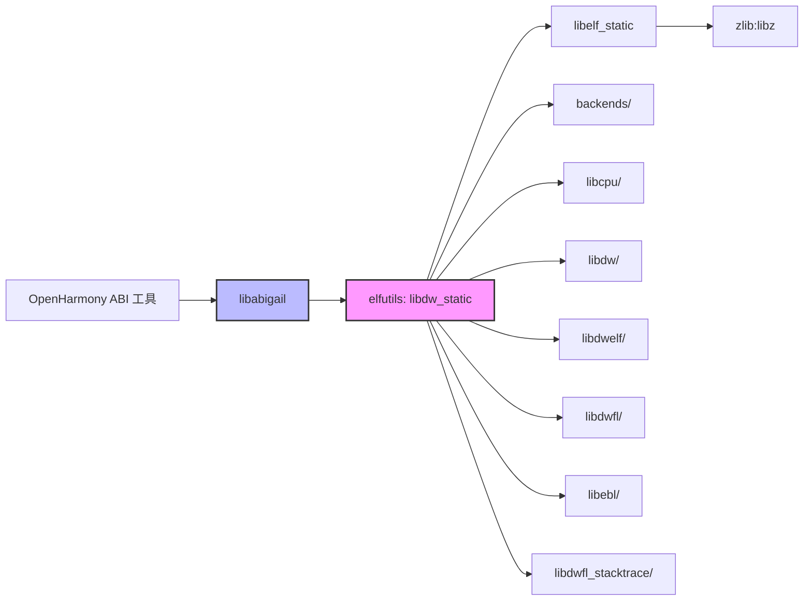

# 依赖关系与使用

---

## 直接依赖者

### 主要依赖者

| 模块 | BUILD.gn 路径 | 依赖类型 | 使用库 | 用途 |
|------|---------------|---------|---------|-----|
| libabigail (src) | third_party/libabigail/src/BUILD.gn | external_deps | libdw_static | ABI 分析库，读取 DWARF 调试信息 |
| libabigail (tools) | third_party/libabigail/tools/BUILD.gn | 间接依赖 | libdw_static | ABI 检查工具链 |

### 依赖关系图



### 说明

- **主要依赖者**：libabigail（唯一直接使用者）
- **间接依赖**：任何使用 libabigail 的 OH 工具
- **使用范围**：宿主机编译（host_only），不用于设备运行时

---

## libabigail 依赖详情

### libabigail/src/BUILD.gn

位置：`third_party/libabigail/src/BUILD.gn`

```gn
ohos_static_library("libabigail_static") {
  configs = [ "//third_party/libabigail:libabigail_defaults" ]

  sources = [
    "abg-dwarf-reader.cc",
    "abg-elf-reader.cc",
    "abg-elf-helpers.cc",
    "abg-symtab-reader.cc",
    // ... 更多源文件
  ]

  include_dirs = [
    "//third_party/libabigail",
    "//third_party/libabigail/include",
    "//third_party/libabigail/src",
    "/usr/include/libxml2"
  ]

  external_deps = [
    "elfutils:libdw_static",  # 关键依赖
  ]

  ldflags = [ "-lxml2" ]
  defines = [ "ABIGAIL_ROOT_SYSTEM_LIBDIR=\"lib\"" ]
}
```

### libabigail 如何使用 elfutils

| elfutils 功能 | libabigail 使用场景 |
|-------------|------------------|
| **ELF 文件读取** (`libelf`) | 读取二进制文件的段、节、符号表 |
| **DWARF 解析** (`libdw`) | 提取类型信息、函数签名、变量定义 |
| **DWARF abbreviation** (`libdw`) | 解析调试信息的压缩表示 |
| **位置信息** (`libdw`) | 获取源文件名、行号、列号 |
| **架构支持** (`libebl`) | 支持多种 CPU 架构的 ABI 分析 |

### 使用示例

libabigail 在以下场景使用 elfutils：

1. **读取共享库**：
   ```cpp
   Dwarf *dwarf = dwarf_begin(libelf_handle, DWARF_C_READ);
   // 提取 DWARF 调试信息
   ```

2. **遍历编译单元**：
   ```cpp
   while (dwarf_next_cu_header(dwarf, &cu_header, ...) == 0) {
       // 处理每个编译单元
   }
   ```

3. **提取类型信息**：
   ```cpp
   Dwarf_Die *die = ...;
   const char *type_name = dwarf_diename(die);
   // 获取类型名称
   ```

---

## 使用方式

### 链接方式

**静态链接**（Static Linking）

```gn
ohos_static_library("some_library") {
  external_deps = [
    "elfutils:libdw_static",
  ]
}
```

**说明**：
- libdw_static 是静态库（.a 文件）
- 所有符号在链接时解析
- 无运行时依赖

### 头文件引用方式

### 公共头文件

通过 `copy_header_file` 复制到输出目录：

```gn
copy("copy_header_file") {
  sources = [
    "//third_party/elfutils/libdwelf/libdwelf.h",
    "//third_party/elfutils/libdwfl/libdwfl.h",
    "//third_party/elfutils/libdw/libdw.h",
    "//third_party/elfutils/libdw/dwarf.h",
  ]
  outputs = [ "$target_out_dir/elfutils/{{source_file_part}}" ]
}
```

### 在代码中使用

```c
#include <dwarf.h>         // DWARF 核心接口
#include <libdw.h>        // libdw 主头文件
#include <libdwelf.h>     // ELF 工具
#include <libdwfl.h>      // 高级 DWARF 处理
```

### include_dirs 配置

```gn
include_dirs = [
  "//third_party/elfutils",
  "$target_out_dir",           // 包含复制的头文件
  "$target_out_dir/elfutils",  // elfutils 头文件目录
]
```

---

## 关键使用场景

### 场景 1：ABI 兼容性检查

**工具**：libabigail

**流程**：
1. 读取旧版本库的 DWARF 信息
2. 读取新版本库的 DWARF 信息
3. 比较类型、函数签名、布局变化
4. 生成 ABI 差异报告

**elfutils 作用**：
- 解析 DWARF 调试信息
- 提取类型和符号定义
- 提供位置信息（源文件、行号）

### 场景 2：ELF 文件分析

**工具**：libabigail 的 ELF 读取模块

**流程**：
1. 打开 ELF 文件（使用 `libelf`）
2. 读取段表、节表
3. 解析符号表
4. 提取必要的元数据

**elfutils 作用**：
- `elf_begin()` / `elf_end()` - 文件操作
- `elf_getscn()` - 获取节
- `gelf_getsym()` - 读取符号

### 场景 3：架构特定分析

**工具**：libabigail + libebl

**流程**：
1. 识别 ELF 文件架构
2. 加载对应的 libebl 后端
3. 解析架构特定的调试信息

**支持的架构**：
- aarch64（ARM64）
- arm（ARM32）
- riscv, riscv64（RISC-V）
- x86_64（Intel 64-bit）

---

## inner_kits 暴露

### bundle.json 配置

```json
{
  "component": {
    "name": "elfutils",
    "subsystem": "thirdparty",
    "inner_kits": [
      {
        "header": {
          "header_base": "third_party/elfutils",
          "header_files": []
        },
        "name": "//third_party/elfutils:libdw_static",
        "host_only": true
      }
    ]
  }
}
```

### 说明

- **仅 libdw_static 暴露**：libelf_static 等内部库不暴露
- **host_only**：仅用于宿主机编译，不打包到设备
- **header_files 为空**：头文件通过 copy_header_file 动态管理

---

## 编译目标限制

### host_only 标志

所有 elfutils 构建目标标记为 `host_only`：

```gn
ohos_static_library("libdw_static") {
  // ...
  subsystem_name = "thirdparty"
  part_name = "elfutils"
  // 隐含 host_only：未标记 device 类型
}
```

**影响**：
- 不编译到设备固件
- 仅在宿主机上运行的工具链中使用
- 不占用设备 ROM/RAM

### 运行时 vs 构建时

| 阶段 | 使用场景 | elfutils 参与 |
|------|---------|--------------|
| **构建时** | libabigail 生成 ABI 特征文件 | ✅ 是 |
| **运行时** | 设备运行的应用 | ❌ 否 |

---

## 依赖统计

### 依赖者数量

- **直接依赖**：1 个（libabigail）
- **间接依赖**：未知（使用 libabigail 的 OH 模块）

### 使用范围

| 范围 | 模块数量 | 示例 |
|------|----------|------|
| third_party | 1 | libabigail |
| foundation | 0 | - |
| development | 0 | - |
| 其他子系统 | 0 | - |

**说明**：elfutils 使用非常集中，仅在 libabigail 中使用。

---

## 潜在使用场景（未来）

### 场景：性能分析工具

如果 OH 未来需要性能分析工具（类似 `perf`），可能使用：

- **libdwfl_stacktrace** - 堆栈跟踪（0.193 新增，实验性）
- **libdwfl** - 进程和核心文件分析

### 场景：调试工具

如果需要本地调试工具，可能使用：

- **libdwfl** - DWARF 高级接口
- **libdwfl** - 堆栈展开

### 场景：符号解析

如果需要符号解析功能，可能使用：

- **libdwfl** - 符号解析和地址转换
- **libelf** - ELF 文件操作

**注意**：这些场景目前仅在宿主机工具中使用。

---

## 版本兼容性

### libabigail 依赖的 elfutils 功能

| 功能 | elfutils 版本要求 | OH 状态 |
|------|----------------|---------|
| DWARF 5 支持 | >= 0.171 | ✅ 0.193 |
| libdwfl 高级接口 | >= 0.150 | ✅ 0.193 |
| 架构后端 | 按需 | ✅ aarch64, arm, riscv, x86_64 |
| zlib 压缩 | >= 0.160 | ✅ 0.193 |

### 升级影响

如果升级 elfutils 到新版本：

1. **ABI 兼容**：libdw 的 API 相对稳定，小版本升级通常兼容
2. **新功能**：可以获取新的 DWARF 解析能力
3. **Bug 修复**：继承上游的修复

**建议**：
- 紧跟上游稳定版本（如 0.193）
- 测试 libabigail 的兼容性
- 保留 GN 构建文件

---

## 相关文档

- [Patch 分析](./02_Patches.md) - 源代码修改
- [构建集成](./03_Build_Integration.md) - GN 构建系统
- [库概览](./01_Overview.md) - 库的功能介绍
- [完整评估](_work/ASSESSMENT.md) - 依赖关系清单
