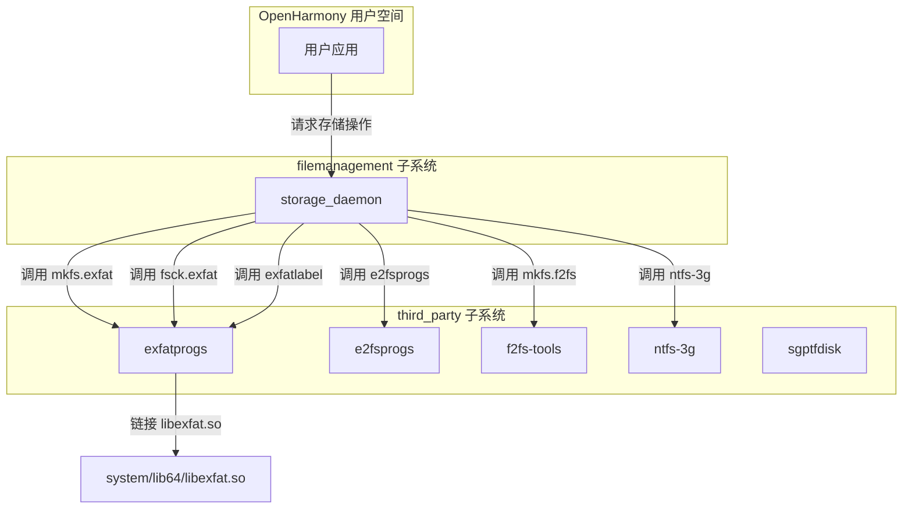
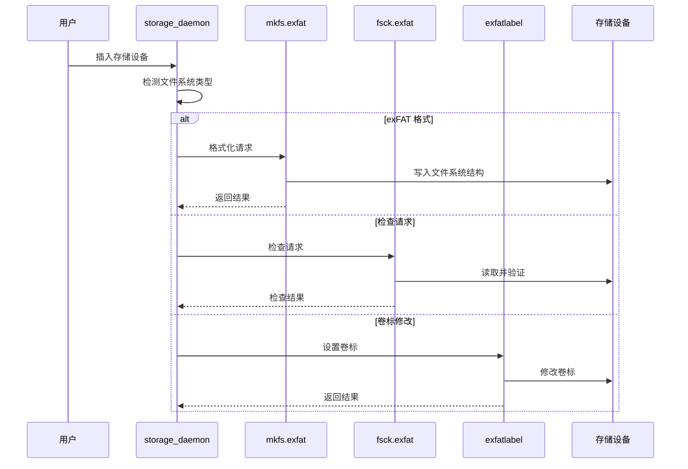

# 依赖关系与使用

## 4.1 直接依赖者

### 主要依赖模块

| 模块 | BUILD.gn 路径 | 依赖方式 | 用途 |
|-----|--------------|---------|------|
| **storage_daemon** | `foundation/filemanagement/storage_service/services/storage_daemon/BUILD.gn` | 外部依赖 (external_deps) | 文件系统工具调用 |

### 依赖详情

#### storage_daemon

**所属子系统**：filemanagement  
**组件名称**：storage_service  
**构建配置位置**：`foundation/filemanagement/storage_service/services/storage_daemon/BUILD.gn` (第 447-469 行)

**依赖声明**：
```gn
group("storage_daemon_third_party") {
  deps = []
  if (storage_service_external_storage_manager && storage_service_fstools) {
    external_deps = [
      # ... 其他文件系统工具
      "exfatprogs:exfatlabel",
      "exfatprogs:fsck.exfat",
      "exfatprogs:mkfs.exfat",
      # ... 其他文件系统工具
    ]
  }
  # ...
}
```

**依赖条件**：
- `storage_service_external_storage_manager` = true
- `storage_service_fstools` = true

**使用方式**：
storage_daemon 通过调用 exfatprogs 提供的命令行工具来执行 exFAT 文件系统操作，而非直接链接 libexfat 动态库。

### 其他潜在依赖者

根据依赖分析，exfatprogs 主要服务于 **storage_service** 子系统，用于管理外部存储设备的文件系统操作。

## 4.2 使用场景分析

### 场景一：外部存储设备格式化

**触发条件**：用户插入新的 exFAT 格式存储设备（SD 卡、USB 存储）

**调用流程**：
```
用户插入存储设备
    │
    ▼
storage_daemon 检测设备
    │
    ▼
调用 mkfs.exfat 格式化设备
    │
    ▼
挂载设备到文件系统
```

**命令行调用示例**：
```bash
mkfs.exfat -c 1048576 /dev/sda1  # 创建 exFAT，指定簇大小
```

### 场景二：文件系统一致性检查

**触发条件**：
- 设备异常卸载
- 系统启动时检查
- 用户手动触发检查

**调用流程**：
```
storage_daemon 发起检查请求
    │
    ▼
调用 fsck.exfat 检查设备
    │
    ▼
输出检查结果
    │
    ▼
如有损坏，调用 fsck.exfat -p -s 修复
```

**命令行调用示例**：
```bash
fsck.exfat /dev/sda1                    # 只读检查
fsck.exfat -p -s /dev/sda1              # 自动修复
fsck.exfat -y -s /dev/sda1              # 修复并自动确认
```

### 场景三：卷标管理

**触发条件**：用户修改设备卷标

**调用流程**：
```
用户设置卷标请求
    │
    ▼
storage_daemon 接收请求
    │
    ▼
调用 exfatlabel 设置卷标
```

**命令行调用示例**：
```bash
exfatlabel /dev/sda1 "我的SD卡"         # 设置卷标
exfatlabel /dev/sda1                     # 查询当前卷标
```

## 4.3 链接方式

### 命令行工具调用（非链接方式）

storage_daemon 使用 **子进程调用** 方式使用 exfatprogs：

| 特性 | 说明 |
|------|------|
| **调用方式** | fork + execve / spawn |
| **通信方式** | 标准输入/输出/错误管道 |
| **同步/异步** | 同步执行 |
| **错误处理** | 检查子进程退出码 |

**代码模式示例**：
```cpp
// 伪代码示例
int result = system("fsck.exfat /dev/sda1");
if (result != 0) {
    // 处理错误
}
```

### 动态链接方式（备选）

对于需要直接操作 exFAT 文件系统的场景，可通过链接 libexfat 实现：

```gn
ohos_shared_library("my_storage_lib") {
  # ...
  external_deps = [
    "exfatprogs:libexfat",  # 直接链接 libexfat
  ]
}
```

**API 使用示例**：
```c
#include <libexfat.h>

int FormatExfatDevice(const char *device_path) {
    struct exfat *ef;
    struct exfat_mkfs_options opts = {
        .cluster_size = 4096,
        .volume_label = "OHOS",
    };
    
    if (exfat_format(device_path, &opts) != 0) {
        return -1;
    }
    
    return 0;
}
```

## 4.4 依赖关系图

### 系统依赖图



### 调用链路图



## 4.5 头文件引用

### 命令行工具头文件

使用命令行工具时无需包含头文件，工具本身是独立可执行文件。

### 库 API 头文件

如需直接链接 libexfat，需包含以下头文件：

| 头文件 | 用途 |
|--------|------|
| `libexfat.h` | libexfat 核心 API |
| `exfat_dir.h` | 目录操作接口 |
| `exfat_fs.h` | 文件系统操作接口 |
| `exfat_ondisk.h` | On-disk 数据结构 |
| `list.h` | 链表实现 |

**引用方式**：
```c
// 在 BUILD.gn 中添加 include_dirs
include_dirs = [
  "//third_party/exfatprogs/include",
  "//third_party/exfatprogs/lib",
]

// 在源码中包含
#include <libexfat.h>
#include <exfat_dir.h>
```

## 4.6 版本兼容性

### OH 版本与上游版本对应

| OH 版本号 | 上游版本 | 兼容性状态 |
|-----------|----------|------------|
| 4.1 | 1.2.5 | 兼容 |

### API 兼容性

libexfat API 在次要版本升级中保持向后兼容：

| API 函数 | 稳定性 | 说明 |
|----------|--------|------|
| `exfat_mount()` | 稳定 | 挂载 exFAT 文件系统 |
| `exfat_unmount()` | 稳定 | 卸载文件系统 |
| `exfat_format()` | 稳定 | 格式化设备 |
| `exfat_fsck()` | 稳定 | 检查文件系统 |
| `exfat_read()` | 稳定 | 读取数据 |
| `exfat_write()` | 稳定 | 写入数据 |

## 4.7 依赖管理建议

### 构建时依赖

在 BUILD.gn 中添加对 exfatprogs 的依赖：

**方式一：命令行工具（子进程调用）**
```gn
external_deps = [
  "exfatprogs:exfatlabel",
  "exfatprogs:fsck.exfat",
  "exfatprogs:mkfs.exfat",
]
```

**方式二：动态链接库**
```gn
external_deps = [
  "exfatprogs:libexfat",
]
```

### 运行时依赖

- libexfat.so 需安装到 system/lib64/
- 命令行工具需安装到 system/bin/
- 运行时库路径自动配置，无需手动设置 LD_LIBRARY_PATH

## 4.8 故障排查

### 常见问题

| 问题 | 可能原因 | 解决方案 |
|------|----------|----------|
| mkfs.exfat 未找到 | 未启用安装 | 检查 BUILD.gn 中 install_enable |
| 权限被拒绝 | SELinux 或权限问题 | 检查设备访问权限 |
| 格式化失败 | 设备忙或只读 | 确认设备未被挂载 |
| 检查超时 | 大容量设备 | 正常现象，耐心等待 |

### 调试技巧

1. **启用详细输出**：在命令行添加 `-v` 参数
   ```bash
   fsck.exfat -v /dev/sda1
   ```

2. **检查返回码**：
   - 0：无错误
   - 1：文件系统错误已修复
   - 2：文件系统错误无法修复
   - 8：操作被取消

3. **日志查看**：检查 storage_daemon 日志获取详细错误信息
