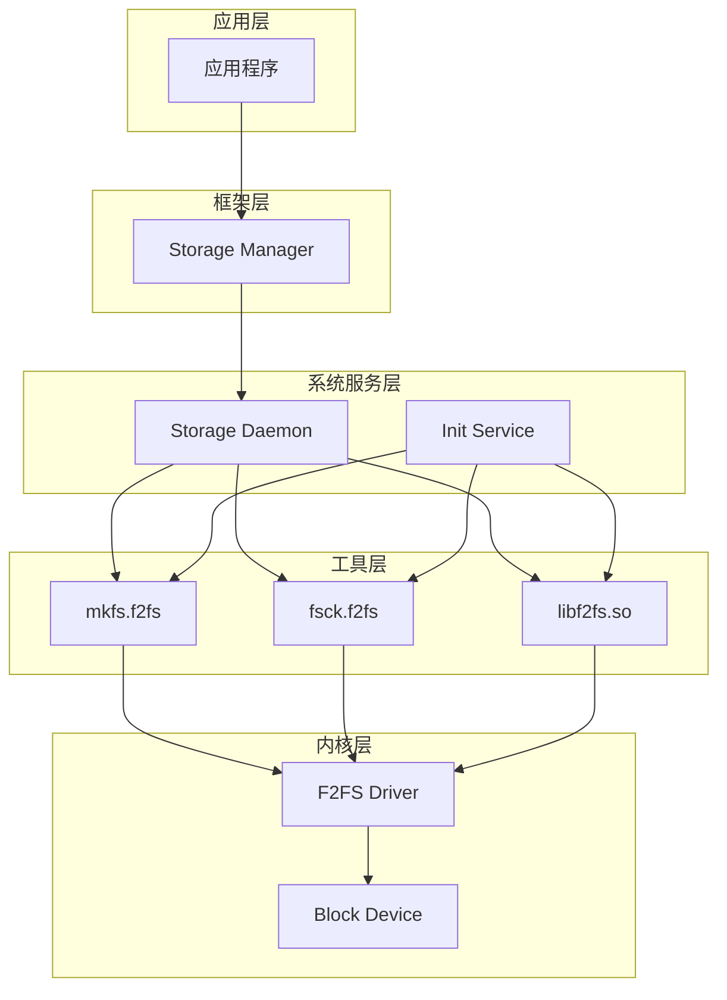
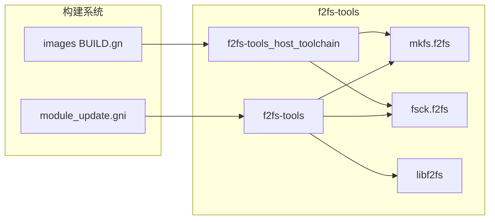

# 04 - OpenHarmony 中的依赖关系与使用

## 4.1 直接依赖者列表

通过搜索 OH 代码库中包含 `f2fs-tools` 的 BUILD.gn 文件，识别出以下直接依赖模块：

### 1. Storage Daemon（存储守护进程）

```
路径: foundation/filemanagement/storage_service/services/storage_daemon/BUILD.gn
```

**依赖配置**:
```gn
deps = [
    "f2fs-tools:fsck.f2fs",
    "f2fs-tools:libf2fs",
    "f2fs-tools:mkfs.f2fs",
]
```

**功能描述**:
- Storage Daemon 是 OpenHarmony 存储管理的核心服务
- 负责文件系统的挂载、卸载、格式化和检查
- 运行在系统服务层，为 Storage Manager 提供底层支持

**使用场景**:
1. 系统启动时检查和挂载 /data 分区
2. 恢复出厂设置时格式化 data 分区
3. 外部存储设备的文件系统操作

---

### 2. Init Service（初始化服务）

```
路径: base/startup/init/services/BUILD.gn
```

**依赖配置**:
```gn
deps = [
    "f2fs-tools:fsck.f2fs",
    "f2fs-tools:libf2fs",
    "f2fs-tools:mkfs.f2fs",
]
```

**功能描述**:
- Init 是 OpenHarmony 的第一个用户空间进程（PID 1）
- 负责系统启动初始化
- 在启动早期阶段执行文件系统检查和修复

**使用场景**:
1. 启动时检查 /data 分区是否需要 fsck
2. 首次启动时格式化 data 分区
3. 异常重启后的文件系统修复

---

### 3. 镜像构建系统

```
路径: build/ohos/images/BUILD.gn
```

**依赖配置**:
```gn
deps = [
    "//third_party/f2fs-tools:f2fs-tools_host_toolchain",
]
```

**功能描述**:
- 负责构建系统镜像（system.img, updater.img 等）
- 使用主机工具链版本的 f2fs-tools

**使用场景**:
1. 构建 system 镜像时创建 F2FS 文件系统
2. 构建 updater 镜像时创建恢复分区
3. 生成用于刷机的镜像文件

---

### 4. 模块更新系统

```
路径: build/templates/update/module_update.gni
```

**引用位置**:
```gn
"//${root_build_dir}/clang_arm64/thirdparty/f2fs-tools",
"//${root_build_dir}/clang_x64/thirdparty/f2fs-tools",
```

**功能描述**:
- 支持 OTA（Over-The-Air）更新
- 在更新过程中可能需要操作 F2FS 分区

---

## 4.2 依赖关系图

### 整体架构图



### 构建时依赖图



---

## 4.3 典型使用场景

### 场景 1: 系统启动时的文件系统检查

```
流程:
Init Service
    │
    ├── 检查 /data 分区状态
    │
    ├── 如果需要，调用 fsck.f2fs -a /dev/block/data
    │       │
    │       ├── 检查 superblock
    │       ├── 检查 checkpoint
    │       ├── 检查 NAT/SIT/SSA
    │       ├── 检查 node 和 data blocks
    │       └── 修复发现的错误
    │
    └── 挂载 /data 分区
```

**代码参考**（init/services）:
```c
// 伪代码示意
int CheckAndMountData() {
    // 1. 检查文件系统状态
    int ret = system("fsck.f2fs -a /dev/block/data");
    
    // 2. 根据返回结果处理
    if (ret != 0) {
        // 检查失败，可能需要格式化
        LOG_ERROR("fsck failed, ret=%d", ret);
    }
    
    // 3. 挂载分区
    mount("/dev/block/data", "/data", "f2fs", ...);
}
```

---

### 场景 2: 恢复出厂设置

```
流程:
Storage Manager (用户触发)
    │
    ├── 通知 Storage Daemon
    │
    ├── Storage Daemon 卸载 /data
    │
    ├── 调用 mkfs.f2fs /dev/block/data
    │       │
    │       ├── 写入 superblock
    │       ├── 创建 checkpoint
    │       ├── 初始化 NAT/SIT/SSA
    │       └── 创建根目录和 lost+found
    │
    └── 重新挂载 /data
```

**命令示例**:
```bash
# 格式化 data 分区
mkfs.f2fs -l data /dev/block/data

# 常用选项:
# -l LABEL    设置卷标
# -O feature  启用特性（如 compression, encryption）
# -S          稀疏文件支持
```

---

### 场景 3: OTA 升级时的镜像构建

```
流程:
构建系统
    │
    ├── 编译主机工具链版本
    │       └── f2fs-tools_host_toolchain
    │
    ├── 创建 system.raw 文件
    │
    ├── 使用 mkfs.f2fs 格式化 system.raw
    │
    ├── 挂载 system.raw
    │
    ├── 复制系统文件到镜像
    │
    └── 卸载并生成 system.img
```

**构建配置**（build/ohos/images/BUILD.gn）:
```gn
action("build_system_image") {
    deps = [ "//third_party/f2fs-tools:f2fs-tools_host_toolchain" ]
    
    # 使用主机 mkfs.f2fs 创建镜像
    script = "build_image.py"
    args = [
        "--mkfs",
        rebase_path("$root_build_dir/host_toolchain/mkfs.f2fs"),
        # ...
    ]
}
```

---

### 场景 4: 存储空间不足时的清理

```
流程:
Storage Manager
    │
    ├── 检测到存储空间不足
    │
    ├── 调用 fsck.f2fs 获取文件系统统计
    │       │
    │       └── 使用 libf2fs 接口
    │
    └── 触发缓存清理或提示用户
```

---

## 4.4 依赖关系统计

### 依赖分布

| 模块 | 依赖组件 | 用途 |
|-----|---------|------|
| Storage Daemon | fsck.f2fs, mkfs.f2fs, libf2fs | 完整的存储管理功能 |
| Init Service | fsck.f2fs, mkfs.f2fs, libf2fs | 启动时的文件系统操作 |
| Images Build | f2fs-tools_host_toolchain | 镜像构建 |
| Module Update | f2fs-tools | OTA 更新 |

### 组件重要性评估

| 组件 | 关键程度 | 说明 |
|-----|---------|------|
| fsck.f2fs | ⭐⭐⭐⭐⭐ | 系统启动必需，影响开机成功率 |
| mkfs.f2fs | ⭐⭐⭐⭐ | 恢复出厂设置和首次启动必需 |
| libf2fs | ⭐⭐⭐⭐ | Storage Daemon 依赖，影响存储服务 |
| f2fscrypt | ⭐⭐⭐ | 加密功能，影响数据安全 |
| f2fstat | ⭐⭐ | 诊断工具，非必需 |
| fibmap.f2fs | ⭐ | 调试工具，非必需 |

---

## 4.5 头文件导出

### bundle.json 配置

```json
{
    "inner_kits": [
        {
            "name": "//third_party/f2fs-tools/lib:libf2fs",
            "header": {
                "header_files": ["utf8data.h"],
                "header_base": "//third_party/f2fs-tools/lib"
            }
        },
        {
            "name": "//third_party/f2fs-tools/fsck:fsck.f2fs"
        },
        {
            "name": "//third_party/f2fs-tools/mkfs:mkfs.f2fs"
        }
    ]
}
```

**说明**:
- 仅导出 `utf8data.h` 头文件
- 其他内部头文件不对外暴露
- 二进制工具（fsck.f2fs, mkfs.f2fs）可直接依赖

---

## 4.6 使用建议

### 开发者指南

1. **直接使用工具**:
   ```gn
   deps = [ "f2fs-tools:fsck.f2fs" ]
   ```

2. **链接共享库**:
   ```gn
   deps = [ "f2fs-tools:libf2fs" ]
   ```

3. **包含头文件**:
   ```c
   #include "utf8data.h"  // 如需使用字符集功能
   ```

### 故障排查

| 问题 | 检查点 |
|-----|-------|
| fsck 失败 | 检查 /dev/kmsg 或 /log/f2fs-tools/fsck.log |
| 格式化失败 | 确认设备未被挂载，检查磁盘空间 |
| 库链接错误 | 确认 libf2fs.so 在 system 或 updater 分区 |
