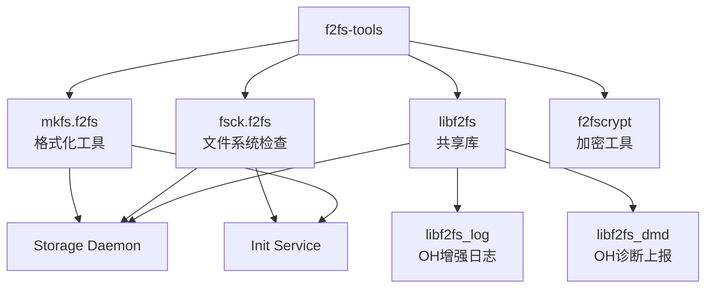

# f2fs-tools Wiki

## 库概览

f2fs-tools 是 OpenHarmony 系统中用于处理 F2FS（Flash-Friendly File System）文件系统的核心工具集。本 Wiki 重点介绍该库在 OpenHarmony 中的**定制化内容**，包括 Patch 分析、构建适配和使用方式。

### 快速导航

| 文档 | 内容 |
|-----|------|
| [01_Overview.md](./01_Overview.md) | 原始库简介、版本信息、在 OH 中的定位 |
| [02_Patches.md](./02_Patches.md) | **核心文档** - OH 特有的代码修改详细分析 |
| [03_Build_Integration.md](./03_Build_Integration.md) | BUILD.gn 结构、编译选项、与上游构建差异 |
| [04_Usage_in_OH.md](./04_Usage_in_OH.md) | 依赖关系、使用场景、依赖图 |
| [05_API_Differences.md](./05_API_Differences.md) | OH 新增的 API 和接口差异 |
| [06_Security.md](./06_Security.md) | 安全风险分析和升级建议 |

### 关键特性

### 版本信息

- **上游版本**: v1.16.0 (2023-04-11)
- **OH 组件版本**: 3.1
- **许可证**: GPL-2.0
- **上游地址**: https://git.kernel.org/pub/scm/linux/kernel/git/jaegeuk/f2fs-tools.git

### 重要提示

> ⚠️ **注意**：本 Wiki 专注于 OpenHarmony 的定制化内容，原始库的完整文档请参考上游项目。

### OH 特有增强

相比上游版本，OpenHarmony 的 f2fs-tools 增加了以下能力：

1. **增强日志系统** (`libf2fs_log.c`)
   - 支持写入内核日志 (kmsg)
   - 文件日志持久化到 `/log/f2fs-tools/` 或 `/dev/f2fs-tools/`
   - 多工具分类日志（fsck.log, mkfs.log 等）

2. **DFX 诊断模块** (`libf2fs_dmd.c`)
   - 文件系统错误统计和上报
   - 性能耗时监控（fsck 执行时间）
   - 通过 `/dev/storage` 接口上报到系统

3. **安全加固**
   - 集成 `bounds_checking_function` 安全函数库
   - 使用 strncpy_s、vsnprintf_s 等安全字符串函数

4. **WITH_OHOS 条件编译**
   - 禁用 SCSI 命令（非标准 Linux 环境兼容性）
   - 禁用交互式功能（适配无 TTY 环境）

---

## 文档状态

| 文档 | 状态 | 最后更新 |
|-----|------|---------|
| ASSESSMENT.md | ✅ 完成 | 2025-02-07 |
| 01_Overview.md | ✅ 完成 | 2025-02-07 |
| 02_Patches.md | ✅ 完成 | 2025-02-07 |
| 03_Build_Integration.md | ✅ 完成 | 2025-02-07 |
| 04_Usage_in_OH.md | ✅ 完成 | 2025-02-07 |
| 05_API_Differences.md | ✅ 完成 | 2025-02-07 |
| 06_Security.md | ✅ 完成 | 2025-02-07 |
