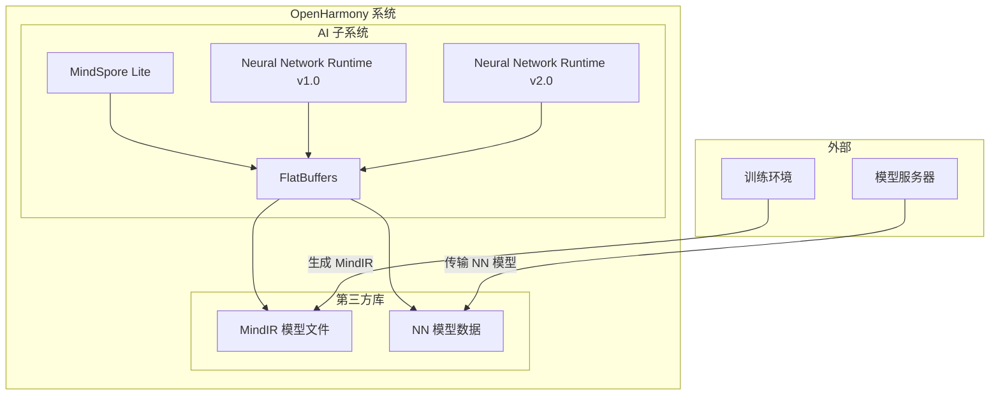
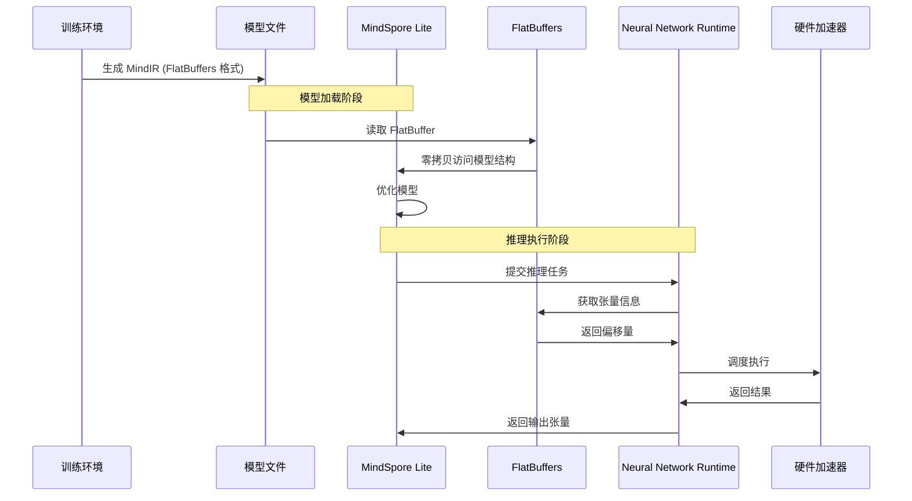

# OpenHarmony 使用场景与依赖关系

本文档详细说明 FlatBuffers 在 OpenHarmony 系统中的使用方式，包括直接依赖者分析、使用场景说明以及依赖关系图。

## 4.1 直接依赖者

### 4.1.1 依赖模块清单

FlatBuffers 在 OpenHarmony 中被以下模块直接依赖：

| 序号 | 模块名称 | BUILD.gn 路径 | 用途 | 依赖方式 |
|-----|---------|--------------|------|---------|
| 1 | **MindSpore Lite** | `//third_party/mindspore/mindspore-src/source/mindspore-lite/mir/tests/BUILD.gn` | MindIR 模型解析 | 头文件引用 |
| 2 | **NNRT v1.0** | `//foundation/ai/neural_network_runtime/example/drivers/nnrt/v1_0/hdi_cpu_service/BUILD.gn` | 模型数据序列化 | 头文件引用 |
| 3 | **NNRT v2.0** | `//foundation/ai/neural_network_runtime/example/drivers/nnrt/v2_0/hdi_cpu_service/BUILD.gn` | 模型数据序列化 | 头文件引用 |

### 4.1.2 依赖详情

#### MindSpore Lite

```gn
# third_party/mindspore/mindspore-src/source/mindspore-lite/mir/tests/BUILD.gn

ohos_shared_library("mir") {
  # ... 其他配置
  
  include_dirs = [
    "//third_party/flatbuffers/include",
    # ... 其他 include_dirs
  ]
  
  deps = [
    "//third_party/flatbuffers:libflatbuffers_static",
  ]
}
```

**使用场景**: MindIR（MindSpore Intermediate Representation）模型文件解析

**使用方式**:
- 静态链接 `libflatbuffers_static`
- 引用 FlatBuffers 头文件进行模型反序列化

---

#### Neural Network Runtime v1.0

```gn
# foundation/ai/neural_network_runtime/example/drivers/nnrt/v1_0/hdi_cpu_service/BUILD.gn

ohos_shared_library("hdi_cpu_service") {
  # ... 其他配置
  
  include_dirs = [
    "//third_party/flatbuffers/include",
    # ... 其他 include_dirs
  ]
  
  external_deps = [
    "flatbuffers:libflatbuffers_static",
  ]
}
```

**使用场景**: 神经网络模型数据的序列化和反序列化

**使用方式**:
- 动态链接（通过 `external_deps`）
- 使用 FlatBuffers 格式传输模型定义

---

#### Neural Network Runtime v2.0

```gn
# foundation/ai/neural_network_runtime/example/drivers/nnrt/v2_0/hdi_cpu_service/BUILD.gn

ohos_shared_library("hdi_cpu_service_v2") {
  # ... 其他配置
  
  include_dirs = [
    "//third_party/flatbuffers/include",
    # ... 其他 include_dirs
  ]
  
  external_deps = [
    "flatbuffers:libflatbuffers_static",
  ]
}
```

**使用场景**: V2.0 版本神经网络运行时，模型数据序列化

**使用方式**:
- 动态链接（通过 `external_deps`）
- 与 v1.0 相同的 FlatBuffers 使用模式

---

## 4.2 依赖关系图

### 4.2.1 系统依赖架构



### 4.2.2 构建依赖关系

```mermaid
graph LR
    subgraph "构建时"
[M        AindSpore Lite] -->|静态链接| F[FlatBuffers 静态库]
        B[NNRT v1.0] -->|动态链接| F2[FlatBuffers 动态库]
        C[NNRT v2.0] -->|动态链接| F2
    end
    
    subgraph "运行时"
        D[MindIR 文件] -->|反序列化| A
        E[NN 模型数据] -->|反序列化| B
    end
```

### 4.2.3 数据流图



---

## 4.3 典型使用场景

### 4.3.1 MindIR 模型加载

#### 场景描述

MindSpore Lite 使用 FlatBuffers 格式存储训练好的 AI 模型（MindIR）。在模型加载阶段，FlatBuffers 的零拷贝特性可以显著减少模型加载时间。

#### 代码示例

```cpp
#include "flatbuffers/flatbuffers.h"
#include "mindir/mindir_generated.h"

// 加载 MindIR 模型文件
std::vector<char> LoadModel(const std::string& path) {
    std::ifstream file(path, std::ios::binary);
    return std::vector<char>(std::istreambuf_iterator<char>(file), {});
}

// 使用 FlatBuffers 访问模型
void AnalyzeModel(const std::vector<char>& buffer) {
    flatbuffers::FlatBufferBuilder builder(buffer.size(), buffer.data());
    
    // 直接访问根对象，无需完整解析
    auto model = GetModel(buffer.data());
    
    // 获取模型元信息
    auto name = model->name();
    auto inputs = model->inputs();
    auto outputs = model->outputs();
    
    // 直接访问张量结构
    for (const auto& input : *inputs) {
        std::cout << "Input: " << input->name()->str() << std::endl;
        std::cout << "Shape: ";
        for (const auto& dim : *input->shape()) {
            std::cout << dim << " ";
        }
        std::cout << std::endl;
    }
}
```

#### 性能优势

| 指标 | 使用 FlatBuffers | 传统解析方式 |
|-----|-----------------|-------------|
| **加载时间** | 极快（内存映射） | 需要完整解析 |
| **内存占用** | 低（无需中间对象） | 高（解析对象） |
| **访问延迟** | 微秒级 | 毫秒级 |
| **部分读取** | 支持 | 不支持 |

---

### 4.3.2 神经网络模型序列化

#### 场景描述

Neural Network Runtime 使用 FlatBuffers 进行模型定义的双向序列化，支持模型的动态传输和更新。

#### 代码示例

```cpp
#include "flatbuffers/flatbuffers.h"
#include "nn/model_generated.h"

// 定义神经网络模型
flatbuffers::FlatBufferBuilder BuildModel() {
    flatbuffers::FlatBufferBuilder builder;
    
    // 创建输入张量
    auto input = CreateTensor(builder, 
        builder.CreateString("input"), 
        {1, 224, 224, 3},
        DataType_F32);
    
    // 创建卷积层
    auto conv = CreateConv2D(builder,
        input,
        CreateWeight(builder, ...),
        {1, 1},  // strides
        {1, 1, 1, 1});  // padding
    
    // 创建输出张量
    auto output = CreateTensor(builder,
        builder.CreateString("output"),
        {1, 1000},
        DataType_F32);
    
    // 构建模型
    auto model = CreateModel(builder,
        builder.CreateString("example_model"),
        builder.CreateVector({input}),
        builder.CreateVector({conv}),
        builder.CreateVector({output}));
    
    builder.Finish(model);
    return builder;
}
```

#### 序列化的优势

1. **紧凑性**: 二进制格式比 JSON/Protobuf 更紧凑
2. **可移植性**: 跨平台数据交换，无字节序问题
3. **可扩展性**: Schema 演进支持向前向后兼容
4. **安全性**: 零拷贝减少内存拷贝错误

---

### 4.3.3 跨语言数据交换

#### 场景描述

仓颉语言绑定使得可以在仓颉环境中使用 FlatBuffers 序列化的数据。

#### 仓颉代码示例

```cj
// cangjie/flatbuffer_object.cj

struct FlatBufferObject {
    // FlatBuffer 对象封装
    let buffer: Array<UInt8>
    let root: Offset
    
    init(buffer: Array<UInt8>) {
        this.buffer = buffer
        this.root = GetRoot(buffer)
    }
    
    func getTable<TableType>(offset: Offset): TableType {
        // 获取 Table 类型数据
        return __get_table(buffer, offset)
    }
}
```

---

## 4.4 头文件引用方式

### 4.4.1 标准引用

FlatBuffers 的头文件位于 `//third_party/flatbuffers/include/flatbuffers/`：

```cpp
// 核心头文件
#include "flatbuffers/flatbuffers.h"

// 代码生成头文件（由 flatc 编译生成）
#include "monster_generated.h"

// 反射头文件
#include "flatbuffers/reflection.h"
```

### 4.4.2 BUILD.gn 配置

```gn
ohos_shared_library("my_module") {
  # ...
  
  include_dirs = [
    "//third_party/flatbuffers/include",
  ]
  
  deps = [
    "//third_party/flatbuffers:libflatbuffers_static",
  ]
}
```

---

## 4.5 链接方式详解

### 4.5.1 静态链接

**适用模块**: MindSpore Lite

```gn
ohos_shared_library("mindspore_lite") {
  # ...
  
  deps = [
    "//third_party/flatbuffers:libflatbuffers_static",
  ]
}
```

**特点**:
- 库代码直接链接到模块中
- 无运行时依赖问题
- 可执行文件体积较大

---

### 4.5.2 动态链接

**适用模块**: Neural Network Runtime

```gn
ohos_shared_library("hdi_cpu_service") {
  # ...
  
  external_deps = [
    "flatbuffers:libflatbuffers_static",
  ]
}
```

**特点**:
- 运行时从系统库加载
- 可执行文件体积较小
- 便于库版本升级

---

## 4.6 依赖管理建议

### 4.6.1 版本升级影响

| 依赖模块 | 升级影响 | 建议 |
|---------|---------|------|
| MindSpore Lite | 高 | 全面回归测试 |
| NNRT v1.0 | 中 | 验证模型兼容性 |
| NNRT v2.0 | 中 | 验证模型兼容性 |

### 4.6.2 兼容性矩阵

| FlatBuffers 版本 | MindSpore Lite | NNRT v1.0 | NNRT v2.0 |
|-----------------|----------------|----------|----------|
| v25.2.10 | 兼容 | 兼容 | 兼容 |

---

## 4.7 小结

FlatBuffers 在 OpenHarmony 中主要服务于 AI 相关模块：

1. **依赖者**: MindSpore Lite、Neural Network Runtime（v1.0 和 v2.0）
2. **使用方式**: 主要通过头文件引用进行模型数据的序列化和反序列化
3. **性能优势**: 零拷贝特性显著提升模型加载和数据访问效率
4. **生态扩展**: 通过仓颉语言绑定支持仓颉编程语言

FlatBuffers 作为高性能序列化基础设施，有效支撑了 OpenHarmony AI 子系统的运行需求。

---

## 参考资料

- [FlatBuffers 官方指南](https://google.github.io/flatbuffers/)
- [MindSpore Lite 文档](https://www.mindspore.cn/lite)
- [Neural Network Runtime 文档](https://gitee.com/openharmony/neural_network_runtime)
