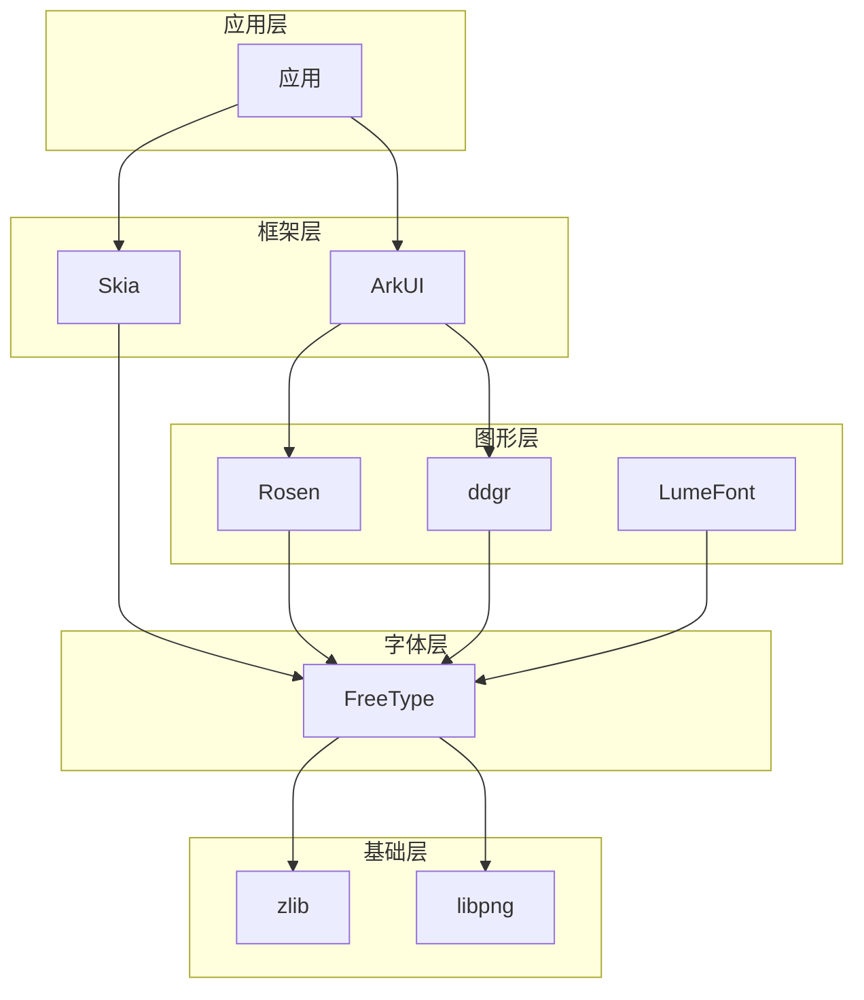

# 依赖关系与使用

本文档详细说明 FreeType 在 OpenHarmony 系统中的使用情况和依赖关系。

---

## 1. 直接依赖者

### 1.1 完整依赖列表

从 BUILD.gn visibility 分析，FreeType 被以下模块直接依赖：

| 模块 | 路径 | 用途 |
|------|------|------|
| **UI 框架** |||
| ui_lite | `//foundation/arkui/ui_lite` | 轻量级 UI 框架字体渲染 |
| ui_ext_lite (ext/updater) | `//foundation/arkui/ui_ext_lite/ext/updater` | 更新器布局 |
| ui_ext_lite (tools/ide) | `//foundation/arkui/ui_ext_lite/tools/ide` | IDE 图形工具 |
| ui_ext_lite (home_host) | `//foundation/arkui/ui_lite/ext/home_host` | 主屏幕宿主 |
| ui_ext_lite (ide) | `//foundation/arkui/ui_ext_lite/ext/ide` | UI IDE |
| ui_ext_lite (test) | `//foundation/arkui/ui_lite/test/unittest` | 单元测试 |
| **图形引擎** |||
| ddgr | `//foundation/graphic/graphic_2d/rosen/modules/2d_engine/ddgr` | 2D 图形引擎 |
| 2d_graphics | `//foundation/graphic/graphic_2d/rosen/modules/2d_graphics` | 2D 图形模块 |
| LumeFont | `//foundation/graphic/graphic_3d/lume` | 3D 字体渲染 |
| spatial_text | `//foundation/graphic/spatial_recon/spatial_text` | 空间文本 |
| **第三方库** |||
| skia typeface | `//third_party/skia/m133:typeface_freetype` | Skia 字体后端 |
| skia typeface tests | `//third_party/skia/m133:typeface_freetype_tests` | Skia 测试 |
| **厂商适配** |||
| graphic_wear | `//vendor/huawei/foundation/graphic/graphic_wear` | 手表图形 |
| ui_ext (hisi) | `//vendor/hisi/confidential/contexthub/src/framework/hisi/ui/third_party` | 海思 UI |

### 1.2 主要使用场景

#### 场景 1: UI 框架字体渲染

```c
// ui_lite 中的典型使用
#include <ft2build.h>
#include <freetype/freetype.h>
#include <freetype/ftglyph.h>

// 加载系统字体
FT_Library ft_library;
FT_Face ft_face;

// 初始化 FreeType
FT_Init_FreeType(&ft_library);

// 加载字体文件
FT_New_Face(ft_library, "/system/fonts/Roboto.ttf", 0, &ft_face);

// 设置字体大小
FT_Set_Char_Size(ft_face, 0, 16 * 64, 300, 300);

// 渲染字符
FT_Load_Char(ft_face, 'A', FT_LOAD_RENDER);
```

#### 场景 2: 2D 图形引擎 glyph 渲染

```c
// ddgr 引擎中的使用
#include <freetype/freetype.h>
#include <freetype/ftoutline.h>

// 获取 glyph 轮廓
FT_GlyphSlot glyph = ft_face->glyph;
FT_Outline *outline = &glyph->outline;

// 转换为位图
FT_Render_Glyph(glyph, FT_RENDER_MODE_LCD);
```

#### 场景 3: Skia 字体后端集成

```cpp
// skia typeface_freetype 桥接
#include <freetype/freetype.h>

class SkFontMgr_Freetype {
public:
  // 使用 FreeType 创建字体
  sk_sp<SkTypeface> makeFromStream(std::unique_ptr<SkStreamAsset>);
};
```

---

## 2. 链接方式

### 2.1 静态链接

**使用方式**: 大多数模块使用静态链接

```gn
# BUILD.gn 中的典型配置
ohos_static_library("some_module") {
  # ...
  external_deps = [
    "freetype:freetype_static",
    "zlib:libz",
  ]
}
```

| 优点 | 缺点 |
|------|------|
| 部署简单，无额外依赖 | 增大最终二进制体积 |
| 无运行时依赖问题 | 更新库需要重新编译 |
| 启动速度快 | 内存使用略高 |

### 2.2 动态链接

**使用方式**: LiteOS-M 共享库模式

```gn
lite_library("freetype") {
  target_type = "shared_library"
  # ...
}
```

| 优点 | 缺点 |
|------|------|
| 减少重复代码 | 需要运行时库文件 |
| 便于库更新 | 启动略慢 |
| 内存共享 | 依赖管理复杂 |

---

## 3. 依赖关系图

### 3.1 整体依赖架构



### 3.2 详细依赖矩阵

```
                    FreeType
                       │
       ┌───────────────┼───────────────┐
       │               │               │
       ▼               ▼               ▼
   ui_lite         ddgr/skia       LumeFont
       │               │               │
       │               │               │
       ▼               ▼               ▼
  zlib + libpng   zlib + libpng   zlib + libpng
```

---

## 4. 头文件引用

### 4.1 必需头文件

```c
// 基础头文件
#include <ft2build.h>
#include <freetype/freetype.h>
#include <freetype/ftglyph.h>
#include <freetype/ftoutln.h>
#include <freetype/ftbitmap.h>

// 扩展头文件（如果需要）
#include <freetype/ftstroke.h>
#include <freetype/ftsynth.h>
```

### 4.2 OH 特有头文件

```c
// OH 配置头文件
#include <ftconfig.h>
```

---

## 5. API 使用统计

### 5.1 常用 API

| API | 使用频率 | 使用场景 |
|-----|----------|----------|
| `FT_Init_FreeType()` | 高 | 初始化 |
| `FT_Done_FreeType()` | 高 | 清理 |
| `FT_New_Face()` | 高 | 加载字体 |
| `FT_Done_Face()` | 高 | 释放字体 |
| `FT_Set_Char_Size()` | 高 | 设置尺寸 |
| `FT_Load_Char()` | 高 | 加载字符 |
| `FT_Render_Glyph()` | 高 | 渲染 glyph |
| `FT_Get_Kerning()` | 中 | 字距调整 |
| `FT_Outline_Render()` | 中 | 轮廓渲染 |
| `FT_Stream_*()` | 低 | 自定义流 |

### 5.2 扩展 API（通过 enable-funcs patch）

| API | 来源 | 使用场景 |
|-----|------|----------|
| `FT_Stream_New()` | enable-funcs | 自定义字体流 |
| `FT_Stream_Read()` | enable-funcs | 高级流操作 |
| `FT_GlyphLoader_Reset()` | enable-funcs | glyph 加载器管理 |
| `ft_glyphslot_free_bitmap()` | enable-funcs | 位图内存管理 |

---

## 6. 最佳实践

### 6.1 初始化和清理

```c
// 推荐：单例模式
static FT_Library g_ft_library = NULL;

FT_Library GetFreeTypeLibrary() {
  if (!g_ft_library) {
    FT_Init_FreeType(&g_ft_library);
  }
  return g_ft_library;
}

// 应用退出时清理
void CleanupFreeType() {
  if (g_ft_library) {
    FT_Done_FreeType(g_ft_library);
    g_ft_library = NULL;
  }
}
```

### 6.2 字体缓存

```c
// 推荐：缓存常用字体
static FT_Face g_system_font = NULL;

FT_Error LoadSystemFont() {
  if (g_system_font) {
    return FT_Err_Ok;
  }
  FT_Library library = GetFreeTypeLibrary();
  return FT_New_Face(library, "/system/fonts/default.ttf", 0, &g_system_font);
}
```

### 6.3 错误处理

```c
FT_Error LoadAndRenderChar(FT_Face face, FT_UInt char_code) {
  FT_Error error = FT_Load_Char(face, char_code, FT_LOAD_RENDER);
  if (error != FT_Err_Ok) {
    // 处理错误
    LOGE("Failed to load char: %u, error: %d", char_code, error);
    return error;
  }
  return FT_Err_Ok;
}
```

---

## 7. 常见问题

### 7.1 内存泄漏

```c
// 错误示例
void RenderText(const char* text) {
  FT_Face face;
  FT_New_Face(library, font_path, 0, &face);
  FT_Set_Char_Size(face, 0, 16*64, 300, 300);
  
  for (const char* p = text; *p; p++) {
    FT_Load_Char(face, *p, FT_LOAD_RENDER);
    // 使用 glyph...
  }
  // 错误：没有 FT_Done_Face
}
```

### 7.2 线程安全

```c
// FreeType 2.10+ 支持多线程
// 确保每个线程使用独立的 FT_Library
// 或者使用锁保护共享的 FT_Library
```

---

*文档版本: 1.0*
*最后更新: 2025-02-08*
