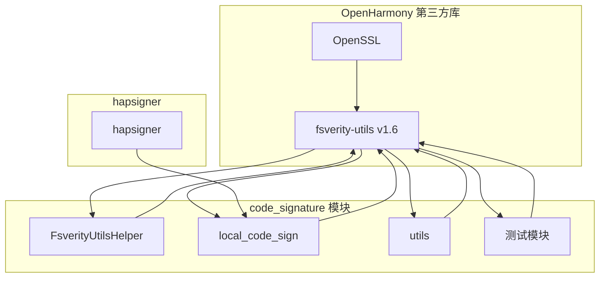

# fsverity-utils 在 OpenHarmony 中的使用

## 4.1 使用概述

### 在 OH 中的定位

fsverity-utils 是 OpenHarmony **代码签名子系统** (`base/security/code_signature`) 的核心依赖，提供文件系统级完整性验证能力。

```
┌─────────────────────────────────────────────────────────────┐
│                    OpenHarmony 架构                           │
├─────────────────────────────────────────────────────────────┤
│                                                              │
│  应用层                                                       │
│  ┌─────────────────────────────────────────────────────┐    │
│  │                    应用                              │    │
│  └─────────────────────────────────────────────────────┘    │
│                            │                                 │
│                            ▼                                 │
│  框架层                                                       │
│  ┌─────────────────────────────────────────────────────┐    │
│  │                 hapsigner                          │    │ ← 使用 fsverity 进行签名
│  │              (应用签名工具)                          │    │
│  └─────────────────────────────────────────────────────┘    │
│                            │                                 │
│                            ▼                                 │
│  系统服务层                                                    │
│  ┌─────────────────────────────────────────────────────┐    │
│  │              code_signature                         │    │ ← 核心依赖模块
│  │            (本地代码签名)                            │    │
│  │                  │                                  │    │
│  │                  ▼                                  │    │
│  │            FsverityUtilsHelper                      │    │
│  │                  │                                  │    │
│  │                  ▼                                  │    │
│  │            fsverity-utils                          │    │ ← 第三方库
│  └─────────────────────────────────────────────────────┘    │
│                                                              │
└─────────────────────────────────────────────────────────────┘
```

---

## 4.2 直接依赖者

### BUILD.gn 依赖文件列表

| 序号 | 文件路径 | 用途 | 依赖类型 |
|------|----------|------|----------|
| 1 | `base/security/code_signature/code_signature.gni` | 定义配置变量 | 引用 |
| 2 | `base/security/code_signature/utils/BUILD.gn` | 签名源文件集 | 外部依赖 |
| 3 | `base/security/code_signature/services/local_code_sign/BUILD.gn` | 本地代码签名服务 | 外部依赖 |
| 4 | `base/security/code_signature/test/unittest/BUILD.gn` | 单元测试 | 外部依赖 |
| 5-8 | `base/security/code_signature/test/fuzztest/.../BUILD.gn` | Fuzz 测试 | 外部依赖 |

### 依赖关系详情

#### 1. code_signature.gni 配置

```gn
# base/security/code_signature/code_signature.gni

# 集中定义 fsverity-utils 路径
fsverity_utils_dir = "//third_party/fsverity-utils"
```

#### 2. utils/BUILD.gn 依赖

```gn
# base/security/code_signature/utils/BUILD.gn

source_set("fsverity_sign_src_set") {
  sources = [
    "$fsverity_utils_dir/lib/compute_digest.c",
    "$fsverity_utils_dir/lib/hash_algs.c",
    "$fsverity_utils_dir/lib/sign_digest.c",
    "$fsverity_utils_dir/lib/utils.c",
  ]

  include_dirs = [ "$fsverity_utils_dir/include" ]

  if (is_standard_system) {
    external_deps = [ "openssl:libcrypto_shared" ]
  }
}
```

#### 3. local_code_sign/BUILD.gn 依赖

```gn
# base/security/code_signature/services/local_code_sign/BUILD.gn

ohos_shared_library("liblocal_code_sign") {
  sources = [ ... ]

  deps = [
    ":some_internal_target",
    "//third_party/fsverity-utils:libfsverity_utils",  # 外部依赖
  ]
}
```

#### 4. 测试依赖

```gn
# base/security/code_signature/test/unittest/BUILD.gn

ohos_unittest("local_code_sign_utils_unittest") {
  ...
  external_deps = [
    "fsverity-utils:libfsverity_utils",
    ...
  ]
}
```

---

## 4.3 核心使用模块：FsverityUtilsHelper

### 封装类概述

`FsverityUtilsHelper` 是 OH 对 libfsverity 的 C++ 封装，提供面向对象的接口。

### 文件位置

| 文件 | 说明 |
|------|------|
| `base/security/code_signature/utils/src/fsverity_utils_helper.cpp` | 实现 |
| `base/security/code_signature/utils/include/fsverity_utils_helper.h` | 头文件 |

### 头文件内容

```cpp
#ifndef FSVERITY_UTILS_HELPER_H
#define FSVERITY_UTILS_HELPER_H

#include <libfsverity.h>
#include <mutex>
#include <string>

namespace OHOS {
namespace Security {
namespace CodeSign {

class FsverityUtilsHelper {
public:
    /**
     * @brief 获取单例实例
     */
    static FsverityUtilsHelper &GetInstance();

    /**
     * @brief 计算文件摘要
     * @param fd 文件描述符
     * @param params Merkle 树参数
     * @param digest 返回的摘要
     * @return 是否成功
     */
    bool ComputeDigest(int fd,
                       const libfsverity_merkle_tree_params &params,
                       struct libfsverity_digest **digest);

    /**
     * @brief 签名摘要
     * @param digest 待签名摘要
     * @param sigParams 签名参数
     * @param signature 返回的签名
     * @param sigSize 返回的签名大小
     * @return 是否成功
     */
    bool SignDigest(const struct libfsverity_digest *digest,
                    const libfsverity_signature_params &sigParams,
                    uint8_t **signature,
                    size_t *sigSize);

    /**
     * @brief 设置错误回调
     * @param cb 回调函数
     */
    void SetErrorCallback(void (*cb)(const char *msg));

private:
    FsverityUtilsHelper() = default;
    ~FsverityUtilsHelper() = default;

    // 禁止拷贝和赋值
    FsverityUtilsHelper(const FsverityUtilsHelper &) = delete;
    FsverityUtilsHelper &operator=(const FsverityUtilsHelper &) = delete;
};

}  // namespace CodeSign
}  // namespace Security
}  // namespace OHOS

#endif  // FSverity_UTILS_HELPER_H
```

### 实现要点

```cpp
// 使用 libfsverity API 计算摘要
bool FsverityUtilsHelper::ComputeDigest(int fd,
    const libfsverity_merkle_tree_params &params,
    struct libfsverity_digest **digest)
{
    int ret = libfsverity_compute_digest(
        &fd,
        [](void *fd, void *buf, size_t count) -> int {
            return read(*(int *)fd, buf, count);
        },
        &params,
        digest
    );
    return ret == 0;
}

// 设置错误回调
void FsverityUtilsHelper::SetErrorCallback(void (*cb)(const char *msg))
{
    libfsverity_set_error_callback(cb);
}
```

---

## 4.4 使用场景

### 场景 1：本地代码签名

#### 流程

```
┌──────────────────────────────────────────────────────────────┐
│                   本地代码签名流程                            │
├──────────────────────────────────────────────────────────────┤
│                                                              │
│  1. 打开文件                                                 │
│     └─► 获取文件描述符 fd                                     │
│                                                              │
│  2. 配置 Merkle 树参数                                       │
│     ├─ version = 1                                          │
│     ├─ hash_algorithm = SHA256                              │
│     ├─ file_size = 文件大小                                  │
│     └─ block_size = 4096                                    │
│                                                              │
│  3. 计算摘要                                                 │
│     └─► libfsverity_compute_digest()                        │
│                                                              │
│  4. 签名摘要                                                 │
│     └─► libfsverity_sign_digest()                           │
│                                                              │
│  5. 启用 fs-verity                                           │
│     └─► libfsverity_enable_with_sig()                        │
│                                                              │
└──────────────────────────────────────────────────────────────┘
```

#### 代码示例

```cpp
// 1. 配置参数
libfsverity_merkle_tree_params params = {
    .version = 1,
    .hash_algorithm = FS_VERITY_HASH_ALG_SHA256,
    .file_size = fileSize,
    .block_size = 4096,
};

// 2. 计算摘要
struct libfsverity_digest *digest = nullptr;
int ret = libfsverity_compute_digest(&fd, readFn, &params, &digest);
if (ret != 0) {
    // 处理错误
}

// 3. 签名
libfsverity_signature_params sigParams = {
    .keyfile = "/path/to/key.pem",
    .certfile = "/path/to/cert.pem",
};

uint8_t *signature = nullptr;
size_t sigSize = 0;
ret = libfsverity_sign_digest(digest, &sigParams, &signature, &sigSize);
if (ret != 0) {
    // 处理错误
}

// 4. 启用 fs-verity
ret = libfsverity_enable_with_sig(fd, &params, signature, sigSize);
if (ret != 0) {
    // 处理错误
}

// 5. 清理
free(digest);
free(signature);
```

### 场景 2：文件完整性验证

#### 流程

```
┌──────────────────────────────────────────────────────────────┐
│                   文件完整性验证流程                            │
├──────────────────────────────────────────────────────────────┤
│                                                              │
│  1. 读取文件摘要                                              │
│     └─► FS_IOC_MEASURE_VERITY ioctl                          │
│                                                              │
│  2. 验证签名                                                  │
│     └─► 检查签名有效性                                        │
│                                                              │
│  3. 验证信任链                                                │
│     └─► 检查证书链                                            │
│                                                              │
└──────────────────────────────────────────────────────────────┘
```

---

## 4.5 依赖图

### Mermaid 依赖关系图



### 依赖统计

| 类别 | 数量 | 说明 |
|------|------|------|
| 直接依赖 BUILD.gn | 8 | 包括测试和 fuzz |
| 核心依赖模块 | 1 | code_signature |
| 间接依赖 | 多 | 通过 code_signature |

---

## 4.6 头文件引用方式

### 方式一：通过 public_configs（推荐）

```gn
# BUILD.gn
ohos_executable("my_app") {
  sources = [ "src/main.cpp" ]

  # 自动包含头文件路径
  external_deps = [ "fsverity-utils:libfsverity_utils" ]
}
```

```cpp
// 代码中直接包含
#include <libfsverity.h>
```

### 方式二：手动指定 include_dirs

```gn
# BUILD.gn
ohos_executable("my_app") {
  sources = [ "src/main.cpp" ]

  external_deps = [ "fsverity-utils:libfsverity_utils_static" ]

  # 手动添加头文件路径
  include_dirs = [
    "//third_party/fsverity-utils/include",
    "//third_party/fsverity-utils/common",
  ]
}
```

---

## 4.7 链接方式

### 动态链接（共享库）

```gn
# 使用共享库
external_deps = [ "fsverity-utils:libfsverity_utils" ]

# 运行时依赖
# libfsverity_utils.so → libcrypto.so
```

**优点**：
- 减少 ROM/RAM 占用
- 便于安全更新
- 链接时间短

**缺点**：
- 运行时依赖
- 加载开销

### 静态链接

```gn
# 使用静态库
external_deps = [ "fsverity-utils:libfsverity_utils_static" ]
```

**优点**：
- 无运行时依赖
- 可能优化性能

**缺点**：
- 增加二进制大小
- 更新需重新编译

---

## 4.8 关键使用注意事项

### 1. 文件描述符管理

```cpp
// ✅ 正确：确保文件以只读方式打开
int fd = open(path, O_RDONLY);
if (fd < 0) {
    return ERROR;
}

// 使用后关闭
close(fd);

// ❌ 错误：不要以写入模式打开
int fd = open(path, O_RDWR);  // fs-verity 要求只读
```

### 2. 错误处理

```cpp
// ✅ 正确：检查返回值
int ret = libfsverity_compute_digest(...);
if (ret != 0) {
    LOG_ERROR("Compute digest failed: %d", ret);
    return false;
}

// ✅ 正确：使用错误回调
libfsverity_set_error_callback([](const char *msg) {
    LOG_ERROR("fsverity error: %s", msg);
});
```

### 3. 内存管理

```cpp
// ✅ 正确：释放分配的内存
struct libfsverity_digest *digest = nullptr;
libfsverity_compute_digest(..., &digest);
if (digest) {
    // 使用 digest
    free(digest);  // 必须释放
}

// ✅ 正确：释放签名
uint8_t *signature = nullptr;
size_t sigSize = 0;
libfsverity_sign_digest(..., &signature, &sigSize);
if (signature) {
    free(signature);  // 必须释放
}
```

### 4. 线程安全

```cpp
// ✅ 建议：使用单例模式 + 互斥锁
class FsverityUtilsHelper {
public:
    static FsverityUtilsHelper &GetInstance() {
        static FsverityUtilsHelper instance;
        return instance;
    }

    bool ComputeDigest(...) {
        std::lock_guard<std::mutex> lock(mutex_);
        // ...
    }

private:
    std::mutex mutex_;
};
```

---

## 4.9 测试用例

### 单元测试

```gn
# base/security/code_signature/test/unittest/BUILD.gn

ohos_unittest("local_code_sign_utils_unittest") {
  sources = [
    "src/local_code_sign_utils_test.cpp",
  ]

  external_deps = [
    "fsverity-utils:libfsverity_utils",
    "crypto_framework:utils",
    "ipc:ipc_single",
  ]

  include_dirs = [
    "//base/security/code_signature/utils/include",
    "//third_party/fsverity-utils/include",
  ]
}
```

### 测试覆盖

| 测试类型 | 覆盖场景 |
|----------|----------|
| 单元测试 | API 调用、参数验证 |
| 集成测试 | 与内核交互 |
| Fuzz 测试 | 边界条件、异常输入 |

---

## 4.10 常见问题

### Q1: 编译时找不到 libfsverity.h？

**解决**：
```gn
# 确保使用 public_configs
public_configs = [ "//third_party/fsverity-utils:libfsverity_public_config" ]
```

### Q2: 链接时提示未定义符号？

**解决**：
```gn
# 确保链接了正确的库
external_deps = [ "fsverity-utils:libfsverity_utils" ]
```

### Q3: 运行时崩溃？

**可能原因**：
1. 文件描述符无效
2. 内存未正确释放
3. 未设置错误回调

**排查**：
```cpp
// 启用错误回调
libfsverity_set_error_callback([](const char *msg) {
    printf("fsverity error: %s\n", msg);
});
```

---

## 4.11 总结

### 使用要点

| 要点 | 说明 |
|------|------|
| 主要使用者 | code_signature 模块 |
| 封装层 | FsverityUtilsHelper C++ 类 |
| 依赖方式 | 共享库为主 |
| 关键 API | compute_digest, sign_digest, enable |

### 推荐使用方式

```
1. 通过 FsverityUtilsHelper 单例使用
2. 启用错误回调
3. 正确管理内存
4. 遵循线程安全规范
```

---

## 参考文档

- [README.md](README.md) - 项目概述
- [01_Overview.md](01_Overview.md) - 原始库介绍
- [03_Build_Integration.md](03_Build_Integration.md) - 构建配置
- [05_API_Differences.md](05_API_Differences.md) - API 差异
- [code_signature README](../../../../base/security/code_signature/README.md)
