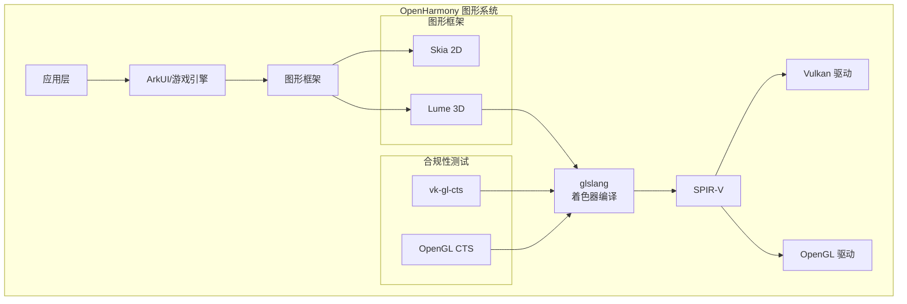

# glslang 概览

## 1. 基本信息

### 1.1 原始库简介

**glslang** 是由 Khronos Group 开发和维护的开源项目，是 OpenGL、OpenGL ES 和 Vulkan 生态系统的官方参考编译器前端。

| 属性 | 内容 |
|------|------|
| **官方名称** | glslang - OpenGL / OpenGL ES Reference Compiler |
| **上游仓库** | https://github.com/KhronosGroup/glslang |
| **上游版本** | vulkan-sdk-1.3.275.0 |
| **上游许可证** | Apache-2.0 |
| **编程语言** | C++17 |
| **构建系统** | CMake (上游) / GN (OH) |

### 1.2 核心功能

```
┌─────────────────────────────────────────────────────────────┐
│                      glslang 功能架构                         │
├─────────────────────────────────────────────────────────────┤
│                                                             │
│  GLSL/ESSL/HLSL 源码                                         │
│       ↓                                                     │
│  ┌─────────────────┐    ┌──────────────────┐              │
│  │  预处理器        │ → │  词法分析器        │              │
│  │  (Preprocessor) │    │  (Scanner)       │              │
│  └─────────────────┘    └──────────────────┘              │
│       ↓                                                     │
│  ┌─────────────────┐                                       │
│  │  语法分析器      │ → 抽象语法树 (AST)                      │
│  │  (Bison Parser) │                                       │
│  └─────────────────┘                                       │
│       ↓                                                     │
│  ┌─────────────────┐    ┌──────────────────┐              │
│  │  语义分析        │ → │  中间表示 (AST)   │              │
│  │  (Type Check)   │    │                  │              │
│  └─────────────────┘    └──────────────────┘              │
│       ↓                                                     │
│  ┌─────────────────┐    ┌──────────────────┐              │
│  │  SPIR-V 生成器   │ → │  SPIR-V 二进制    │              │
│  │  (Backend)      │    │                  │              │
│  └─────────────────┘    └──────────────────┘              │
│       ↓                                                     │
│  ┌─────────────────┐                                       │
│  │  SPVRemapper    │ → 重构/压缩 SPIR-V                     │
│  │  (可选)         │                                       │
│  └─────────────────┘                                       │
│                                                             │
└─────────────────────────────────────────────────────────────┘
```

### 1.3 支持的着色器类型

| 文件扩展名 | 着色器类型 |
|-----------|-----------|
| `.vert` | Vertex Shader (顶点着色器) |
| `.tesc` | Tessellation Control Shader |
| `.tese` | Tessellation Evaluation Shader |
| `.geom` | Geometry Shader (几何着色器) |
| `.frag` | Fragment Shader (片段着色器) |
| `.comp` | Compute Shader (计算着色器) |
| `.rgen` | Ray Generation Shader (光线生成) |
| `.rint` | Ray Intersection Shader |
| `.rahit` | Ray Any-Hit Shader |
| `.rchit` | Ray Closest-Hit Shader |
| `.rmiss` | Ray Miss Shader |
| `.rcall` | Callable Shader |

---

## 2. OpenHarmony 中的定位

### 2.1 组件信息

| 属性 | 内容 |
|------|------|
| **OH 组件名** | @ohos/glslang |
| **OH 组件版本** | 3.2 |
| **所属子系统** | thirdparty / graphic |
| **Part 名称** | glslang (thirdparty), graphic_2d (可执行文件) |
| **适配系统类型** | standard |
| **资源占用** | ROM: 100KB, RAM: 100KB |
| **OH 维护者** | zhangleiyu1@huawei.com |

### 2.2 在 OH 系统中的作用



### 2.3 主要使用场景

| 场景 | 使用者 | 说明 |
|------|--------|------|
| **CTS 测试** | vk-gl-cts | Khronos 合规性测试套件需要编译测试用例着色器 |
| **3D 引擎** | Lume (graphic_3d) | LumeBinaryCompile 使用 glslang 编译运行时着色器 |
| **开发工具** | glslang_validator | 命令行着色器验证工具 |
| **SPIR-V 处理** | spirv-remap | SPIR-V 重构和压缩工具 |

### 2.4 与相关组件的关系

| 组件 | 关系 | 说明 |
|------|------|------|
| **vk-gl-cts** | 主要依赖者 | 大量使用 glslang 进行 CTS 测试 |
| **SPIRV-Tools** | 可选依赖 | OH 中禁用，上游可选启用 |
| **Lume 3D** | 使用者 | LumeShaderCompiler 集成 |
| **Vulkan 驱动** | 消费者 | 接收 glslang 生成的 SPIR-V |

---

## 3. 版本与升级

### 3.1 当前版本特性

基于 Vulkan SDK 1.3.275.0 版本的关键特性：

- **SPIR-V 1.6** 支持
- **Vulkan 1.3** 支持
- **光线追踪**扩展支持
- **网格着色器** (GL_EXT_mesh_shader) 支持
- **协作矩阵** (GL_KHR_cooperative_matrix) 支持
- **非语义调试信息**支持

### 3.2 升级建议

| 考虑因素 | 建议 |
|----------|------|
| **升级难度** | 低 - 无 Patch，直接替换源码即可 |
| **构建适配** | 需检查 BUILD.gn 与新版本兼容性 |
| **API 变更** | 关注 `ShaderLang.h` 的 API 变更 |
| **测试要求** | 运行 vk-gl-cts 测试验证 |

### 3.3 与上游版本对比

| 方面 | 上游 | OpenHarmony |
|------|------|-------------|
| 版本 | 14.0.0+ | vulkan-sdk-1.3.275.0 |
| 构建系统 | CMake | GN |
| SPIRV-Tools | 可选 | 禁用 |
| HLSL 支持 | 完整 | 完整 |
| 测试框架 | Google Test | XTS |

---

## 4. 技术规格

### 4.1 编译选项

| 选项 | 值 | 说明 |
|------|-----|------|
| C++ 标准 | C++17 | 必需 |
| 异常 | 禁用 | `-fno-exceptions` |
| RTTI | 禁用 | `-fno-rtti` |
| 位置无关代码 | 启用 | `-fPIC` |
| HLSL 支持 | 启用 | `ENABLE_HLSL` |
| 优化器 | 禁用 | `ENABLE_OPT=0` |

### 4.2 输出产物

| 产物 | 类型 | 安装位置 |
|------|------|----------|
| `glslang` | 静态库 | 系统库目录 |
| `glslang_validator` | 可执行文件 | SDK 工具目录 |
| `spirv-remap` | 可执行文件 | SDK 工具目录 |

---

## 5. 参考资源

### 5.1 官方文档

- **glslang 项目主页**: https://github.com/KhronosGroup/glslang
- **Khronos 参考编译器**: https://www.khronos.org/opengles/sdk/tools/Reference-Compiler/
- **SPIR-V 规范**: https://www.khronos.org/registry/spir-v/
- **GLSL 规范**: https://www.khronos.org/registry/OpenGL/specs/gl/

### 5.2 OpenHarmony 相关

- **源码位置**: `third_party/glslang/`
- **vk-gl-cts**: `third_party/vk-gl-cts/`
- **graphic_3d**: `foundation/graphic/graphic_3d/`
- **构建配置**: `build/compile_standard_whitelist.json`
