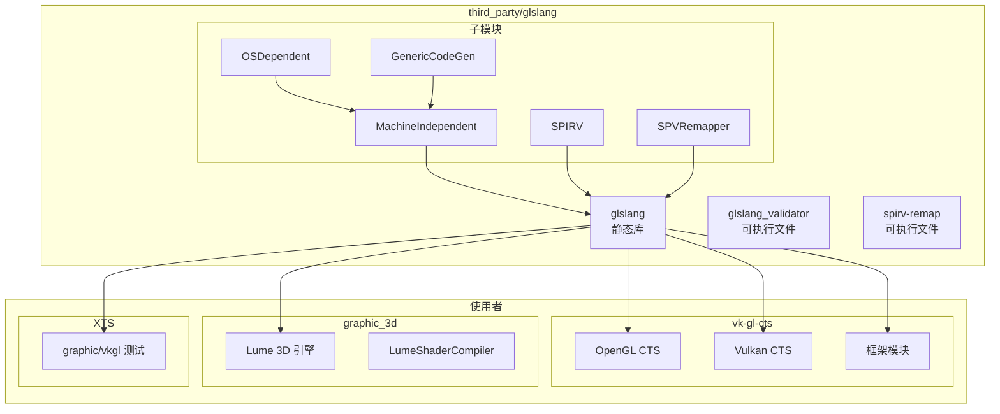
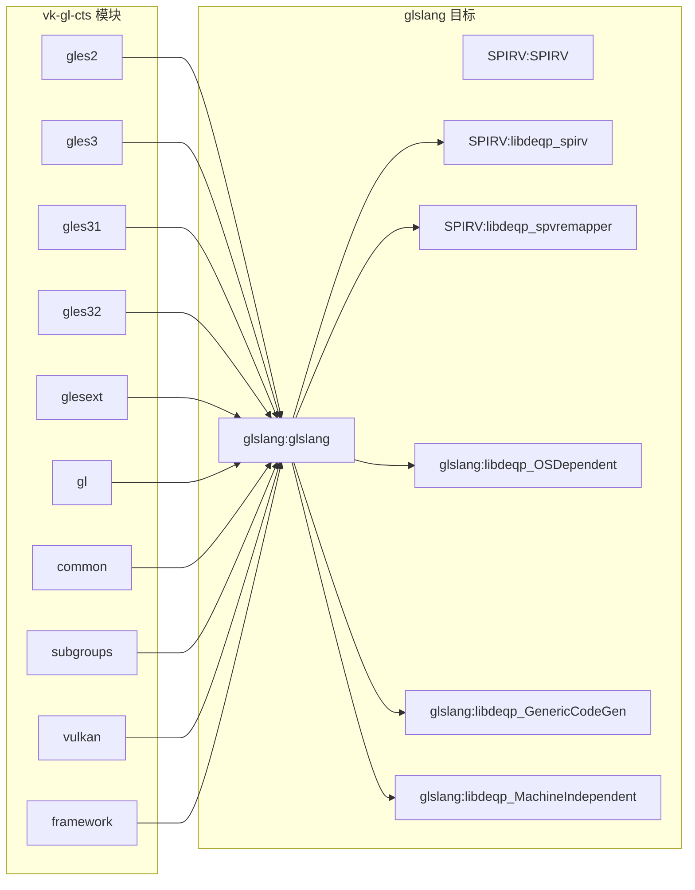

# glslang 在 OpenHarmony 中的使用

## 1. 依赖关系总览

### 1.1 依赖者统计

通过搜索 `third_party/glslang` 引用：

- **总匹配数**: 172 处
- **涉及文件**: 32 个文件
- **主要模块**: vk-gl-cts, graphic_3d, XTS

### 1.2 依赖者分类

```
┌─────────────────────────────────────────────────────────────┐
│                    glslang 依赖关系图                        │
├─────────────────────────────────────────────────────────────┤
│                                                             │
│                         glslang                             │
│                    (third_party/glslang)                    │
│                             │                               │
│           ┌─────────────────┼─────────────────┐            │
│           ▼                 ▼                 ▼            │
│    ┌────────────┐   ┌──────────────┐   ┌──────────┐       │
│    │ vk-gl-cts  │   │ graphic_3d   │   │ XTS      │       │
│    │  (CTS测试)  │   │  (Lume 3D)   │   │ (测试框架)│       │
│    └────────────┘   └──────────────┘   └──────────┘       │
│                                                             │
└─────────────────────────────────────────────────────────────┘
```

---

## 2. 主要依赖者详情

### 2.1 vk-gl-cts (Vulkan/OpenGL CTS)

**定位**: 最大的 glslang 使用者

**路径**: `third_party/vk-gl-cts/`

**使用的 BUILD.gn 目标**:

| 目标 | 路径 | 说明 |
|------|------|------|
| glslang | `//third_party/glslang` | 根目标 |
| glslang | `//third_party/glslang/glslang` | glslang 库 |
| SPIRV | `//third_party/glslang/SPIRV` | SPIRV 库 |
| libdeqp_spirv | `//third_party/glslang/SPIRV` | 静态库 |
| libdeqp_spvremapper | `//third_party/glslang/SPIRV` | SPVRemapper |
| libdeqp_GenericCodeGen | `//third_party/glslang/glslang` | 代码生成 |
| libdeqp_MachineIndependent | `//third_party/glslang/glslang` | 核心库 |
| libdeqp_OSDependent | `//third_party/glslang/glslang` | OS 抽象层 |
| libdeqp_glslang | `//third_party/glslang/glslang` | glslang 主库 |

**使用的子模块**:

```
third_party/vk-gl-cts/
├── external/openglcts/
│   ├── modules/gles2/BUILD.gn
│   ├── modules/gles3/BUILD.gn
│   ├── modules/gles31/BUILD.gn
│   ├── modules/gles32/BUILD.gn
│   ├── modules/glesext/BUILD.gn
│   ├── modules/gl/BUILD.gn
│   └── modules/common/
│       ├── BUILD.gn
│       └── subgroups/BUILD.gn
├── external/vulkancts/
│   ├── modules/vulkan/BUILD.gn
│   └── framework/vulkan/BUILD.gn
└── framework/platform/BUILD.gn
```

**用途**: 
- 编译 CTS 测试用例中的着色器
- 验证 GLSL/HLSL 到 SPIR-V 的转换
- 生成用于驱动测试的 SPIR-V 代码

**依赖方式示例**:

```gn
# external/openglcts/modules/common/BUILD.gn
deps = [
  "//third_party/glslang",
  "//third_party/glslang/glslang",
  "//third_party/glslang/SPIRV",
  "//third_party/glslang/SPIRV:libdeqp_spirv",
  "//third_party/glslang/SPIRV:libdeqp_spvremapper",
  "//third_party/glslang/glslang:libdeqp_GenericCodeGen",
  "//third_party/glslang/glslang:libdeqp_MachineIndependent",
  "//third_party/glslang/glslang:libdeqp_OSDependent",
  "//third_party/glslang/glslang:libdeqp_glslang",
]
```

### 2.2 graphic_3d (Lume 3D 引擎)

**定位**: 图形框架使用者

**路径**: `foundation/graphic/graphic_3d/lume/LumeBinaryCompile/LumeShaderCompiler/`

**使用方式**:

```cmake
# CMakeLists.txt
set(GLSLANG_PATH "${OHOS_ROOT_PATH}/third_party/glslang")
```

**用途**:
- LumeBinaryCompile 使用 glslang 编译运行时着色器
- 将 GLSL 源码编译为 SPIR-V 供 Vulkan 使用
- 集成在 3D 渲染管线中

**特点**:
- 使用 CMake 直接引用 glslang 源码路径
- 构建时链接 glslang 库
- 运行时调用 glslang API 编译着色器

### 2.3 XTS (eXtended Test Suite)

**定位**: 测试框架使用者

**路径**: `test/xts/`

**使用配置**:

```gni
# test/xts/acts/graphic/vkgl/comm.gni
deps = [
  "//third_party/glslang/OGLCompilersDLL:libdeqp_OGLCompiler",
  "//third_party/glslang/SPIRV:libdeqp_spirv",
  "//third_party/glslang/SPIRV:libdeqp_spvremapper",
  "//third_party/glslang/glslang:libdeqp_GenericCodeGen",
  "//third_party/glslang/glslang:libdeqp_MachineIndependent",
  "//third_party/glslang/glslang:libdeqp_OSDependent",
  "//third_party/glslang/glslang:libdeqp_glslang",
]
```

**用途**:
- 图形相关 XTS 测试
- 验证图形驱动行为
- 兼容层测试

---

## 3. 依赖关系图

### 3.1 完整依赖图



### 3.2 vk-gl-cts 详细依赖



---

## 4. 使用方式分析

### 4.1 静态链接

所有 OH 模块都使用**静态链接**方式使用 glslang：

```gn
# 依赖静态库
deps = [
  "//third_party/glslang:glslang",  # 根静态库
  # 或
  "//third_party/glslang/glslang:libdeqp_glslang",  # 子模块
]
```

**原因**:
- 避免运行时依赖
- 减小系统复杂度
- CTS 测试需要确定性行为

### 4.2 头文件引用

**公共头文件位置**: `third_party/glslang/glslang/Public/`

```cpp
// C++ API
#include <glslang/Public/ShaderLang.h>

// C API
#include <glslang/Include/glslang_c_interface.h>
#include <glslang/Public/resource_limits_c.h>
```

**bundle.json 配置**:

```json
{
  "build": {
    "inner_kits": [
      {
        "type": "so",
        "name": "//third_party/glslang:glslang",
        "header": {
          "header_files": [],
          "header_base": "//third_party/glslang/Public"
        }
      }
    ]
  }
}
```

### 4.3 典型使用场景

#### 场景 1: CTS 测试编译着色器

```cpp
// 伪代码，展示典型使用方式
#include <glslang/Public/ShaderLang.h>

void compileShaderForTest(const char* glslSource) {
    // 初始化 glslang 进程
    glslang::InitializeProcess();
    
    // 创建着色器对象
    glslang::TShader shader(EShLangVertex);
    shader.setStrings(&glslSource, 1);
    
    // 设置环境
    shader.setEnvInput(EShSourceGlsl, EShLangVertex, EShClientVulkan, 100);
    shader.setEnvClient(EShClientVulkan, EShTargetVulkan_1_1);
    shader.setEnvTarget(EShTargetSpv, EShTargetSpv_1_0);
    
    // 解析
    TBuiltInResource resources = glslang::DefaultTBuiltInResource;
    shader.parse(&resources, 100, false, ENoProfile, false, false, EShMsgDefault);
    
    // 链接程序
    glslang::TProgram program;
    program.addShader(&shader);
    program.link(EShMsgDefault);
    
    // 生成 SPIR-V
    std::vector<unsigned int> spirv;
    glslang::GlslangToSpv(*program.getIntermediate(EShLangVertex), spirv);
    
    // 清理
    glslang::FinalizeProcess();
}
```

#### 场景 2: Lume 3D 运行时编译

```cpp
// LumeShaderCompiler 使用示例
// 将运行时 GLSL 编译为 SPIR-V 供 Vulkan 使用

class ShaderCompiler {
public:
    std::vector<uint32_t> compile(const std::string& glslCode, ShaderType type) {
        // 使用 glslang C++ API 编译
        // 返回 SPIR-V 字节码
    }
};
```

#### 场景 3: 命令行工具验证

```bash
# 使用 glslang_validator 验证着色器
glslang_validator -V shader.vert -o shader.vert.spv

# 使用 spirv-remap 压缩/重构 SPIR-V
spirv-remap --map all -i input.spv -o output.spv
```

---

## 5. 编译标准白名单

### 5.1 白名单中的 glslang 目标

文件: `build/compile_standard_whitelist.json`

```json
[
  "//third_party/glslang/OGLCompilersDLL:libdeqp_OGLCompiler",
  "//third_party/glslang/SPIRV:SPIRV_source",
  "//third_party/glslang/SPIRV:libdeqp_spirv",
  "//third_party/glslang/SPIRV:libdeqp_spvremapper",
  "//third_party/glslang/glslang:MachineIndependent_source",
  "//third_party/glslang/glslang:glslang_source",
  "//third_party/glslang/glslang:libdeqp_GenericCodeGen",
  "//third_party/glslang/glslang:libdeqp_MachineIndependent",
  "//third_party/glslang/glslang:libdeqp_OSDependent",
  "//third_party/glslang/glslang:libdeqp_glslang",
  "//third_party/glslang/hlsl:libdeqp_hlsl",
  "//third_party/glslang:glslang_validator",
  "//third_party/glslang:spirv-remap"
]
```

**说明**:
- 白名单包含 glslang 的所有主要构建目标
- 表明 glslang 是经过验证的标准组件
- `OGLCompilersDLL` 目标存在但未在其他地方引用

---

## 6. OH SDK 集成

### 6.1 SDK 描述文件

文件: `build/ohos/sdk/ohos_sdk_description_std.json`

```json
{
  "module_label": "//third_party/glslang:glslang_validator"
}
{
  "module_label": "//third_party/glslang:spirv-remap"
}
```

**说明**: glslang 的两个可执行文件作为 SDK 工具提供。

### 6.2 安装位置

| 产物 | 安装位置 | 说明 |
|------|----------|------|
| glslang_validator | SDK 工具目录 | 着色器验证器 |
| spirv-remap | SDK 工具目录 | SPIR-V 重构工具 |

---

## 7. 使用建议

### 7.1 何时使用 glslang

| 场景 | 建议 | 原因 |
|------|------|------|
| **开发图形驱动** | ✅ 推荐 | 需要验证 GLSL/HLSL 兼容性 |
| **开发游戏引擎** | ⚠️ 评估 | 可考虑，但 DXC 可能是更好的 HLSL 选择 |
| **运行时着色器编译** | ⚠️ 评估 | glslang 较重，考虑预编译 SPIR-V |
| **CTS 测试** | ✅ 必须 | vk-gl-cts 依赖 |
| **工具链** | ✅ 推荐 | 命令行工具功能完整 |

### 7.2 性能考虑

| 方面 | 建议 |
|------|------|
| **初始化** | `InitializeProcess()` 较耗时，建议应用生命周期内只调用一次 |
| **内存** | 使用内存池分配器，避免频繁 new/delete |
| **线程安全** | glslang 实例不是线程安全的，每个线程需要独立实例 |
| **SPIR-V 优化** | OH 中禁用，如需优化请使用 spirv-opt 后处理 |

### 7.3 替代方案

| 替代方案 | 适用场景 | 比较 |
|----------|----------|------|
| **DXC** | HLSL 编译 | Microsoft 官方，HLSL 支持更好 |
| **shaderc** | 运行时编译 | Google 封装，API 更友好 |
| **预编译 SPIR-V** | 生产环境 | 避免运行时编译开销 |
| **SPIRV-Cross** | SPIR-V 反编译 | 用于反射或调试 |

---

## 8. 总结

### 8.1 核心使用模式

```
┌─────────────────────────────────────────────────────────────┐
│                    glslang 使用模式                          │
├─────────────────────────────────────────────────────────────┤
│                                                             │
│  ┌──────────────┐      ┌──────────────┐                    │
│  │  GLSL/HLSL   │ ───→ │   glslang    │ ───→ SPIR-V        │
│  │   源码       │      │   编译器      │                    │
│  └──────────────┘      └──────────────┘                    │
│                               ↑                             │
│                    ┌──────────┴──────────┐                 │
│                    ▼                     ▼                 │
│            ┌──────────────┐    ┌──────────────┐           │
│            │   CTS 测试    │    │  Lume 3D    │           │
│            │  (vk-gl-cts) │    │  (运行时)    │           │
│            └──────────────┘    └──────────────┘           │
│                                                             │
└─────────────────────────────────────────────────────────────┘
```

### 8.2 关键要点

1. **vk-gl-cts 是主要用户** - 172 处引用中大部分来自 CTS
2. **静态链接** - 所有模块使用静态链接
3. **CTS 兼容命名** - `libdeqp_*` 前缀表示历史兼容性
4. **工具链集成** - 两个可执行文件作为 SDK 工具提供
5. **生产建议** - 预编译 SPIR-V，避免运行时编译开销
