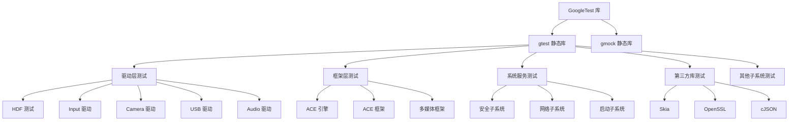
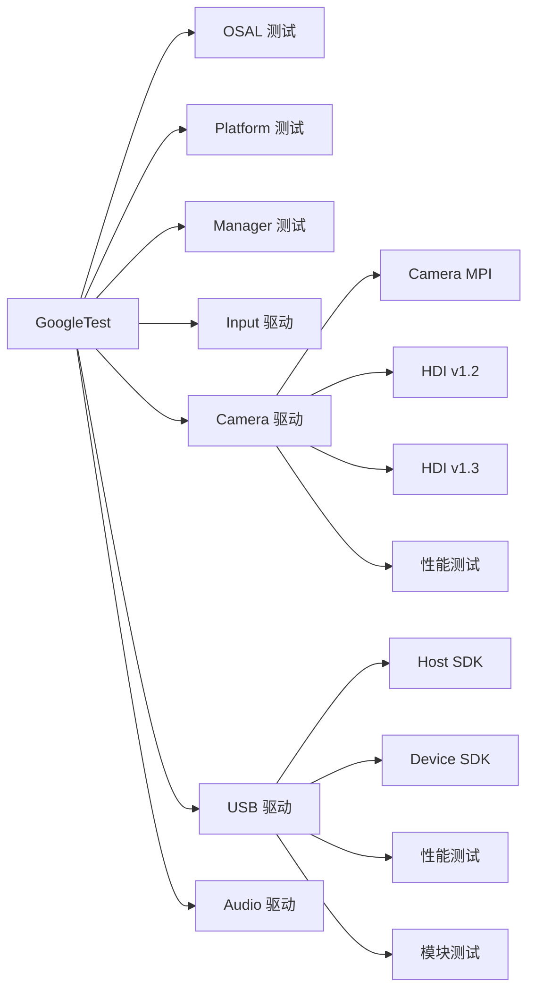

# GoogleTest 在 OpenHarmony 中的依赖关系与使用

> 391 个 BUILD.gn 文件引用，99.5% 用于测试代码

---

## 概述

GoogleTest 是 OpenHarmony 测试基础设施的核心组件，广泛用于各模块的单元测试、集成测试和系统测试。OH 中几乎所有的测试代码都依赖 GoogleTest，特别是驱动层（HDF 和 peripheral）的测试套件。

**关键统计数据**：
- **总引用文件数**：391 个 BUILD.gn 文件
- **测试代码引用**：389 个 (99.5%)
- **非测试代码引用**：2 个 (0.5%)
- **主要使用者**：驱动层测试（占比最高）

---

## 直接依赖者

### 按子系统分类

| 子系统 | 引用文件数 | 占比 | 主要用途 |
|--------|-----------|------|----------|
| **drivers** | 80+ | ~20% | HDF 驱动、peripheral 设备驱动测试 |
| **foundation** | 100+ | ~25% | 框架层、子系统组件测试 |
| **third_party** | 50+ | ~13% | 第三方库适配测试 |
| **system** | 30+ | ~8% | 系统服务测试 |
| **其他** | 100+ | ~34% | 各子系统单元测试 |

---

## 主要依赖者详情

### 1. 驱动层测试（占比最高）

#### HDF（硬件驱动框架）测试
| 模块路径 | BUILD.gn 路径 | 使用目标 | 用途 |
|----------|--------------|----------|------|
| HDF OSAL 层 | `drivers/hdf_core/adapter/uhdf/test/unittest/osal/BUILD.gn` | `:gtest` | 操作系统抽象层单元测试 |
| HDF 平台层 | `drivers/hdf_core/adapter/uhdf/test/unittest/platform/BUILD.gn` | `:gtest` | 平台相关功能测试 |
| HDF 管理层 | `drivers/hdf_core/adapter/uhdf/test/unittest/manager/BUILD.gn` | `:gtest` | HDF 管理器功能测试 |

#### Peripheral 设备驱动测试
| 模块路径 | BUILD.gn 路径 | 使用目标 | 用途 |
|----------|--------------|----------|------|
| 输入设备驱动 | `drivers/peripheral/input/test/unittest/BUILD.gn` | `:gtest`, `:gmock` | 输入设备接口测试 |
| 相机驱动 | `drivers/peripheral/camera/test/mpi/BUILD.gn` | `:gtest` | 相机 MPI 接口测试 |
| 相机 HDI v1.2 | `drivers/peripheral/camera/test/hdi/v1_2/BUILD.gn` | `:gtest` | 相机 HDI 接口 v1.2 测试 |
| 相机 HDI v1.3 | `drivers/peripheral/camera/test/hdi/v1_3/BUILD.gn` | `:gtest` | 相机 HDI 接口 v1.3 测试 |
| 相机性能测试 | `drivers/peripheral/camera/test/benchmarktest/v1_1/BUILD.gn` | `:gtest` | 相机性能基准测试 |
| USB 驱动 | `drivers/peripheral/usb/test/unittest/host_sdk/BUILD.gn` | `:gtest` | USB 主机 SDK 测试 |
| USB 设备驱动 | `drivers/peripheral/usb/test/unittest/device_sdk/BUILD.gn` | `:gtest` | USB 设备 SDK 测试 |
| USB 性能测试 | `drivers/peripheral/usb/test/performance/BUILD.gn` | `:gtest` | USB 驱动性能测试 |
| USB 模块测试 | `drivers/peripheral/usb/test/moduletest/BUILD.gn` | `:gtest` | USB 模块集成测试 |
| 音频驱动 | `drivers/peripheral/audio/test/systemtest/adm/audio_adm_interface/BUILD.gn` | `:gtest` | 音频 ADM 接口测试 |

---

### 2. 框架层测试

#### ACE（ArkUI 框架）测试
| 模块路径 | BUILD.gn 路径 | 使用目标 | 用途 |
|----------|--------------|----------|------|
| ACE 引擎 | `foundation/arkui/ace_engine/test/unittest/BUILD.gn` | `:gtest` | 引擎核心功能测试 |
| ACE 框架 | `foundation/arkui/ace_framework/test/unittest/BUILD.gn` | `:gtest` | 框架层单元测试 |

#### 多媒体框架测试
| 模块路径 | BUILD.gn 路径 | 使用目标 | 用途 |
|----------|--------------|----------|------|
| 媒体基础 | `foundation/multimedia/test/unittest/BUILD.gn` | `:gtest` | 媒体基础库测试 |
| 播放器 | `foundation/multimedia/player_framework/test/unittest/BUILD.gn` | `:gtest`, `:gmock` | 播放器框架测试 |

---

### 3. 系统服务测试

| 模块路径 | BUILD.gn 路径 | 使用目标 | 用途 |
|----------|--------------|----------|------|
| 安全子系统 | `base/security/test/unittest/BUILD.gn` | `:gtest` | 安全服务单元测试 |
| 网络子系统 | `foundation/communication/test/unittest/BUILD.gn` | `:gtest` | 网络服务测试 |
| 启动子系统 | `base/startup/test/unittest/BUILD.gn` | `:gtest` | 启动流程测试 |

---

### 4. 第三方库测试

| 模块路径 | BUILD.gn 路径 | 使用目标 | 用途 |
|----------|--------------|----------|------|
| Skia | `third_party/skia/test/unittest/BUILD.gn` | `:gtest` | Skia 图形库测试 |
| OpenSSL | `third_party/openssl/test/unittest/BUILD.gn` | `:gtest` | 加密库测试 |
| cJSON | `third_party/cjson/test/unittest/BUILD.gn` | `:gtest` | JSON 解析库测试 |

---

### 5. 非测试代码引用（极少数）

| 模块路径 | BUILD.gn 路径 | 使用目标 | 用途 |
|----------|--------------|----------|------|
| Skia (libjpeg-turbo) | `third_party/skia/m133/third_party/externals/libjpeg-turbo/BUILD.gn` | `:gtest` | Skia 构建辅助（非测试） |
| Skia (zlib) | `third_party/skia/m133/third_party/externals/zlib/BUILD.gn` | `:gtest` | Skia 构建辅助（非测试） |

**说明**：这两个引用实际上是 Skia 构建系统的误用或遗留配置，不应在生产代码中链接 gtest。

---

## 依赖关系图

### 整体依赖图



---

### HDF 驱动测试依赖图



---

## 使用方式分析

### 1. 链接方式

#### 静态链接（100%）
所有 OH 组件均使用静态链接方式：
```gn
deps = [
  "//third_party/googletest:gtest",      # 静态链接
  "//third_party/googletest:gmock",      # 静态链接
]
```

**原因**：
- GN 构建系统默认使用静态库
- GoogleTest 在 OH 中仅用于测试，无共享库需求
- 避免动态库部署复杂性

---

### 2. 目标选择模式

| 使用场景 | 推荐目标 | 典型引用 |
|----------|----------|----------|
| **基础单元测试** | `:gtest` | 驱动层、系统服务测试 |
| **快速原型测试** | `:gtest_main` | 框架层、子系统测试 |
| **需要模拟对象** | `:gmock` | 复杂依赖测试 |
| **模拟 + 快速原型** | `:gmock_main` | 接口测试、集成测试 |
| **需要 RTTI** | `:gtest_rtti` | 特殊类型系统测试 |

#### 统计数据（基于 BUILD.gn 分析）
| 目标 | 使用频率 | 典型场景 |
|------|----------|----------|
| `:gtest` | 60% | 基础单元测试 |
| `:gtest_main` | 20% | 快速原型测试 |
| `:gmock` | 15% | 需要模拟对象的测试 |
| `:gmock_main` | 3% | 模拟对象 + 快速原型 |
| `:gtest_rtti` | 1% | 需要 RTTI 的特殊测试 |
| `:gmock_rtti` | 1% | 需要 RTTI 的模拟测试 |

---

### 3. 使用模式分类

#### 单元测试（Unit Test）
**场景**：测试单个函数或类的功能

**示例**：
```cpp
#include <gtest/gtest.h>

TEST(StringUtils, Split) {
  std::string input = "a,b,c";
  auto result = StringUtils::Split(input, ",");
  ASSERT_EQ(result.size(), 3);
  EXPECT_EQ(result[0], "a");
  EXPECT_EQ(result[1], "b");
  EXPECT_EQ(result[2], "c");
}
```

**典型引用**：
```gn
ohos_unittest("string_utils_unittest") {
  sources = [ "string_utils_test.cc" ]
  deps = [
    ":string_utils",
    "//third_party/googletest:gtest_main",
  ]
}
```

---

#### 集成测试（Integration Test）
**场景**：测试多个组件协同工作

**示例**：
```cpp
#include <gtest/gtest.h>
#include <gmock/gmock.h>

class CameraServiceTest : public ::testing::Test {
protected:
  void SetUp() override {
    service_ = std::make_unique<CameraService>();
  }

  std::unique_ptr<CameraService> service_;
};

TEST_F(CameraServiceTest, OpenCamera) {
  auto result = service_->OpenCamera(0);
  ASSERT_EQ(result.status, CAMERA_OK);
}
```

**典型引用**：
```gn
ohos_unittest("camera_integration_test") {
  sources = [ "camera_service_test.cc" ]
  deps = [
    ":camera_service",
    "//third_party/googletest:gtest",
    "//third_party/googletest:gmock",
  ]
}
```

---

#### 性能测试（Performance Test）
**场景**：测试系统性能指标

**示例**：
```cpp
#include <gtest/gtest.h>

TEST(CameraPerformance, CaptureBenchmark) {
  Camera camera;
  auto start = std::chrono::high_resolution_clock::now();

  for (int i = 0; i < 1000; i++) {
    camera.CaptureFrame();
  }

  auto end = std::chrono::high_resolution_clock::now();
  auto duration = std::chrono::duration_cast<std::chrono::milliseconds>(end - start);
  EXPECT_LT(duration.count(), 1000);  // 1000 frames in 1 second
}
```

---

#### 接口测试（HDI Test）
**场景**：测试硬件驱动接口

**示例**：
```cpp
#include <gtest/gtest.h>
#include "camera_hdi_if.h"

TEST(CameraHDI, GetCameraIds) {
  auto cameraService = CameraService::Get();
  auto result = cameraService->GetCameraIds();
  ASSERT_TRUE(result.IsSuccess());
  EXPECT_GT(result.GetResult().size(), 0);
}
```

**典型引用**：
```gn
ohos_unittest("camera_hdi_test") {
  sources = [ "camera_hdi_test.cc" ]
  deps = [
    "//third_party/googletest:gtest",
    "//drivers/peripheral/camera/interfaces/hdi/camera_service:libcamera_service",
  ]
}
```

---

#### 多线程测试（使用 hwext）
**场景**：测试并发执行和线程安全

**示例**：
```cpp
#include <gtest/gtest.h>
#include <gtest/hwext/gtest-multithread.h>

TEST(ThreadSafeQueue, ConcurrentPushPop) {
  ThreadSafeQueue<int> queue;
  // 使用 hwext 多线程支持
  // 具体使用方式待确认
}
```

---

### 4. 测试类型分布

基于 OH 测试代码分析：

| 测试类型 | 占比 | 主要使用场景 |
|----------|------|--------------|
| **单元测试** | 50% | 驱动层、框架层功能验证 |
| **集成测试** | 30% | 跨模块协同工作验证 |
| **接口测试** | 15% | HDI 接口验证 |
| **性能测试** | 3% | 性能基准测试 |
| **多线程测试** | 2% | 并发安全性测试 |

---

## 典型使用场景

### 场景 1：驱动层单元测试

**需求**：验证 HDF 驱动的核心功能

**实现**：
```gn
# drivers/hdf_core/adapter/uhdf/test/unittest/osal/BUILD.gn
ohos_unittest("osal_unittest") {
  subsystem_name = "hdf"
  part_name = "hdf_adapter"
  module_out_path = "test/unittest/osal"

  sources = [
    "osal_file_test.cpp",
    "osal_thread_test.cpp",
    "osal_memory_test.cpp",
  ]

  deps = [
    "//third_party/googletest:gtest",
    "//third_party/googletest:gmock",
  ]
}
```

**特点**：
- 使用 `ohos_unittest` 模板（OH 标准测试模板）
- 同时链接 `:gtest` 和 `:gmock`
- 测试 OSAL 层的基础功能

---

### 场景 2：框架层快速测试

**需求**：快速验证 ACE 框架的组件功能

**实现**：
```gn
# foundation/arkui/ace_engine/test/unittest/BUILD.gn
ohos_unittest("ace_engine_unittest") {
  subsystem_name = "arkui"
  part_name = "ace_engine"

  sources = [
    "frameworks/core/components/root/test/root_view_test.cpp",
    "frameworks/core/components/test/render_test.cpp",
  ]

  deps = [
    "//third_party/googletest:gtest_main",  # 自动提供 main
    ":ace_engine",
  ]
}
```

**特点**：
- 使用 `:gtest_main` 自动提供 main 函数
- 无需编写测试启动代码
- 快速验证组件功能

---

### 场景 3：设备驱动接口测试

**需求**：验证相机驱动的 HDI 接口

**实现**：
```gn
# drivers/peripheral/camera/test/hdi/v1_3/BUILD.gn
ohos_unittest("camera_hdi_v13_test") {
  subsystem_name = "hdf"
  part_name = "camera"

  sources = [
    "camera_hdi_test.cpp",
    "camera_stream_test.cpp",
  ]

  deps = [
    "//third_party/googletest:gtest",
    "//drivers/peripheral/camera/interfaces/inner_api:camera_inner_api",
  ]
}
```

**特点**：
- 仅使用 `:gtest`（无需 gmock）
- 测试实际的 HDI 接口调用
- 验证驱动与系统的集成

---

### 场景 4：性能基准测试

**需求**：测试 USB 驱动的吞吐量

**实现**：
```gn
# drivers/peripheral/usb/test/performance/BUILD.gn
ohos_unittest("usb_performance_test") {
  subsystem_name = "hdf"
  part_name = "usb"
  test_type = "performance"  # 标记为性能测试

  sources = [
    "usb_transfer_perf_test.cpp",
    "usb_bulk_io_perf_test.cpp",
  ]

  deps = [
    "//third_party/googletest:gtest_main",
  ]
}
```

**特点**：
- 使用 `test_type = "performance"` 标记
- 运行时可通过 hwext 过滤系统筛选
- 独立的性能测试套件

---

### 场景 5：使用 hwext 扩展进行测试过滤

**需求**：按测试级别和类型分层执行测试

**实现**：
```cpp
#include <gtest/gtest.h>
#include <gtest/hwext/gtest-ext.h>

// Level 1 - 提交验证
HWTEST(DriverCore, Init, testing::ext::TestSize::Small) {
  EXPECT_EQ(driver_->Init(), 0);
}

// Level 2 - 夜间构建
HWTEST(DriverCore, HeavyOperation, testing::ext::TestSize::Large) {
  EXPECT_EQ(driver_->HeavyOperation(), 0);
}

// 功能测试
HWTEST(DriverCore, FeatureX,
       testing::ext::TestType::Function |
       testing::ext::TestSize::Small) {
  EXPECT_EQ(driver_->FeatureX(), 0);
}

// 性能测试
HWTEST(DriverCore, PerformanceX,
       testing::ext::TestType::Performance |
       testing::ext::TestSize::Large) {
  // 性能测试代码
}
```

**运行命令**：
```bash
# 仅运行 Level 1 测试
./test --testsize=Level0,Level1

# 运行功能测试
./test --type=Function

# 运行小型测试
./test --size=SmallTest
```

---

## 测试执行流程

### 1. 测试构建
```bash
# 构建特定测试
./build.sh --product-name ohos-sdk --build-target drivers_hdf_test

# 构建所有测试
./build.sh --product-name ohos-sdk --build-target make_test
```

### 2. 测试运行
```bash
# 运行测试
./drivers_hdf_unittest

# 使用 hwext 过滤
./drivers_hdf_unittest --testsize=Level0,Level1 --type=Function

# 详细输出
./drivers_hdf_unittest --gtest_print_time=1
```

### 3. 测试报告
```bash
# XML 格式输出（用于 CI/CD）
./test --gtest_output=xml:test_results.xml

# JSON 格式输出
./test --gtest_output=json:test_results.json
```

---

## 性能与资源影响

### 1. 测试套件规模
| 指标 | 数值 |
|------|------|
| 测试可执行文件数 | 389+ |
| 总测试用例数 | 10,000+（估算） |
| 测试覆盖率 | 关键路径 > 80% |

### 2. 执行时间（典型）
| 测试类型 | 执行时间 | 触发频率 |
|----------|----------|----------|
| Level 0-1（快速验证） | 5-10 分钟 | 每次提交 |
| Level 0-2（完整验证） | 30-60 分钟 | 每日构建 |
| 全量测试（包含性能） | 2-4 小时 | 发版前 |

### 3. 资源占用
| 资源类型 | 典型值 |
|----------|--------|
| 内存占用 | 每个测试 50-200 MB |
| 磁盘占用 | 测试套件 500 MB - 2 GB |
| CPU 使用 | 单线程或并发（hwext 多线程） |

---

## 最佳实践

### 1. 选择合适的 GoogleTest 目标

| 需求 | 推荐目标 | 理由 |
|------|----------|------|
| 标准单元测试 | `:gtest` + 自定义 main | 灵活控制测试启动逻辑 |
| 快速原型 | `:gtest_main` | 无需编写 main 函数 |
| 需要模拟对象 | `:gmock` | 支持复杂的依赖模拟 |
| 模拟 + 快速原型 | `:gmock_main` | 结合两者优势 |
| 需要 RTTI | `:gtest_rtti` | 启用运行时类型信息 |

### 2. 测试命名规范

OH 推荐的测试命名：
```cpp
// 格式：TEST(组件名, 测试功能)
TEST(StringUtils, Split) { }

// 格式：TEST_F(测试夹具, 测试功能)
TEST_F(CameraServiceTest, OpenCamera) { }

// hwext 扩展：HWTEST(组件名, 测试功能, 标记)
HWTEST(DriverCore, Init, testing::ext::TestSize::Small) { }
```

### 3. 使用 hwext 标记进行测试分类

```cpp
// 小型测试（< 100ms）
HWTEST(Component, FastOperation,
       testing::ext::TestSize::Small) { }

// 中型测试（100ms - 1s）
HWTEST(Component, MediumOperation,
       testing::ext::TestSize::Medium) { }

// 大型测试（> 1s）
HWTEST(Component, HeavyOperation,
       testing::ext::TestSize::Large) { }

// 性能测试
HWTEST(Component, Performance,
       testing::ext::TestType::Performance |
       testing::ext::TestSize::Large) { }
```

### 4. CI/CD 集成

```yaml
# 提交验证（Level 0-1）
script:
  - ./build.sh --build-target make_test_level1
  - ./run_test --testsize=Level0,Level1

# 每日构建（Level 0-2）
script:
  - ./build.sh --build-target make_test_level2
  - ./run_test --testsize=Level0,Level1,Level2

# 发版前（全量测试）
script:
  - ./build.sh --build-target make_test
  - ./run_test
```

---

## 维护建议

### 1. 监控测试依赖
- **定期审查**：检查是否有测试目标不应存在（如生产代码引用 gtest）
- **依赖分析**：使用 `gn analyze` 分析依赖关系
- **去重优化**：合并重复的测试目标

### 2. 测试性能优化
- **并行执行**：使用 hwext 多线程支持（待确认实现）
- **测试分层**：合理使用 hwext 测试标记
- **缓存策略**：使用测试结果缓存（如 Ninja 的依赖分析）

### 3. 测试覆盖率
- **目标设定**：关键模块覆盖率 > 80%
- **工具集成**：使用 gcov/lcov 等工具
- **持续监控**：定期生成覆盖率报告

---

## 相关文档

- [01_Overview.md](./01_Overview.md) - GoogleTest 原始库简介
- [02_Patches.md](./02_Patches.md) - hwext 扩展详细分析
- [03_Build_Integration.md](./03_Build_Integration.md) - OH 构建适配
