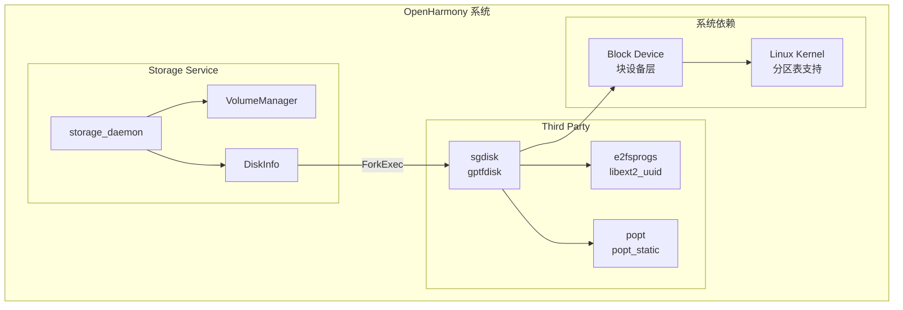

# 04 依赖关系与使用

> 分析 gptfdisk 在 OpenHarmony 中的依赖关系和使用场景

---

## 4.1 依赖关系总览

### 依赖图



---

## 4.2 直接依赖者

### storage_daemon (storage_service)

**BUILD.gn 引用**:

```gn
# foundation/filemanagement/storage_service/services/storage_daemon/BUILD.gn
ohos_executable("storage_daemon") {
    ...
    external_deps = [
        ...
        "gptfdisk:sgdisk",  # <-- 依赖声明
        ...
    ]
}
```

**bundle.json 引用**:

```json
{
    "name": "@ohos/storage_service",
    ...
    "component": {
        "deps": {
            "components": [
                "gptfdisk",  # <-- 组件依赖
                ...
            ]
        }
    }
}
```

### 依赖统计

| 类型 | 数量 | 模块 |
|------|------|------|
| **直接依赖** | 1 | storage_service |
| **间接依赖** | 0 | 无 |
| **可选依赖** | 0 | 无 |

---

## 4.3 使用代码分析

### 使用位置

**文件**: `foundation/filemanagement/storage_service/services/storage_daemon/disk/src/disk_info.cpp`

**头文件定义**:

```cpp
// disk_info.h
#include <vector>
#include <string>

class DiskInfo {
    ...
private:
    std::vector<std::string> sgdiskLines_;  // sgdisk --ohos-dump 输出缓存
};
```

**常量定义**:

```cpp
// disk_info.cpp
constexpr const char *SGDISK_PATH = "/system/bin/sgdisk";
constexpr const char *SGDISK_DUMP_CMD = "--ohos-dump";
constexpr const char *SGDISK_ZAP_CMD = "--zap-all";
constexpr const char *SGDISK_PART_CMD = "--new=0:0:-0 --typeconde=0:0c00 --gpttombr=1";
```

### 使用场景 1: 分区信息导出

**功能**: 读取磁盘分区表信息

**代码**:

```cpp
int DiskInfo::ReadPartition() {
    // 构造命令: sgdisk --ohos-dump /dev/block/disk-x-y
    std::vector<std::string> cmd;
    cmd.push_back(SGDISK_PATH);
    cmd.push_back(SGDISK_DUMP_CMD);
    cmd.push_back(devPath_);
    
    // 执行命令
    std::vector<std::string> output;
    int res = ForkExec(cmd, &output);
    
    if (res != E_OK) {
        LOGE("sgdisk dump failed");
        return res;
    }
    
    // 解析输出
    sgdiskLines_ = output;
    return ParsePartitionInfo(output);
}
```

**命令示例**:
```bash
sgdisk --ohos-dump /dev/block/disk-8-0
```

**输出解析**:
```
DISK gpt 12345678-1234-1234-1234-123456789abc
PART 1 EBD0A0A2-B9E5-4433-87C0-68B6B72699C7 11111111-1111-1111-1111-111111111111 EFI System Partition
PART 2 0FC63DAF-8483-4772-8E79-3D69D8477DE4 22222222-2222-2222-2222-222222222222 Linux filesystem
```

### 使用场景 2: 清除分区表

**功能**: 恢复出厂设置时清除分区

**代码**:

```cpp
int DiskInfo::Partition() {
    std::vector<std::string> cmd;
    std::vector<std::string> output;
    
    // 步骤 1: 清除分区表
    cmd.push_back(SGDISK_PATH);
    cmd.push_back(SGDISK_ZAP_CMD);  // --zap-all
    cmd.push_back(devPath_);
    
    int res = ForkExec(cmd, &output);
    if (res != E_OK) {
        LOGE("sgdisk: zap fail");
        return res;
    }
    
    ...
}
```

**命令**:
```bash
sgdisk --zap-all /dev/block/disk-8-0
```

**作用**: 
- 清除 GPT 主分区表
- 清除 GPT 备份分区表
- 清除保护性 MBR

### 使用场景 3: 创建分区

**功能**: 创建新分区 (userdata)

**代码**:

```cpp
int DiskInfo::Partition() {
    ...
    // 步骤 2: 创建新分区
    cmd.clear();
    output.clear();
    cmd.push_back(SGDISK_PATH);
    cmd.push_back("--new=0:0:-0");           // 使用所有可用空间
    cmd.push_back("--typecode=0:0c00");      // Microsoft basic data
    cmd.push_back("--gpttombr=1");           // 创建混合 MBR
    cmd.push_back(devPath_);
    
    res = ForkExec(cmd, &output);
    if (res != E_OK) {
        LOGE("sgdisk: partition fail");
        return res;
    }
    
    return E_OK;
}
```

**命令**:
```bash
sgdisk --new=0:0:-0 --typecode=0:0c00 --gpttombr=1 /dev/block/disk-8-0
```

**参数说明**:
| 参数 | 说明 |
|------|------|
| `--new=0:0:-0` | 分区号:0(自动), 起始:0(默认), 结束:-0(最后) |
| `--typecode=0:0c00` | 分区 0 的类型码为 0x0c00 (Microsoft basic data) |
| `--gpttombr=1` | 创建混合 MBR，第 1 个分区同步到 MBR |

---

## 4.4 调用流程

### 完整调用链

```
应用层
  │
  ▼
Storage Manager (JS API)
  │
  ▼
Storage Daemon (C++ SA)
  │
  ├──> VolumeManager::CreateVolume()
  │        │
  │        ▼
  │      DiskInfo::Create()
  │        │
  │        ├──> ReadMetadata()
  │        │
  │        ├──> ReadPartition()
  │        │       │
  │        │       ▼
  │        │     ForkExec("sgdisk --ohos-dump ...")
  │        │       │
  │        │       ▼
  │        │     sgdisk (gptfdisk)
  │        │       │
  │        │       ▼
  │        │     /dev/block/disk-X-Y
  │        │
  │        └──> NotifyDiskCreated()
  │
  └──> (恢复出厂设置时)
           │
           ▼
         DiskInfo::Partition()
           │
           ├──> ForkExec("sgdisk --zap-all ...")
           │
           └──> ForkExec("sgdisk --new ...")
```

---

## 4.5 依赖版本兼容性

### e2fsprogs (libext2_uuid)

| OH 版本 | e2fsprogs 版本 | 兼容性 |
|---------|---------------|--------|
| 3.1 | 1.46.x | ✅ 已验证 |

**接口使用**:
```cpp
// guid.cc 中使用
uuid_generate(uuidData);        // 生成 UUID
uuid_parse(str, uuidData);      // 解析 UUID 字符串
uuid_unparse(uuidData, str);    // 导出 UUID 字符串
```

### popt

| OH 版本 | popt 版本 | 兼容性 |
|---------|----------|--------|
| 3.1 | 1.18+ | ✅ 已验证 |

**接口使用**:
```cpp
// gptcl.cc 中使用
poptGetContext();       // 创建解析上下文
poptGetNextOpt();       // 获取下一个选项
poptGetArg();           // 获取参数
poptFreeContext();      // 释放上下文
```

---

## 4.6 运行时依赖

### 文件系统依赖

| 路径 | 类型 | 说明 |
|------|------|------|
| `/system/bin/sgdisk` | 可执行文件 | sgdisk 二进制 |
| `/dev/block/*` | 设备节点 | 块设备 |

### 权限要求

| 操作 | 权限 | 说明 |
|------|------|------|
| 读取分区表 | root | 需要访问块设备 |
| 写入分区表 | root | 需要修改块设备 |
| 创建/删除分区 | root | 危险操作 |

### SELinux 策略

```
# storage_daemon 的 SELinux 域需要有权限:
allow storage_daemon block_device:blk_file { read write open ioctl };
allow storage_daemon sgdisk_exec:file { execute execute_no_trans };
```

---

## 4.7 性能特征

### 执行时间

| 操作 | 耗时 | 说明 |
|------|------|------|
| `--ohos-dump` | ~10ms | 纯读取操作 |
| `--zap-all` | ~50ms | 写入 GPT 头部 |
| `--new` | ~100ms | 创建分区表 |

### 资源占用

| 指标 | 值 | 说明 |
|------|-----|------|
| 内存占用 | ~2MB | 执行时 RSS |
| 磁盘 I/O | 少量 | 仅分区表区域 |
| CPU 使用 | 低 | 无复杂计算 |

---

## 4.8 故障排查

### 常见问题

#### Q: sgdisk 命令未找到

**症状**: ForkExec 返回 ENOENT

**检查**:
```bash
# 确认文件存在
ls -la /system/bin/sgdisk

# 确认文件权限
file /system/bin/sgdisk
```

#### Q: 分区操作权限拒绝

**症状**: Permission denied

**检查**:
```bash
# 确认以 root 运行
id

# 检查 SELinux 日志
logcat | grep avc
```

#### Q: --ohos-dump 输出为空

**症状**: sgdiskLines_ 为空

**检查**:
```bash
# 手动执行查看错误
sgdisk --ohos-dump /dev/block/disk-X-Y

# 检查设备是否存在
ls -la /dev/block/disk-X-Y
```

---

## 4.9 使用建议

### 最佳实践

1. **错误处理**
   ```cpp
   // 始终检查返回值
   int res = ForkExec(cmd, &output);
   if (res != E_OK) {
       LOGE("sgdisk failed: %d", res);
       return res;
   }
   ```

2. **超时保护**
   ```cpp
   // ForkExec 应有超时机制
   // 防止 sgdisk 卡住导致服务无响应
   ```

3. **日志记录**
   ```cpp
   // 记录执行的命令
   LOGI("Executing: %s", cmd.join(" ").c_str());
   ```

### 避免的做法

1. ❌ 直接拼接用户输入到命令
   ```cpp
   // 危险!
   cmd.push_back(userInput);  // 可能导致命令注入
   ```

2. ❌ 忽略错误返回值
   ```cpp
   // 危险!
   ForkExec(cmd, &output);  // 返回值被忽略
   ```

3. ❌ 并发执行分区操作
   ```cpp
   // 同一磁盘的分区操作应串行化
   // 防止分区表损坏
   ```
