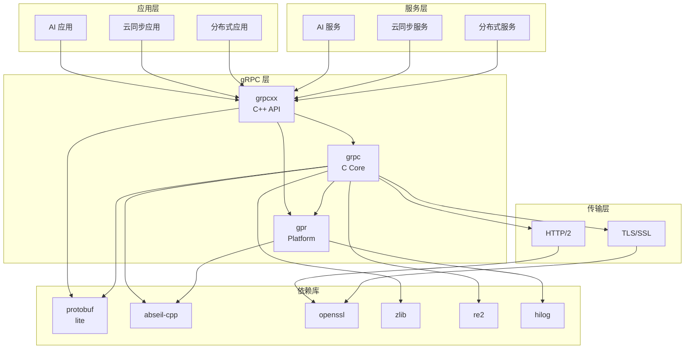

# 04 - gRPC 在 OH 中的依赖关系与使用

## 概述

本文档分析 gRPC 在 OpenHarmony 中的依赖关系、使用场景和集成方式。

**重要说明**: 由于当前分析环境限制，部分依赖关系需要完整 OH 代码库才能完全确定。本文档基于现有信息和 gRPC 的典型使用场景进行分析。

## 1. 依赖关系总览

### 1.1 gRPC 的依赖

```
                    ┌─────────────────────────────────────┐
                    │           gRPC 组件                  │
                    │  (grpc, grpcxx, gpr, grpc_plugin)   │
                    └─────────────┬───────────────────────┘
                                  │
        ┌─────────────────────────┼─────────────────────────┐
        │                         │                         │
        ↓                         ↓                         ↓
┌───────────────┐       ┌───────────────┐       ┌───────────────┐
│   核心依赖     │       │   可选依赖     │       │   OH 特有依赖  │
├───────────────┤       ├───────────────┤       ├───────────────┤
│ protobuf:lite │       │ zlib:libz     │       │ hilog:libhilog│
│ abseil-cpp:*  │       │ re2:re2       │       │               │
│ openssl:ssl   │       │               │       │               │
│ openssl:crypto│       │               │       │               │
└───────────────┘       └───────────────┘       └───────────────┘
```

### 1.2 依赖 gRPC 的组件（预期）

基于 gRPC 的功能特性，以下 OH 组件可能依赖 gRPC：

| 子系统 | 组件 | 用途 | 置信度 |
|--------|------|------|--------|
| AI | AI 引擎 | 模型服务调用 | 高 |
| 云 | 云服务 | 云同步/云函数 | 高 |
| 分布式 | 分布式软总线 | 跨设备服务发现 | 中 |
| 网络 | HTTP 客户端 | 高级 RPC 场景 | 中 |

## 2. gRPC 提供的接口

### 2.1 Inner Kits（公开接口）

根据 `bundle.json`，gRPC 提供以下 Inner Kits：

```json
{
    "inner_kits": [
        {"name": "//third_party/grpc:grpc"},
        {"name": "//third_party/grpc:grpcxx"},
        {"name": "//third_party/grpc:gpr"},
        {"name": "//third_party/grpc:grpc_cpp_plugin"}
    ]
}
```

| Kit | 类型 | 说明 | 使用场景 |
|-----|------|------|----------|
| `grpc` | 共享库 | C 核心库 | C 项目使用 |
| `grpcxx` | 共享库 | C++ 库 | C++ 项目使用（推荐） |
| `gpr` | 共享库 | 平台运行时 | 内部依赖 |
| `grpc_cpp_plugin` | 可执行文件 | protoc 插件 | 代码生成 |

### 2.2 头文件接口

```
include/
├── grpc/               # C API
│   ├── grpc.h
│   ├── status.h
│   ├── impl/
│   └── support/
└── grpcpp/             # C++ API
    ├── grpcpp.h
    ├── server.h
    ├── client_context.h
    ├── channel.h
    └── support/
```

### 2.3 使用方式

#### 方式 1: 作为依赖组件（推荐）

在您的 `BUILD.gn` 中：

```gn
ohos_executable("my_service") {
    sources = [
        "server.cpp",
        "my_service.pb.cc",       # protoc 生成的代码
        "my_service.grpc.pb.cc",  # grpc_cpp_plugin 生成的代码
    ]
    
    external_deps = [
        "grpc:grpcxx",           # 使用 C++ API
        "protobuf:protobuf_lite",
    ]
    
    include_dirs = [
        "${target_gen_dir}",     # 包含生成的头文件
    ]
}
```

#### 方式 2: 使用 gRPC 工具链

```gn
group("my_grpc_targets") {
    deps = [
        "//third_party/grpc:grpc_plugin_toolchain",
    ]
}
```

#### 方式 3: 代码生成

```gn
# 生成 protobuf 代码
proto_sources = ["my_service.proto"]

# 生成 gRPC 代码
action("generate_grpc") {
    deps = ["//third_party/grpc:grpc_cpp_plugin"]
    script = "//third_party/grpc/grpc_cpp_plugin"
    # ...
}
```

## 3. 典型使用场景

### 场景 1: AI 模型服务

```cpp
// ai_client.cpp
#include <grpcpp/grpcpp.h>
#include "model_service.grpc.pb.h"

class AIClient {
public:
    AIClient(const std::string& server_address) {
        channel_ = grpc::CreateChannel(
            server_address, 
            grpc::InsecureChannelCredentials()
        );
        stub_ = ModelService::NewStub(channel_);
    }
    
    std::string Predict(const std::string& input) {
        PredictRequest request;
        request.set_input(input);
        
        PredictResponse response;
        grpc::ClientContext context;
        
        grpc::Status status = stub_->Predict(
            &context, request, &response
        );
        
        if (status.ok()) {
            return response.output();
        }
        return "Error: " + status.error_message();
    }

private:
    std::shared_ptr<grpc::Channel> channel_;
    std::unique_ptr<ModelService::Stub> stub_;
};
```

### 场景 2: 云同步服务

```cpp
// cloud_sync_client.cpp
#include <grpcpp/grpcpp.h>
#include "sync_service.grpc.pb.h"

class CloudSyncClient {
public:
    CloudSyncClient(const std::string& endpoint) {
        // 使用 SSL/TLS
        auto channel_creds = grpc::SslCredentials(
            grpc::SslCredentialsOptions()
        );
        channel_ = grpc::CreateChannel(endpoint, channel_creds);
        stub_ = SyncService::NewStub(channel_);
    }
    
    bool SyncData(const DataBatch& data) {
        SyncRequest request;
        *request.mutable_data() = data;
        
        SyncResponse response;
        grpc::ClientContext context;
        
        // 添加认证
        context.AddMetadata("authorization", "Bearer " + token_);
        
        grpc::Status status = stub_->Sync(&context, request, &response);
        return status.ok();
    }
};
```

### 场景 3: 分布式设备通信

```cpp
// distributed_service.cpp
#include <grpcpp/grpcpp.h>
#include <grpcpp/server_builder.h>
#include "device_service.grpc.pb.h"

class DeviceServiceImpl : public DeviceService::Service {
public:
    grpc::Status GetCapabilities(
        grpc::ServerContext* context,
        const CapabilityRequest* request,
        CapabilityResponse* response
    ) override {
        // 返回设备能力
        response->add_capabilities("camera");
        response->add_capabilities("microphone");
        response->add_capabilities("speaker");
        return grpc::Status::OK;
    }
    
    grpc::Status StreamData(
        grpc::ServerContext* context,
        grpc::ServerReaderWriter<DataChunk, DataChunk>* stream
    ) override {
        // 双向流通信
        DataChunk chunk;
        while (stream->Read(&chunk)) {
            // 处理收到的数据
            stream->Write(ProcessData(chunk));
        }
        return grpc::Status::OK;
    }
};

void StartServer() {
    DeviceServiceImpl service;
    
    grpc::ServerBuilder builder;
    builder.AddListeningPort(
        "0.0.0.0:50051", 
        grpc::InsecureServerCredentials()
    );
    builder.RegisterService(&service);
    
    std::unique_ptr<grpc::Server> server(builder.BuildAndStart());
    server->Wait();
}
```

## 4. 依赖关系图

### 4.1 完整依赖图



### 4.2 简化依赖图

```
┌────────────────────────────────────────────────────────────┐
│                         应用模块                             │
│  (AI Engine / Cloud Sync / Distributed Service)             │
└─────────────────────────┬──────────────────────────────────┘
                          │ 依赖
                          ↓
┌────────────────────────────────────────────────────────────┐
│                     grpc:grpcxx                             │
│                  C++ API (libgrpcxx.so)                     │
└─────────────┬─────────────────────────────┬────────────────┘
              │ 依赖                         │ 依赖
              ↓                             ↓
┌─────────────────────┐           ┌──────────────────────┐
│    grpc:grpc        │           │    grpc:gpr          │
│  C Core (libgrpc.so)│           │  Platform (libgpr.so)│
└──────────┬──────────┘           └──────────┬───────────┘
           │ 依赖                            │ 依赖
           ↓                                 ↓
┌────────────────────────────────────────────────────────────┐
│                      基础依赖库                              │
│  ┌──────────┐ ┌──────────┐ ┌──────────┐ ┌──────────┐       │
│  │protobuf  │ │abseil-cpp│ │ openssl  │ │  hilog   │       │
│  │  lite    │ │          │ │          │ │          │       │
│  └──────────┘ └──────────┘ └──────────┘ └──────────┘       │
└────────────────────────────────────────────────────────────┘
```

## 5. 预期依赖者分析

### 5.1 AI 子系统

**组件**: AI 引擎、模型服务框架

**使用场景**:
- 调用云端 AI 推理服务
- 分布式 AI 模型部署
- 模型更新同步

**使用方式**:
```gn
# AI 引擎的 BUILD.gn (预期)
external_deps = [
    "grpc:grpcxx",
    "protobuf:protobuf_lite",
]
```

### 5.2 云子系统

**组件**: 云服务、同步服务

**使用场景**:
- 设备数据云同步
- 云端配置下发
- 远程命令执行

### 5.3 分布式软总线

**组件**: 分布式服务框架

**使用场景**:
- 跨设备服务发现
- 分布式能力调度
- 设备间 RPC 调用

**注意**: 分布式软总线可能同时使用：
- gRPC（云服务/远程场景）
- SoftBus（近场设备）
- OH IPC（本地服务）

## 6. 集成最佳实践

### 6.1 版本管理

确保依赖版本一致：

```gn
# 使用统一的 protobuf 版本
deps = [
    "//third_party/grpc:grpcxx",
    "//third_party/protobuf:protobuf_lite",
]
```

### 6.2 错误处理

```cpp
grpc::Status status = stub_->Method(&context, request, &response);
if (!status.ok()) {
    HILOG_ERROR("gRPC call failed: %{public}s", 
                status.error_message().c_str());
    // 处理错误
}
```

### 6.3 连接管理

```cpp
// 复用 Channel（推荐）
class GrpcClient {
    std::shared_ptr<grpc::Channel> channel_;
    std::unique_ptr<Service::Stub> stub_;
    
public:
    GrpcClient() {
        // 使用连接池或共享 channel
        channel_ = grpc::CreateCustomChannel(
            endpoint,
            creds,
            grpc::ChannelArguments()
        );
        stub_ = Service::NewStub(channel_);
    }
};
```

### 6.4 性能优化

1. **使用异步 API**:
   ```cpp
   grpc::CompletionQueue cq;
   auto rpc = stub_->AsyncMethod(&context, request, &cq);
   ```

2. **启用压缩**:
   ```cpp
   grpc::ChannelArguments args;
   args.SetCompressionAlgorithm(GRPC_COMPRESS_GZIP);
   ```

3. **连接池**:
   - 复用 gRPC Channel
   - Channel 是线程安全的

## 7. TODO 项

### 需要完整 OH 代码库确认

- [ ] 搜索所有引用 `//third_party/grpc` 的 BUILD.gn 文件
- [ ] 统计直接依赖者数量和名称
- [ ] 分析各依赖者的使用场景
- [ ] 绘制准确的依赖关系图

### 查询命令

```bash
# 在完整 OH 代码库中执行
find . -name "BUILD.gn" -exec grep -l "third_party/grpc" {} \; 2>/dev/null

# 或使用 rg
rg -l "third_party/grpc" --type gn

# 统计依赖关系
rg "//third_party/grpc:" --type gn | sort | uniq -c
```

---

**相关文档**:
- [01_Overview.md](./01_Overview.md) - gRPC 简介
- [03_Build_Integration.md](./03_Build_Integration.md) - 构建适配
- [05_API_Differences.md](./05_API_Differences.md) - API 差异
