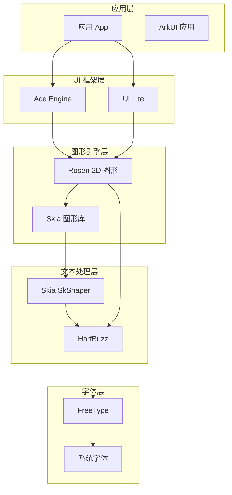
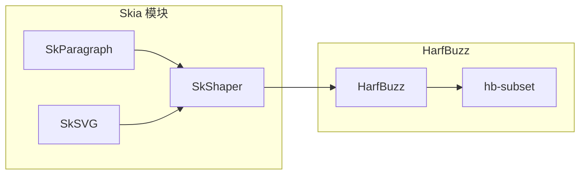
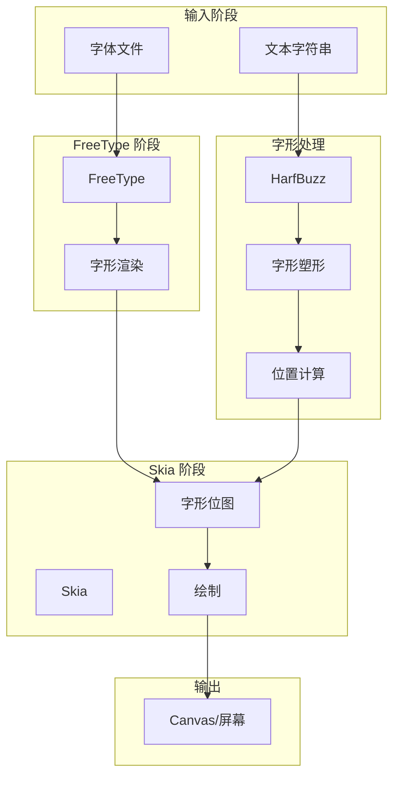

# HarfBuzz 在 OpenHarmony 中的依赖关系与使用

本文档详细记录 HarfBuzz 库在 OpenHarmony 系统中的使用情况，包括直接依赖者、使用方式、依赖关系图以及集成细节。

## 1 直接依赖者概览

HarfBuzz 在 OpenHarmony 中被以下模块直接依赖：

| 序号 | 模块名称 | BUILD.gn 路径 | 依赖类型 | 主要用途 |
|-----|---------|--------------|---------|---------|
| 1 | Rosen 2D 图形 | `foundation/graphic/graphic_2d/rosen/modules/2d_graphics` | 静态链接 | 字体塑形 |
| 2 | UI Lite IDE | `foundation/arkui/ui_lite/ext/ide` | 静态链接 | 轻量 UI 文本 |
| 3 | Skia SkShaper | `third_party/skia/m133/modules/skshaper` | 外部依赖 | 高级文本塑形 |
| 4 | Skia SkParagraph | `third_party/skia/m133/modules/skparagraph` | 条件依赖 | 段落排版 |
| 5 | Skia SVG | `third_party/skia/m133/modules/svg` | 条件依赖 | SVG 文本渲染 |

---

## 2 核心依赖者详解

### 2.1 Rosen 2D 图形引擎（Rosen）

**BUILD.gn 路径**: `foundation/graphic/graphic_2d/rosen/modules/2d_graphics/BUILD.gn`

**源代码文件**:
- `font_harfbuzz.cpp`

**依赖方式**: 静态链接

**集成方式**:

```gn
sources = [
  "$drawing_core_src_dir/text/font_harfbuzz.cpp",
]
```

**使用场景**:

Rosen 是 OpenHarmony 的 2D 图形引擎，负责系统级的图形渲染。HarfBuzz 在 Rosen 中的主要作用是：

1. **文本塑形（Text Shaping）**: 将 Unicode 字符序列转换为字形序列和位置
2. **字形定位**: 计算每个字形在文本中的正确位置
3. **字距调整**: 处理字形间的间距（kerning）
4. **双向文本**: 支持 Arabic、Hebrew 等从右到左的语言

**头文件引用**:

```cpp
#include <hb.h>
#include <hb-ft.h>
#include <hb-ot.h>
```

**典型使用流程**:

```cpp
// 1. 创建 HarfBuzz 塑形器
hb_font_t *hb_font = hb_ft_font_create(ft_face, nullptr);
hb_buffer_t *hb_buffer = hb_buffer_create();

// 2. 添加文本到缓冲区
hb_buffer_reset(hb_buffer);
hb_buffer_add_utf32(hb_buffer, text, text_len, 0, text_len);

// 3. 设置脚本和语言
hb_buffer_guess_segment_properties(hb_buffer);

// 4. 执行塑形
hb_shape(hb_font, hb_buffer, nullptr, 0);

// 5. 获取字形信息
hb_glyph_info_t *glyphs = hb_buffer_get_glyph_infos(hb_buffer, &glyph_count);
hb_glyph_position_t *positions = hb_buffer_get_glyph_positions(hb_buffer, &glyph_count);

// 6. 使用结果进行渲染
// ...

// 7. 清理资源
hb_buffer_destroy(hb_buffer);
hb_ft_font_destroy(hb_font);
```

**在 OH 系统中的位置**:

```
应用层
    ↓
Ace Engine (ArkUI)
    ↓
Rosen 图形引擎 ← harfbuzz
    ↓
Skia 图形库
    ↓
GPU/显示驱动
```

### 2.2 UI Lite IDE 模块

**BUILD.gn 路径**: `foundation/arkui/ui_lite/ext/ide/BUILD.gn`

**依赖方式**: 静态链接

**构建声明**:

```gn
"harfbuzz:harfbuzz_static",
```

**使用场景**:

UI Lite 是面向轻量设备的 UI 框架，harfbuzz 为其提供文本渲染支持。该模块主要用于：

1. **轻量级文本显示**: 适用于资源受限的设备
2. **系统字体渲染**: 为系统 UI 提供字体塑形能力
3. **静态库集成**: 直接静态链接到目标模块

### 2.3 Skia SkShaper（高级文本塑形器）

**BUILD.gn 路径**: `third_party/skia/m133/modules/skshaper/BUILD.gn`

**外部依赖声明**:

```gn
external_deps = [ "harfbuzz:harfbuzz_static_for_skia" ]
deps += [ "${skia_third_party_dir}/harfbuzz" ]
```

**使用场景**:

SkShaper 是 Skia 图形库的高级文本塑形模块，HarfBuzz 被集成到其中提供专业级的文本排版能力：

1. **高级字形处理**: 支持复杂的 OpenType 特性
2. **可变字体**: 支持可变字体（Variable Fonts）的轴（axis）控制
3. **字距调整**: 精确的字形间距计算
4. **连字处理**: 自动处理字符连写（ligatures）

**与 HarfBuzz 的集成**:

```cpp
class SkShaperHarfBuzzImpl : public SkShaper {
public:
    SkShaperHarfBuzzImpl(std::unique_ptr<FontHarfBuzz> font) : font_(std::move(font)) {}
    
    Result shape(const char* utf8text, size_t textBytes,
                 const Run& run, double width,
                 SkPoint* out_xy) const override;
    
private:
    std::unique_ptr<FontHarfBuzz> font_;
};
```

---

## 3 依赖关系图

### 3.1 整体依赖架构



### 3.2 Skia 与 HarfBuzz 的集成关系



### 3.3 Rosen 文本渲染管线



---

## 4 链接方式详解

### 4.1 静态链接

在 OpenHarmony 中，HarfBuzz 主要以**静态库**形式被集成：

**标准系统构建**:

```gn
ohos_static_library("harfbuzz_static") {
  sources = get_target_outputs(":harfbuzz_action")
  deps = [ ":harfbuzz_action" ]
  include_dirs = [ "${target_gen_dir}/harfbuzz-11.0.0/src" ]
  defines = [ "HAVE_PTHREAD = 1" ]
  public_configs = [ ":harfbuzz_config" ]
  part_name = "harfbuzz"
  subsystem_name = "thirdparty"
}
```

**Lite 系统构建**:

```gn
lite_library("harfbuzz") {
  output_name = "harfbuzz"
  sources = get_target_outputs(":harfbuzz_action")
  deps = [ ":harfbuzz_action" ]
  public_configs = [ ":harfbuzz_config" ]
}
```

### 4.2 头文件引用

HarfBuzz 提供以下主要头文件供外部使用：

| 头文件 | 用途 |
|-------|-----|
| `hb.h` | 核心 API（版本、内存管理、基本类型） |
| `hb-blob.h` | 二进制数据（字体文件）管理 |
| `hb-buffer.h` | 塑形缓冲区（文本输入/字形输出） |
| `hb-font.h` | 字体度量信息 |
| `hb-face.h` | 字体字形数据访问 |
| `hb-ft.h` | FreeType 集成接口 |
| `hb-ot.h` | OpenType 布局特性 |
| `hb-unicode.h` | Unicode 字符属性 |
| `hb-version.h` | 版本信息 |

**标准引用方式**:

```cpp
#include <harfbuzz/hb.h>
#include <harfbuzz/hb-ft.h>
#include <harfbuzz/hb-ot.h>
```

---

## 5 典型使用场景

### 5.1 文本渲染流水线

OpenHarmony 的文本渲染遵循以下流水线：

```
┌─────────────┐     ┌─────────────┐     ┌─────────────┐     ┌─────────────┐
│  文本输入    │ ──▶ │  字符编码   │ ──▶ │  字形塑形   │ ──▶ │  字形定位   │
│  (UTF-8)    │     │  转换       │     │  (HarfBuzz) │     │  (HarfBuzz) │
└─────────────┘     └─────────────┘     └─────────────┘     └─────────────┘
                                                                      │
                                                                      ▼
┌─────────────┐     ┌─────────────┐     ┌─────────────┐     ┌─────────────┐
│  显示       │ ◀── │  位图生成   │ ◀── │  FreeType   │ ◀── │  位置信息   │
│  (GPU)      │     │  (FT_Render)│     │  渲染        │     │  + 字形索引 │
└─────────────┘     └─────────────┘     └─────────────┘     └─────────────┘
```

### 5.2 多语言支持

HarfBuzz 在 OpenHarmony 中提供全面的多语言文本支持：

| 语言/脚本 | 支持状态 | 特殊处理 |
|----------|---------|---------|
| Latin | ✅ 完整 | 基本字形、连字、字距 |
| Arabic | ✅ 完整 | 双向文本、字形连接 |
| Hebrew | ✅ 完整 | 双向文本 |
| CJK | ✅ 完整 | 中日韩统一表意文字 |
| Devanagari | ✅ 完整 | 复合元音、形态重排 |
| Thai | ✅ 完整 | 前后位置标记 |
| Emoji | ✅ 完整 | 彩色 Emoji（COLR） |

### 5.3 OpenType 特性支持

HarfBuzz 支持丰富的 OpenType 排版特性：

| 特性 | 标签 | 说明 |
|-----|------|-----|
| Ligatures | `liga` | 连字替换 |
| Kerning | `kern` | 字距调整 |
| Small Caps | `smcp` | 小型大写字母 |
| Oldstyle Figures | `onum` | 旧式数字 |
| Subscript | `subs` | 下标 |
| Superscript | `sups` | 上标 |
| Contextual Alternates | `calt` | 上下文替换 |

---

## 6 性能考虑

### 6.1 内存使用

HarfBuzz 在 OpenHarmony 中的内存使用受以下因素影响：

| 配置选项 | 内存影响 | 适用场景 |
|---------|---------|---------|
| HB_TINY | 大幅减少 | 轻量设备 |
| HB_CUSTOM_MALLOC | 可控分配器 | 嵌入式系统 |
| 静态链接 | 无额外开销 | 所有场景 |

### 6.2 渲染性能

文本渲染的关键性能指标：

| 操作 | 典型耗时 | 优化建议 |
|-----|---------|---------|
| 字体加载 | 1-10ms | 缓存字体对象 |
| 字形塑形 | 0.1-1ms/字符 | 批量处理 |
| 字形缓存 | 命中时 <0.01ms | 启用缓存 |

### 6.3 缓存策略

OpenHarmony 推荐以下缓存策略：

```cpp
// 1. 字体对象缓存
class FontCache {
public:
    static hb_face_t* get_face(const char* font_path) {
        auto it = cache.find(font_path);
        if (it != cache.end()) return it->second;
        
        hb_face_t* face = hb_face_create_from_file(font_path);
        if (face) {
            cache[font_path] = face;
        }
        return face;
    }
    
private:
    static std::unordered_map<std::string, hb_face_t*> cache;
};

// 2. 字形缓存
class GlyphCache {
public:
    hb_codepoint_t lookup(const char* text, size_t len) {
        // 使用 ft_face 获取字形索引
        return FT_Get_Char_Index(face_, utf32_char);
    }
};
```

---

## 7 测试与验证

### 7.1 单元测试

HarfBuzz 的集成测试主要包括：

| 测试类型 | 测试内容 | 验证点 |
|---------|---------|-------|
| 基本塑形 | 简单 ASCII 文本 | 字形数量、顺序 |
| 双向文本 | Arabic/Hebrew | 字形顺序、位置 |
| 复合字形 | TrueType 复合字形 | 组件正确组合 |
| 彩色字体 | COLR Emoji | 颜色层正确渲染 |
| 可变字体 | Variable Fonts | 轴变化效果 |

### 7.2 集成测试位置

```
foundation/graphic/graphic_2d/rosen/test/2d_graphics/unittest/text/
    └── font_harfbuzz_test.cpp
```

---

## 8 版本与兼容性

### 8.1 当前版本

| 项目 | 版本 |
|-----|------|
| HarfBuzz | 11.0.0 |
| OH 组件版本 | 3.1 |
| 上游版本 | 11.0.0 |

### 8.2 兼容性矩阵

| OH 版本 | HarfBuzz 版本 | 兼容性 |
|---------|--------------|-------|
| 4.0+ | 11.0.0 | ✅ 完全兼容 |
| 3.x | 11.0.0 | ✅ 完全兼容 |
| 2.x | 4.x-8.x | ⚠️ 需升级 |

### 8.3 升级路径

升级 HarfBuzz 版本时需要：

1. **检查 API 变更**: 确认主要 API 兼容性
2. **验证 Patch**: 重新应用 OH 特有修改
3. **测试集成**: 完整回归测试
4. **性能基准**: 对比渲染性能差异

---

## 9 故障排查

### 9.1 常见问题

| 问题 | 可能原因 | 解决方案 |
|-----|---------|---------|
| 字形显示为方框 | 字体文件缺失 | 检查字体路径 |
| 阿拉伯文本反向 | 方向检测失败 | 设置正确脚本 |
| 内存泄漏 | 资源未释放 | 检查销毁调用 |
| 编译失败 | ICCARM 配置错误 | 检查 defines |

### 9.2 调试技巧

```cpp
// 1. 启用 HarfBuzz 调试输出
hb_debug = 1;

// 2. 打印字形信息
printf("Glyph count: %d\n", glyph_count);
for (int i = 0; i < glyph_count; i++) {
    printf("Glyph %d: index=%u, x=%d, y=%d\n",
           i, glyphs[i].codepoint,
           positions[i].x_offset,
           positions[i].y_offset);
}

// 3. 检查缓冲区状态
hb_buffer_guess_segment_properties(buffer);
hb_buffer_get_direction(buffer);  // Should be RTL for Arabic
```

---

## 10 最佳实践

### 10.1 资源管理

```cpp
// ✅ 正确做法：使用智能指针管理
auto buffer = std::unique_ptr<hb_buffer_t, decltype(&hb_buffer_destroy)>(
    hb_buffer_create(),
    hb_buffer_destroy
);

// ✅ 正确做法：初始化后设置属性
hb_buffer_reset(buffer.get());
hb_buffer_guess_segment_properties(buffer.get());

// ❌ 错误做法：遗漏清理
hb_buffer_t* buffer = hb_buffer_create();
// ... 使用后忘记调用 hb_buffer_destroy
```

### 10.2 多线程使用

```cpp
// ✅ 每个线程创建独立的缓冲区
void shape_text(const char* text) {
    hb_buffer_t* buffer = hb_buffer_create();
    // ... 使用缓冲区
    hb_buffer_destroy(buffer);
}

// ❌ 错误做法：共享缓冲区
hb_buffer_t* shared_buffer;  // 多线程访问会有问题
```

### 10.3 性能优化

```cpp
// 1. 预创建缓冲区
static thread_local hb_buffer_t* tls_buffer = nullptr;
if (!tls_buffer) {
    tls_buffer = hb_buffer_create();
    hb_buffer_guess_segment_properties(tls_buffer);
}

// 2. 批量处理文本
for (size_t i = 0; i < text.length(); i += CHUNK_SIZE) {
    hb_buffer_add_utf8(buffer, text.data() + i, CHUNK_SIZE, 0, CHUNK_SIZE);
    hb_shape(font, buffer, nullptr, 0);
}
```

---

*本文档最后更新: 2024年*
