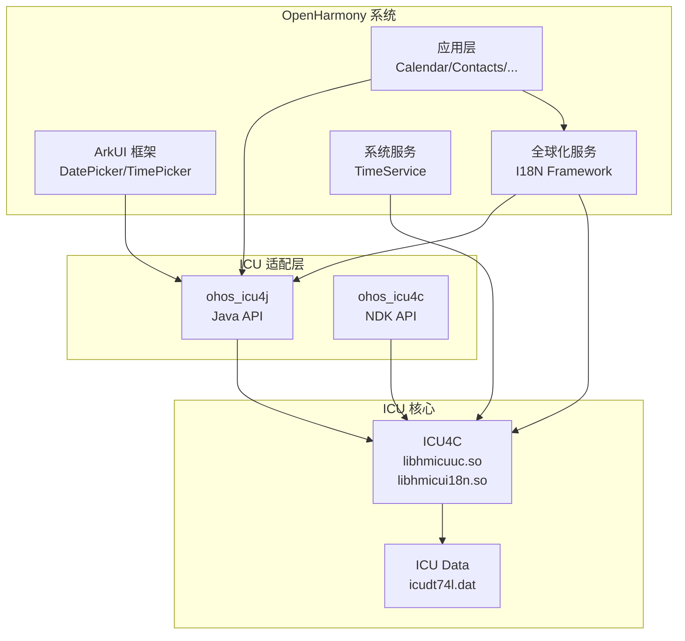

# 04 - ICU 在 OpenHarmony 中的依赖与使用

## 4.1 依赖关系概览

### 模块依赖图



### 直接依赖 ICU 的模块

根据 `bundle.json` 的 `inner_kits` 定义，以下模块直接依赖 ICU：

| 模块 | 依赖方式 | 使用场景 |
|------|----------|----------|
| 系统框架 | `shared_icuuc` / `shared_icui18n` | 全球化服务实现 |
| ArkUI | `ohos_icu4j` | UI 组件国际化 |
| 系统应用 | 动态链接 | 日历、时钟等 |
| NDK 应用 | `icundk` | Native 国际化 |

---

## 4.2 使用方式详解

### 4.2.1 Native 系统服务使用

**BUILD.gn 配置**:

```gn
ohos_shared_library("my_service") {
  deps = [
    "//third_party/icu/icu4c:shared_icuuc",
    "//third_party/icu/icu4c:shared_icui18n",
  ]
  
  include_dirs = [
    "//third_party/icu/icu4c/source/common",
    "//third_party/icu/icu4c/source/i18n",
  ]
}
```

**代码示例 - 日期格式化**:

```cpp
#include "unicode/udat.h"
#include "unicode/ucal.h"

void FormatDate() {
    UErrorCode status = U_ZERO_ERROR;
    
    // 创建日期格式化器
    UDateFormat* fmt = udat_open(
        UDAT_DEFAULT,           // 日期风格
        UDAT_DEFAULT,           // 时间风格
        "zh_CN",                // 语言环境
        NULL, 0,                // 时区
        NULL, 0,                // 模式
        &status
    );
    
    // 获取当前时间
    UDate now = ucal_getNow();
    
    // 格式化
    UChar result[256];
    int32_t len = udat_format(fmt, now, result, 256, NULL, &status);
    
    // 清理
    udat_close(fmt);
}
```

**代码示例 - 农历计算**:

```cpp
#include "ohos/lunar_calendar.h"

void GetLunarDate() {
    OHOS::ICU::LunarCalendar lunar;
    
    // 设置公历日期 (2024年2月10日)
    lunar.SetDaysFrom1970(2024, 2, 10);
    
    int32_t lunarYear = lunar.GetLunarYear();    // 2024
    int32_t lunarMonth = lunar.GetLunarMonth();  // 1 (正月)
    int32_t lunarDay = lunar.GetLunarDay();      // 1 (初一)
    bool isLeap = lunar.IsLeapMonth();           // false
    int32_t era = lunar.GetEra();                // 甲子周期
    int32_t cycleYear = lunar.GetCycleYear();    // 干支年
}
```

### 4.2.2 Java 应用使用

**BUILD.gn 配置**:

```gn
ohos_java_library("my_app") {
  deps = [
    "//third_party/icu/ohos_icu4j:ohos_icu4j_java",
  ]
}
```

**代码示例 - 日期格式化**:

```java
import ohos.global.icu.text.DateFormat;
import ohos.global.icu.util.Calendar;
import ohos.global.icu.util.TimeZone;
import ohos.global.icu.util.ULocale;

public class DateExample {
    public void formatDate() {
        // 创建中文本地化
        ULocale locale = new ULocale("zh_CN");
        
        // 获取日期格式化器
        DateFormat df = DateFormat.getDateInstance(
            DateFormat.DEFAULT, locale
        );
        
        // 格式化当前时间
        Calendar cal = Calendar.getInstance(TimeZone.getDefault(), locale);
        String result = df.format(cal.getTime());
        // 结果: "2024年2月10日"
    }
}
```

**代码示例 - 数字格式化**:

```java
import ohos.global.icu.text.NumberFormat;
import ohos.global.icu.util.ULocale;

public class NumberExample {
    public void formatNumber() {
        ULocale locale = new ULocale("zh_CN");
        
        // 货币格式化
        NumberFormat cf = NumberFormat.getCurrencyInstance(locale);
        String result = cf.format(12345.67);
        // 结果: "¥12,345.67"
        
        // 百分比格式化
        NumberFormat pf = NumberFormat.getPercentInstance(locale);
        result = pf.format(0.75);
        // 结果: "75%"
    }
}
```

### 4.2.3 NDK 应用使用

**BUILD.gn 配置**:

```gn
ohos_shared_library("my_ndk_lib") {
  deps = [
    "//third_party/icu/ohos_icu4c:icundk",
  ]
}
```

**代码示例 - 编码转换**:

```cpp
#include "unicode/ucnv.h"

void ConvertEncoding() {
    UErrorCode status = U_ZERO_ERROR;
    
    // 打开转换器 (GB18030 -> UTF-8)
    UConverter* conv = ucnv_open("gb18030", &status);
    
    // 输入: GB18030 编码的字节
    const char* src = ...;
    int32_t srcLen = ...;
    
    // 转换
    char dest[256];
    int32_t destLen = ucnv_convert("UTF-8", "gb18030",
        dest, 256, src, srcLen, &status);
    
    ucnv_close(conv);
}
```

---

## 4.3 典型使用场景

### 4.3.1 日历应用

**功能需求**:
- 显示公历和农历日期
- 节日标注 (春节、中秋等)
- 日程提醒

**ICU 使用**:
- `ucal_*` API - 日历计算
- `LunarCalendar` - 农历计算
- `udat_*` API - 日期格式化

### 4.3.2 时钟应用

**功能需求**:
- 多时区时间显示
- 世界时钟
- 闹钟功能

**ICU 使用**:
- `ucal_*` API - 时区转换
- `ucal_getTimeZoneDisplayName` - 时区名称

### 4.3.3 联系人应用

**功能需求**:
- 按姓名排序
- 电话号码格式化

**ICU 使用**:
- `ucol_*` API - 字符串排序 (Collation)
- 支持中文拼音排序

### 4.3.4 输入法

**功能需求**:
- 文本断词
- 候选词排序

**ICU 使用**:
- `ubrk_*` API - 文本断词
- `ucol_*` API - 候选词排序

### 4.3.5 浏览器

**功能需求**:
- 网页编码检测
- IDN (国际化域名) 处理

**ICU 使用**:
- `ucsdet_*` API - 字符集检测
- `uidna_*` API - IDNA 处理

---

## 4.4 头文件引用

### 公共头文件路径

```
//third_party/icu/icu4c/source/common/unicode/
    ├── ucal.h          # 日历
    ├── udat.h          # 日期格式化
    ├── ucnv.h          # 编码转换
    ├── ucol.h          # 排序
    ├── ubrk.h          # 断词
    ├── uloc.h          # 本地化
    ├── unum.h          # 数字格式化
    ├── uregex.h        # 正则表达式
    ├── ustring.h       # Unicode 字符串
    └── ...

//third_party/icu/icu4c/source/i18n/unicode/
    ├── calendar.h      # C++ 日历
    ├── datefmt.h       # C++ 日期格式化
    ├── coll.h          # C++ 排序
    ├── numfmt.h        # C++ 数字格式化
    └── ...

//third_party/icu/icu4c/source/ohos/
    ├── init_data.h     # ICU 初始化
    └── lunar_calendar.h # 农历日历
```

---

## 4.5 部署与运行时

### 4.5.1 文件部署位置

| 文件类型 | 部署路径 | 说明 |
|----------|----------|------|
| 动态库 | `/system/lib/platformsdk/` | libhmicuuc.so, libhmicui18n.so |
| 数据文件 | `/system/usr/icu/` | icudt74l.dat |
| 旧数据 | `/system/usr/ohos_icu/` | icudt72l.dat |
| NDK 库 | `/system/lib/ndk/` | libicu.so |

### 4.5.2 运行时初始化

ICU 数据文件路径由 `init_data.cpp` 在系统启动时设置：

```cpp
// 系统启动时调用
SetHwIcuDirectory();  // 设置 /system/usr/icu
```

### 4.5.3 多版本兼容

| 数据版本 | 兼容性 | 用途 |
|----------|--------|------|
| icudt74l.dat | 主要版本 | 当前系统使用 |
| icudt72l.dat | 兼容版本 | 旧应用兼容 |

---

## 4.6 依赖图

### 完整的系统依赖关系

```
应用层
├── 日历应用
│   ├── deps: ohos_icu4j (农历)
│   └── deps: I18N Framework
├── 时钟应用
│   └── deps: I18N Framework
├── 联系人
│   └── deps: I18N Framework
└── 浏览器
    └── deps: ICU NDK

框架层
├── ArkUI
│   └── deps: ohos_icu4j
├── I18N Framework
│   ├── deps: shared_icuuc
│   └── deps: shared_icui18n
└── 资源管理
    └── deps: shared_icuuc

系统服务
├── TimeService
│   └── deps: shared_icuuc
└── LocationService
    └── deps: shared_icui18n

ICU 层
├── ohos_icu4j
│   └── deps: ICU4J Data + ICU4C
├── ohos_icu4c (NDK)
│   └── deps: shared_icuuc + shared_icui18n
└── ICU4C Core
    ├── shared_icuuc
    │   └── deps: ICU Data
    └── shared_icui18n
        └── deps: shared_icuuc
```
