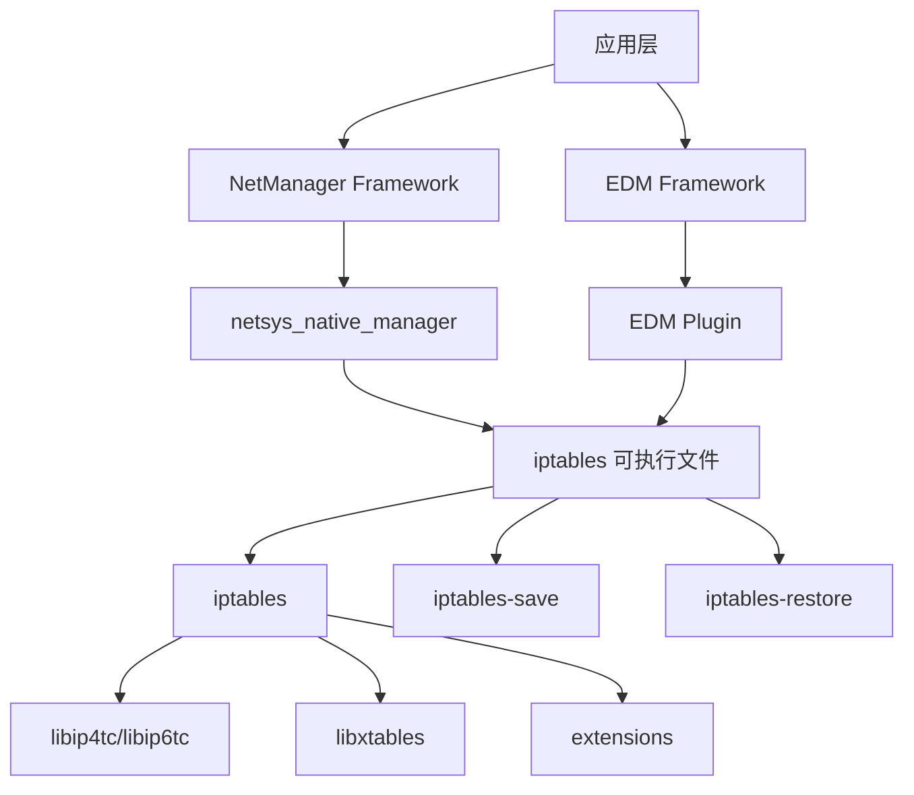
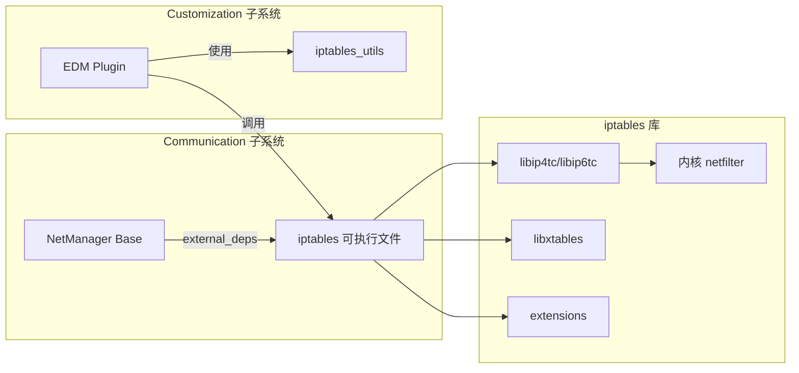
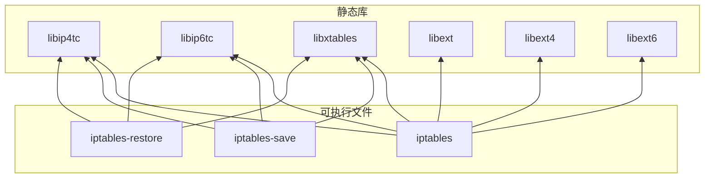

# iptables 在 OpenHarmony 中的使用

## 依赖关系总览

iptables 在 OpenHarmony 中主要服务于**网络管理**和**企业设备管理**两个领域。



## 直接依赖模块

| 模块 | 路径 | 子系统 | 依赖方式 | 主要用途 |
|-----|------|--------|---------|---------|
| **netsys_native_manager** | foundation/communication/netmanager_base/services/netmanagernative | communication | external_deps | 核心网络防火墙、流量管理 |
| **communication_plugin** | base/customization/enterprise_device_management/services/edm_plugin | customization | source deps | 企业防火墙规则管理 |
| **edm_common** | base/customization/enterprise_device_management/common/native | customization | source deps | iptables 工具函数 |

---

## 1. NetManager Base - 核心网络管理

### 模块信息

- **模块名**: netsys_native_manager / netmanager_base
- **子系统**: communication
- **归属**: foundation/communication/netmanager_base
- **依赖方式**: `external_deps` 依赖 iptables 可执行文件

### 依赖声明

```gn
# BUILD.gn (netmanager_base/services/netmanagernative)
external_deps = [
    "iptables:iptables",
    "iptables:iptables-restore",
    "iptables:iptables-save",
]
```

### 核心实现: iptables_wrapper

**文件位置**:
- `foundation/communication/netmanager_base/services/netmanagernative/src/netsys/iptables_wrapper.cpp`
- `foundation/communication/netmanager_base/services/netmanagernative/include/iptables_wrapper.h`

#### 架构设计

`IptablesWrapper` 是一个**命令执行包装器**，通过 fork/exec 调用 iptables 命令行工具：

```cpp
class IptablesWrapper {
public:
    // 执行 iptables 命令
    int RunIptablesCommand(const std::string& command);
    
    // 执行 iptables-save
    int RunIptablesSaveCommand(std::string& output);
    
    // 执行 iptables-restore
    int RunIptablesRestoreCommand(const std::string& rules);
    
private:
    // IPv4 和 IPv6 命令路径
    static constexpr const char* IPTABLES_PATH = "/system/bin/iptables";
    static constexpr const char* IP6TABLES_PATH = "/system/bin/ip6tables";
    static constexpr const char* IPTABLES_SAVE_PATH = "/system/bin/iptables-save";
    static constexpr const char* IP6TABLES_SAVE_PATH = "/system/bin/ip6tables-save";
    static constexpr const char* IPTABLES_RESTORE_PATH = "/system/bin/iptables-restore";
    static constexpr const char* IP6TABLES_RESTORE_PATH = "/system/bin/ip6tables-restore";
};
```

#### 工作流程

```
NetManager 服务
      │
      ▼
iptables_wrapper.RunCommand()
      │
      ▼
fork() → execv("/system/bin/iptables", args)
      │
      ▼
内核 netfilter 框架
```

#### 典型使用场景

##### 1. 防火墙规则管理

```cpp
// 添加防火墙规则示例
std::string cmd = "iptables -A INPUT -p tcp --dport 8080 -j ACCEPT";
IptablesWrapper::RunIptablesCommand(cmd);
```

##### 2. NAT 配置

```cpp
// 配置网络地址转换
std::string cmd = "iptables -t nat -A POSTROUTING -o eth0 -j MASQUERADE";
IptablesWrapper::RunIptablesCommand(cmd);
```

##### 3. 规则持久化

```cpp
// 保存规则
std::string rules;
IptablesWrapper::RunIptablesSaveCommand(rules);
// 保存到文件...

// 恢复规则
IptablesWrapper::RunIptablesRestoreCommand(savedRules);
```

### 功能覆盖

根据代码分析，NetManager 使用 iptables 实现以下功能：

| 功能 | 说明 | iptables 表/链 |
|-----|------|---------------|
| **包过滤** | 基础防火墙功能 | filter 表的 INPUT/OUTPUT/FORWARD |
| **NAT** | 网络地址转换 | nat 表的 PREROUTING/POSTROUTING |
| **带宽控制** | 流量整形 | mangle 表 |
| **连接追踪** | 有状态防火墙 | conntrack 模块 |
| **流量统计** | 数据包计数 | 规则的计数器功能 |
| **VPN 路由** | VPN 流量管理 | 自定义链和规则 |
| **网络共享** | 热点/网络共享 | nat 表的 MASQUERADE |

### IPv4/IPv6 双栈支持

NetManager 同时支持 IPv4 和 IPv6：

```cpp
// 根据 IP 类型选择命令
if (isIpv4) {
    cmd = IPTABLES_PATH;
} else {
    cmd = IP6TABLES_PATH;  // 指向 ip6tables 软链接
}
```

iptables 可执行文件通过 `symlink_target_name` 创建 `ip6tables` 软链接，实现代码复用。

---

## 2. Enterprise Device Management (EDM) - 企业设备管理

### 模块信息

- **模块名**: communication_plugin / edm_plugin / edm_common
- **子系统**: customization
- **归属**: base/customization/enterprise_device_management
- **依赖方式**: 源码级依赖（直接调用 iptables 功能）

### 关键源文件

| 文件 | 路径 | 功能 |
|-----|------|------|
| iptables_manager.cpp | services/edm_plugin/src/network/ | 核心 iptables 规则管理 |
| iptables_rule_plugin.cpp | services/edm_plugin/src/network/ | EDM 网络规则插件 |
| iptables_factory.cpp | services/edm_plugin/src/network/ | 管理器工厂 |
| ipv4tables_manager.cpp | services/edm_plugin/src/network/ | IPv4 专用管理器 |
| ipv6tables_manager.cpp | services/edm_plugin/src/network/ | IPv6 专用管理器 |
| iptables_utils.cpp | common/native/src/ | 工具函数 |
| iptables_utils.h | common/native/include/ | 工具函数头文件 |

### 架构设计

EDM 实现了**面向对象的 iptables 管理框架**：

```
IptablesRulePlugin
       │
       ├── IptablesFactory
       │       │
       │       ├── Ipv4TablesManager
       │       └── Ipv6TablesManager
       │
       └── IptablesUtils
```

#### 核心类

##### IptablesManager (抽象基类)
```cpp
class IptablesManager {
public:
    virtual int AddRule(const FirewallRule& rule) = 0;
    virtual int RemoveRule(const FirewallRule& rule) = 0;
    virtual int ClearRules() = 0;
    virtual int ListRules(std::vector<FirewallRule>& rules) = 0;
    
protected:
    virtual std::string BuildIptablesCommand(const FirewallRule& rule) = 0;
};
```

##### Ipv4TablesManager / Ipv6TablesManager
```cpp
class Ipv4TablesManager : public IptablesManager {
protected:
    std::string GetIptablesPath() const override {
        return "/system/bin/iptables";
    }
};

class Ipv6TablesManager : public IptablesManager {
protected:
    std::string GetIptablesPath() const override {
        return "/system/bin/ip6tables";
    }
};
```

### 企业功能

EDM 使用 iptables 实现以下企业级网络功能：

| 功能 | 说明 | 典型应用场景 |
|-----|------|------------|
| **域名过滤** | 基于 DNS/域名的访问控制 | 阻止访问特定网站 |
| **IP 黑白名单** | 基于 IP 的访问控制 | 只允许访问内网 |
| **端口限制** | 基于端口的流量控制 | 禁用非业务端口 |
| **协议控制** | 基于协议的过滤 | 只允许 HTTP/HTTPS |
| **时间策略** | 基于时间的规则 | 工作时间限制访问 |
| **应用隔离** | 应用级网络隔离 | 沙箱应用网络 |

### 规则管理示例

```cpp
// 添加企业防火墙规则
FirewallRule rule;
rule.domain = "example.com";
rule.action = FirewallAction::DENY;
rule.direction = TrafficDirection::OUTGOING;
rule.appId = "com.example.app";

// 通过管理器应用规则
auto manager = IptablesFactory::CreateManager(IPVersion::V4);
manager->AddRule(rule);

// 生成并执行的 iptables 命令（内部实现）
// iptables -A OUTPUT -p tcp -d 93.184.216.34 --dport 443 -j DROP
```

---

## 依赖关系图

### 模块级依赖



### 构建依赖



---

## 使用方式对比

| 维度 | NetManager | EDM |
|-----|-----------|-----|
| **依赖方式** | external_deps (声明式) | 源码级 (直接调用) |
| **调用方式** | fork/exec 命令行 | fork/exec 命令行 |
| **封装层级** | 简单包装器 | 完整管理框架 |
| **功能范围** | 系统级网络功能 | 企业策略管理 |
| **IPv6 支持** | 完整支持 | 完整支持 |
| **策略复杂度** | 中等 | 高（企业级） |

---

## 典型使用场景

### 场景 1: 应用网络隔离

```
应用 A (沙箱)
    │
    ▼
NetManager (iptables_wrapper)
    │
    ▼
iptables -A OUTPUT -m owner --uid-owner 10001 -j DROP
    │
    ▼
内核 - 阻止应用 A 的所有出站流量
```

### 场景 2: 企业防火墙策略

```
EDM 策略服务器
    │
    ▼
EDM Plugin (IptablesManager)
    │
    ▼
添加规则到企业链:
  - iptables -N ENTERPRISE_FILTER
  - iptables -A OUTPUT -j ENTERPRISE_FILTER
  - iptables -A ENTERPRISE_FILTER -d blocked.com -j DROP
    │
    ▼
用户设备 - 无法访问 blocked.com
```

### 场景 3: 热点网络共享

```
用户开启热点
    │
    ▼
NetManager
    │
    ▼
iptables -t nat -A POSTROUTING -o eth0 -j MASQUERADE
iptables -A FORWARD -i eth0 -o wlan0 -m state --state RELATED,ESTABLISHED -j ACCEPT
iptables -A FORWARD -i wlan0 -o eth0 -j ACCEPT
    │
    ▼
连接设备可以共享网络
```

---

## 依赖关系总结

### 直接依赖者 (基于 BUILD.gn 分析)

| # | 模块 | 路径 | 依赖强度 | 说明 |
|---|-----|------|---------|------|
| 1 | netmanager_base | foundation/communication/netmanager_base | 强 | 核心网络功能依赖 |
| 2 | enterprise_device_management | base/customization/enterprise_device_management | 中 | 企业防火墙策略 |

### 间接影响

iptables 通过上述模块间接影响：
- **所有需要网络访问的应用**: 通过 NetManager 的防火墙规则
- **企业设备**: 通过 EDM 的网络策略
- **系统网络服务**: VPN、热点、流量统计等

### 不可替代性

iptables 在 OpenHarmony 中是**关键基础设施**：
- ✅ 无替代方案（OHOS 中无其他 netfilter 用户态工具）
- ✅ 内核深度集成（netfilter 是 Linux 标准）
- ✅ 上层模块重度依赖

**建议**: iptables 的维护和升级应作为高优先级任务。
