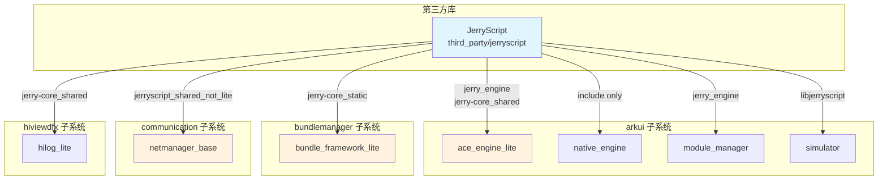

# JerryScript 在 OpenHarmony 中的使用

## 1. 依赖关系概览

### 1.1 直接依赖者统计

**总计**: 4 个主要模块，8 个 BUILD.gn 文件

| 模块 | 子系统 | 依赖类型 | 主要用途 |
|------|--------|----------|----------|
| **ace_engine_lite** | arkui | 核心引擎 | UI 渲染、JS 运行时 |
| **bundle_framework_lite** | bundlemanager | 字节码转换 | 应用包解析 |
| **netmanager_base** | communication | PAC 执行 | 网络代理配置 |
| **hilog_lite** | hiviewdfx | 测试依赖 | 日志测试 |

### 1.2 依赖关系图



---

## 2. 核心使用场景

### 2.1 ace_engine_lite - UI 引擎

#### 使用概述

ace_engine_lite 是 OpenHarmony 轻量级 UI 引擎，JerryScript 作为其 JavaScript 运行时核心，负责执行应用的 JS 代码。

#### 依赖方式

**BUILD.gn 配置**:
```gn
# foundation/arkui/ace_engine_lite/frameworks/BUILD.gn

# LiteOS-M 环境
if (ohos_kernel_type == "liteos_m") {
  deps += [ "//third_party/jerryscript:jerry_engine" ]
} else {
  # 标准环境
  deps += [
    "//third_party/jerryscript/jerry-core:jerry-core_shared",
    "//third_party/jerryscript/jerry-ext:jerry-ext_shared",
    "//third_party/jerryscript/jerry-libm:jerry-libm_shared",
    "//third_party/jerryscript/jerry-port/default:jerry-port-default_shared",
  ]
}

# 头文件包含
include_dirs += [
  "//third_party/jerryscript/jerry-core/include",
]
```

#### API 使用

**1. 引擎初始化**
```cpp
#include "jerryscript.h"
#include "jerryscript-port-default.h"

// 初始化引擎
jerry_init(JERRY_INIT_EMPTY);

// 设置致命错误处理
jerry_port_default_set_fatal_handler(HandleFatalError);

// 启用外部上下文（如果需要）
jerry_context_t *context = jerry_create_context(nullptr);
jerry_set_context(context);
```

**2. 内存监控**
```cpp
#include "jerryscript-core.h"

// 获取内存统计信息
jerry_heap_stats_t stats = {0};
jerry_get_memory_stats(&stats);

printf("Allocated bytes: %zu\n", stats.allocated_bytes);
printf("Peak allocated bytes: %zu\n", stats.peak_allocated_bytes);
printf("GC count: %zu\n", stats.gc_count);
```

**3. 字符串操作**
```cpp
#include "jerryscript.h"

// 检查值类型
jerry_value_t value = /* ... */;
if (jerry_value_is_string(value)) {
    // 获取字符串大小
    size_t size = jerry_get_string_size(value);

    // 提取字符串内容
    jerry_char_t buffer[size];
    jerry_string_to_char_buffer(value, buffer, size);
    printf("String: %s\n", buffer);
}
```

**4. GC 控制**
```cpp
// 在关键代码执行前禁用 GC
ecma_gc_disable();

// 执行关键路径（如动画帧渲染）
// ...

// 恢复 GC
ecma_gc_enable();

// 手动触发 GC
jerry_gc(JERRY_GC_SEVERITY_LOW);
```

#### 主要使用场景

| 场景 | 说明 |
|------|------|
| **JS 应用执行** | 运行轻量级 JS 应用的业务逻辑 |
| **JSI 绑定** | 通过 JSI（JavaScript Interface）提供 JS 与 C++ 的互操作 |
| **内存管理** | 监控 JS 堆内存，防止 OOM |
| **错误处理** | 捕获和处理 JS 运行时错误 |
| **快照加载** | 预编译 JS 字节码，加速应用启动 |

---

### 2.2 bundle_framework_lite - 包管理服务

#### 使用概述

bundle_framework_lite 是 OpenHarmony 的轻量级包管理服务，使用 JerryScript 将 JS 源码预编译为字节码，提升应用加载性能。

#### 依赖方式

**BUILD.gn 配置**:
```gn
# foundation/bundlemanager/bundle_framework_lite/services/bundlemgr_lite/BUILD.gn

deps = [
  "//third_party/jerryscript/jerry-core:jerry-core_static",
]

# 多目录头文件包含
include_dirs += [
  "//third_party/jerryscript/jerry-core/api",
  "//third_party/jerryscript/jerry-core/ecma/base",
  "//third_party/jerryscript/jerry-core/include",
  "//third_party/jerryscript/jerry-core/jrt",
  "//third_party/jerryscript/jerry-core/jmem",
  "//third_party/jerryscript/jerry-core/lit",
]
```

#### API 使用

**1. 字节码转换**
```cpp
#include "jerryscript_adapter.h"

// 初始化 BMS 任务内存
void GtManagerService::ScanPackages() {
    JerryBmsPsRamMemInit();

    // 初始化 BMS 任务上下文
    bms_task_context_init();

    // 获取 JS 引擎版本
    jsEngineVer_ = get_jerry_version_no();
}
```

**2. 快照生成**
```cpp
#include "jerryscript.h"

// 读取 JS 源文件
FILE *fp = fopen("app.js", "r");
size_t file_size = /* ... */;
char *source_code = (char*)malloc(file_size + 1);
fread(source_code, 1, file_size, fp);
fclose(fp);

// 解析 JS 源码
jerry_value_t parsed_code = jerry_parse(
    (const jerry_char_t *)source_code,
    file_size,
    JERRY_PARSE_NO_OPTS
);

// 生成字节码快照
size_t snapshot_size = jerry_get_snapshot_size(
    parsed_code,
    JERRY_SNAPSHOT_SAVE_STATIC
);

uint8_t *snapshot_buffer = (uint8_t*)malloc(snapshot_size);
jerry_snapshot_result_t result = jerry_generate_snapshot(
    parsed_code,
    snapshot_buffer,
    snapshot_size,
    JERRY_SNAPSHOT_SAVE_STATIC
);

// 保存快照到文件
if (result == JERRY_SNAPSHOT_OK) {
    FILE *out_fp = fopen("app.jbc", "wb");
    fwrite(snapshot_buffer, 1, snapshot_size, out_fp);
    fclose(out_fp);
}

// 清理
jerry_release_value(parsed_code);
free(source_code);
free(snapshot_buffer);
```

**3. 快照执行**
```cpp
// 加载快照
FILE *fp = fopen("app.jbc", "rb");
fseek(fp, 0, SEEK_END);
size_t snapshot_size = ftell(fp);
fseek(fp, 0, SEEK_SET);

uint8_t *snapshot_buffer = (uint8_t*)malloc(snapshot_size);
fread(snapshot_buffer, 1, snapshot_size, fp);
fclose(fp);

// 从快照恢复并执行
jerry_value_t func = jerry_load_snapshot(
    snapshot_buffer,
    snapshot_size,
    0,
    JERRY_SNAPSHOT_EXEC_ALLOW_STATIC
);

jerry_value_t result = jerry_call_function(func, jerry_create_undefined(), NULL, 0);

// 清理
jerry_release_value(result);
jerry_release_value(func);
free(snapshot_buffer);
```

#### 主要使用场景

| 场景 | 说明 |
|------|------|
| **字节码预编译** | 将 JS 源码编译为字节码，减少运行时解析开销 |
| **应用包安装** | 安装应用时预编译 JS 文件 |
| **版本管理** | 记录 JS 引擎版本，确保兼容性 |
| **BMS 任务隔离** | 独立的 BMS 任务上下文，避免与 JS 任务冲突 |

---

### 2.3 netmanager_base - 网络代理管理

#### 使用概述

netmanager_base 使用 JerryScript 执行 PAC (Proxy Auto-Configuration) 代理脚本，实现动态网络代理配置。

#### 依赖方式

**BUILD.gn 配置**:
```gn
# foundation/communication/netmanager_base/services/netconnmanager/BUILD.gn

if (netmanager_base_enable_pac_proxy) {
  external_deps += [ "jerryscript:jerryscript_shared_not_lite" ]
}
```

#### API 使用

**1. PAC 函数注册**
```cpp
// 文件: pac_functions.cpp

#include "jerryscript.h"

void PacFunctions::RegisterPacFunctions(void)
{
    jerry_value_t globalObj = jerry_get_global_object();

    // 注册网络检测函数
    RegisterHostDomainFunctions(globalObj);
    RegisterDnsResolveFunctions(globalObj);
    RegisterIpAddressFunctions(globalObj);

    // 注册时间/日期函数
    RegisterTimeAndDateFunctions(globalObj);

    // 注册模式匹配函数
    RegisterPatternMatchingFunctions(globalObj);

    jerry_release_value(globalObj);
}
```

**2. 实现 PAC 标准函数**

**isPlainHostName**
```cpp
// 检查是否为纯主机名（不包含点号）
jerry_value_t PacFunctions::JsIsPlainHostName(
    const jerry_value_t func_value,
    const jerry_value_t this_val,
    const jerry_value_t args_p[],
    const jerry_length_t args_cnt
) {
    if (args_cnt < 1) {
        return jerry_create_boolean(false);
    }

    jerry_value_t host = args_p[0];
    if (!jerry_value_is_string(host)) {
        return jerry_create_boolean(false);
    }

    jerry_length_t length = 0;
    jerry_string_to_utf8_char_buffer(host, nullptr, 0, &length);
    std::string host_str(length, '\0');
    jerry_string_to_utf8_char_buffer(host, (jerry_char_t*)host_str.data(), length, &length);

    // 检查是否包含点号
    bool is_plain = (host_str.find('.') == std::string::npos);
    return jerry_create_boolean(is_plain);
}
```

**dnsDomainIs**
```cpp
// 检查主机名是否属于指定域名
jerry_value_t PacFunctions::JsDnsDomainIs(
    const jerry_value_t func_value,
    const jerry_value_t this_val,
    const jerry_value_t args_p[],
    const jerry_length_t args_cnt
) {
    if (args_cnt < 2) {
        return jerry_create_boolean(false);
    }

    // 获取主机名和域名
    jerry_value_t host = args_p[0];
    jerry_value_t domain = args_p[1];

    // 提取字符串
    std::string host_str = ExtractString(host);
    std::string domain_str = ExtractString(domain);

    // 检查主机名是否以域名结尾
    bool match = false;
    if (host_str.length() >= domain_str.length()) {
        match = (host_str.compare(
            host_str.length() - domain_str.length(),
            domain_str.length(),
            domain_str
        ) == 0);
    }

    return jerry_create_boolean(match);
}
```

**myIpAddress**
```cpp
// 获取本机 IP 地址
jerry_value_t PacFunctions::JsMyIpAddress(
    const jerry_value_t func_value,
    const jerry_value_t this_val,
    const jerry_value_t args_p[],
    const jerry_length_t args_cnt
) {
    // 获取本机 IP 地址（实际实现需要调用网络接口）
    std::string ip = GetLocalIpAddress();

    // 返回 IP 字符串
    return jerry_create_string((const jerry_char_t*)ip.c_str());
}
```

**dateRange**
```cpp
// 检查当前日期是否在指定范围内
jerry_value_t PacFunctions::JsDateRange(
    const jerry_value_t func_value,
    const jerry_value_t this_val,
    const jerry_value_t args_p[],
    const jerry_length_t args_cnt
) {
    // 解析参数（支持多种格式）
    // dateRange(1)
    // dateRange(1, 15)
    // dateRange(1, "JAN")
    // dateRange(1, 15, "JAN")
    // dateRange(1, 15, "JAN", 2023)

    // 获取当前日期
    time_t now = time(nullptr);
    struct tm *tm_now = localtime(&now);

    // 日期范围匹配逻辑
    bool in_range = CheckDateRange(tm_now, args_p, args_cnt);

    return jerry_create_boolean(in_range);
}
```

**isInNet**
```cpp
// 检查 IP 地址是否在指定子网内
jerry_value_t PacFunctions::JsIsInNet(
    const jerry_value_t func_value,
    const jerry_value_t this_val,
    const jerry_value_t args_p[],
    const jerry_length_t args_cnt
) {
    if (args_cnt < 3) {
        return jerry_create_boolean(false);
    }

    // 参数：ip, subnet, mask
    std::string ip = ExtractString(args_p[0]);
    std::string subnet = ExtractString(args_p[1]);
    std::string mask = ExtractString(args_p[2]);

    // 检查 IP 是否在子网内
    bool in_subnet = CheckSubnet(ip, subnet, mask);

    return jerry_create_boolean(in_subnet);
}
```

**3. PAC 脚本执行**
```cpp
#include "jerryscript.h"

// 加载 PAC 脚本
std::string pac_script = ReadFile("proxy.pac");

// 解析 PAC 脚本
jerry_value_t parsed_code = jerry_parse(
    (const jerry_char_t *)pac_script.c_str(),
    pac_script.length(),
    JERRY_PARSE_NO_OPTS
);

// 执行 PAC 脚本（定义函数）
jerry_value_t result = jerry_run(parsed_code);
jerry_release_value(result);

// 调用 FindProxyForURL 函数
jerry_value_t global = jerry_get_global_object();
jerry_value_t find_proxy_func = jerry_get_property_by_name(global, "FindProxyForURL");

jerry_value_t url = jerry_create_string((jerry_char_t*)"http://example.com");
jerry_value_t host = jerry_create_string((jerry_char_t*)"example.com");

jerry_value_t args[] = { url, host };
jerry_value_t proxy_result = jerry_call_function(
    find_proxy_func,
    jerry_create_undefined(),
    args,
    2
);

// 解析代理配置
std::string proxy = ExtractString(proxy_result);
// proxy 格式: "PROXY proxy.example.com:8080; DIRECT"

// 清理
jerry_release_value(proxy_result);
jerry_release_value(host);
jerry_release_value(url);
jerry_release_value(find_proxy_func);
jerry_release_value(global);
jerry_release_value(parsed_code);
```

#### 支持的 PAC 函数

| 函数名 | 说明 | 参数 |
|--------|------|------|
| `isPlainHostName` | 检查是否为纯主机名 | host |
| `dnsDomainIs` | 检查域名匹配 | host, domain |
| `isInNet` | 检查 IP 子网 | ip, subnet, mask |
| `myIpAddress` | 获取本机 IP | - |
| `dnsResolve` | DNS 解析 | host |
| `shExpMatch` | Shell 表达式匹配 | str, pattern |
| `weekdayRange` | 检查星期范围 | wd1, wd2, ... |
| `dateRange` | 检查日期范围 | ... |
| `timeRange` | 检查时间范围 | ... |

---

### 2.4 hilog_lite - 日志服务测试

#### 使用概述

hilog_lite 的单元测试依赖 JerryScript，用于测试 JS 绑定功能。仅在调试模式下使用。

#### 依赖方式

**BUILD.gn 配置**:
```gn
# base/hiviewdfx/hilog_lite/test/BUILD.gn

if (ohos_kernel_type == "liteos_m") {
  deps += [
    "//third_party/jerryscript:jerry_engine",
  ]
} else {
  deps += [
    "//third_party/jerryscript/jerry-port/default:jerry-port-default_shared",
  ]
}
```

#### 主要用途

| 用途 | 说明 |
|------|------|
| **单元测试** | 测试 hilog 的 JS API 绑定 |
| **集成测试** | 验证 JS 日志功能 |
| **调试** | 在开发环境中验证功能 |

---

## 3. 依赖方式对比

| 模块 | 静态/动态 | 目标 | 主要用途 |
|------|----------|------|----------|
| ace_engine_lite (liteos_m) | 静态 | jerry_engine | UI 渲染 |
| ace_engine_lite (标准) | 动态 | jerry-core_shared | UI 渲染 |
| bundle_framework_lite | 静态 | jerry-core_static | 字节码转换 |
| netmanager_base | 动态 | jerryscript_shared_not_lite | PAC 执行 |
| hilog_lite | 混合 | jerry_engine / jerry-port-default_shared | 测试 |

---

## 4. API 使用模式

### 4.1 初始化模式

```cpp
// 模式 1: 基础初始化
jerry_init(JERRY_INIT_EMPTY);

// 模式 2: 启用快照
jerry_init(JERRY_INIT_SHOW_OPCODES | JERRY_INIT_MEM_STATS);

// 模式 3: 外部上下文
jerry_context_t *context = jerry_create_context(nullptr);
jerry_init(JERRY_INIT_EMPTY);
jerry_set_context(context);
```

### 4.2 代码执行模式

```cpp
// 模式 1: 直接执行 JS 字符串
jerry_eval(
    (const jerry_char_t*)"var x = 1 + 2;",
    16,
    JERRY_PARSE_NO_OPTS
);

// 模式 2: 解析后执行
jerry_value_t parsed = jerry_parse(source, size, JERRY_PARSE_NO_OPTS);
jerry_value_t result = jerry_run(parsed);
jerry_release_value(result);
jerry_release_value(parsed);

// 模式 3: 快照执行
jerry_value_t func = jerry_load_snapshot(snapshot, size, 0, JERRY_SNAPSHOT_EXEC_ALLOW_STATIC);
jerry_value_t result = jerry_call_function(func, jerry_create_undefined(), NULL, 0);
```

### 4.3 内存管理模式

```cpp
// 获取内存统计
jerry_heap_stats_t stats = {0};
jerry_get_memory_stats(&stats);

// 手动触发 GC
jerry_gc(JERRY_GC_SEVERITY_LOW);

// 禁用/启用 GC
ecma_gc_disable();
// ... 关键代码 ...
ecma_gc_enable();
```

---

## 5. 性能优化建议

### 5.1 ace_engine_lite

1. **使用快照**: 预编译 JS 字节码，减少启动时间
2. **控制 GC 频率**: 在动画渲染等关键时段禁用 GC
3. **内存限制**: 设置合理的堆大小，避免 OOM

### 5.2 bundle_framework_lite

1. **增量编译**: 只编译修改过的 JS 文件
2. **快照缓存**: 缓存编译结果，避免重复编译
3. **并行编译**: 多线程编译多个 JS 文件

### 5.3 netmanager_base

1. **缓存 PAC 结果**: 避免重复执行相同 URL 的 PAC 查询
2. **轻量级 JS 函数**: 优化 PAC 函数实现，减少执行时间
3. **快速失败**: DNS 解析失败时快速返回，避免长时间阻塞

---

## 6. 常见问题

### Q1: ace_engine_lite 如何管理 JS 堆内存？

**答**: ace_engine_lite 使用 JerryScript 的内存统计 API 来监控堆内存使用：

```cpp
jerry_heap_stats_t stats = {0};
jerry_get_memory_stats(&stats);

// 如果接近堆大小限制，触发 GC
if (stats.allocated_bytes > heap_size * 0.9) {
    jerry_gc(JERRY_GC_SEVERITY_HIGH);
}
```

### Q2: bundle_framework_lite 如何处理 JS 引擎版本升级？

**答**: 通过 `jerryscript_adapter.c` 提供的版本管理 API：

```cpp
int jsEngineVer_ = get_jerry_version_no();

// 检查快照版本兼容性
if (snapshot_version != jsEngineVer_) {
    // 重新编译 JS 文件
    RecompileJsFiles();
}
```

### Q3: netmanager_base 如何确保 PAC 脚本安全？

**答**: 使用 JerryScript 的安全特性：

1. **禁用 eval()**: 通过 `JERRY_BUILTIN_EVAL_DISABLED` 宏
2. **限制执行时间**: 使用 `JERRY_VM_EXEC_STOP` API
3. **内存限制**: 设置 `JS_TASK_HEAP_SIZE` 限制

### Q4: 如何在调试时启用详细日志？

**答**: 通过 GN 配置启用：

```gn
jerryscript_jerry_error_messages = 1
jerryscript_jerry_line_info = 1
jerryscript_jerry_debugger = 1
```

---

**相关文档**:
- [01_Overview.md](01_Overview.md) - 原始库简介
- [02_Patches.md](02_Patches.md) - Patch 详细分析
- [03_Build_Integration.md](03_Build_Integration.md) - 构建集成
