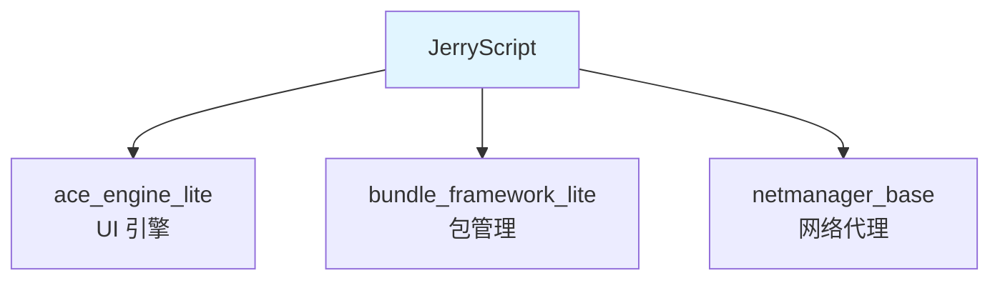

# JerryScript OpenHarmony 集成文档

**库版本**: v2.3.0
**文档日期**: 2026-02-07

---

## 概述

本文档说明 OpenHarmony 对 JerryScript JavaScript 引擎的集成与适配。JerryScript 是一个超轻量级 JavaScript 引擎，在 OH 中主要作为轻量级系统的 JavaScript 运行时核心。

### 核心信息

| 项目 | 内容 |
|------|------|
| **原始库名** | JerryScript |
| **许可证** | Apache-2.0 |
| **上游地址** | https://github.com/jerryscript-project/jerryscript.git |
| **OH 组件名** | @ohos/jerryscript |
| **OH 版本** | 3.1 |
| **子系统** | thirdparty |

### 主要用途

- **ace_engine_lite**: UI 引擎的 JavaScript 运行时
- **bundle_framework_lite**: JS 字节码转换
- **netmanager_base**: PAC 代理脚本执行

---

## 文档导航

### 快速开始

- **[SUMMARY.md](SUMMARY.md)** - 推荐阅读顺序
- **[_work/ASSESSMENT.md](_work/ASSESSMENT.md)** - 项目评估结果

### 核心文档

| 文档 | 说明 | 适合读者 |
|------|------|----------|
| **[01_Overview.md](01_Overview.md)** | 原始库简介 | 所有人 |
| **[02_Patches.md](02_Patches.md)** | Patch 详细分析 | 开发者 |
| **[03_Build_Integration.md](03_Build_Integration.md)** | 构建适配说明 | 构建工程师 |
| **[04_Usage_in_OH.md](04_Usage_in_OH.md)** | OH 使用场景 | 应用开发者 |

---

## OH 适配概述

### 构建系统

OpenHarmony 将 JerryScript 的 CMake 构建系统替换为 GN/Ninja，支持两种构建模式：

- **Lite 模式**: 针对轻量设备（IP Camera）
- **标准模式**: 针对 Linux 等标准系统

### 主要修改

| 修改类型 | 数量 | 说明 |
|----------|------|------|
| Patch 文件 | 1 | test262-es6.patch（测试相关） |
| 直接代码修改 | ~15 | 内存优化、GC 控制、字符串优化等 |
| 新增文件 | 6 | OH 特定适配文件 |
| 构建文件 | 8 | BUILD.gn + bundle.json + engine.gni |

### 特性支持

| 特性 | 支持 | 备注 |
|------|------|------|
| ES5.1 | ✅ 完整 | 标准支持 |
| ES2015 | ⚠️ 部分支持 | Promise, Proxy, TypedArray 等 |
| ES2020+ | ❌ 不支持 | 轻量级限制 |
| 调试器 | ✅ 支持 | 基于 TCP/WebSocket |
| 快照 | ✅ 支持 | 预编译字节码 |
| 外部上下文 | ✅ 支持 | 多任务环境 |

---

## 依赖关系



### 依赖者详情

| 模块 | 子系统 | 使用方式 |
|------|--------|----------|
| ace_engine_lite | arkui | 核心 JS 运行时 |
| bundle_framework_lite | bundlemanager | 字节码转换 |
| netmanager_base | communication | PAC 代理脚本 |

详细说明见 [04_Usage_in_OH.md](04_Usage_in_OH.md)。

---

## 关键配置

### 内存配置（默认值）

| 配置项 | 默认值 | 说明 |
|--------|--------|------|
| `INPUTJS_BUFFER_SIZE` | 32KB | JS 输入缓冲区 |
| `SNAPSHOT_BUFFER_SIZE` | 24KB | 快照缓冲区 |
| `JS_TASK_HEAP_SIZE` | 64KB | JS 任务堆 |
| `BMS_TASK_HEAP_SIZE` | 64KB | BMS 任务堆 |

### ES2015 特性（默认启用）

- ✅ TypedArray
- ✅ Promise
- ✅ Proxy
- ✅ Map
- ✅ Set
- ✅ Symbol
- ✅ 模块系统

### ES2015 特性（默认禁用，内存考虑）

- ❌ WeakMap
- ❌ WeakSet
- ❌ DataView
- ❌ Reflect

---

## 开发指南

### 如何依赖 JerryScript

在项目的 BUILD.gn 中添加依赖：

```gn
# 静态库
deps += [ "//third_party/jerryscript:jerryscript_static_not_lite" ]

# 动态库
deps += [ "//third_party/jerryscript:jerryscript_shared_not_lite" ]

# Lite 模式
deps += [ "//third_party/jerryscript:jerry_engine" ]
```

### 头文件包含

```cpp
#include "jerryscript.h"           // 核心 API
#include "jerryscript-port-default.h"  // 端口层 API
#include "jerryscript-ext/handle-scope/handle-scope.h"  // 扩展 API
```

### 基础使用示例

```cpp
#include "jerryscript.h"

// 初始化
jerry_init(JERRY_INIT_EMPTY);

// 执行 JS 代码
jerry_value_t result = jerry_eval(
    (const jerry_char_t*)"var x = 1 + 2;",
    16,
    JERRY_PARSE_NO_OPTS
);

// 清理
jerry_release_value(result);
jerry_cleanup();
```

完整示例见 [04_Usage_in_OH.md](04_Usage_in_OH.md)。

---

## 升级建议

### 当前状态

- **上游版本**: v2.3.0 (2020年)
- **上游活跃**: ✅ 是
- **OH 特性**: 约 6 个新增文件 + 核心代码修改

### 升级风险评估

| 风险项 | 级别 | 说明 |
|--------|------|------|
| 构建系统适配 | 中 | GN 配置需要同步更新 |
| 内存优化 | 中 | 2023 核心修改需要重新评估 |
| 平台适配 | 低 | IAR/JUPITER 适配保留 |
| 功能兼容性 | 低 | 主要功能稳定 |

### 升级建议

**保守策略**（推荐）:
1. 先合入上游 bug 修复和安全修复
2. 保留 OH 性能优化
3. 逐步验证向上游贡献

详细升级建议见 [02_Patches.md](02_Patches.md)。

---

## 安全说明

### 已修复 CVE

| CVE | 说明 | 状态 |
|-----|------|------|
| CVE-2020-24187 | 堆溢出漏洞 | ✅ 已修复 |
| CVE-2021-43453 | 堆损坏漏洞 | ✅ 已修复 |

### 安全特性

- ✅ 默认禁用 `eval()`
- ✅ GC mark 递归限制
- ✅ 内存大小限制
- ✅ 堆转储支持（调试）

安全详情见 [06_Security.md](06_Security.md)（如有）。

---

## 常见问题

### Q1: JerryScript 适用于哪些场景？

**答**: 适用于资源受限的轻量级设备（<64KB RAM, <200KB Flash），如 IP Camera、IoT 设备等。

### Q2: 如何调整内存配置？

**答**: 在项目配置中覆盖 engine.gni 定义的变量：

```gn
jerryscript_js_task_heap_size = 128  # 增加到 128KB
```

### Q3: 如何启用调试？

**答**: 配置以下选项：

```gn
jerryscript_jerry_debugger = 1
jerryscript_jerry_line_info = 1
jerryscript_jerry_error_messages = 1
```

### Q4: 如何提交问题？

**答**:
1. JerryScript 核心问题: https://github.com/jerryscript-project/jerryscript/issues
2. OH 适配问题: 联系维护者 pengbiao1@huawei.com

---

## 相关资源

### 上游资源

- **GitHub**: https://github.com/jerryscript-project/jerryscript
- **项目页**: http://jerryscript.net
- **Wiki**: https://github.com/jerryscript-project/jerryscript/wiki
- **Mailing List**: jerryscript-dev@groups.io

### OpenHarmony 资源

- **OH 官网**: https://www.openharmony.cn
- **OH 文档**: https://docs.openharmony.cn
- **OH 代码库**: https://gitee.com/openharmony

### 文档目录

```
wiki/
├── README.md              # 本文档
├── SUMMARY.md             # 阅读路线
├── 01_Overview.md         # 原始库简介
├── 02_Patches.md          # Patch 详细分析
├── 03_Build_Integration.md # 构建适配
├── 04_Usage_in_OH.md      # OH 使用场景
└── _work/
    ├── ASSESSMENT.md       # 项目评估
    ├── NOTES.md           # 分析笔记
    └── PLAN.md            # 任务计划
```

---

## 维护信息

| 项目 | 内容 |
|------|------|
| **维护者** | pengbiao1@huawei.com |
| **最后更新** | 2026-02-07 |
| **文档版本** | 1.0 |

---

## 更新日志

| 日期 | 版本 | 更新内容 |
|------|------|----------|
| 2026-02-07 | 1.0 | 初始文档，完成 Phase 0 信息收集 |

---

**本文档由 OpenHarmony Wiki Agent 自动生成**
