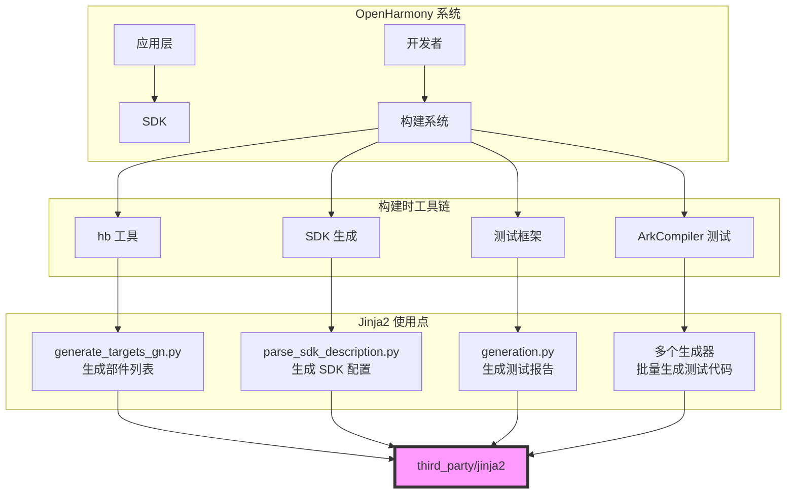

# 依赖关系与使用

## 直接依赖者

经全面搜索，共有 **28 个 Python 文件** 直接导入使用 jinja2。

### 按模块分类

#### 1. 构建系统 (4 个文件)

| 文件路径 | 导入方式 | 用途 |
|----------|----------|------|
| `build/ohos/sdk/parse_sdk_description.py` | `from jinja2 import Template` | SDK 描述解析，生成 GN 目标列表 |
| `build/ohos/sdk/generate_all_types_sdk.py` | `from jinja2 import Template` | 生成多类型 SDK 配置 |
| `build/hb/util/loader/generate_targets_gn.py` | `from jinja2 import Template` | 生成部件列表和 kit 列表 |
| `build/dfx/build_trace_uploader.py` | `from jinja2 import Template, FileSystemLoader, Environment, exceptions` | 构建追踪日志上传，模板渲染 HTTP 请求 |

**典型代码片段**:
```python
sys.path.insert(1, os.path.join(os.path.abspath(
    os.path.join(os.path.dirname(__file__), '..', '..', '..')), 'third_party'))
from jinja2 import Template  # noqa: E402  # pylint: disable=F0401

PARTS_LIST_GNI_TEMPLATE = """
parts_list = [
  
  "{{ part }}",
  
]
"""
```

#### 2. 测试框架 (1 个文件)

| 文件路径 | 导入方式 | 用途 |
|----------|----------|------|
| `test/testfwk/xdevice/plugins/devicetest/report/generation.py` | `from jinja2 import Environment, FileSystemLoader` | 生成 HTML 测试报告 |

**典型代码片段**:
```python
from jinja2 import Environment, FileSystemLoader

env = Environment(loader=FileSystemLoader(template_dir))
template = env.get_template('report_template.html')
```

#### 3. ArkCompiler 测试系统 (10+ 个文件)

| 文件路径 | 用途 |
|----------|------|
| `arkcompiler/runtime_core/static_core/tests/tests-u-runner-2/runner/extensions/generators/sts_stdlib/func_templates_generator.py` | 标准库函数测试代码生成 |
| `arkcompiler/runtime_core/static_core/tests/tests-u-runner-2/runner/extensions/generators/sts_stdlib/stdlib_templates_generator.py` | 标准库模板生成 |
| `arkcompiler/runtime_core/static_core/tests/tests-u-runner-2/runner/extensions/generators/ets_cts/template.py` | ETS CTS 测试模板 |
| `arkcompiler/runtime_core/static_core/tests/tests-u-runner-2/runner/extensions/generators/ets_cts/yaml_extension.py` | YAML 扩展处理 |
| `arkcompiler/runtime_core/static_core/tests/tests-u-runner-2/runner/test/template_extension_test/yaml_extension_test.py` | 模板扩展测试 |
| `arkcompiler/runtime_core/static_core/tests/tests-u-runner/runner/generators/ets_func_tests/ets_func_test_template_generator.py` | ETS 函数测试生成 |
| `arkcompiler/runtime_core/static_core/tests/tests-u-runner/runner/plugins/ets/ets_templates/template.py` | ETS 模板系统 |
| `arkcompiler/runtime_core/static_core/tests/tests-u-runner/runner/plugins/ets/ets_templates/yaml_extension.py` | YAML 模板扩展 |
| `arkcompiler/runtime_core/static_core/tests/tests-u-runner/runner/plugins/ets/stdlib_templates/stdlib_templates_generator.py` | 标准库测试生成 |
| `arkcompiler/runtime_core/static_core/tests/vm-benchmarks/src/vmb/generate.py` | VM 基准测试代码生成 |
| `arkcompiler/runtime_core/static_core/plugins/ets/tests/ani/tests/verifyani/cmake/test_gen_script/test_gen_script.py` | ANI 测试代码生成 |
| `arkcompiler/runtime_core/static_core/plugins/ets/tests/ani/tests/bridges/scripts/gen_test_files.py` | 桥接测试文件生成 |

**典型代码片段**:
```python
from jinja2 import Environment, FileSystemLoader, TemplateSyntaxError, select_autoescape

env = Environment(
    loader=FileSystemLoader(template_dir),
    autoescape=select_autoescape(['html', 'xml'])
)
template = env.get_template('test_case.ets.j2')
code = template.render(test_spec=spec)
```

#### 4. 第三方库脚本 (4 个文件)

| 文件路径 | 用途 |
|----------|------|
| `third_party/mbedtls/scripts/generate_driver_wrappers.py` | 生成驱动包装代码 |
| `third_party/mbedtls/tests/scripts/generate_test_cert_macros.py` | 生成测试证书宏 |
| `third_party/grpc/tools/distrib/python/grpc_prefixed/generate.py` | gRPC Python 代码生成 |
| `third_party/json/tools/generate_natvis/generate_natvis.py` | Visual Studio 调试文件生成 |

#### 5. Skia 工具 (1 个文件)

| 文件路径 | 用途 |
|----------|------|
| `third_party/skia/m133/tools/skp/generate_page_set.py` | 页面集生成工具 |

---

## 使用方式

### 链接方式

Jinja2 在 OpenHarmony 中**不作为编译依赖**，因此不存在静态或动态链接的概念。

Python 的导入机制可视为**源码级依赖**：

```
Python 脚本
    ├── sys.path.insert() ──→ third_party/jinja2/
    └── import jinja2
```

### 头文件引用方式

对于 Python，"头文件" 对应于模块导入：

```python
# 常用导入方式
from jinja2 import Template                    # 简单模板
from jinja2 import Environment, FileSystemLoader  # 文件模板
from jinja2 import Environment, select_autoescape # 自动转义
import jinja2                                    # 完整模块
```

### 关键使用场景

#### 场景 1: SDK 配置生成

**位置**: `build/ohos/sdk/`

**用途**: 根据 SDK 描述文件生成 GN 构建配置

**输入**: JSON 格式的 SDK 描述
**输出**: `.gni` 文件 (GN 变量定义)

```python
template = Template("""
sdk_{{ sdk_type }}_targets = [
  
  {
    name = "{{ target.name }}"
    install_dir = "{{ target.install_dir }}"
  },
  
]
""")
```

#### 场景 2: 构建目标列表生成

**位置**: `build/hb/util/loader/`

**用途**: 生成部件列表、inner_kits 列表等

**输出**: `parts_list.gni`, `inner_kits_list.gni`

```python
PARTS_LIST_GNI_TEMPLATE = """
parts_list = [
  
  "{{ part }}",
  
]
"""
```

#### 场景 3: 测试代码批量生成

**位置**: `arkcompiler/**/tests/`

**用途**: 基于 YAML/JSON 规范批量生成测试用例

**输入**: 测试规范文件 (.yaml)
**输出**: TypeScript/JavaScript 测试文件 (.ets)

```python
env = Environment(loader=FileSystemLoader('templates'))
for spec in load_test_specs('tests.yaml'):
    template = env.get_template('test_template.ets.j2')
    code = template.render(**spec)
    write_file(f"{spec.name}.ets", code)
```

#### 场景 4: 测试报告渲染

**位置**: `test/testfwk/xdevice/`

**用途**: 生成美观的 HTML 测试报告

**输入**: 测试结果数据
**输出**: HTML 报告文件

```python
env = Environment(
    loader=FileSystemLoader('report_templates'),
    autoescape=True  # 安全：自动 HTML 转义
)
template = env.get_template('report.html')
html = template.render(
    title="Test Report",
    results=test_results,
    summary=summary_stats
)
```

---

## 依赖图

### 简化依赖图



### 详细依赖关系

```
third_party/jinja2
    │
    ├── build/ohos/sdk/
    │   ├── parse_sdk_description.py
    │   └── generate_all_types_sdk.py
    │       └── 用途: SDK 描述 → GN 配置
    │
    ├── build/hb/util/loader/
    │   └── generate_targets_gn.py
    │       └── 用途: 生成部件/kit 列表
    │
    ├── build/dfx/
    │   └── build_trace_uploader.py
    │       └── 用途: HTTP 请求模板渲染
    │
    ├── test/testfwk/xdevice/
    │   └── plugins/devicetest/report/generation.py
    │       └── 用途: HTML 测试报告
    │
    ├── arkcompiler/runtime_core/static_core/tests/
    │   ├── tests-u-runner-2/runner/extensions/generators/** (5+ 文件)
    │   ├── tests-u-runner/runner/generators/** (3+ 文件)
    │   └── plugins/ets/tests/ani/tests/** (2+ 文件)
    │       └── 用途: 批量生成测试代码
    │
    ├── third_party/mbedtls/scripts/
    │   └── generate_driver_wrappers.py
    │       └── 用途: 驱动代码生成
    │
    ├── third_party/grpc/tools/distrib/python/grpc_prefixed/
    │   └── generate.py
    │       └── 用途: gRPC 代码生成
    │
    └── third_party/skia/m133/tools/skp/
        └── generate_page_set.py
            └── 用途: 页面集生成
```

---

## 依赖者使用统计

| 模块类别 | 文件数量 | 占比 | 主要用途 |
|----------|----------|------|----------|
| 构建系统 | 4 | 14% | SDK/部件配置生成 |
| 测试框架 | 1 | 4% | 报告生成 |
| ArkCompiler 测试 | 12 | 43% | 测试代码批量生成 |
| 第三方库脚本 | 4 | 14% | 各种代码生成 |
| Skia | 1 | 4% | 工具脚本 |
| **合计** | **28** | **100%** | - |

---

## 间接依赖

### 运行时依赖

Jinja2 运行时依赖：
- Python 3.7+ (OpenHarmony 使用 Python 3.8+)
- MarkupSafe (可选，用于 HTML 转义)

### 构建时依赖

使用 Jinja2 的 Python 脚本通常还依赖：
- OpenHarmony 构建工具 (`build/hb`)
- 文件工具 (`build/scripts/util/file_utils`)
- JSON/YAML 解析库

---

## 关键发现

1. **构建工具链核心** - 40% 的使用在核心构建系统
2. **测试代码生成主力** - 43% 的使用在 ArkCompiler 测试系统
3. **纯构建时依赖** - 无运行时依赖，不进入系统镜像
4. **广泛的代码生成** - 用于 GN 配置、测试代码、报告、驱动代码等
5. **零侵入式设计** - 不修改其他模块，仅作为工具使用
