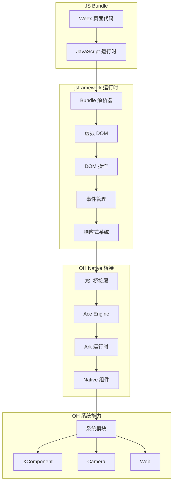
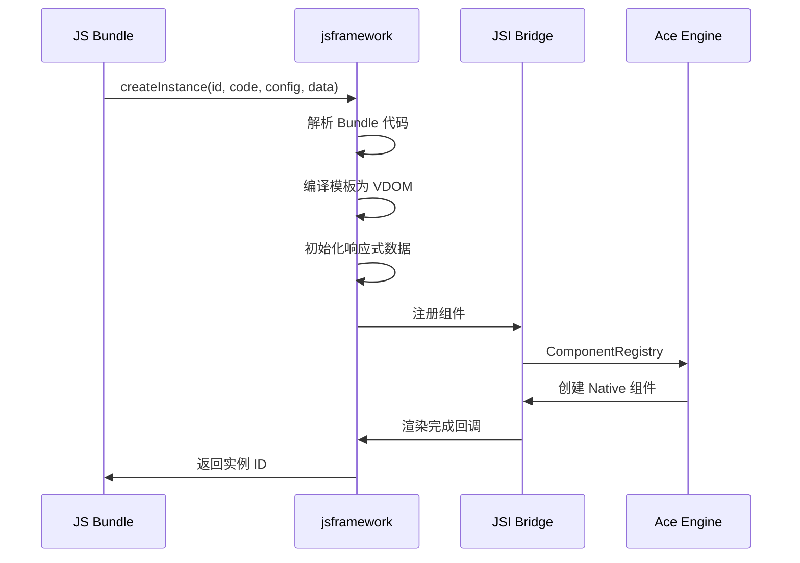
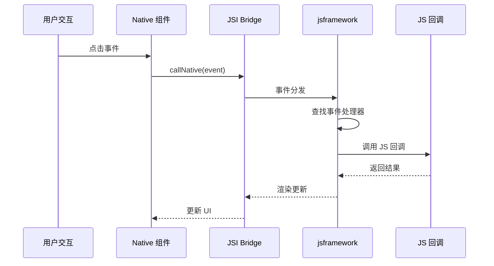

# 01_Overview - 库概览

## 1.1 原始库简介

### Apache Weex 概述

Apache Weex 是一个跨平台的移动端 UI 框架，允许开发者使用 Vue.js 语法编写界面代码，然后编译为 iOS、Android 和 Web 平台的原生应用。

**原始特性**:

- **Virtual DOM**: 高性能虚拟 DOM 实现
- **Native Rendering**: 原生组件渲染，非 WebView
- **Hot Reload**: 开发时热重载支持
- **Component System**: 丰富的内置组件库
- **Module System**: 可扩展的原生模块机制

### Weex 版本信息

| 属性           | 值                             |
| -------------- | ------------------------------ |
| **上游版本**   | 0.30.0                         |
| **上游地址**   | https://github.com/apache/weex |
| **上游许可证** | Apache License 2.0             |
| **发布日期**   | 2019年                         |

---

## 1.2 OpenHarmony 适配版本

### OH 版本信息

| 属性                 | 值                |
| -------------------- | ----------------- |
| **OH 组件名称**      | jsframework       |
| **OH 适配版本**      | 3.1               |
| **bundle.json 名称** | @ohos/jsframework |
| **子系统**           | thirdparty        |
| **适配系统类型**     | standard          |

### 适配策略概述

与传统的 Patch 方式不同，jsframework 采用**独立源码分支**的方式进行 OH 适配：

1. **独立源码目录**: `runtime/` 目录包含完整的框架实现，而非在上游源码上打 Patch
2. **构建系统适配**: 通过 `BUILD.gn` 实现 GN 构建系统的深度集成
3. **Ark 字节码支持**: 针对 OH Ark 引擎生成 `.abc` 字节码格式
4. **原生模块扩展**: 注册了 50+ OH 特有组件和 13 个系统模块

---

## 1.3 框架架构

### 整体架构图



### 核心模块说明

#### runtime/main/

| 目录/文件     | 功能                                | 行数估算 |
| ------------- | ----------------------------------- | -------- |
| `app/`        | 应用生命周期管理                    | ~400 行  |
| `extend/`     | OH 扩展模块 (DPI、I18N、MediaQuery) | ~800 行  |
| `manage/`     | 事件调度和实例管理                  | ~1000 行 |
| `model/`      | 编译器、指令、DOM 实现              | ~2000 行 |
| `page/`       | 页面渲染和 API                      | ~1000 行 |
| `reactivity/` | 响应式数据系统                      | ~500 行  |
| `util/`       | 工具函数                            | ~200 行  |

#### runtime/preparation/

**功能**: 框架初始化和模块注册

关键文件:

- `init.ts` - 模块注册入口（包含 50+ 组件和 13 个系统模块的定义）
- `service.ts` - 服务注册机制

#### runtime/vdom/

**功能**: 虚拟 DOM 实现

关键组件:

- `Document.ts` - DOM 文档对象
- `Element.ts` - DOM 元素
- `Node.ts` - DOM 节点基类
- `NativeElementClassFactory.ts` - 原生元素类工厂

---

## 1.4 核心流程

### Bundle 加载流程



### 事件处理流程



---

## 1.5 与上游 Weex 的差异

### 适配差异总览

| 类别         | 上游 Weex       | OH 适配版本             |
| ------------ | --------------- | ----------------------- |
| **构建系统** | Webpack/Rollup  | GN + npm + es2abc       |
| **输出格式** | JS Bundle       | JS Bundle + .abc 字节码 |
| **组件数量** | ~30 个          | 50+ 个                  |
| **系统模块** | 基础模块        | 13 个 OH 系统模块       |
| **动画系统** | basic animation | ohos.animator           |
| **设备支持** | Android/iOS     | 标准设备 + 穿戴设备     |

### 主要差异点

#### 1. 构建系统适配

**上游**: 使用 Webpack/Rollup 进行打包

**OH 适配**: 使用 GN 构建系统集成

```gn
# BUILD.gn 关键配置
action("gen_snapshot") {
  script = "//third_party/jsframework/js_framework_build.sh"
  inputs = [ "runtime/..." ]  # 源码输入
  outputs = [ "$target_out_dir/dist/strip.native.min.js" ]
}
```

#### 2. Ark 字节码生成

**特有功能**: 支持生成 Ark 引擎的 `.abc` 字节码

```gn
es2abc_gen_abc("ark_jsf") {
  src_js = rebase_path(prebuilt_js_path)
  dst_file = rebase_path(ark_abc_path)
}

ohos_prebuilt_etc("ark_build") {
  deps = [ ":ark_jsf" ]
  source = ark_abc_path
}
```

#### 3. 系统模块扩展

**新增模块**:

| 模块名          | 功能      | 特有 API                                             |
| --------------- | --------- | ---------------------------------------------------- |
| `ohos.animator` | OH 动画器 | createAnimator, create                               |
| `digitalCrown`  | 数字表冠  | setMonitorForCrownEvents, clearMonitorForCrownEvents |
| `system.grid`   | 系统布局  | getSystemLayoutInfo                                  |

#### 4. 组件扩展

**新增组件** (部分):

| 组件名       | 功能       | 特有 API                                     |
| ------------ | ---------- | -------------------------------------------- |
| `xcomponent` | XComponent | getXComponentContext, getXComponentSurfaceId |
| `camera`     | 相机组件   | takePhoto, startRecorder, closeRecorder      |
| `web`        | Web 组件   | reload                                       |
| `canvas`     | 画布       | getContext, toDataURL                        |

---

## 1.6 框架定位

### 在 OH 系统中的位置

```
OpenHarmony 系统架构
├── 应用层
│   ├── FA (Feature Ability)         # JS/ETS 应用
│   └── System UI                   # 系统 UI
├── 框架层
│   ├── Ace Framework
│   │   ├── Ace Engine              # 核心引擎
│   │   │   └── jsframework          # JS 运行时 ← 本库
│   │   └── ...
│   └── ...
├── 系统层
│   ├── Ark Runtime                 # JS 运行时
│   └── Native API
└── 内核层
    └── Linux Kernel
```

### 核心作用

1. **JS Bundle 解析**: 解析 Weex 格式的 JS 页面代码
2. **Virtual DOM 管理**: 提供高效的 DOM 操作和更新机制
3. **Native 桥接**: 通过 JSI 与 Native 层通信
4. **组件渲染**: 管理组件的创建、更新和销毁
5. **事件处理**: 处理用户交互和系统事件

### 依赖关系

**上游依赖**:

- css-what - CSS 选择器解析器（通过 bundle.json 声明）

**下游依赖**:

- ace_engine - JS 前端引擎集成

---

## 1.7 性能特性

### 优化措施

1. **Virtual DOM Diff**: 高效的差异算法，最小化 DOM 操作
2. **响应式依赖追踪**: 精确的数据变更监听
3. **事件批量处理**: 减少 Native 与 JS 的通信次数
4. **增量更新**: 支持只更新变化的部分

### 性能指标（参考）

| 操作     | 预期性能           |
| -------- | ------------------ |
| 初始渲染 | < 100ms (典型页面) |
| 简单更新 | < 16ms (60fps)     |
| 事件响应 | < 50ms             |
| 内存占用 | 与页面复杂度相关   |

---

## 1.8 局限性

### 当前限制

1. **仅支持 JS 语法**: 暂不支持 ETS 语言直接编写页面
2. **依赖 Ace Engine**: 需要配合 ace_engine 使用
3. **标准系统限定**: 部分功能仅支持标准系统
4. **组件兼容性**: 上游 Weex 组件可能需要适配

### TODO(需确认)

- [ ] 确认是否支持 Preview 模式
- [ ] 确认 XComponent 的完整支持情况
- [ ] 确认 Camera 组件的权限要求

---

## 相关文档

- [02_Patches.md](./02_Patches.md) - Patch 分析（本库无传统 Patch）
- [03_Build_Integration.md](./03_Build_Integration.md) - 构建适配
- [04_Usage_in_OH.md](./04_Usage_in_OH.md) - 使用方式
- [05_API_Differences.md](./05_API_Differences.md) - API 差异
