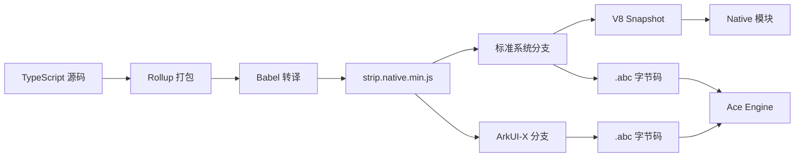

# 03_Build_Integration - OH 构建适配

## 3.1 构建系统概述

### GN 构建系统集成

jsframework 使用 OpenHarmony 的 GN (Generate Ninja) 构建系统进行构建，通过 `BUILD.gn` 文件定义完整的构建流程。

**关键特征**:

- **双产物输出**: 同时生成 JavaScript 产物和 Ark 字节码 (.abc)
- **条件编译**: 支持标准系统和 ArkUI-X 两种配置
- **NPM 集成**: 使用 npm 进行 JavaScript 依赖管理
- **快照生成**: 支持 V8 Snapshot 和 Ark ABC 两种格式

### 构建流程概述



---

## 3.2 BUILD.gn 结构详解

### 顶层配置

```gn
# Copyright (c) 2021 Huawei Device Co., Ltd.
# Licensed under the Apache License, Version 2.0

import("//build/ohos.gni")  # OH 构建系统导入
```

**说明**: 导入 OH 构建系统的 GNI 配置文件，提供 `ohos_prebuilt_etc`、`ohos_source_set` 等模板。

### 构建目标定义

#### 1. gen_node_modules

**功能**: 生成 node_modules 目录

```gn
action("gen_node_modules") {
  script = "//third_party/jsframework/prebuild_env.sh"
  inputs = [
    "package.json",
    "package-lock.json",
  ]
  outputs = [ "$root_out_dir/jsframework/node_modules" ]
}
```

#### 2. gen_snapshot（核心构建目标）

**功能**: 生成打包后的 JavaScript 产物

```gn
action("gen_snapshot") {
  script = "//third_party/jsframework/js_framework_build.sh"

  # JS Framework 源码目录
  js_framework = "//third_party/jsframework/runtime"

  # Node.js 环境配置
  node_modules = "//prebuilts/build-tools/common/js-framework/node_modules"
  nodejs_path = "//prebuilts/build-tools/common/nodejs/current"

  # 构建文件
  buildfile_native_min = "//third_party/jsframework/build_strip_native_min.js"
  package_file = "//third_party/jsframework/package.json"
  tsconfig = "//third_party/jsframework/tsconfig.json"
  eslint = "//third_party/jsframework/.eslintrc"
  babel = "//third_party/jsframework/.babelrc"
  test_file = "//third_party/jsframework/test"

  # 条件编译：独立编译器配置
  if (ohos_indep_compiler_enable) {
    external_deps = [ "css-what:css_what_sources" ]
    css_what = "obj/binarys/third_party/css-what/innerapis/css_what_sources/src"
    is_indep_compiler = "true"
  } else {
    deps = [ "//third_party/css-what:css_what_sources" ]
    is_indep_compiler = "false"
  }

  # 构建参数
  args = [
    rebase_path(nodejs_path, root_build_dir),
    rebase_path(js_framework, root_build_dir),
    rebase_path(node_modules, root_build_dir),
    rebase_path(package_file, root_build_dir),
    rebase_path(tsconfig, root_build_dir),
    rebase_path(eslint, root_build_dir),
    rebase_path(test_file, root_build_dir),
    rebase_path(target_out_dir, root_build_dir),
    rebase_path(babel, root_build_dir),
    is_mac,           # 是否 macOS
    rebase_path("//prebuilts", root_build_dir),
    rebase_path(buildfile_native_min, root_build_dir),
    css_what,         # css-what 路径
    is_indep_compiler # 是否独立编译
  ]

  # 输入文件列表（包含所有 TypeScript 源码）
  inputs = [
    # ... 约 100+ 个源文件
  ]

  # 输出文件
  outputs = [ prebuilt_js_path ]
}
```

**输出文件**:

```
$target_out_dir/dist/strip.native.min.js
```

---

## 3.3 构建产物

### 产物清单

| 产物类型        | 文件路径                   | 说明                       |
| --------------- | -------------------------- | -------------------------- |
| **JS 产物**     | `dist/strip.native.min.js` | 打包后的 JavaScript 运行时 |
| **V8 Snapshot** | `strip.native.min.js.bin`  | 标准系统 V8 快照二进制     |
| **Ark ABC**     | `strip.native.min.abc`     | Ark 引擎字节码             |

### 产物说明

#### strip.native.min.js

**文件大小**: 约 200KB（压缩后）

**包含内容**:

- 虚拟 DOM 实现
- 响应式系统
- 事件管理
- 组件渲染逻辑
- 系统模块桥接

**构建方式**: Rollup + Babel

#### strip.native.min.abc

**文件大小**: 约 150KB

**说明**: Ark 引擎可以直接执行的字节码格式

**生成工具**: es2abc (OpenHarmony 内置工具)

---

## 3.4 条件编译配置

### 条件编译标志

```gn
# 标准系统判断
if (!is_standard_system && !is_arkui_x) {
  # 仅标准系统启用 V8 Snapshot 生成
}

if (!is_arkui_x) {
  # ArkUI-X 排除某些配置
}
```

### ohos_indep_compiler_enable

**功能**: 控制是否启用独立编译器模式

| 模式      | 说明                                |
| --------- | ----------------------------------- |
| **true**  | 独立编译，css-what 从预编译产物获取 |
| **false** | 集成编译，css-what 作为构建依赖     |

```gn
if (ohos_indep_compiler_enable) {
  external_deps = [ "css-what:css_what_sources" ]
} else {
  deps = [ "//third_party/css-what:css_what_sources" ]
}
```

---

## 3.5 Ark 字节码生成配置

### es2abc 集成

```gn
import("//build/config/components/ets_frontend/es2abc_config.gni")

es2abc_gen_abc("ark_jsf") {
  extra_visibility = [ ":*" ]
  extra_dependencies = [ ":gen_snapshot" ]

  src_js = rebase_path(prebuilt_js_path)
  dst_file = rebase_path(ark_abc_path)
}

ohos_prebuilt_etc("ark_build") {
  deps = [ ":ark_jsf" ]
  source = ark_abc_path

  if (!is_arkui_x) {
    part_name = "jsframework"
    subsystem_name = "thirdparty"
  }
}
```

**说明**:

- `es2abc_gen_abc`: 使用 OH 内置的 es2abc 工具生成 ABC 字节码
- `ohos_prebuilt_etc`: 将产物打包为 OH 预编译组件

---

## 3.6 V8 Snapshot 生成（标准系统）

### V8 Snapshot 配置

```gn
if (!is_standard_system && !is_arkui_x) {
  v8_snapshot_bin_path = get_label_info(":v8_snapshot_bin", "target_out_dir") +
                          "/strip.native.min.js.bin"
  v8_snapshot_obj_path = get_label_info(":v8_snapshot_bin", "target_out_dir") +
                          "/strip.native.min.js.o"

  action("gen_snapshot_bin") {
    deps = [ ":gen_snapshot" ]
    deps += [ "$v8_root:mksnapshot($v8_snapshot_toolchain)" ]

    script = "$v8_root/tools/run.sh"

    args = [
      rebase_path("${aosp_libs_dir}/ndk/libcxx/linux_x86") + ":" +
          rebase_path("${aosp_libs_dir}/ndk/libcxx/linux_x86_64"),
      rebase_path(get_label_info("$v8_root:mksnapshot($v8_snapshot_toolchain)",
                     "root_out_dir") + "/arkui/ace_engine_full/mksnapshot"),
      rebase_path(prebuilt_js_path),
      "--startup_blob=" + rebase_path(v8_snapshot_bin_path),
      "--turbo_instruction_scheduling",
    ]
  }

  ohos_prebuilt_etc("v8_snapshot_bin") {
    deps = [ ":gen_snapshot_bin" ]
    source = v8_snapshot_bin_path
    part_name = "jsframework"
  }
}
```

### 产物目标

| 目标名            | 类型              | 产物                    | part_name   |
| ----------------- | ----------------- | ----------------------- | ----------- |
| `ark_build`       | ohos_prebuilt_etc | strip.native.min.abc    | jsframework |
| `v8_snapshot_bin` | ohos_prebuilt_etc | strip.native.min.js.bin | jsframework |

---

## 3.7 构建脚本详解

### js_framework_build.sh

**位置**: `//third_party/jsframework/js_framework_build.sh`

**功能**: 调用 Node.js 执行 Rollup 打包

```bash
# 关键步骤
node $nodejs_path/bin/node \
  $buildfile_native_min \
  $js_framework \
  $node_modules \
  $package_file \
  $tsconfig \
  $eslint \
  $test_file \
  $target_out_dir \
  $babel \
  $is_mac \
  $prebuilts_path \
  $buildfile_native_min_path \
  $css_what_path \
  $is_indep_compiler
```

**依赖的构建文件**:

- `build_strip_native_min.js` - Rollup 打包配置
- `.babelrc` - Babel 转译配置
- `tsconfig.json` - TypeScript 编译配置

---

## 3.8 依赖配置

### 内部依赖

```gn
deps = [ "//third_party/css-what:css_what_sources" ]
```

**css-what**: CSS 选择器解析器，用于解析组件选择器。

### 外部依赖（独立编译模式）

```gn
external_deps = [ "css-what:css_what_sources" ]
```

### 构建时依赖

| 依赖项                                                 | 用途           |
| ------------------------------------------------------ | -------------- |
| prebuilts/build-tools/common/js-framework/node_modules | 构建工具链     |
| prebuilts/build-tools/common/nodejs                    | Node.js 运行时 |
| build/config/components/ets_frontend/es2abc_config.gni | ABC 生成工具   |

---

## 3.9 构建产物集成

### 与 ace_engine 的集成

```gn
# ace_engine 的 BUILD.gn
external_deps += [
  "css-what:css_what_sources",
  "jsframework:ark_build",  # 依赖 jsframework 的 ark_build 目标
  "napi:ace_napi",
]
```

### 集成说明

1. **产物类型**: `ohos_prebuilt_etc`
2. **安装路径**: `//system/lib/module/xxx/`
3. **引用方式**: 通过 `jsframework:ark_build` label 引用

---

## 3.10 构建配置示例

### 标准系统完整配置

```gn
# 启用标准系统配置
is_standard_system = true
is_arkui_x = false

# 产物
jsframework_build = "//third_party/jsframework:ark_build"
v8_snapshot_build = "//third_party/jsframework:v8_snapshot_bin"
```

### ArkUI-X 配置

```gn
# ArkUI-X 配置
is_standard_system = false
is_arkui_x = true

# 仅生成 ABC 字节码
jsframework_build = "//third_party/jsframework:ark_build"
# v8_snapshot_bin 目标被跳过
```

---

## 3.11 常见构建问题

### 问题 1：css-what 依赖失败

**现象**:

```
error: dependency '//third_party/css-what:css_what_sources' not found
```

**解决方案**:

```gn
# 启用独立编译模式
ohos_indep_compiler_enable = true
```

### 问题 2：es2abc 工具未找到

**现象**:

```
error: es2abc_gen_abc not defined
```

**解决方案**: 确保导入正确的配置：

```gn
import("//build/config/components/ets_frontend/es2abc_config.gni")
```

### 问题 3：macOS 构建失败

**检查**: `is_mac` 变量是否正确设置

```gn
is_mac = host_os == "mac"
```

---

## 相关文档

- [01_Overview.md](./01_Overview.md) - 库概览
- [04_Usage_in_OH.md](./04_Usage_in_OH.md) - 依赖关系与使用
- [05_API_Differences.md](./05_API_Differences.md) - API 差异
