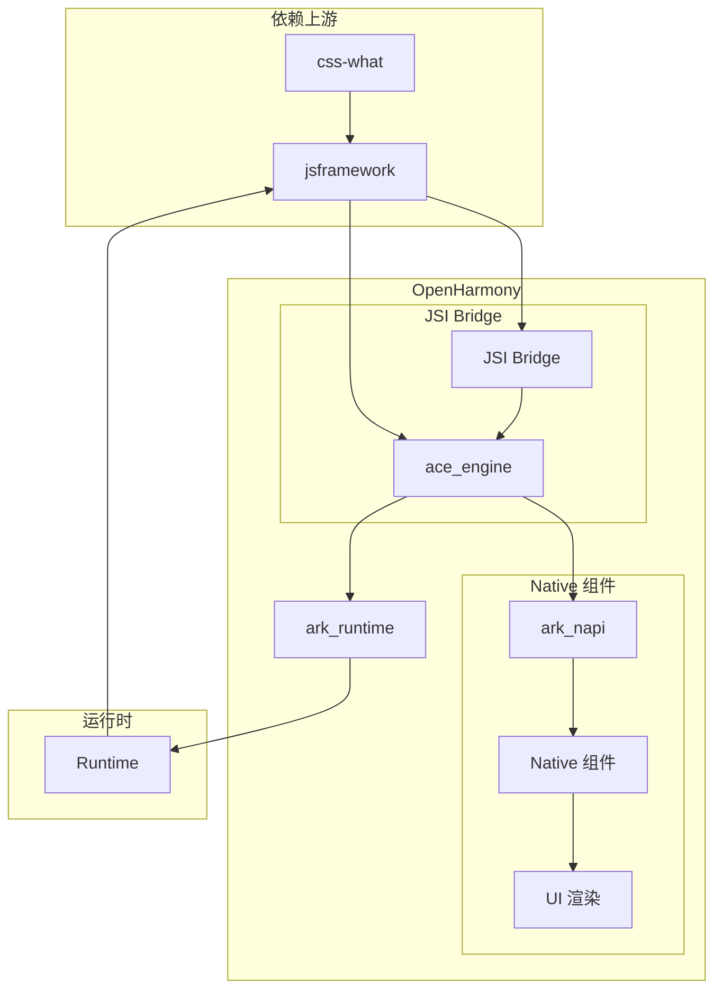
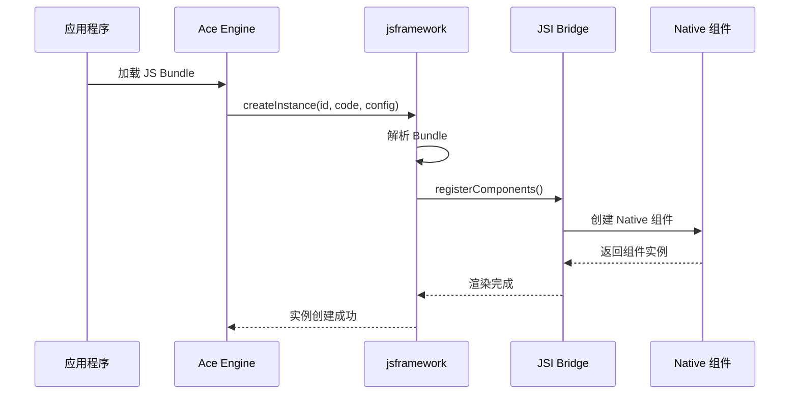

# 04_Usage_in_OH - 依赖关系与使用

## 4.1 依赖关系概述

### 直接依赖者

| 模块           | BUILD.gn 路径                                                                 | 依赖方式      | 主要用途      |
| -------------- | ----------------------------------------------------------------------------- | ------------- | ------------- |
| **ace_engine** | foundation/arkui/ace_engine/frameworks/bridge/js_frontend/engine/jsi/BUILD.gn | external_deps | JS 运行时引擎 |

### 依赖图



---

## 4.2 ace_engine 集成详解

### BUILD.gn 依赖配置

**文件**: `foundation/arkui/ace_engine/frameworks/bridge/js_frontend/engine/jsi/BUILD.gn`

```gn
# 核心依赖配置
external_deps += [
  "css-what:css_what_sources",
  "jsframework:ark_build",  # jsframework 的 Ark 字节码产物
  "napi:ace_napi",
]
```

### 多平台条件编译

```gn
if (defined(config.build_for_preview) && config.build_for_preview) {
  # Preview 模式
  deps += [ ":gen_obj_src_abc_strip_native_min" ]
  external_deps += [ "napi:ace_napi" ]
} else if (defined(config.build_for_android) && config.build_for_android) {
  # Android 平台
  deps += [
    ":gen_obj_src_abc_strip_native_min",
    "//third_party/css-what:css_what_sources",
    "//third_party/jsframework:ark_build",
  ]
} else if (defined(config.build_for_ios) && config.build_for_ios) {
  # iOS 平台
  deps += [ ":gen_obj_src_abc_strip_native_min" ]
  external_deps += [
    "css-what:css_what_sources",
    "jsframework:ark_build",
    "napi:ace_napi",
  ]
} else {
  # 标准 OH 平台（默认）
  external_deps += [
    "css-what:css_what_sources",
    "image_framework:image",
    "image_framework:image_native",
    "jsframework:ark_build",
    "napi:ace_napi",
  ]
}
```

### 平台支持矩阵

| 平台    | jsframework  | css-what | ace_napi | image_framework |
| ------- | ------------ | -------- | -------- | --------------- |
| 标准 OH | ✅ ark_build | ✅       | ✅       | ✅              |
| Android | ✅ ark_build | ✅       | ❌       | ❌              |
| iOS     | ✅ ark_build | ✅       | ✅       | ❌              |
| Preview | ❌           | ❌       | ✅       | ❌              |

---

## 4.3 使用场景

### 场景 1：JS 前端页面渲染

**流程**:



**代码示例**:

```javascript
// JS Bundle 中的页面代码
const vm = new Vue({
  template: "<div>{{ message }}</div>",
  data: { message: "Hello OHOS!" },
});

// 通过 Ace Engine 加载
framework.createInstance("page1", vm.$options, {
  /* data */
});
```

### 场景 2：系统模块调用

**支持的系统模块**:

| 模块            | 功能     | 调用示例                                 |
| --------------- | -------- | ---------------------------------------- |
| `system.router` | 页面路由 | `router.push({ url: 'page2' })`          |
| `system.app`    | 应用信息 | `app.getInfo()`                          |
| `system.prompt` | 提示弹窗 | `prompt.showToast({ message: 'Hello' })` |
| `ohos.animator` | 动画     | `animator.createAnimator({ ... })`       |

**调用方式**:

```javascript
// 通过 framework 模块调用
import { createInstance, receiveTasks } from "@ohos/jsframework";

// 路由跳转
router.push({ url: "pages/detail/index" });

// 弹窗提示
prompt.showToast({ message: "操作成功" });

// 创建动画
const animator = animator.createAnimator({
  duration: 1000,
  easing: "linear",
  iterations: 1,
});
```

### 场景 3：组件交互

**OH 特有组件调用**:

```javascript
// XComponent（原生渲染组件）
const xcomponent = this.$element("xcomponentId");
xcomponent.getXComponentContext();

// Canvas 画布
const canvas = this.$element("canvasId");
const ctx = canvas.getContext("2d");
ctx.fillRect(0, 0, 100, 100);

// Web 组件
const web = this.$element("webId");
web.reload();
```

---

## 4.4 产物使用方式

### ark_build 产物

**产物路径**: `//third_party/jsframework:ark_build`

**产物类型**: `ohos_prebuilt_etc`

**包含文件**:

```
strip.native.min.abc  # Ark 字节码
```

**集成方式**:

```gn
# 在目标模块的 BUILD.gn 中
ohos_source_set("my_module") {
  # ... 其他配置
  external_deps += [ "jsframework:ark_build" ]
}
```

### v8_snapshot_bin 产物（标准系统）

**产物路径**: `//third_party/jsframework:v8_snapshot_bin`

**包含文件**:

```
strip.native.min.js.bin  # V8 快照二进制
```

**使用条件**:

- `is_standard_system = true`
- `is_arkui_x = false`

---

## 4.5 API 使用说明

### 框架入口 API

```typescript
// runtime/main/index.ts
export { createInstance, destroyInstance } from "./manage/instance/life";
export { receiveTasks } from "./manage/event/bridge";
export { getRoot } from "./manage/instance/misc";
export { registerModules, appDestroy, appError, appShow, appHide };
```

#### createInstance

**功能**: 创建 JS 实例

**签名**:

```typescript
function createInstance(
  instanceId: string,
  code: string,
  config: Options,
  data: object,
): any | Error;
```

**参数**:

- `instanceId`: 实例唯一标识
- `code`: JS Bundle 代码
- `config`: 实例配置（包含 componentMap 等）
- `data`: 初始数据

**返回值**: 实例 ID 或 Error

#### destroyInstance

**功能**: 销毁 JS 实例

**签名**:

```typescript
function destroyInstance(pageId: string): any | Error;
```

#### receiveTasks

**功能**: 接收 Native 侧的任务

**签名**:

```typescript
function receiveTasks(
  instanceId: string,
  tasks: any[],
  callback: (tasks: any[]) => void,
): void;
```

### 模块注册 API

**文件**: `runtime/preparation/init.ts`

```typescript
// 注册系统模块
const ModulesInfo: Record<string, string[]>[] = [
  { "system.router": ["push", "replace", "back", "clear" /* ... */] },
  { "system.app": ["getInfo", "getPackageInfo", "terminate" /* ... */] },
  // ... 更多模块
];

// 注册组件
const ComponentsInfo: components<string>[] = [
  { methods: CommanMethods, type: "div" },
  { methods: ["show"], type: "colorpicker" },
  // ... 更多组件
];
```

---

## 4.6 事件处理

### 事件流


### 事件类型

| 事件类型     | 说明                  | 示例                        |
| ------------ | --------------------- | --------------------------- |
| **点击事件** | click, longpress      | `@click="handleClick"`      |
| **触摸事件** | touchstart, touchmove | `@touchstart="handleTouch"` |
| **滚动事件** | scroll, scrollstart   | `@scroll="handleScroll"`    |
| **输入事件** | change, input         | `@input="handleInput"`      |
| **系统事件** | appear, disappear     | `@appear="handleAppear"`    |

### 自定义事件

```javascript
// Native 发送事件到 JS
// 通过 callJS 接口
callJS(instanceId, [
  { method: "fireEvent", args: ["customEvent", { detail: "data" }] },
]);
```

---

## 4.7 组件使用

### 内置组件

jsframework 提供了 50+ 内置组件，分为以下几类：

#### 基础组件

| 组件     | 功能     | 特有 API                  |
| -------- | -------- | ------------------------- |
| `div`    | 基础容器 | addChild, animate         |
| `text`   | 文本     |                           |
| `image`  | 图片     |                           |
| `button` | 按钮     | setProgress               |
| `input`  | 输入框   | showError, insert, delete |

#### 容器组件

| 组件             | 功能     | 特有 API                          |
| ---------------- | -------- | --------------------------------- |
| `list`           | 列表     | scrollTo, scrollBy, collapseGroup |
| `stack`          | 堆叠布局 |                                   |
| `flex`           | 弹性布局 |                                   |
| `grid-container` | 网格容器 | getColumns, getGutterWidth        |

#### OH 特有组件

| 组件         | 功能         | 场景               |
| ------------ | ------------ | ------------------ |
| `xcomponent` | 原生组件渲染 | 地图、游戏引擎     |
| `camera`     | 相机预览     | 拍照、录像         |
| `web`        | WebView      | 网页加载           |
| `canvas`     | 画布绘制     | 2D/3D 绘图         |
| `video`      | 视频播放     | start, pause, stop |
| `dialog`     | 对话框       | show, close        |

### 组件使用示例

```javascript
// 基础使用
<div>
  <text>{{ message }}</text>
  <button onclick="handleClick">点击</button>
</div>

// 列表使用
<list>
  <list-item for="{{ items }}">
    <text>{{ $item.name }}</text>
  </list-item>
</list>

// XComponent 使用
<xcomponent id="map" type="surface" @load="onLoad" />
```

---

## 4.8 数据绑定

### 响应式数据

```javascript
// 定义响应式数据
const data = {
  message: 'Hello OHOS',
  count: 0,
  items: ['a', 'b', 'c']
}

// 模板中使用
<text>{{ message }}</text>
<text>{{ count * 2 }}</text>
<text>{{ items[0] }}</text>
```

### 计算属性

```javascript
// 计算属性
computed: {
  doubleCount() {
    return this.count * 2
  }
}
```

### 监听器

```javascript
// 监听器
watch: {
  count(newVal, oldVal) {
    console.log(`count changed: ${oldVal} -> ${newVal}`)
  }
}
```

---

## 4.9 样式系统

### CSS 支持

```javascript
// JS Bundle 中定义样式
const styles = {
  container: {
    width: '100%',
    height: '100%',
    backgroundColor: '#ffffff',
    flexDirection: 'column'
  },
  title: {
    fontSize: '20fp',
    color: '#333333'
  }
}

// 模板中使用
<text style="title">标题</text>
```

### OH 特有样式

| 属性           | 说明     | 示例                           |
| -------------- | -------- | ------------------------------ |
| `width`        | 宽度     | `'100%'`, `'200px'`, `'100fp'` |
| `height`       | 高度     | `'100%'`, `'200px'`            |
| `padding`      | 内边距   | `'10px'`, `'10px 20px'`        |
| `margin`       | 外边距   | `'10px'`, `'auto'`             |
| `flex`         | 弹性布局 | `flex: 1`                      |
| `grid-columns` | 网格列数 | `'4'`                          |

---

## 4.10 生命周期

### 实例生命周期

| 阶段      | 说明     | 回调        |
| --------- | -------- | ----------- |
| `init`    | 初始化   | -           |
| `created` | 实例创建 | onInit()    |
| `ready`   | 组件就绪 | onReady()   |
| `show`    | 页面显示 | onShow()    |
| `hide`    | 页面隐藏 | onHide()    |
| `destroy` | 实例销毁 | onDestroy() |

### 使用示例

```javascript
export default {
  onInit() {
    console.log("Instance initialized");
  },
  onReady() {
    console.log("Component ready");
  },
  onShow() {
    console.log("Page shown");
  },
  onHide() {
    console.log("Page hidden");
  },
  onDestroy() {
    console.log("Instance destroyed");
  },
};
```

---

## 相关文档

- [01_Overview.md](./01_Overview.md) - 库概览
- [03_Build_Integration.md](./03_Build_Integration.md) - 构建适配
- [05_API_Differences.md](./05_API_Differences.md) - API 差异
- [06_Security.md](./06_Security.md) - 安全风险分析
