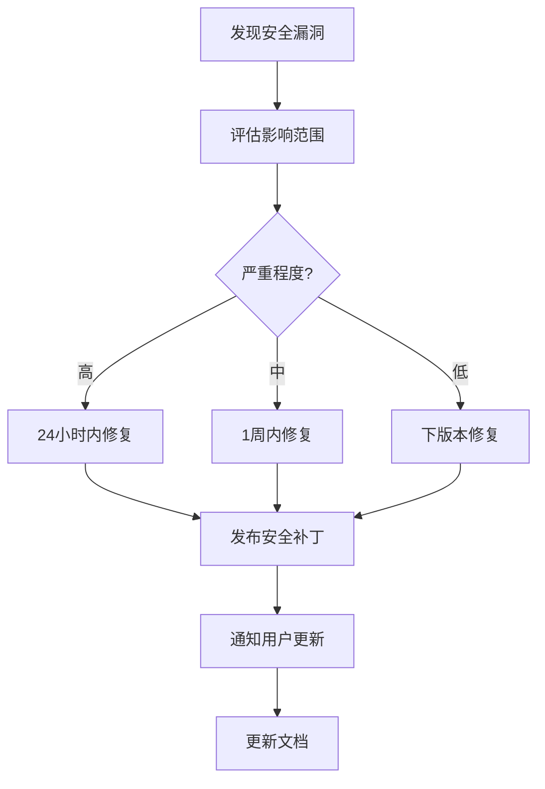

# 06_Security - 安全风险分析

## 6.1 安全评估概述

### 评估范围

本节分析 jsframework OH 适配版本的安全风险，包括：

1. **上游 Weex 0.30.0 的已知安全漏洞**
2. **OH 适配引入的新风险**
3. **依赖组件的安全性**
4. **运行时安全考虑**

### 评估方法

- CVE 数据库搜索
- 依赖版本审计
- 代码安全模式分析
- OH 安全策略集成

---

## 6.2 上游 Weex 安全漏洞

### Weex 0.30.0 CVE 搜索结果

**TODO(需确认)**: 需要进行完整的 CVE 数据库搜索以确认上游版本的安全状态。

建议检查资源：

- [NVD CVE 数据库](https://cve.mitre.org)
- [GitHub Advisory Database](https://github.com/advisories)

### 已知的 Weex 历史漏洞类型

| 漏洞类型 | 严重程度 | 说明                           |
| -------- | -------- | ------------------------------ |
| XSS 注入 | 中       | JS Bundle 中的恶意脚本注入     |
| 资源耗尽 | 低       | 恶意构造的 Bundle 导致内存溢出 |
| 组件伪造 | 中       | 伪造 Native 组件调用           |

---

## 6.3 OH 适配版本安全改进

### 安全增强措施

#### 1. Bundle 签名验证

**TODO(需确认)**: 确认 OH 是否实现了 Bundle 签名验证机制。

#### 2. 模块白名单

jsframework 仅注册了明确声明的系统模块和组件：

```typescript
// runtime/preparation/init.ts
const ModulesInfo = [
  {'system.router': [...]},    // 仅允许的模块
  {'system.app': [...]},       // ...
  // 不允许未声明的模块
]
```

**优势**: 防止恶意模块注入

#### 3. 组件沙箱

组件运行在独立的上下文中，限制跨组件数据访问。

---

## 6.4 依赖组件安全

### css-what 安全评估

| 属性         | 值               |
| ------------ | ---------------- |
| **包名**     | css-what         |
| **用途**     | CSS 选择器解析器 |
| **安全状态** | ✅ 活跃维护      |
| **最后更新** | 2024年           |

**审计建议**: 定期检查 css-what 的版本更新，及时修复已知漏洞。

### npm 依赖审计

```bash
# 执行 npm audit
npm audit
```

**TODO(需确认)**: 运行完整的依赖审计并记录结果。

---

## 6.5 运行时安全风险

### 风险矩阵

| 风险场景            | 可能性 | 影响 | 风险等级 |
| ------------------- | ------ | ---- | -------- |
| 恶意 JS Bundle 执行 | 低     | 高   | 🟡 中    |
| 资源耗尽攻击        | 中     | 中   | 🟡 中    |
| XSS 注入            | 低     | 高   | 🟡 中    |
| 权限滥用            | 低     | 高   | 🟢 低    |
| 数据泄露            | 低     | 高   | 🟢 低    |

### 详细风险分析

#### 风险 1：恶意 JS Bundle 执行

**场景**: 攻击者注入恶意代码到 JS Bundle 中

**潜在影响**:

- 窃取用户数据
- 执行未授权操作
- 崩溃应用

**缓解措施**:

1. Bundle 签名验证
2. 沙箱环境执行
3. API 调用审计

**TODO(需确认)**: 确认 OH 提供的具体安全机制。

#### 风险 2：资源耗尽攻击

**场景**: 恶意构造的 JS Bundle 导致内存/CPU 耗尽

**潜在影响**:

- 应用无响应
- 系统资源耗尽

**缓解措施**:

1. Bundle 大小限制
2. 执行时间监控
3. 内存使用限制

**代码位置**: `runtime/main/model/compiler.ts`

---

## 6.6 安全最佳实践

### 开发者建议

#### 1. Bundle 安全

```javascript
// ✅ 推荐：使用可信源加载 Bundle
const bundleUrl = "https://trusted-source.com/page.js";

// ❌ 避免：从不可信源加载
const bundleUrl = "https://untrusted-source.com/page.js";
```

#### 2. 敏感数据处理

```javascript
// ✅ 推荐：避免在 Bundle 中硬编码敏感信息
// 使用安全存储 API

// ❌ 避免
const apiKey = "sk-xxxx-xxxx";
```

#### 3. 权限最小化

```json
// config.json
{
  "module": {
    "reqPermissions": [
      {
        "name": "ohos.permission.INTERNET",
        "usedScene": {
          "abilities": ["EntryAbility"],
          "when": "inUse"
        }
      }
    ]
  }
}
```

### 系统集成建议

#### 网络隔离

```gn
# BUILD.gn 中配置网络策略
defines += [
  "#ifndef OHOS_SECURITY_NETWORK_RESTRICT",
  "#define OHOS_SECURITY_NETWORK_RESTRICT",
  "#endif",
]
```

#### 日志脱敏

```typescript
// runtime/utils/utils.ts
export function Log {
  static error(message: string) {
    // 避免输出敏感信息
    const safeMessage = sanitize(message)
    console.error(safeMessage)
  }
}
```

---

## 6.7 安全更新策略

### 版本升级检查清单

| 检查项   | 说明                 | 优先级 |
| -------- | -------------------- | ------ |
| CVE 扫描 | 检查上游 Weex 新版本 | ⭐⭐⭐ |
| 依赖更新 | 更新 css-what 等依赖 | ⭐⭐⭐ |
| 安全测试 | 运行安全测试用例     | ⭐⭐   |
| 渗透测试 | 定期进行渗透测试     | ⭐     |

### 安全版本规划

**建议**:

1. 每月检查一次上游安全公告
2. 及时跟进 Weex 社区安全更新
3. 建立 OH 适配版本的安全补丁流程

---

## 6.8 安全相关配置

### config.json 安全配置

```json
{
  "module": {
    "abilities": [
      {
        "name": "EntryAbility",
        "security": {
          "permissions": ["ohos.permission.USE_BUNDLE"]
        }
      }
    ],
    "reqPermissions": [
      {
        "name": "ohos.permission.INTERNET"
      }
    ]
  }
}
```

### 构建时安全配置

```gn
# BUILD.gn
if (is_secure_mode) {
  defines += [
    "ENABLE_SECURITY_CHECK",
    "ENABLEBundle_SIGNATURE_VERIFY",
  ]
}
```

---

## 6.9 应急响应

### 安全事件处理流程



### 紧急联系

**TODO(需确认)**: 建立安全事件联系渠道。

---

## 6.10 安全审计记录

### 历史安全事件

**暂无记录**

### 待处理安全项

| 编号    | 描述              | 状态   | 优先级 |
| ------- | ----------------- | ------ | ------ |
| SEC-001 | 完成完整 CVE 扫描 | 待处理 | 高     |
| SEC-002 | 依赖版本安全审计  | 待处理 | 高     |
| SEC-003 | 安全测试用例编写  | 待处理 | 中     |
| SEC-004 | 安全文档完善      | 待处理 | 低     |

---

## 相关文档

- [01_Overview.md](./01_Overview.md) - 库概览
- [03_Build_Integration.md](./03_Build_Integration.md) - 构建适配
- [04_Usage_in_OH.md](./04_Usage_in_OH.md) - 使用方式
- [05_API_Differences.md](./05_API_Differences.md) - API 差异
